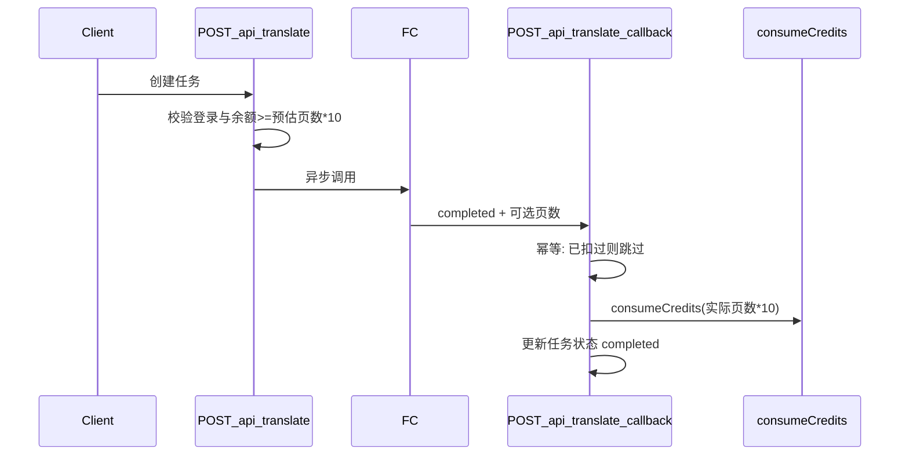

# Creem 接入 + 翻译成功后扣积分

## 现状（可复用）

- **Creem**：`[frontend/src/extensions/payment/creem.ts](frontend/src/extensions/payment/creem.ts)` + `[getPaymentServiceWithConfigs](frontend/src/shared/services/payment.ts)` 已注册；Webhook 统一走 `[/api/payment/notify/[provider]](frontend/src/app/api/payment/notify/[provider]/route.ts)`（`provider=creem`）。
- **积分**：`[consumeCredits](frontend/src/shared/models/credit.ts)` / `getRemainingCredits`；支付成功后发放在 `[handleCheckoutSuccess` / `handlePaymentSuccess` / `handleSubscriptionRenewal](frontend/src/shared/services/payment.ts)`（与 `order.creditsAmount`、`pricingItem.credits` 对齐）。
- **定价与结账**：`[POST /api/payment/checkout](frontend/src/app/api/payment/checkout/route.ts)` 从 **next-intl** 的 `pages.pricing` 读 `items`（`[en/pages/pricing.json](frontend/src/config/locale/messages/en/pages/pricing.json)`）；Creem 的 `product_id` 来自条目的 `payment_product_id` 或后台 **product_id → 各支付渠道 ID** 映射（`[getPaymentProductId](frontend/src/app/api/payment/checkout/route.ts)` 所用配置，见后台 General 里 Creem 映射说明 `[settings.ts](frontend/src/shared/services/settings.ts)`）。
- **翻译链路**：`[POST /api/translate](frontend/src/app/api/translate/route.ts)` 入队 + 调 FC；完成由 `[POST /api/translate/callback](frontend/src/app/api/translate/callback/route.ts)` 把任务标为 `completed`（当前**不**扣积分）。

## 业务规则（与你确认一致）

| SKU | 价格  | 积分   | 类型                              |
| --- | --- | ---- | ------------------------------- |
| 月付  | $5  | 500  | 订阅（每月续费再发 500，与现有 renewal 逻辑一致） |
| 年付  | $50 | 6000 | 订阅（按年续费发 6000）                  |
| 加购  | $5  | 500  | 一次性（可重复买）                       |

- **10 积分 / 页**：扣费基数 = 本次任务实际翻译页数 × 10。
- **仅登录用户**可发起需扣积分的翻译；匿名用户拒绝或明确提示登录（与 `[getTranslateAuth](frontend/src/app/api/translate/auth.ts)` 结合）。

## 扣费时机（仅成功扣）

- **启动时**：只做 **余额读取 + 与预估消耗比较**，调用 `getRemainingCredits`，不足则 **402**（或 403）+ 文案引导 `/pricing`；**不**调用 `consumeCredits`。
- **回调成功**：在 **同一 DB 事务**（或先查幂等再事务）内：`status === 'completed'` 且任务有 `userId` 时，计算 `pages`，再 `consumeCredits`。若余额不足（并发导致），记录日志 + 可设任务字段 `billing_error` 或仍保持 `completed` 但记欠款——**建议**：事务内扣款失败则将任务标为特殊状态或写审计表，避免静默亏损（实现时二选一，在代码注释中写清）。

**幂等**：为 `[translation_tasks](frontend/src/config/db/schema.postgres.ts)`（及 mysql/sqlite 同源 schema）增加例如 `creditConsumeId`（text，可空）或 `creditsCharged` + 关联 consume 记录；回调处理前若已存在则直接 `return`，防止 FC 重试导致重复扣款。

**页数来源**（优先级）：

1. 回调 body 增加可选字段（如 `translated_page_count` / `page_count`），由 FC 在成功时写入（最准）。
2. 否则服务端用已有 `page_range` + `documents.pageCount` 解析（与当前 UI 选页一致）。

需在仓库内文档或 FC 合约里约定字段名。

## Creem 与后台配置（运维侧）

1. Creem Dashboard 创建 **3 个 Product**：月订阅 $5、年订阅 $50、一次性 $5（加购）。
2. 后台打开 **Creem**：`creem_enabled`、`creem_api_key`、`creem_signing_secret`、`creem_environment`，`default_payment_provider=creem`（若只用 Creem）。
3. Webhook URL：`{APP_URL}/api/payment/notify/creem`（与现有 notify 路由一致）。
4. 将 locale 里每个定价条的 `product_id` 映射到 Creem 的 `payment_product_id`（或直接写在 JSON 的 `payment_product_id` 字段），保证 checkout 能拿到 Creem `product_id`。

## 代码改动清单（实现阶段）

1. **定价文案与金额**（`[en/zh pages/pricing.json](frontend/src/config/locale/messages/en/pages/pricing.json)`）：收敛为 3 个 `items`（或保留结构但替换数值）：`amount` 使用分（$5 → `500`，$50 → `5000`），`credits` / `valid_days` / `interval`（`month` | `year` | `one-time`）与上表一致；`payment_providers` 可设为 `["creem"]`；每条配好 `payment_product_id`（占位符待你填真实 Creem ID）。
2. `**POST /api/translate`**：若启用积分策略（建议 env：`TRANSLATE_CREDITS_ENABLED` 或复用 `creem_enabled`）：`userId` 必填；计算 `estimatedPages` 与 `estimatedCredits`；`getRemainingCredits` 不足则拒绝；任务行可写入 `estimatedCredits`（可选，便于对账）。
3. `**POST /api/translate/callback**`：`completed` 分支调用扣费逻辑 + 幂等字段；`failed` 不扣。
4. **常量**：`CREDITS_PER_PAGE = 10`（可 env 覆盖）。
5. **前端**：翻译页在余额不足时展示引导（调用已有 `/api/user/get-user-credits` 或任务创建错误体）；定价页展示 Creem 结账（已有 payment modal + creem 按钮）。

## 风险与可选加固

- **并发**：多个任务同时通过「仅校验余额」可能略超扣；如需严格，可在创建任务时对 `userId` 做 advisory lock 或引入「冻结额度」表（二期）。
- **公网回调安全**：确认 `[callback/route.ts](frontend/src/app/api/translate/callback/route.ts)` 是否需校验 FC secret（若尚未校验，建议与 invoke 时相同 header），避免伪造 completed 刷扣积分。

## Shipany 最小侵入原则（与 Creem 实现约定）

- **不改动** Shipany 已有支付链路：`extensions/payment`、`payment.ts` 服务、`/api/payment/checkout`、`/api/payment/notify/*`、`credit` 发放逻辑；后台已支持 Creem 时仅 **配置 + 定价 JSON** 即可卖积分包/订阅。
- **仅增量**：在 `translation_tasks` 与 `POST /api/translate`、`POST /api/translate/callback` 上 **追加** 登录校验、余额预估、成功回调内 `consumeCredits` 与幂等字段；必要时抽 **小函数**（如 `translate-billing.ts`）避免散改大文件。
- **避免** 重命名/重构通用 `order`、`subscription` 模型或改写 `handleCheckoutSuccess` 分支，除非 Creem 回调有明确缺口（优先在 translate 域内闭环）。

