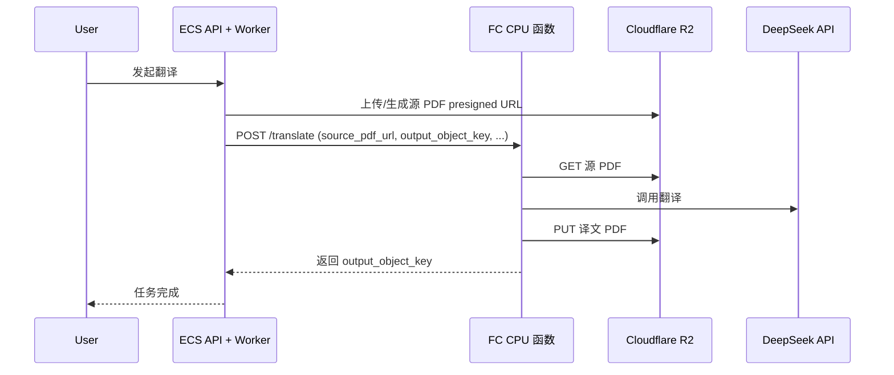

# FC 纯 CPU 方案 + GitHub 构建镜像 + 阿里云部署

## 现状与目标

- **现状**：翻译任务通过 `BABELDOC_USE_FC=true` 由 ECS Worker 调用阿里云 FC；当前若使用 GPU 函数（`Dockerfile.babeldoc-fc.gpu`）成本高。
- **目标**：
  1. 采用**纯 CPU** 承载翻译（使用现有 [docker/Dockerfile.babeldoc-fc](docker/Dockerfile.babeldoc-fc)，无需改业务代码）。
  2. 使用 **GitHub 打包 Docker 镜像** 并推送到阿里云 ACR。
  3. 在阿里云 **重新创建函数** 为 **CPU 版 Web 函数**，并给出可执行的部署步骤。

---

## 一、架构与数据流（不变）

仅将 FC 从「GPU 函数」改为「Web 函数（自定义容器）」+ CPU 镜像，调用方式与 ECS 配置不变。

---

## 二、采用纯 CPU 承载（无代码改动）

- 已有 **CPU 镜像** 定义：[docker/Dockerfile.babeldoc-fc](docker/Dockerfile.babeldoc-fc)（`python:3.11-slim`，无 CUDA）。
- 后端通过 [backend/app/config.py](backend/app/config.py) 的 `BABELDOC_USE_FC`、`BABELDOC_FC_URL`、`BABELDOC_FC_SECRET` 调用 FC，与 GPU/CPU 无关，**无需修改**。
- **需要做的**：在阿里云 FC 侧创建/重建函数时选择 **Web 函数 + 自定义容器**，使用 CPU 镜像，**不选 GPU 规格**。

---

## 三、GitHub 打包 Docker 镜像并推送 ACR

### 3.1 新增 GitHub Actions 工作流

- **路径**：`.github/workflows/build-babeldoc-fc.yml`（新建）。
- **触发**：建议 `push` 到 `main` 时对 `babeldoc_fc/`、`docker/`、`tmp/BabelDOC/` 有变更时构建；或通过 `workflow_dispatch` 手动触发。
- **步骤**：
  1. Checkout 仓库。
  2. 使用 **阿里云 ACR 登录**：
    `docker login registry.<region>.aliyuncs.com -u ${{ secrets.ACR_USERNAME }} -p ${{ secrets.ACR_PASSWORD }}`  
     （或使用 ACR 的命名空间 + 密码；若用 RAM 子账号，则用户名多为阿里云账号 ID，密码为 ACR 控制台设置的固定密码或访问凭证。）
  3. **构建 CPU 镜像**（在仓库根目录）：
    `docker build -f docker/Dockerfile.babeldoc-fc -t <ACR 地址>/babeldoc-fc:latest .`  
     其中 `<ACR 地址>` 形如 `registry.cn-hangzhou.aliyuncs.com/<命名空间>/babeldoc-fc`，可由 GitHub Secrets 提供（如 `ACR_REGISTRY`）。
  4. **推送**：`docker push <ACR 地址>/babeldoc-fc:latest`。
- **Secrets 建议**（在 GitHub 仓库 Settings → Secrets 中配置）：
  - `ACR_REGISTRY`：完整镜像前缀，如 `registry.cn-hangzhou.aliyuncs.com/your-ns/babeldoc-fc`。
  - `ACR_USERNAME`：ACR 登录用户名（阿里云账号或 RAM 子账号等，按 ACR 控制台说明）。
  - `ACR_PASSWORD`：ACR 登录密码（ACR 控制台「访问凭证」中设置/查看）。

### 3.2 可选：多 tag

- 可为同一镜像打 `latest` 与 `sha-${GITHUB_SHA}` 并推送，便于 FC 回滚到某次构建。

---

## 四、阿里云重新创建函数（纯 CPU 方案）

### 4.1 资源与前置

- **地域**：与 ACR 一致（如华东1 杭州 `cn-hangzhou`）。
- **ACR**：已存在命名空间，且 GitHub 已能推送 `babeldoc-fc:latest`（见第三节）。
- **FC**：若当前为 GPU 函数，可保留旧函数仅停用或删除，**新建一个 CPU 函数** 使用新镜像与触发器，避免与旧 GPU 混用。

### 4.2 创建函数步骤（控制台）

1. **函数计算控制台** → 选择地域 → **创建函数**。
2. **函数类型**：选择 **Web 函数**（或「自定义容器」/「自定义镜像」等价入口），**不要选 GPU 函数**。
3. **镜像**：填 ACR 中 CPU 镜像地址，例如：
  `registry.cn-hangzhou.aliyuncs.com/<命名空间>/babeldoc-fc:latest`  
   若为私有仓库，在 FC 中配置 **镜像拉取凭证**（同 ACR 账号/密码）。
4. **规格**（纯 CPU）：
  - **内存**：≥ 2048 MB（建议 2048–4096）。
  - **超时**：600 秒（10 分钟）。
  - **实例并发**：1（单实例单请求，避免 OOM）。
  - **不勾选、不配置任何 GPU**。
5. **环境变量**（与 [docs/FC_DEPLOY_GUIDE.md](docs/FC_DEPLOY_GUIDE.md) 第四节一致）：
  - `DEEPSEEK_API_KEY`、`DEEPSEEK_BASE_URL`（可选）、`DEEPSEEK_MODEL`（可选）
  - `R2_BUCKET_NAME`、`R2_ENDPOINT_URL`、`R2_ACCESS_KEY_ID`、`R2_SECRET_ACCESS_KEY`
  - `BABELDOC_FC_SECRET`（与 ECS 将使用的保持一致）
6. **创建** 后，在函数下 **创建 HTTP 触发器**（POST，匿名或按需鉴权），得到公网访问地址。

### 4.3 获取并配置 ECS

- **BABELDOC_FC_URL**：触发器基础 URL + 路径，需能访问容器内 `POST /translate`。  
例如：`https://<account>.<region>.fc.aliyuncs.com/2016-08-15/proxy/<服务名>/<函数名>/translate`  
若网关把根路径转发到容器，则路径可能为 `/translate` 或 `/`*，以实际能 POST 到 `/translate` 为准。
- 在 **ECS 环境变量** 中设置（与 [docs/FC_DEPLOY_GUIDE.md](docs/FC_DEPLOY_GUIDE.md) 第七节一致）：
  - `BABELDOC_USE_FC=true`
  - `BABELDOC_FC_URL=<上一步完整 URL，以 /translate 结尾>`
  - `BABELDOC_FC_SECRET=<与 FC 内相同>`
- 重启 **Celery Worker** 使配置生效。

### 4.4 验证

- `GET <FC 触发器基础 URL>/health` 返回 200。
- 前端发起一次翻译，在 ECS Worker 日志中确认调用 FC 成功且任务状态为 completed。

---

## 五、交付物与文档更新建议

| 交付物                                       | 说明                                                                                                                                                                                                                                 |
| ----------------------------------------- | ---------------------------------------------------------------------------------------------------------------------------------------------------------------------------------------------------------------------------------- |
| `.github/workflows/build-babeldoc-fc.yml` | 新建：GitHub 构建并推送 CPU 镜像到 ACR。                                                                                                                                                                                                       |
| 文档                                        | 在 [docs/FC_DEPLOY_GUIDE.md](docs/FC_DEPLOY_GUIDE.md) 中强调「纯 CPU 迁移」：选 Web 函数、不选 GPU、镜像用 `Dockerfile.babeldoc-fc`；在 [DEPLOYMENT.md](DEPLOYMENT.md) 中补充 ECS 的 `BABELDOC_USE_FC` / `BABELDOC_FC_URL` / `BABELDOC_FC_SECRET` 说明（若当前缺失）。 |
| 部署清单                                      | 可在 `docs/` 或根目录增加「FC CPU 部署清单」：ACR 地址、GitHub Secrets 列表、FC 创建要点（内存/超时/无 GPU）、ECS 三变量、验证步骤。                                                                                                                                         |

---

## 六、简要检查清单（纯 CPU）

- GitHub Secrets 已配置：`ACR_REGISTRY`、`ACR_USERNAME`、`ACR_PASSWORD`。
- GitHub Actions 成功构建并推送 `babeldoc-fc:latest` 到 ACR。
- FC 新建函数类型为 **Web 函数（自定义容器）**，未选 GPU。
- FC 镜像地址为 ACR 的 CPU 镜像（如 `.../babeldoc-fc:latest`）。
- FC 内存 ≥ 2048 MB，超时 ≥ 600 秒。
- FC 环境变量已填：DEEPSEEK_*、R2_*、BABELDOC_FC_SECRET。
- HTTP 触发器已创建，BABELDOC_FC_URL 以 `/translate` 结尾且 POST 可达。
- ECS 已配置 `BABELDOC_USE_FC`、`BABELDOC_FC_URL`、`BABELDOC_FC_SECRET`，并重启 Worker。
- 一次端到端翻译任务成功完成。

---

## 七、与现有文档的关系

- 详细 FC 创建、触发器、环境变量、故障排查仍以 [docs/FC_DEPLOY_GUIDE.md](docs/FC_DEPLOY_GUIDE.md) 为准；本方案明确「仅用 CPU 版镜像 + Web 函数、不用 GPU」。
- 前端/后端/域名等整体部署仍按 [DEPLOYMENT.md](DEPLOYMENT.md)；本方案仅覆盖「FC 从 GPU 迁到 CPU」与「镜像由 GitHub 构建」两部分。

