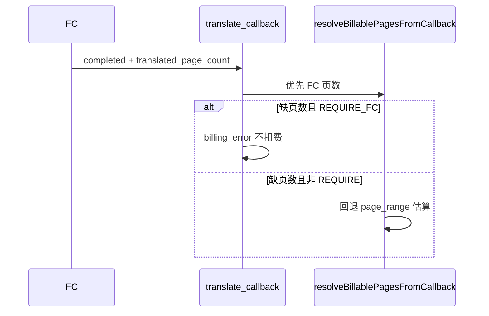
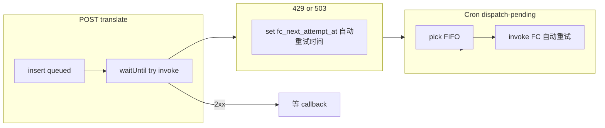

# FC 回传页数优先 + FC 并发自动重试（含 Cloudflare 生产）

## 背景（当前代码）

- 扣费页数：`[resolveBillablePagesFromCallback](frontend/src/shared/lib/translate-billing.ts)` 已 **优先**使用回调 body 的 `translated_page_count` / `page_count` / `pages`，否则回退 `page_range` + `documents.page_count`。
- FC 调用：`[POST /api/translate](frontend/src/app/api/translate/route.ts)` 在 `waitUntil` 里 `fetch(FC_URL)`；若 HTTP 非 2xx **仅打日志**，任务长期 `queued`，**无自动重试**。
- **缺口**：当前 `fcPayload` **未传 `page_range`**，而本仓库 FC 的 `[TranslateRequest](babeldoc_fc/main.py)` 支持 `page_range`；需在抽取的 `invoke-fc` 中从 `translation_tasks` / 关联 document 补全，与 BabelDOC 行为一致。

## 1. 按页扣费：以 FC 回传为准（产品 + 技术）

**目标**：与「每页 10 积分」一致时，**计费以成功回调里的页数为主**。

1. **契约文档**：在 `[docs/environment-variables.md](frontend/docs/environment-variables.md)` 或 `docs/translate-fc-contract.md` 写明成功回调字段（见下文 §4）。
2. **严格模式（可选）**：`TRANSLATE_BILLING_REQUIRE_FC_PAGE_COUNT=true` 时，无合法 FC 页数则 **不扣费**、写 `billing_error`；预校验仍用 `estimateTranslatedPages`。
3. **可观测**：回退估算时打结构化日志（`task_id`、`used_fallback: true`）。

## 2. FC 并发上限：**自动重试**（禁止静默失败）+ Cloudflare 生产约束

**问题**：`waitUntil` 内单次 `fetch` 遇 **429 / 503**（及可选 **502**）后，若无后续调度，任务会 **永久 queued**。

**必做（自动重试，默认开启）**：

1. **抽出** `[invokeTranslateFc(taskId)](frontend/src/app/api/translate/invoke-fc.ts)`（新建）：读任务 + document，生成 `source_pdf_url`（与现 route 一致）、组装 body（**含 `page_range`**）、`X-Babeldoc-Secret`，`POST` FC。
2. **首次派发**：`POST /api/translate` 仍 `waitUntil(invoke…)`；在 `then` 中：
  - **2xx**：写 `fc_last_http_status`、`fc_last_invoked_at`（schema 迁移）。
  - **429 / 503 /（可选）502**：解析 `**Retry-After`**；写 `**fc_next_attempt_at`**；更新 `progress_stage` 或用户可见文案（如「FC 繁忙，将自动重试」）。
  - 无 `Retry-After` 时：**指数退避**（如 30s → 60s → … 封顶 15min）写入 `fc_next_attempt_at`。
3. **Cron 自动续跑（主力，适配 Worker）**：新增 `POST /api/translate/dispatch-pending`，校验 `x-cron-secret`（复用 `[CRON_SECRET](frontend/src/app/api/documents/cleanup-expired/route.ts)` 或独立 `TRANSLATE_DISPATCH_SECRET`）。查询 `status='queued'` 且 `fc_next_attempt_at <= now()`（含「从未失败过、待首次派发」的规则在实现时写清），**FIFO `created_at`** 调用 `invokeTranslateFc`。

### Cloudflare Workers 生产环境（必读）

- `**waitUntil` 有 CPU/时长上限**：不要在 Worker 内用长循环/长 `setTimeout` 做多次重试；**以 DB `fc_next_attempt_at` + Cron Trigger 为主路径**。
- **运行时变量**：`CRON_SECRET`、`TRANSLATE_`*、调度用 URL 等须在 **Worker → Settings → Variables and secrets** 可见；构建变量默认不进运行时——见 `[docs/environment-variables.md](frontend/docs/environment-variables.md)`、`[frontend/docs/cloudflare-env-真相.md](frontend/docs/cloudflare-env-真相.md)`；新键如需从 CI 注入可加入 `[scripts/generate-wrangler.js](frontend/scripts/generate-wrangler.js)` 白名单。
- **Cron**：在 Cloudflare Dashboard 为 Worker 配置 **Triggers**（Cron），周期性 `POST https://<你的域名>/api/translate/dispatch-pending`，Header `x-cron-secret: <CRON_SECRET>`（与 cleanup 任务同模式）。

### 可选第二阶段

- `**TRANSLATE_FC_MAX_IN_FLIGHT`**：在派发前统计「已发起 FC 且仍为 `queued`」数量，超限则跳过本次派发、仅依赖队列顺序；注意多实例竞态，宜与 `FOR UPDATE` 或串行 Cron 结合。

## 3. 涉及文件（实现时）

| 区域        | 文件                                                                                                                                             |
| --------- | ---------------------------------------------------------------------------------------------------------------------------------------------- |
| 页数策略      | `[translate-billing.ts](frontend/src/shared/lib/translate-billing.ts)`、`[callback/route.ts](frontend/src/app/api/translate/callback/route.ts)` |
| 自动重试 / 派发 | 新建 `invoke-fc.ts`、`dispatch-pending/route.ts`；改 `[translate/route.ts](frontend/src/app/api/translate/route.ts)`                                |
| Schema    | `[schema.postgres.ts](frontend/src/config/db/schema.postgres.ts)` + `docs/migrations/*.sql`                                                    |
| FC 侧（本仓库） | `[babeldoc_fc/main.py](babeldoc_fc/main.py)`（及必要时 `[run_translate.py](babeldoc_fc/run_translate.py)`）                                          |
| 文档        | `[environment-variables.md](frontend/docs/environment-variables.md)`、Cron/契约                                                                   |

## 4. 与本仓库 FC 源码 `[babeldoc_fc](babeldoc_fc)` 的约定（实现时对照改）

以下路径相对仓库根目录 `**translatepdfonline/**`（即 `D:\imppro\translatepdfonline`）。**Agent/人工实现前应直接打开这些文件**，避免与线上一致性漂移。

### 4.1 当前行为（已读源码摘要）

- **HTTP 入口**：`[babeldoc_fc/main.py](babeldoc_fc/main.py)` — `POST /translate`，同步执行下载 → BabelDOC → 上传 R2 → **成功后再** `_notify_callback(..., "completed", ...)`，最后返回 `TranslateResponse`。  
  - 即：对调用方而言，**HTTP 200 往往表示整单已完成**（除非平台在入口前有队列）。阿里云 FC **实例并发打满**时，可能在上游返回 **429/503**，这正是 Next 侧要做 **自动重试** 的场景。
- **回调**：`[_notify_callback](babeldoc_fc/main.py)`（约 67–88 行）仅用 `httpx.post(callback_url, json=payload)`，**未带 `X-Babeldoc-Secret`**。而 Next `[verifyTranslateFcCallbackRequest](frontend/src/app/api/translate/fc-auth.ts)` 在配置了 Secret 时会校验该头 — **若不改 FC，生产开启 Secret 后回调会 401**。  
  - **改造**：在 `_notify_callback` 的 POST 中增加与入口相同的鉴权头（值与 `get_fc_secret()` / 环境变量一致），与 Next 约定头名（默认 `X-Babeldoc-Secret`）。
- **成功回调 body**：当前仅 `task_id`、`status`、`output_object_key`，**无页数**。  
  - **改造**：在 `status=="completed"` 时增加整数 `**translated_page_count`**（与 Next `[resolveBillablePagesFromCallback](frontend/src/shared/lib/translate-billing.ts)` 对齐）。
- **页数从哪里来（推荐实现顺序）**：
  1. **优先**：若 BabelDOC `translate()` 的返回对象上能取到「已翻译页数」或页列表长度，则在 `[run_translate.py](babeldoc_fc/run_translate.py)` 返回该数，由 `main.py` 传入 `_notify_callback`（最准）。
  2. **兜底**：在 `main.py` 用请求体里的 `**page_range`**（与 `run_translate_local(..., page_range=body.page_range)` 一致）做与 Next 相同的区间解析，得到页数；无 `page_range` 时可用 **输入 PDF 页数**（例如 `pypdf` 读 `input_pdf`）作为 `translated_page_count`，并与 Next 侧 `documents.page_count` 逻辑协调，避免重复计费或低估。

### 4.2 与 Next 的 payload 对齐

- BabelDOC FC 已定义 `[TranslateRequest.page_range](babeldoc_fc/main.py)`；Next 派发时必须 **传入 `page_range`**（与 `translation_tasks.pageRange` 一致），否则 FC 侧兜底页数会偏差。

### 4.3 并发 / 429（FC 侧可选）

- 若希望在 **FC 进程内**主动限流（在进 BabelDOC 前返回 429），可在 `main.py` 增加信号量/队列；**与 Next 自动重试 + Cron 互补**。非必须，视阿里云 FC 观测决定。

---

**说明**：若你希望由 Cursor **直接改代码**，请切换到 **Agent 模式** 并引用本计划；当前为 Plan 模式，仅更新计划文档，未改业务代码。