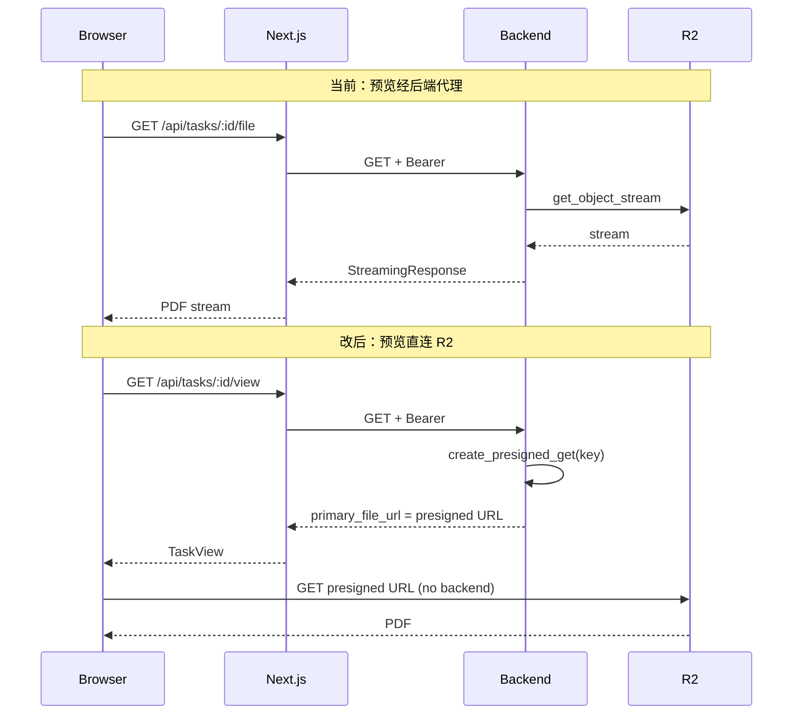

# History 权限、预览文案与 R2 直连预览

## 1. History 栏：仅当前用户可见 + 内容优化

**现状**

- 后端 [backend/app/routes/tasks.py](backend/app/routes/tasks.py) 中 `list_tasks` 未做用户过滤，返回全库最近 100 条任务，导致未登录或任意用户都能看到他人任务。
- [frontend/components/HistoryPanel.tsx](frontend/components/HistoryPanel.tsx) 仅展示 `id` 前 8 位、`source_lang → target_lang · status`，信息过少。

**改动**

- **后端**  
  - `list_tasks` 增加依赖 `user: User = Depends(get_current_user_or_temp)`，只返回 `TranslationTask.user_id == user.id` 的任务（保留 `order_by(created_at.desc()).limit(100)`）。  
  - 确保前端请求 `/api/tasks` 时带上鉴权（Cookie/Bearer），与现有 `getTask`/`getTaskView` 一致；若 Next 代理会转发 Cookie/Bearer，则 list 也会带上。
- **TaskSummary 扩展**（便于 History 展示更多）  
  - 在 [backend/app/schemas.py](backend/app/schemas.py) 的 `TaskSummary` 中增加可选字段，例如：`document_filename: Optional[str]`、`page_range: Optional[str]`、`updated_at: Optional[datetime]`。  
  - `list_tasks` 内 join `Document`，填充 `document_filename`；从 `TranslationTask` 取 `page_range`、`updated_at` 填入。
- **前端 HistoryPanel**  
  - 展示：文件名（`document_filename`，过长可 truncate）、语言对、页码范围（若有）、状态、时间（`created_at` 或 `updated_at` 的相对/绝对格式）。  
  - 未登录时：后端因 `get_current_user_or_temp` 会创建或识别临时用户，故列表为“当前临时用户”的任务；若希望未登录完全看不到历史，可再在后端对 `is_temporary` 做策略（例如不返回列表或返回空），按产品决定。

---

## 2. 译文预览占位文案：避免误导“正在生成”

**现状**

- [frontend/app/[locale]/page.tsx](frontend/app/[locale]/page.tsx) 中译文 Pane 的 placeholder 为：`taskId && !targetPdfUrl ? t("targetPlaceholder") : undefined`，即一律显示 “Generating translation, please wait...”。
- 导致：**非本人任务**（无 `targetPdfUrl`）和**本人任务失败**（status=failed，无译文）也显示“正在生成”，造成误解。

**改动**

- 仅在“任务进行中且尚无译文”时显示 “Generating translation, please wait...”；其余无译文情况显示 “No PDF”。
- 逻辑建议（在 page.tsx 内计算传给 `PdfViewerPane` 的 `placeholder`）：
  - 若存在 `targetPdfUrl`：不传 placeholder（正常显示 PDF）。
  - 若不存在 `targetPdfUrl`：  
    - 若 `taskStatus === "processing" || taskStatus === "queued"`：`placeholder = t("targetPlaceholder")`；  
    - 否则（含 `failed`、`completed` 无输出、非 owner 无 URL 等）：`placeholder = tPdfViewer("noPdf")`。
- 无需改后端；`taskStatus` 已由 `taskDetail`/SSE 维护。

---

## 3. 预览/下载直连 R2，减轻后端压力

**现状**

- 原文预览：`/api/tasks/:id/source-file` → Next 代理 → 后端 → 从 R2 流式读取并转发。  
- 译文预览/下载：`/api/tasks/:id/file` → Next 代理 → 后端 → 从 R2 或本地流式读取并转发。  
- 所有 PDF 流量都经后端，并发大时压力集中。

**目标**

- 原文、译文预览（及下载）改为浏览器直连 R2：后端只返回预签名 GET URL，前端用该 URL 直接请求 R2，不再经后端流式代理。

**后端**

- 在 [backend/app/storage_r2.py](backend/app/storage_r2.py) 中新增 `create_presigned_get(object_key: str, expires_in_seconds: int = 3600) -> str`，使用 `get_object` 生成预签名 URL。
- 在 [backend/app/routes/tasks.py](backend/app/routes/tasks.py) 的 `get_task_view` 中（仅当 `is_owner` 且 R2 已配置时）：
  - 若有 `task.source_slice_object_key`：将 `source_pdf_url` 设为该 key 的 presigned GET URL（替代当前 `/api/tasks/{id}/source-file`）。
  - 若有 `task.output_object_key`：将 `primary_file_url` 设为该 key 的 presigned GET URL（替代当前 `/api/tasks/{id}/file`）。
- 可选：保留“后端代理 URL”为 fallback（例如 R2 未配置或未上传到 R2 时仍用现有 `/source-file`、`/file`），由 view 根据是否存在 object_key 决定返回代理 URL 还是 presigned URL。前端统一用 “有 URL 就加载”，无需区分来源。

**前端**

- 预览/下载已使用 `taskView.primary_file_url`、`taskView.source_pdf_url`；改为 presigned URL 后，仅需确保：
  - 使用 `credentials: "omit"` 请求 R2 预签名 URL（避免带 Cookie 到 R2），或按 R2/CORS 配置决定。
  - 若 R2 域名与本站不同源，PDF.js 跨域加载需 R2 返回正确 CORS 头；预签名 URL 本身不解决 CORS，需在 R2 桶上配置允许前端 origin。
- 可移除或保留 Next 的 `app/api/tasks/[taskId]/file/route.ts` 与 `source-file/route.ts` 作为 fallback（当后端返回代理 URL 时仍会用到）。

**注意**

- 预签名 URL 有过期时间；若预览页长时间不刷新，可能过期后需重新拉取 view 拿新 URL。  
- 下载场景若仍走“后端代理”可保留 disposition 控制文件名；若改为直连 R2，需在 R2 对象元数据或预签名时设置 `ResponseContentDisposition` 以指定下载文件名。

---

## 4. 原文按页切分与预览默认页（采用：前端按页切分再上传）

**目标**

- 原文由**前端按页切分**后上传 R2，后端只消费“源切片”对象，不再拉整份再切页。
- 原文预览默认：无选页时首页；用户选择翻译页后，预览默认**选中范围第一页**。原文/译文预览均从 R2 直连（presigned URL）。

**4.1 前端：选页 + 切分 + 上传切片**

- **选页时机**：在已有上传 + 翻译表单流程中，在用户选择语言对之后、提交翻译之前，增加“选择要翻译的页码”步骤（或保留现有 page_range 输入，但在有整份 PDF 时提供“在预览里选页”的交互）。
- **整份 PDF 上传**：保持现有流程（presigned PUT 整份上传到 R2 → complete 得到 document_id）。Document 仍对应整份文件的 object_key。
- **选页后生成切片 PDF**：用户选定 page_range（如 `1-5` 或单页 `3`）后，前端用 **pdf-lib**（推荐，体积与 API 适合浏览器端切页）或 PDF.js 从**当前已加载的预览用 PDF**（或从整份 URL 再 fetch 一次）在内存中生成“仅含所选页”的新 PDF blob。
- **切片上传 R2**：  
  - 新增后端接口：例如 `POST /api/upload/presigned-slice` 或复用现有 presigned 逻辑，请求体包含 `document_id`、`page_range`，后端返回用于上传“源切片”的 presigned PUT URL 及 `slice_object_key`。  
  - 前端将切片 PDF blob 用 PUT 上传到该 URL，完成后调用类似 `POST /api/upload/presigned-slice/complete`，传入 `document_id`、`page_range`、`slice_object_key`（或由后端在生成 presigned 时已绑定），后端**不**下载文件，只落库“该 task 将使用此 slice 的 object_key”。
- **创建翻译任务**：创建 task 时（`POST /translate`）请求体增加可选字段 `source_slice_object_key`（或由后端根据“刚完成的 slice complete”关联到当前 document 的待翻译页，避免前端传 key）。后端创建 TranslationTask 时写入 `source_slice_object_key`；翻译 worker 只从 R2 拉取该 key 对应的 PDF，不再做按页切分。

**4.2 后端：切片 object_key 与任务绑定**

- **模型**：已有 `TranslationTask.source_slice_object_key`（见 [backend/alembic/versions/20260306_0007_add_task_source_slice_object_key.py](backend/alembic/versions/20260306_0007_add_task_source_slice_object_key.py)），用于存“源切片”在 R2 的 key。
- **API**：  
  - 方案甲：新增“申请切片上传”接口，返回 presigned PUT + 唯一 `slice_object_key`；complete 时后端将 `document_id + page_range + slice_object_key` 存为“待用于下一次 translate 的切片”，`POST /translate` 时带上 `document_id` 与 `page_range`，后端查找该组合对应的 `source_slice_object_key` 写入 task。  
  - 方案乙：`POST /translate` 请求体增加可选 `source_slice_object_key`，前端在“切片上传完成”后拿到该 key，创建任务时传入；后端校验该 key 属于当前用户/当前 document 后写入 task。
- **Worker**：[backend/app/tasks_translate.py](backend/app/tasks_translate.py) 中已支持从 R2 拉取 `source_slice_object_key` 对应文件到 staging；若 task 有 `source_slice_object_key`，则**不再**从整份 document 的 object_key 拉取并切页，直接使用切片文件进行翻译。需确认现有逻辑是否已按“有 source_slice_object_key 则用切片”实现，否则改为优先使用切片。

**4.3 原文预览与默认页**

- **预览 URL**：`get_task_view` 在 is_owner 且存在 `task.source_slice_object_key` 时，将 `source_pdf_url` 设为该 key 的 presigned GET（与第 3 步一致）；前端原文 Pane 用该 URL 加载，即从 R2 直连。
- **默认页码**：进入任务页时（如从 History 点入或 URL 带 `?task=xxx`），若有 `taskView.task.page_range`，将 `currentPage` 初始化为该范围的**第一页**（例如 `1-5` → 1）；否则默认 1。这样“选页翻译”场景下原文预览默认就是选中翻译的第一页。

**4.4 依赖与顺序**

- 依赖第 3 步：R2 预签名 GET 与 view 返回 presigned URL，否则原文预览仍会走后端代理。
- 前端切分依赖：安装 `pdf-lib`（或使用已有 PDF.js）在浏览器端生成切片 PDF。

**4.5 关键文件**

- 前端：上传/翻译表单（选页 + 调切片上传）、新建工具函数（用 pdf-lib 从 blob/URL 按 page_range 生成 PDF）、[frontend/lib/api.ts](frontend/lib/api.ts) 或等价处增加切片 presigned 与 complete 调用。
- 后端：[backend/app/routes/upload.py](backend/app/routes/upload.py) 或 tasks 中新增切片 presigned + complete；[backend/app/routes/tasks.py](backend/app/routes/tasks.py) 的 create_translation_task 支持绑定 source_slice_object_key；[backend/app/tasks_translate.py](backend/app/tasks_translate.py) 优先使用 source_slice_object_key 拉取并翻译。

---

## 5. 实施顺序建议

| 步骤  | 内容                                                                                       | 依赖     |
| --- | ---------------------------------------------------------------------------------------- | ------ |
| 1   | 后端 list_tasks 按 user_id 过滤                                                               | 无      |
| 2   | TaskSummary 增加 document_filename、page_range、updated_at；HistoryPanel 展示优化                 | 步骤 1   |
| 3   | 译文预览 placeholder 按 taskStatus 区分 “Generating…” / “No PDF”                                | 无      |
| 4   | storage_r2 增加 create_presigned_get；get_task_view 在 is_owner 且存在 R2 key 时返回 presigned URL | 无      |
| 5   | 前端预览/下载使用 presigned URL（CORS/credentials 按 R2 配置）；可选保留代理 fallback                        | 步骤 4   |
| 6   | 进入任务页时，若有 page_range 则将原文/译文预览默认页设为选中范围第一页                                               | 无      |
| 7   | 后端：切片上传接口（presigned PUT + complete），POST /translate 支持 source_slice_object_key 或“待用切片”关联 | 无      |
| 8   | 后端：翻译 worker 优先使用 task.source_slice_object_key，有则从 R2 拉切片，不再整份拉取再切页                      | 步骤 7   |
| 9   | 前端：选页 UI（在翻译表单中）+ pdf-lib 按 page_range 生成切片 PDF + 上传切片到 R2 + 创建任务时绑定切片                   | 步骤 5、7 |

---

## 6. 关键文件与数据流（R2 直连）

以上覆盖：History 仅本人可见与内容优化、译文预览文案修正、通过 R2 预签名 URL 实现预览/下载直连以降低后端并发压力，以及可选的“前端按页切分”方向。