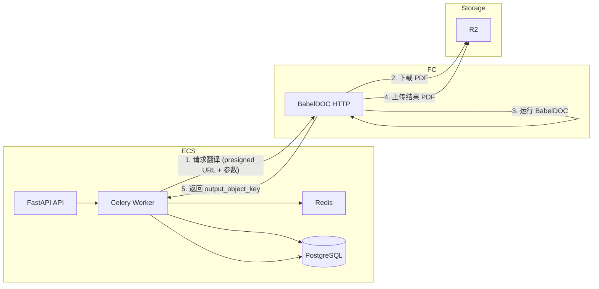

# 生产环境部署与后端 BabelDOC 拆分

## 一、当前架构简要

- **后端**：FastAPI（上传、翻译、任务、鉴权）+ Celery + Redis + PostgreSQL。Worker 内联调用 [babeldoc_adapter.run_translate](backend/app/babeldoc_adapter.py)，进而加载 `tmp/BabelDOC` 的 `high_level.translate` 完成 PDF 翻译，结果上传 R2。
- **前端**：Next.js（next-intl），通过 `NEXT_PUBLIC_API_BASE_URL` 代理/请求后端 API。
- **目标**：ECS 只跑 API + 轻量 Worker（不跑 BabelDOC）；BabelDOC 在阿里云 FC 上独立运行；前端在 Cloudflare Pages 通过 GitHub 自动部署。

---

## 二、后端拆分：BabelDOC 隔离到 FC

### 2.1 拆分思路

- **ECS Worker**：仍负责任务状态、从 R2/本地取源 PDF、可选 OCR、生成源 PDF 的 presigned URL；**不再**直接调用 `run_translate()`，改为调用 FC 提供的 HTTP 接口；收到 FC 返回的 `output_object_key` 后写库并标记完成。
- **FC**：提供**单一 HTTP 入口**（如 `POST /translate`），入参：源 PDF 的 presigned URL（或 R2 key + 临时凭证）、`source_lang`、`target_lang`、`page_range`、`task_id`（可选，用于日志）；在 FC 内下载 PDF 到 /tmp，调用 BabelDOC 翻译，将结果 PDF 上传到 R2，返回 `output_object_key`。FC 内需配置 DEEPSEEK_API_KEY、R2 凭证。

### 2.2 代码拆分步骤

**步骤 1：新增 FC 侧「BabelDOC 服务」仓库或目录**

- 在仓库中新建独立目录（如 `babeldoc_fc/`）或单独仓库，用于 FC 部署。
- 包含内容：
  - **HTTP 入口**：FastAPI 或单文件 Flask/Starlette，暴露例如 `POST /translate`。
  - **请求体**：`source_pdf_url`（presigned GET URL）、`source_lang`、`target_lang`、`page_range`（可选）、`task_id`（可选）、`output_object_key`（约定结果写入 R2 的 key，由 ECS 指定）。
  - **逻辑**：下载 `source_pdf_url` 到 `/tmp/input.pdf`；调用 BabelDOC（复用当前 [babeldoc_adapter.run_translate](backend/app/babeldoc_adapter.py) 的调用方式，或把 `run_translate` 抽成可被 FC 调用的包）；将输出 PDF 上传到 R2 的 `output_object_key`；返回 `{"output_object_key": "..."}`。
  - **依赖**：将 `tmp/BabelDOC` 以子模块或复制方式纳入 FC 项目；`requirements.txt` 包含 BabelDOC 所需依赖（含 PyMuPDF、openai 等）；不依赖当前 backend 的 DB/Redis/Celery。

**步骤 2：从 ECS 后端中抽象「翻译执行器」**

- 在 [backend/app](backend/app) 下新增模块（如 `babeldoc_client.py`）：
  - 定义接口：`run_translate_remote(source_pdf_url, output_dir_or_key, source_lang, target_lang, page_range, ...) -> output_object_key`。
  - 实现为：根据配置（如 `BABELDOC_FC_URL`）向 FC 的 `POST /translate` 发 HTTP 请求，传入 presigned URL 与参数；轮询或同步等待响应；返回 FC 填写的 `output_object_key`。
- 在 [backend/app/config.py](backend/app/config.py) 增加配置项：
  - `babeldoc_fc_url: str`（例如 `https://xxx.cn-hangzhou.fc.aliyuncs.com/translate`）
  - `babeldoc_use_fc: bool`（默认 True 时走 FC，False 时保留本地 `run_translate`，便于本地开发）。

**步骤 3：修改 Celery 任务，按配置选择本地或 FC**

- 在 [backend/app/tasks_translate.py](backend/app/tasks_translate.py) 中：
  - 在「解析到本地 PDF 路径、完成健康检查与可选 OCR」之后，若 `settings.babeldoc_use_fc` 为 True：
    - 若当前无 presigned URL，则用现有 R2 逻辑生成源 PDF 的 presigned GET URL。
    - 调用 `babeldoc_client.run_translate_remote(...)`，传入该 URL、`output_object_key=f"translations/{task_id}/output.pdf"`、语言与 page_range。
    - FC 返回成功后，将返回的 `output_object_key` 写入 `task.output_object_key`，并执行当前任务中「上传 source_pages.pdf、更新 completed」等后续逻辑（不再本地调用 `run_translate`）。
  - 若 `babeldoc_use_fc` 为 False，则保持现有逻辑：调用 [babeldoc_adapter.run_translate](backend/app/babeldoc_adapter.py)，再上传结果到 R2。
- 确保 ECS 上**不安装** BabelDOC 及 `tmp/BabelDOC`（或通过环境变量不加载），避免 ECS 镜像仍带重型依赖。

**步骤 4：FC 与 ECS 的约定**

- **超时**：阿里云 FC 单次调用有最大执行时间（如 10 分钟）；长文档可考虑分页多调或异步回调，首版建议单次同步调用并限制页数/大小。
- **安全**：FC 接口应对请求做鉴权（如 ECS 通过 Header 传内部密钥，FC 校验）；presigned URL 短期有效，避免暴露 R2 主密钥。
- **进度**：可选：FC 内将进度写入 Redis（与现有 [task_progress](backend/app/task_progress.py) 一致），ECS Worker 或前端轮询不变；若首版不实现，可仅做「进行中/完成」状态。

---

## 三、阿里云 ECS 部署后端（不含 BabelDOC）

### 3.1 资源准备

- ECS 实例（建议 2 核 4G 起）、安全组放行 80/443 及 SSH。
- 已创建 RDS（PostgreSQL）、Redis 实例，与 ECS 同 VPC 或可访问。
- 若使用 SLB/域名：为 API 配置域名（如 `api.yourdomain.com`）并配置 HTTPS。

### 3.2 代码与运行环境

- 从 [https://github.com/gladlyknow/translatepdfonline](https://github.com/gladlyknow/translatepdfonline.git) 拉取代码；或 CI 构建 Docker 镜像后推送到阿里云 ACR，ECS 拉取运行。
- 环境变量（示例）：
  - `DATABASE_URL`、`REDIS_URL`、`JWT_SECRET`、`FRONTEND_ORIGINS`（含 Cloudflare 前端域名）
  - R2：`R2_ACCOUNT_ID`、`R2_BUCKET_NAME`、`R2_ACCESS_KEY_ID`、`R2_SECRET_ACCESS_KEY`、`R2_ENDPOINT_URL`、`R2_PUBLIC_URL`
  - Google OAuth、Resend 等按现有 [config](backend/app/config.py) 配置
  - **BabelDOC 走 FC**：`BABELDOC_FC_URL=https://xxx.cn-hangzhou.fc.aliyuncs.com/...`、`BABELDOC_USE_FC=true`；不配置 `BABELDOC_STAGING_DIR`/`BABELDOC_OUTPUT_DIR` 也可（Worker 不再写本地 BabelDOC 目录）
  - `DEEPSEEK_API_KEY` 可仅配置在 FC，ECS 不配则不会本地跑 BabelDOC

### 3.3 进程管理

- **API**：使用 gunicorn + uvicorn worker（如 `gunicorn -k uvicorn.workers.UvicornWorker app.main:app -b 0.0.0.0:8000`），由 systemd 或 supervisor 管理。
- **Celery Worker**：单独进程，`celery -A app.celery_app worker -l info`，与 API 同机或另机均可，需能访问同一 Redis、PostgreSQL、R2 及 FC URL。

### 3.4 预发布检查

- 健康检查：`GET /health` 返回 200。
- 创建翻译任务后，Worker 日志中应出现对 FC 的 HTTP 调用，且任务最终为 completed（FC 返回 output_object_key 并写库）。

---

## 四、阿里云函数计算（FC）部署 BabelDOC

### 4.1 运行时选择

- **推荐**：使用**自定义容器**运行 FC，镜像内预装 Python、BabelDOC 代码与依赖（含 `tmp/BabelDOC`）、PyMuPDF 等，避免 50MB 代码包限制与冷启动依赖缺失。
- **或**：代码包 + 层（Layer）方式：BabelDOC 及大依赖打成层，入口仅保留薄 HTTP 与调用逻辑；需注意解压与冷启动时间。

### 4.2 镜像/代码内容

- 镜像或代码中需包含：
  - BabelDOC 源码（当前项目的 `tmp/BabelDOC`）及 `babeldoc_adapter` 中与 `run_translate` 等效的调用（或直接复制适配逻辑到 FC 项目）。
  - `requirements.txt`：BabelDOC 依赖 + `httpx`、`boto3`（或 oss2，若用阿里云 OSS 代替 R2）等；若结果上传 R2，需 S3 兼容客户端（如 boto3 配置 endpoint）。
- 环境变量（FC 控制台或模板配置）：`DEEPSEEK_API_KEY`、`DEEPSEEK_BASE_URL`、R2 相关（或 OSS）用于上传结果 PDF。

### 4.3 HTTP 触发器

- 为 FC 创建 HTTP 触发器，方法 POST，路径如 `/translate`。
- 请求体与 FC 返回格式需与 [babeldoc_client](backend/app) 中约定一致（如 JSON：`source_pdf_url`, `source_lang`, `target_lang`, `page_range`, `output_object_key`；返回 `output_object_key`）。
- 设置足够长的**超时时间**（如 600s），内存建议 2GB 以上（BabelDOC 占内存）。

### 4.4 安全与网络

- 内网访问：若 ECS 与 FC 同地域，可考虑 FC 启用 VPC，与 ECS/RDS/Redis 内网互通；FC 通过内网访问 R2 若需则配置 NAT 或 VPC 端点。
- 鉴权：FC 入口校验 Header 中的密钥（与 ECS 配置的 `BABELDOC_FC_SECRET` 一致），避免接口被滥用。

---

## 五、前端部署到 Cloudflare（GitHub 自动部署）

### 5.1 仓库与分支

- 仓库：[https://github.com/gladlyknow/translatepdfonline.git](https://github.com/gladlyknow/translatepdfonline.git)
- 使用分支（如 `main`）作为生产构建分支。

### 5.2 Cloudflare Pages 配置

- 登录 Cloudflare Dashboard → Pages → Create project → Connect to Git → 选择 `gladlyknow/translatepdfonline`。
- **Build configuration**：
  - **Root directory**：`frontend`（项目根为 monorepo 时必填）。
  - **Framework preset**：Next.js（若 Cloudflare 识别）；或 Build command 手动设为 `npm run build`。
  - **Build command**：`npm run build`（或 `npx next build`，若需静态导出则先配置 `output: 'export'` 再 `next build`，Output directory 填 `out`）。
  - **Build output directory**：Next.js 默认 `.next`；若使用 `@cloudflare/next-on-pages` 或静态导出，按文档填（如 `out` 或 `.vercel/output/static`）。

### 5.3 环境变量

- 在 Pages → Settings → Environment variables 中添加：
  - **NEXT_PUBLIC_API_BASE_URL**：后端 API 公网地址，如 `https://api.yourdomain.com`（与 ECS 上 CORS 的 `FRONTEND_ORIGINS` 对应，例如 `https://your-project.pages.dev`）。
- 生产/预览环境可分别配置不同 API 地址。

### 5.4 构建与发布

- 每次推送到上述分支会触发自动构建；构建成功后即可通过 `*.pages.dev` 或自定义域名访问。
- 若 Next.js 使用服务端渲染或 API 路由，需确认 Cloudflare Pages 对 Next.js 的兼容性（必要时使用 `@cloudflare/next-on-pages` 或仅用静态导出）。

### 5.5 后端 CORS

- ECS 上 `FRONTEND_ORIGINS` 需包含 Cloudflare 前端域名，例如：`https://translatepdfonline.pages.dev,https://yourdomain.com`。

---

## 六、实施顺序建议

1. **FC 侧**：实现 `babeldoc_fc` HTTP 接口（下载 PDF → 调 BabelDOC → 上传 R2 → 返回 key），在本地或 FC 控制台测试通过。
2. **后端**：增加 `babeldoc_client` 与配置，在 `tasks_translate` 中接入「FC 分支」；本地或测试环境设 `BABELDOC_USE_FC=true` 与 `BABELDOC_FC_URL`，端到端跑通一条翻译任务。
3. **ECS**：部署当前后端（FC 已可用），不部署 BabelDOC 代码；Worker 仅通过 HTTP 调 FC。
4. **FC 正式部署**：将 BabelDOC 服务部署到阿里云 FC（镜像或代码+层），配置触发器、超时、内存、环境变量与鉴权。
5. **前端**：在 Cloudflare Pages 连接 GitHub、配置根目录与构建命令、设置 `NEXT_PUBLIC_API_BASE_URL`，完成首次发布并验证 API 请求与登录、翻译流程。

---

## 七、关键文件索引

| 用途            | 文件或位置                                                                                         |
| ------------- | --------------------------------------------------------------------------------------------- |
| BabelDOC 调用入口 | [backend/app/babeldoc_adapter.py](backend/app/babeldoc_adapter.py)（run_translate）             |
| 翻译任务逻辑        | [backend/app/tasks_translate.py](backend/app/tasks_translate.py)（run_translation_task）        |
| 配置项           | [backend/app/config.py](backend/app/config.py)                                                |
| 前端 API 基地址    | [frontend/lib/api.ts](frontend/lib/api.ts)、[frontend/next.config.ts](frontend/next.config.ts) |
| 任务进度          | [backend/app/task_progress.py](backend/app/task_progress.py)                                  |

