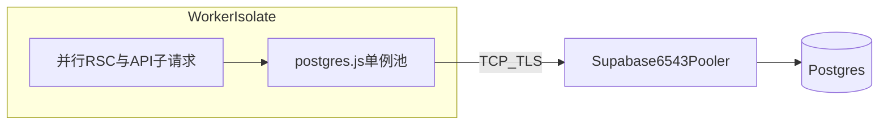

# Cloudflare Worker + Supabase 连接问题排查与加固计划

## 日志结论（你这次的关键证据）

- 失败链：`get configs from db failed` → `**write CONNECT_TIMEOUT**` → `aws-1-us-east-1.pooler.supabase.com:6543`。
- 含义：在 postgres.js 的 `**connect_timeout`（当前 12 秒）** 内，到 **Transaction pooler（6543）** 的 TCP/TLS 或连接建立未完成；属于 **网络/池化路径/边缘到 Supabase 的间歇延迟**，不是 `select from config` 本身逻辑错误。
- 同一段时间里 `**GET /docs` 200** 且仍打出 `[db] resolved (once)`，说明 **同一部署下有时能连上**，进一步支持 **间歇性** 而非配置完全错误。

## 配置与代码入口清单（「加载所有相关配置」）

| 层级          | 文件/位置                                                                                                                                                         | 作用                                                                                                      |
| ----------- | ------------------------------------------------------------------------------------------------------------------------------------------------------------- | ------------------------------------------------------------------------------------------------------- |
| 连接逻辑        | [frontend/src/core/db/postgres.ts](frontend/src/core/db/postgres.ts)                                                                                          | Worker 路径：`max: 1`（写死）、`connect_timeout: 12`、`prepare: false`、`fetch_types: false`、`ssl: require`（远程主机） |
| 构建期 env 快照  | [frontend/src/config/index.ts](frontend/src/config/index.ts)                                                                                                  | `database_url`、`db_schema`、`db_max_connections`（**注意：Worker 路径当前未读 `db_max_connections`**）              |
| 聚合 DB 访问    | [frontend/src/core/db/index.ts](frontend/src/core/db/index.ts)                                                                                                | `db()` → `getPostgresDb()`                                                                              |
| 首屏/配置读取     | [frontend/src/shared/models/config.ts](frontend/src/shared/models/config.ts)                                                                                  | `getConfigs` / `getAllConfigs`，易与 `get-session` 等并发                                                     |
| Auth        | [frontend/src/core/auth/config.ts](frontend/src/core/auth/config.ts)                                                                                          | `hasPostgresRuntimeConfig`、`AUTH_DB_DIAG`                                                               |
| 运维探针        | [frontend/src/app/api/dev/verify-db/route.ts](frontend/src/app/api/dev/verify-db/route.ts)                                                                    | 需 `VERIFY_DB_SECRET`                                                                                    |
| 示例与说明       | [frontend/.env.example](frontend/.env.example)                                                                                                                | `DATABASE_URL`、pooler 说明                                                                                |
| 部署          | Cloudflare Dashboard **Variables and secrets**、`pnpm` 构建时 [frontend/scripts/generate-wrangler.js](frontend/scripts/generate-wrangler.js) 白名单里的 `DATABASE_URL` | 运行时 `process.env.DATABASE_URL` 来源                                                                       |
| 本地 OpenNext | [frontend/next.config.mjs](frontend/next.config.mjs)                                                                                                          | `WRANGLER_HYPERDRIVE_LOCAL_CONNECTION_STRING_*`（与线上 pooler 无直接关系）                                       |

**重要发现**：`[postgres.ts](frontend/src/core/db/postgres.ts)` 里 Worker 客户端 `**max` 固定为 `1`**（约 230–236 行），没有使用 `[envConfigs.db_max_connections](frontend/src/config/index.ts)`。首页加载时 `**get-session`、`get-configs`、多路 `_rsc` 并行**，同一 isolate 内多查询会 **共用一个连接**；在连接抖动或重连时，**串行 + 12s 超时** 更容易放大为 **hung / canceled**。

## 建议实施顺序

### 1. 运维侧（零代码，优先验证）

- **确认 `DATABASE_URL` 与 Supabase 面板「Transaction pooler」一致**，含 `**?pgbouncer=true`**（6543 场景）。
- 在 Supabase 检查：**Network restrictions / IPv4 add-on**（若仅 IPv6 而 CF 出口为 IPv4 等，会导致间歇失败；以官方文档为准）。
- **A/B**：用同一密码试 **Session pooler（5432）** 或 **Direct（5432，`db.xxx.supabase.co`）** 作为 Worker 的 `DATABASE_URL`（注意直连连接数上限；仅用于验证是否为 6543 路径问题）。

### 2. 代码侧（小改动，建议 Agent 模式实现）

- **让 Worker 路径读取可配置 `max`**：例如使用 `envConfigs.db_max_connections`，默认保持 `1`，生产可设为 `**3～5**`（需在 Cloudflare 文档允许的并发 TCP 范围内；通常小于 Worker 子请求风暴即可）。
- **让 `connect_timeout` 可配置**：例如新 env `WORKER_PG_CONNECT_TIMEOUT`（秒），默认 `12`，生产可试 `**20～30`**，专门缓解 `CONNECT_TIMEOUT`。
- **启动时一次性格式化日志**（不含密码）：若 host 匹配 `pooler.supabase.com` 且 URL **缺少** `pgbouncer=true`，打 **warn**，避免误配。
- （可选）`**AUTH_DB_DIAG=1`** 已在 [auth/config.ts](frontend/src/core/auth/config.ts) 与 [postgres.ts](frontend/src/core/db/postgres.ts) 有部分诊断，可在 Worker 临时开启，对比 `hasCloudflareRuntimeContext` 与 URL 来源。

### 3. 预期与边界

- 若改为直连 5432 后 **问题消失**，则主要矛盾在 **6543 事务池 + CF 边缘路径**；可长期用直连或 Session pooler，并监控 Supabase 连接数。
- 若仍频繁 `CONNECT_TIMEOUT`，需结合 **colo/地区**、Supabase **region**（你当前为 `us-east-1` pooler）与 **是否跨区** 评估延迟与防火墙。

## 不在此计划内（除非你愿意加范围）

- 大规模重构 RSC 请求合并（减少并发 DB 命中）。
- 引入 Hyperdrive（你已因 Supabase 放弃；若未来支持再评估）。

