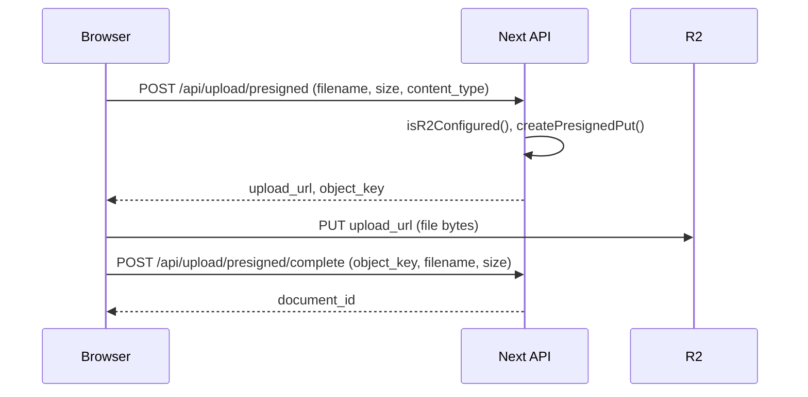

# 上传 503 与前端上传校验修复计划

## 一、503 与「为何请求后端」说明

### 1.1 503 的直接原因

`[src/app/api/upload/presigned/route.ts](frontend/src/app/api/upload/presigned/route.ts)` 在 **R2 未配置** 时返回 503：

```ts
if (!isR2Configured()) {
  return Response.json(
    { detail: 'Upload storage not configured' },
    { status: 503 }
  );
}
```

`[src/shared/lib/translate-r2.ts](frontend/src/shared/lib/translate-r2.ts)` 中 `isR2Configured()` 依赖：`R2_BUCKET`、`R2_ACCESS_KEY_ID`、`R2_SECRET_ACCESS_KEY`，以及 `R2_ENDPOINT` 或 `R2_ACCOUNT_ID`。

当前 `[.env.development](frontend/.env.development)` 里配置的是 **R2_BUCKET_NAME**、**R2_ENDPOINT_URL**，而代码只读 **R2_BUCKET**、**R2_ENDPOINT**，因此 `bucket` 为空，`isR2Configured()` 为 false，导致 503。

### 1.2 上传流程是「前端 + Next API」，没有改漏

当前设计（Route A）就是「前端先问 Next 要预签名 URL，再直传 R2」：




- 文件内容 **不经过 Next**，只经过「申请 URL」和「完成登记」两次请求，所以「上传文件会请求后端」是预期行为，不是遗留的旧后端逻辑。
- 503 表示的是「后端无法签发预签名 URL」，即 R2 未配置或变量名不对，而不是「不该调后端」。

---

## 二、修改项概览


| 项        | 说明                                                                              |
| -------- | ------------------------------------------------------------------------------- |
| R2 变量名统一 | 采用方案 B：不改代码，在文档与 .env.example 中明确使用 R2_BUCKET、R2_ENDPOINT，本地 .env 增加这两项以消除 503。 |
| 上传需登录    | 后端 presigned/complete 要求已登录（无 userId 则 401）；前端未登录时禁用上传并提示「请先登录后上传」。             |
| 服务端校验    | presigned 与 complete：限制大小、仅允许 PDF、对 filename/object_key 做安全处理（防止路径穿越/恶意 key）。   |
| 前端校验     | 在现有「仅 PDF」基础上增加最大文件大小限制、未登录限制与错误提示，可选：简单 PDF 魔数校验。                              |


---

## 三、R2 环境变量统一（消除 503）——采用方案 B

**方案 B（采用）**：不改 [translate-r2.ts](frontend/src/shared/lib/translate-r2.ts) 代码，通过统一环境变量名消除 503：

- 在 [docs/PROJECT_SETUP_AND_FC.md](frontend/docs/PROJECT_SETUP_AND_FC.md) 和 [.env.example](frontend/.env.example) 中明确：上传/翻译使用的 R2 变量为 **R2_BUCKET**、**R2_ENDPOINT**（与 R2_ACCOUNT_ID、R2_ACCESS_KEY_ID、R2_SECRET_ACCESS_KEY 一起）。
- 在本地 [.env.development](frontend/.env.development) 中增加（或把现有 R2_BUCKET_NAME、R2_ENDPOINT_URL 的值赋给代码读取的变量）：
  - `R2_BUCKET` = 当前 R2_BUCKET_NAME 的值（如 `translatepdfonline`）
  - `R2_ENDPOINT` = 当前 R2_ENDPOINT_URL 的值（如 `https://<account_id>.r2.cloudflarestorage.com`）
- 保留 R2_BUCKET_NAME、R2_ENDPOINT_URL 亦可，但必须同时设置 R2_BUCKET、R2_ENDPOINT，否则 `isR2Configured()` 仍为 false。

---

## 四、服务端上传校验（防恶意/滥用）

### 4.1 POST /api/upload/presigned

- **最大 body size**：Next 层不直接读 body 流，仅 `req.json()`，可限制为例如 1KB（仅传 filename/size_bytes/content_type）。
- **校验参数**：
  - `size_bytes`：必须 > 0，且 ≤ 服务端配置的最大值（如 100MB），否则 400。
  - `content_type`：仅允许 `application/pdf`，否则 400。
  - `filename`：非空字符串；从 filename 提取的扩展名仅允许 `pdf`（小写）；用于生成 `object_key` 时做安全处理：只取 basename、去掉 `..`、限制长度，最终用 `uploads/${nanoid(16)}.pdf` 形式（不信任客户端扩展名时可固定为 .pdf）。
- **object_key**：不直接使用用户可控路径，始终用 `uploads/${nanoid(16)}.pdf`（或上述安全 basename + .pdf），避免路径穿越与覆盖。

### 4.2 POST /api/upload/presigned/complete

- **object_key**：必须匹配「本服务生成的」格式（例如前缀 `uploads/`、后缀 `.pdf`、中间为指定字符集），否则 400；防止用户随便写 key 污染存储。
- **size_bytes**：可选与 presigned 时一致或做合理范围校验（>0 且 ≤ 同一上限）。
- **filename**：仅用于写入 DB 展示用；做长度与字符白名单（或转义），避免注入与超长。

实现时可抽公共常量：如 `MAX_PDF_BYTES = 100 * 1024 * 1024`、`ALLOWED_CONTENT_TYPE = 'application/pdf'`，presigned 与 complete 共用。

---

## 五、前端上传限制与提示

- **上传需登录**：
  - **后端**：在 [presigned/route.ts](frontend/src/app/api/upload/presigned/route.ts) 与 [presigned/complete/route.ts](frontend/src/app/api/upload/presigned/complete/route.ts) 中，在调用 `getTranslateAuth()` 后若 `userId` 为 null，则返回 401，body 如 `{ detail: 'Login required to upload' }`。
  - **前端**：在翻译页或 [UploadDropzone](frontend/src/shared/components/translate/UploadDropzone.tsx) 中根据登录态（如 useSession / getSession）判断：未登录时禁用上传区域（或隐藏上传入口）、显示「请先登录后上传」；若用户未登录仍触发上传，收到 401 时统一提示登录（如 `t('loginRequired')`）。
- **最大文件大小**：在 UploadDropzone 中增加上限（建议与后端一致，如 100MB）。在 `uploadFile` 内若 `file.size > MAX` 则 `setError(t('fileTooLarge'))` 并 return，不调用 `createPresignedUpload`。
- **类型**：已限制 `application/pdf` 与 `accept="application/pdf"`，保持不变。
- **错误提示**：对 503 返回的「存储未配置」在前端给出友好提示（如「存储未配置，请稍后再试」）；对 401 提示「请先登录后上传」。
- **可选**：在选中文件后、上传前做简单 PDF 魔数检查（前几个字节），非 PDF 则提示「请上传有效的 PDF 文件」；可作为增强项，不阻塞当前计划。

多语言：在 `translate.upload` 中增加 `fileTooLarge`、`storageUnavailable`、`loginRequired` 等 key（中/英/西按现有习惯补）。

---

## 六、实施顺序建议

1. **R2 环境变量（方案 B）**：在 .env.example 与 PROJECT_SETUP_AND_FC.md 中写明 R2_BUCKET、R2_ENDPOINT；在本地 .env.development 中增加 R2_BUCKET、R2_ENDPOINT（值同现有 R2_BUCKET_NAME、R2_ENDPOINT_URL），先消除 503。
2. **上传需登录**：后端 presigned 与 complete 在 getTranslateAuth() 后校验 userId 存在否则 401；前端根据登录态禁用/提示「请先登录后上传」，并对 401 做统一提示。
3. **服务端校验**（presigned + complete：大小、类型、object_key 安全、filename 安全）—— 防止恶意/滥用。
4. **前端大小与 503/401 提示**（UploadDropzone + translate.upload 文案：fileTooLarge、storageUnavailable、loginRequired）—— 提升体验与安全感知。
5. **（可选）** PDF 魔数校验、或 presigned 接口的 rate limit，视需要再做。

---

## 七、涉及文件清单

- [frontend/.env.example](frontend/.env.example) 与 [frontend/docs/PROJECT_SETUP_AND_FC.md](frontend/docs/PROJECT_SETUP_AND_FC.md)：明确 R2_BUCKET、R2_ENDPOINT（方案 B，不改 translate-r2.ts）。
- 本地 [frontend/.env.development](frontend/.env.development)：增加 R2_BUCKET、R2_ENDPOINT（与现有 R2_BUCKET_NAME、R2_ENDPOINT_URL 同值即可）。
- [frontend/src/app/api/upload/presigned/route.ts](frontend/src/app/api/upload/presigned/route.ts)：登录校验（无 userId 则 401）；大小/类型/object_key 与 filename 校验。
- [frontend/src/app/api/upload/presigned/complete/route.ts](frontend/src/app/api/upload/presigned/complete/route.ts)：登录校验（无 userId 则 401）；object_key 格式与可选 size/filename 校验。
- [frontend/src/shared/components/translate/UploadDropzone.tsx](frontend/src/shared/components/translate/UploadDropzone.tsx)：未登录时禁用上传并提示；最大文件大小；503/401 友好提示。
- 翻译页或布局：需能拿到登录态并传入 UploadDropzone（或由 UploadDropzone 内部 useSession），以便未登录时展示「请先登录后上传」。
- 文案：`frontend/src/config/locale/messages/{en,zh,es}/translate/upload.json` 等，新增 `fileTooLarge`、`storageUnavailable`、`loginRequired`。

以上完成后，503 会因 R2 配置正确而消失，「请求后端」的流程保持不变且更安全、可解释。