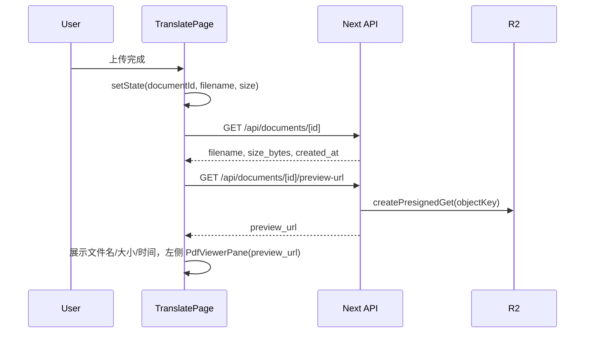

# 上传后文件展示、删除、7 天保留与预览

## 一、现状简述

- 上传完成后 [TranslatePageClient](frontend/src/app/[locale]/(landing)/translate/TranslatePageClient.tsx) 通过 `handleUploaded` 设置 `documentId`、`filename`、`lastUploadedFile`（仅 name/size），底部有一行「当前文档: 文件名」和删除按钮。
- 文档列表 [GET /api/documents](frontend/src/app/api/documents/route.ts) 返回 `id, filename, size_bytes, status, created_at`，但单文档仅有 [DELETE /api/documents/[documentId]](frontend/src/app/api/documents/[documentId]/route.ts)，无 GET。
- 左侧「原文」预览的 `sourcePdfUrl` 仅来自 [getTaskView](frontend/src/app/api/tasks/[taskId]/view/route.ts) 的 `source_pdf_url`，**上传后、未创建任务时没有原文 URL**，左侧 PDF 为空。
- [documents](frontend/src/config/db/schema.postgres.ts) 表已有 `expiresAt` 字段，创建文档时未赋值；文案已说明「保留 7 天」（[uploadFileNotice](frontend/src/config/locale/messages/en/translate/home.json)）。

---

## 二、需求与实现要点

### 2.0 用户隔离（当前用户只能看到自己的文件）

- **要求**：所有 PDF 文档与翻译任务按用户隔离，**当前用户仅能访问本人（或本 anonId）的文档与任务**；不得通过修改 documentId/taskId 访问他人数据。
- **实现**：所有涉及文档、任务的 API 必须：
  - 调用 [getTranslateAuth](frontend/src/app/api/translate/auth.ts) 取得当前 `userId`（已登录）或 `anonId`（匿名）。
  - **文档**：查询/删除/预览前用 `where = userId ? eq(documents.userId, userId) : eq(documents.anonId, anonId)` 且 `eq(documents.id, documentId)`，无匹配则返回 404，不返回任何内容或 presigned URL。
  - **任务**：查询/预览前用 `where = userId ? eq(translationTasks.userId, userId) : eq(translationTasks.anonId, anonId)` 且 `eq(translationTasks.id, taskId)`，无匹配则 404。
- **需强制隔离的接口**（含本次新增）：
  - [GET/DELETE /api/documents/[documentId]](frontend/src/app/api/documents/[documentId]/route.ts)（已有 DELETE 校验；新增 GET 须同条件）
  - [GET /api/documents](frontend/src/app/api/documents/route.ts)（已有 where 过滤）
  - **GET /api/documents/[documentId]/preview-url**：必须先按 documentId + userId/anonId 查出文档归属，通过后再拉 R2 做切片并返回 URL；否则 404。
  - **GET /api/tasks/[taskId]/output-preview-url**：必须先按 taskId + userId/anonId 查出任务归属，通过后再按 outputObjectKey 拉 R2 做切片；否则 404。
  - 现有 [GET /api/tasks](frontend/src/app/api/tasks/route.ts)、[GET /api/tasks/[taskId]](frontend/src/app/api/tasks/[taskId]/route.ts)、[GET /api/tasks/[taskId]/view](frontend/src/app/api/tasks/[taskId]/view/route.ts) 已按 userId/anonId 过滤，保持即可。
- **cleanup-expired**：删除时只按 `expiresAt` 过滤，不按用户；执行前需通过 cron secret 等鉴权，避免被任意调用。

### 2.1 上传完成后能看到文件（文件名、大小、上传时间）

- **原因**：当前只在下拉区域下有一行「当前文档: 文件名」，没有单独展示大小和上传时间，且 `created_at` 未在页面上使用。
- **实现**：
  - 新增 **GET /api/documents/[documentId]**：在 [documents/[documentId]/route.ts](frontend/src/app/api/documents/[documentId]/route.ts) 中增加 GET 分支，**先按 2.0 做归属校验**（documentId + userId/anonId），通过后返回单条文档：`id, filename, size_bytes, status, created_at`（及可选 `expires_at`）。不在此接口返回 preview_url，由专门预览接口提供。
  - 新增 **GET /api/documents/[documentId]/preview-url**：**先按 2.0 校验文档归属**，通过后再根据文档 `objectKey` 做切片并返回 presigned URL（见 2.4）。若 R2 未配置则返回 503。
  - 前端：在 [TranslatePageClient](frontend/src/app/[locale]/(landing)/translate/TranslatePageClient.tsx) 中，当 `documentId` 存在时请求上述接口（GET document + preview-url，或一个合并接口），将 **filename、size_bytes、created_at** 存入 state，在「当前文档」区域**显式展示**：文件名、大小（如 1.2 MB）、上传时间（格式化为本地日期时间）。可保留现有「当前文档」一行，在其下或同一块内增加一行小字：大小 + 上传时间。
- **文案**：在 [translate.home](frontend/src/config/locale/messages/en/translate/home.json)（及 zh）中增加如 `uploadedAt`（"Uploaded at" / "上传时间"）、`fileSize`（"Size" / "大小"）等，用于该信息块。

### 2.2 允许用户删除；文件保留 7 天后自动删除

- **删除**：已有 [handleDeleteDocument](frontend/src/app/[locale]/(landing)/translate/TranslatePageClient.tsx) 与 DELETE /api/documents/[documentId]，只需确保在「当前文档」信息块中删除按钮明显可用（已存在，可保留或与 2.1 的展示放在一起）。
- **7 天保留**：
  - 在 [presigned/complete/route.ts](frontend/src/app/api/upload/presigned/complete/route.ts) 插入文档时，设置 **expiresAt = new Date(Date.now() + 7 * 24 * 60 * 60 * 1000)**（7 天后）。若 schema 中 `expiresAt` 可为 null，则按需保留「未设置则视为永久」或统一 7 天。
  - **过期清理**：在服务端提供**按过期时间删除**的能力，例如新增 **POST /api/documents/cleanup-expired**（或 DELETE，仅服务端 cron 调用）：查询 `documents.expiresAt < now()`，先删关联的 translation_tasks，再删 documents；可选返回删除条数。该接口需做鉴权并限制为内部/cron 调用（如通过 secret 或 Vercel Cron 的授权头）。不在本次实现具体 cron 调度，只在文档中说明「可配置 cron 定期调用此接口实现 7 天自动删除」。

### 2.3 预览需求

- **左侧「原文」预览**：上传完成后、尚未创建翻译任务时，左侧应能预览**当前已上传的 PDF**。
- **实现**：
  - 使用 2.1 的 **preview-url** 接口：当页面有 `documentId` 时，请求该接口得到 `preview_url`。
  - 在 [TranslatePageClient](frontend/src/app/[locale]/(landing)/translate/TranslatePageClient.tsx) 中，**左侧 PDF 的 URL 逻辑**：若存在 `taskView?.source_pdf_url` 则优先用（任务视角的原文）；否则若存在 `documentId`，则用本次请求到的 `documentPreviewUrl`（上传后文档的预签名 URL）作为左侧 [PdfViewerPane](frontend/src/shared/components/translate/PdfViewerPane.tsx) 的 `fileUrl`。这样上传完成后即可在左侧看到原文 PDF。
  - 若 R2 未配置或 preview-url 失败，左侧保持当前占位或空状态，不报错阻断。

### 2.4 大文件预览与 PDF 切片（避免浏览器卡死）

- **问题**：大 PDF 整份加载到前端会导致内存占用过高、浏览器卡死。需要「按页」加载，且默认只预览第一页。
- **思路**：不做整份 PDF 的 presigned URL，改为**服务端按页切片**——只生成/返回「单页 PDF」的预览 URL，前端每次只加载一页。
- **实现要点**：
  - **文档原文切片**：`GET /api/documents/[documentId]/preview-url?page=1`（默认 `page=1`）。服务端：**先按 2.0 校验该 documentId 属于当前 userId/anonId**，通过后再从 R2 拉取该文档完整 PDF，用 **pdf-lib** 提取第 `page` 页，上传到 R2 如 `slices/{documentId}/page-{n}.pdf`，返回 `{ preview_url, total_pages }`。若该页 slice 已存在则直接返回其 presigned URL。
  - **译文切片**：`GET /api/tasks/[taskId]/output-preview-url?page=1`。**先按 2.0 校验该 taskId 属于当前用户**，通过后再根据任务 `outputObjectKey` 从 R2 取译文 PDF，提取第 `page` 页，上传 slice，返回 `{ preview_url, total_pages }`。
  - **前端**：
    - **默认第一页**：原文预览默认请求 `preview-url?page=1`；译文预览在翻译完成后也默认请求 `output-preview-url?page=1`。两侧 [PdfViewerPane](frontend/src/shared/components/translate/PdfViewerPane.tsx) 的 `initialPage` 均为 1，且传入的 `fileUrl` 为**当前页对应的切片 URL**（即每次只加载单页 PDF）。
    - **翻页**：用户点击上一页/下一页时，请求 `preview-url?page=N`（或 output-preview-url?page=N），用返回的 `preview_url` 更新对应侧的 `fileUrl`，始终只渲染单页。前端用接口返回的 `total_pages` 显示「第 N / total_pages 页」并控制翻页按钮可用性。
  - **依赖**：服务端需安装 PDF 处理库（如 `pdf-lib`），用于从完整 PDF 中复制单页到新 PDF 并上传 R2。若单次提取耗时较长，可在接口内做短期缓存（内存或 R2 已有 slice key）。
- **与 2.3 的衔接**：2.3 的「preview-url」改为**按页**接口（见上）；左侧/右侧的 `sourcePdfUrl`、`targetPdfUrl` 不再使用「整份 PDF」URL，而是「当前页切片」URL；默认展示第一页，翻译后右侧默认也是第一页。

---

## 三、接口与数据流小结

- **GET /api/documents/[documentId]**：返回文档元数据（含 created_at、可选 total_pages 若已解析）。
- **GET /api/documents/[documentId]/preview-url?page=1**：返回**第 page 页**的单页 PDF 切片 presigned URL（服务端用 pdf-lib 等从完整 PDF 提取该页并上传 R2 后签发）。
- **GET /api/tasks/[taskId]/output-preview-url?page=1**：返回译文 PDF 第 page 页的单页切片 presigned URL。
- 创建文档时写入 **expiresAt = now + 7d**；**POST /api/documents/cleanup-expired** 用于定时清理过期文档。

---

## 四、涉及文件

- [frontend/src/app/api/documents/[documentId]/route.ts](frontend/src/app/api/documents/[documentId]/route.ts)：增加 GET（文档详情）；保持 DELETE。
- 新增 [frontend/src/app/api/documents/[documentId]/preview-url/route.ts](frontend/src/app/api/documents/[documentId]/preview-url/route.ts)：GET，查询参数 `page`（默认 1）。**先 getTranslateAuth 并用 userId/anonId + documentId 查询 documents，无记录或归属不符则 404**；通过后从 R2 拉取完整 PDF，用 pdf-lib 提取第 page 页，上传到 R2 `slices/{documentId}/page-{n}.pdf` 并返回该切片的 presigned GET URL；可缓存已生成 slice 的 key 避免重复提取。
- 新增 [frontend/src/app/api/tasks/[taskId]/output-preview-url/route.ts](frontend/src/app/api/tasks/[taskId]/output-preview-url/route.ts)：GET，查询参数 `page`（默认 1）。**先 getTranslateAuth 并用 userId/anonId + taskId 查询 translation_tasks，无记录或归属不符则 404**；通过后根据任务 `outputObjectKey` 从 R2 取译文 PDF，提取第 page 页，上传 slice 并返回 presigned URL。
- [frontend/src/app/api/upload/presigned/complete/route.ts](frontend/src/app/api/upload/presigned/complete/route.ts)：插入 documents 时设置 `expiresAt`。
- 新增 [frontend/src/app/api/documents/cleanup-expired/route.ts](frontend/src/app/api/documents/cleanup-expired/route.ts)（或类似路径）：内部/cron 调用的过期清理接口。
- [frontend/src/shared/lib/translate-api.ts](frontend/src/shared/lib/translate-api.ts)：新增 `getDocument(id)`、`getDocumentPreviewUrl(id)`（或合并为一次返回 document + preview_url 的接口，由前端决定）。
- [frontend/src/app/[locale]/(landing)/translate/TranslatePageClient.tsx](frontend/src/app/[locale]/(landing)/translate/TranslatePageClient.tsx)：当 `documentId` 存在时拉取文档详情；**按页**拉取预览：左侧 `sourcePdfUrl` 使用 `preview-url?page=currentPage` 得到的切片 URL（无 task 时）或 task 的 source 切片；右侧译文使用 `output-preview-url?page=targetPage`。**默认第一页**：`currentPage` 初始为 1，翻译完成后右侧默认也是第 1 页；翻页时先请求对应 page 的切片 URL 再更新 `fileUrl`。状态中增加 `documentCreatedAt`、当前页对应的 `sourceSliceUrl`/`targetSliceUrl`（或按页缓存 URL）；当前文档区域展示文件名、大小、上传时间；删除按钮保持。
- [frontend/src/shared/components/translate/PdfViewerPane.tsx](frontend/src/shared/components/translate/PdfViewerPane.tsx)：在「单页切片」模式下，传入的 `fileUrl` 已是单页 PDF，组件内 `numPages` 恒为 1，可隐藏或简化翻页 UI，由父组件控制翻页（父组件换 URL）；或保留 prev/next 但由父组件传入新 URL。确保 `initialPage={1}` 与父组件默认第一页一致。
- [frontend/src/config/locale/messages/{en,zh}/translate/home.json](frontend/src/config/locale/messages/en/translate/home.json)：增加 `uploadedAt`、`fileSize` 等 key。
- [frontend/docs/PROJECT_SETUP_AND_FC.md](frontend/docs/PROJECT_SETUP_AND_FC.md)：在「常见问题」或新小节中说明 7 天保留与「可配置 cron 调用 cleanup-expired 实现自动删除」。
- 服务端 PDF 切片依赖：在 frontend 中安装 `pdf-lib`（或同类库），用于在 preview-url 与 output-preview-url 中提取单页并上传 R2。若使用 R2 的 GetObject，需在 API 中流式读取并传入 pdf-lib。

---

## 五、实施顺序建议

1. **GET document + GET preview-url（按页切片）**：实现 GET document；实现 preview-url 的按页逻辑（R2 取完整 PDF → pdf-lib 提取 page → 上传 slice → 返回 presigned URL）；translate-api 增加 getDocument、getDocumentPreviewUrl(id, page)。
2. **GET task output-preview-url（按页切片）**：实现 output-preview-url?page=1，逻辑同文档切片。
3. **complete 写入 expiresAt**：7 天过期时间。
4. **TranslatePageClient**：拉取文档详情；**默认第一页**，原文/译文均用「当前页」的切片 URL；翻页时请求新 page 的切片 URL 再更新左右两侧 fileUrl；展示文件名、大小、上传时间。
5. **PdfViewerPane**：在单页 URL 模式下保持可用的单页渲染；翻页由父组件换 URL 驱动。
6. **cleanup-expired 接口 + 文档说明**：便于后续配置 cron。
7. **文案**：home.json 的 uploadedAt、fileSize。

按上述顺序实现后，上传完成即可看到文件信息与左侧原文预览（仅第一页），大文件不会整份加载，翻译后右侧默认第一页，翻页通过换切片 URL 实现，删除与 7 天过期逻辑完整。
