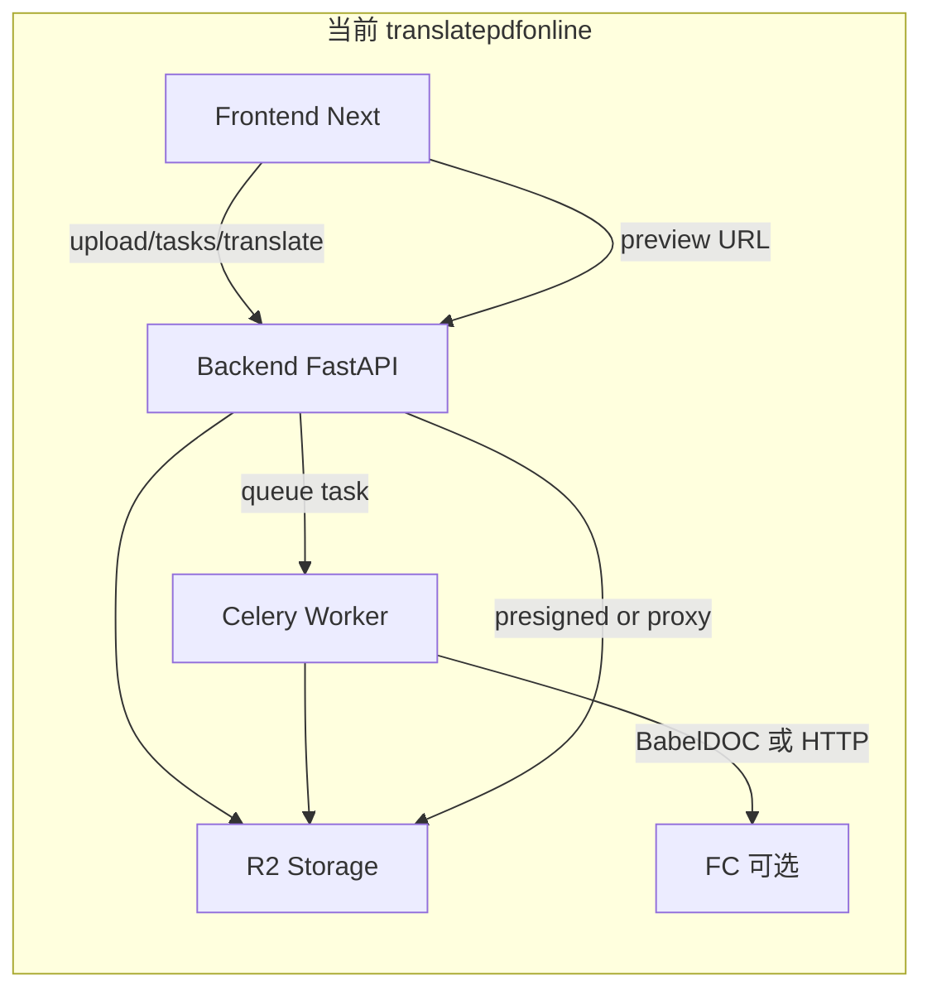
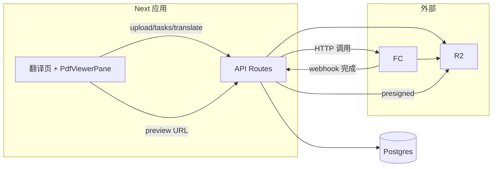

# 以 reference 为基底并入翻译与 PDF 预览

## 一、方向与约束

- **基底**：以 [tmp/onlinepdftranslator/src](tmp/onlinepdftranslator/src) 为**唯一前端项目**，在其上做改动；reference 原有能力（注册、登录、支付、订阅、订单、动态页、设置等）**不改动**。
- **迁入能力**：将当前 [frontend/](frontend/)（translatepdfonline）中的 **PDF 上传、翻译任务创建/状态/取消、PDF 预览（源文+译文）、下载** 等流程迁入 reference 项目。
- **首要目标**：前端**必须能进行 PDF 预览**（源文与译文双栏或单栏，基于 react-pdf/pdfjs）。

---

## 二、当前架构简要（便于评估）

- **Frontend**：[frontend/app/[locale]/page.tsx](frontend/app/[locale]/page.tsx) 首页：上传区、翻译表单、任务状态、左右双栏 [PdfViewerPane](frontend/components/PdfViewerPane.tsx)（react-pdf），预览 URL 来自 `getTaskView` 的 `download_url`（后端签发或代理）。
- **Backend**：提供 `/api/documents`、`/api/upload/`*、`/api/translate`、`/api/tasks/`*、`/api/tasks/:id/file`；写 DB（documents、translation_tasks）、发 Celery 任务、R2 预签名。
- **Worker**：执行 [run_translation_task](backend/app/tasks_translate.py)；当 `BABELDOC_USE_FC=True` 时通过 HTTP 调 [babeldoc_client](backend/app/babeldoc_client.py)（FC），否则本地跑 BabelDOC；结果写 R2，更新任务状态。

---

## 三、后端与 Worker 评估

**结论概要：**

- **后端**：若希望「不再维护独立 Python 服务」，可用 **Next.js API Routes + 数据库 + R2** 替代当前 FastAPI 的文档/上传/任务/翻译入口；保留「谁签发预览与下载 URL、谁落库任务状态」的职责，只是实现从 Python 迁到 Next。
- **Worker**：**可以不再需要**。翻译执行已支持 FC（`BABELDOC_USE_FC` + `babeldoc_client`）。可改为：由 Next API 创建任务后**直接 HTTP 调用 FC**，FC 完成后通过 **webhook 回调 Next** 更新任务状态并写 R2。这样无需 Celery 与 Worker 进程。
- **前端 + FC 能否完成 PDF 在线翻译**：能。前提是：
  - 在「新前端」（reference 基底）内实现或保留：**上传（预签名或直传 R2）、创建翻译任务、轮询或 SSE 任务状态、获取译文预览/下载 URL**。
  - 翻译执行**只**由 FC 承担：Next 只负责「调 FC + 收 webhook」，不再有 Worker。

**可选两种路线：**

- **路线 A（推荐）**：**前端 = reference 基底 + 迁入的翻译/预览能力**；**后端 = Next.js API Routes + 同一 Postgres（或 Vercel Postgres）+ R2**；**无 Python 后端、无 Worker**；翻译由 **Next 调 FC，FC 回调 Next** 更新状态。
- **路线 B**：保留现有 Python 后端与 Worker，仅把「前端」换成 reference 基底并接现有 API；前端只做迁移与适配，后端与 Worker 逻辑基本不动。

若选路线 A，需在 reference 项目中新增：Next API 的文档/上传/任务/翻译/回调路由，以及任务与文档的持久化（DB）；FC 需提供可配置的 webhook URL（或由 FC 内部在完成后请求 Next 的 `/api/translate/callback` 之类）。

---

## 四、以 reference 为基底的具体规划

### 4.1 代码与目录约定

- **工作目录**：所有新改均在 [tmp/onlinepdftranslator/src](tmp/onlinepdftranslator/src) 下（或你将该目录提升为正式前端仓库后的等价路径）。
- **不修改**：reference 已有页面与功能（auth、payment、settings、动态页、主题与区块等）保持原样。
- **迁入来源**：以当前 [frontend/](frontend/) 的以下部分为参考实现，**迁入**到 reference 项目，并适配 reference 的 i18n、路由、组件与 API 风格：
  - PDF 预览与翻译相关 UI、API 调用、状态流。

### 4.2 必须迁入并优先保证的能力（PDF 预览为第一要务）

1. **PDF 预览**
  - 将 [frontend/components/PdfViewerPane.tsx](frontend/components/PdfViewerPane.tsx)（或等价逻辑）迁入 reference，保证：
    - 支持通过 **URL**（presigned 或同源代理）加载 PDF；
    - 支持**源文 / 译文**双模式（或双栏）；
    - 页码受控/同步（与现有首页双栏行为一致）。
  - 依赖：`react-pdf`、`pdfjs-dist`；worker 与 cmap 路径与当前 frontend 一致或按 reference 的 public/CDN 策略调整。
  - **验收**：在 reference 基底的前端中，能打开「翻译任务」对应页面，左侧源文 PDF、右侧译文 PDF（或单栏切换）均可正常渲染、翻页。
2. **翻译主流程（为预览提供数据与 URL）**
  - **上传**：在 reference 中实现「选择 PDF → 获得 document_id」的流程。若采用路线 A，由 Next API 提供 presigned 或直传 R2 的接口；若路线 B，继续调用现有 Backend 的 `/api/upload/`* 与 `/api/documents`。
  - **创建任务**：在 reference 中实现「选择文档 + 源/目标语言 + 可选页范围 → 创建翻译任务」；若路线 A，由 Next API 写任务入 DB 并调 FC；若路线 B，调用现有 `/api/translate`。
  - **任务状态**：轮询或 SSE 获取任务状态（queued / processing / completed / failed）；完成后能拿到**译文预览与下载 URL**（与当前 `getTaskView` + `download_url` 一致）。
  - **预览与下载**：预览使用与 PdfViewerPane 一致的 URL（`inline`）；下载使用同一 URL 的 `attachment` 或单独下载接口，行为与当前一致。
3. **入口与路由**
  - 在 reference 的 app 路由中新增「翻译」入口（例如 `/[locale]/translate` 或保留首页为翻译页，视 reference 现有首页而定）；该页面承载：上传区、翻译表单、任务状态、**双栏 PDF 预览**（PdfViewerPane 左+右）。
4. **i18n 与文案**
  - 将当前 [frontend/messages](frontend/messages) 中与 **upload、translate、task、errors、pdfViewer** 等相关的键迁入 reference 的 locale/messages 结构，保证预览与翻译相关文案完整。

### 4.3 与 reference 的集成方式（建议）

- **路由**：若 reference 已有 `[locale]` 与 `(landing)` 等，翻译页放在 `app/[locale]/translate/page.tsx`（或单独 layout 下），避免覆盖 reference 首页。
- **导航**：在 reference 的 Header 或主导航中增加「PDF 翻译」或「翻译」入口，指向上述翻译页。
- **API 调用**：在 reference 内封装与「文档、上传、翻译、任务、预览 URL」相关的 API 客户端，请求目标为：
  - **路线 A**：同源 Next API（如 `/api/documents`、`/api/translate`、`/api/tasks/...`），由 Next 再连 DB、R2、FC；
  - **路线 B**：现有 Backend 的 `NEXT_PUBLIC_API_BASE_URL`（与当前 frontend 一致）。
- **鉴权**：若 reference 使用 better-auth，则上传/任务/预览接口需校验 session；与现有「临时用户 / 登录用户」策略可对齐（用 session 或匿名 id 区分归属）。

### 4.4 数据流（路线 A：无 Python、无 Worker）

- 预览 URL：由 Next API 根据任务结果生成 R2 presigned URL（或同源 proxy），前端 PdfViewerPane 仅通过 URL 加载，**无需改动预览组件逻辑**，只需保证 URL 可用。

---

## 五、实施顺序建议

1. **确定路线**：选择路线 A（Next + FC，无 Python/Worker）或路线 B（保留 Backend + Worker，只迁前端）。
2. **在 reference 中落地 PDF 预览**：迁入 PdfViewerPane 与依赖，在任意一页用固定 PDF URL 验证渲染与翻页正常（**优先完成**）。
3. **在 reference 中实现翻译入口页**：上传区、翻译表单、任务状态占位；先接现有 Backend（路线 B）或占位 API（路线 A），保证页面与路由就绪。
4. **对接任务与预览 URL**：实现 getTaskView 等价逻辑与预览 URL 注入，在翻译页接上双栏 PdfViewerPane，完成「上传 → 创建任务 → 等完成 → 左右预览」闭环。
5. **若选路线 A**：在 reference 中实现 Next API（documents、upload、tasks、translate、FC 调用与 webhook）；迁移或新建 DB 表（documents、translation_tasks）；配置 R2、FC URL 与 webhook；最后下线或不再依赖 Python 与 Worker。

---

## 六、交付与验收（摘要）

- **PDF 预览**：在 reference 基底的前端中，翻译相关页面能稳定打开**源文与译文 PDF**（双栏或可切换），翻页与当前产品一致。
- **翻译流程**：上传 PDF → 创建翻译任务 → 查看状态 → 完成后预览与下载译文，与现有行为一致（无论 API 来自 Next 还是现有 Backend）。
- **reference 原有功能**：注册、登录、支付、订阅、订单、动态页、设置等无回归。
- **后端/Worker**：若采用路线 A，则不再依赖 Python 后端与 Celery Worker；若采用路线 B，仅前端迁到 reference，后端与 Worker 保持不变。

---

若你确认采用**路线 A**或**路线 B**，以及 reference 项目实际路径（是否将 `tmp/onlinepdftranslator` 提为正式仓库），可在下一步细化「在 reference 中的文件清单与逐文件迁移/新增说明」及「FC webhook 与 Next API 的接口约定」。