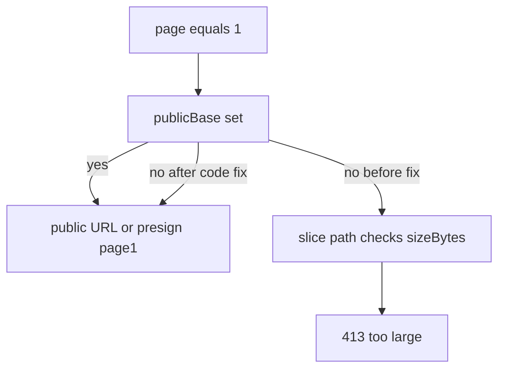

# 修复 Worker 上大 PDF 第 1 页预览 413（含 R2 公网配置）

## 根因

`[frontend/src/app/api/documents/[documentId]/preview-url/route.ts](frontend/src/app/api/documents/[documentId]/preview-url/route.ts)` 逻辑顺序如下：

1. `**page === 1 && publicBase && doc.objectKey**`（约 63–90 行）：用公网直链返回整 PDF，大文件可走 `total_pages: 0` 且不加载整本。
2. 若不进入该分支（**常见原因**：生产未设置 `[getR2PublicBaseUrl()](frontend/src/shared/lib/translate-r2.ts)` 所需的 `R2_PUBLIC_URL` / `NEXT_PUBLIC_R2_PUBLIC_URL`），后续在 `**doc.sizeBytes > maxBytes`**（Worker 上 `maxPreviewLoadBytes()` = 8MB）时直接 **413**（约 107–108 行）。

`[frontend/src/app/api/tasks/[taskId]/output-preview-url/route.ts](frontend/src/app/api/tasks/[taskId]/output-preview-url/route.ts)` 同样依赖 `**page === 1 && publicBase`**（约 86–99 行）；无 `publicBase` 时大译稿会在约 102–104 行 **413**。

因此：即使用户请求 `**?page=1`**，只要没有公网 base URL，就会误走「必须整本拉取再切片」的路径并触发限制。

## 方案 A：代码（必做）

### 1. 文档源预览 `[preview-url/route.ts](frontend/src/app/api/documents/[documentId]/preview-url/route.ts)`

在 `**page === 1 && doc.objectKey**` 场景拆两类：

- **有 `publicBase`**：保持现有 `${publicBase}/${encodeR2KeyForPublicUrl(...)}` 与 `total_pages` 逻辑不变。
- **无 `publicBase` 但 R2 已配置**：`preview_url = await createPresignedGet(doc.objectKey, 3600)`。
  - `total_pages`：`doc.pageCount` 有效则用；否则若 `doc.sizeBytes <= maxBytes` 可 `getObjectBody` + `PDFDocument.load` 写回页数；若 `**sizeBytes > maxBytes`** 则 `**total_pages: 0`**，由前端 pdf.js 解析。

该分支须 **先于** `sizeBytes > maxBytes` 的 413 判断，确保第 1 页不因「仅缺 publicBase」而 413。

### 2. 译稿预览 `[output-preview-url/route.ts](frontend/src/app/api/tasks/[taskId]/output-preview-url/route.ts)`

对 `**page === 1 && task.outputObjectKey`** 对称处理：

- 有 `publicBase`：保持现有行为。
- 无 `publicBase`：`preview_url = await createPresignedGet(task.outputObjectKey, 3600)`；`total_pages` 来自 `totalFromSource`，若无且 `outputSize <= maxBytes` 可加载一次补页数，否则 `**total_pages: 0`**。

须在 `**outputSize > maxBytes` 的 413** 之前处理完 `page=1`。

### 3. 上限策略

**不**默认调高 Worker 的 8MB 整本加载上限；`page>1` 且无缓存切片、文件仍 >8MB 时仍可 **413**（不在 Worker 内整本切片）。可选的未来增强：仅用于 `getObjectBody` 路径的 `PDF_PREVIEW_MAX_LOAD_MB` 环境变量（与本次正交）。

## 方案 B：运维（R2 自定义域与变量，与代码互补）

### `R2_ENDPOINT` 与 `R2_PUBLIC_URL` 不得互换

| 变量                                                | 用途                                                                                        |
| ------------------------------------------------- | ----------------------------------------------------------------------------------------- |
| `**R2_ENDPOINT` / `R2_ENDPOINT_URL`**             | S3 兼容 API 根（如 `https://<account>.r2.cloudflarestorage.com`），用于签名、预签名、读写。                  |
| `**R2_PUBLIC_URL` / `NEXT_PUBLIC_R2_PUBLIC_URL`** | 浏览器可匿名 `**GET**` 的公网基址；典型为 R2 **自定义域**（生产推荐），例如 `https://storage.translatepdfonline.com`。 |

代码拼接方式为：`${publicBase}/${encodeR2KeyForPublicUrl(objectKey)}`，与「自定义域绑定到桶根」一致：**base URL 内不要重复拼桶名**。

### Worker 运行时

在 **Variables and secrets** 中配置 `R2_PUBLIC_URL` 或 `NEXT_PUBLIC_R2_PUBLIC_URL` 与自定义域一致；若构建用 `[generate-wrangler.js](frontend/scripts/generate-wrangler.js)` 且白名单未包含该键，须在控制台单独配置，或把键加入白名单随 deploy 注入。

配置正确后，`page=1` 优先走直链，大文件可不进 Worker 内存；**未配置**时依赖 **方案 A 的预签名** 仍应返回 200。

### CORS

若站点域（如 `*.workers.dev` / 主站）与 `storage.translatepdfonline.com` 不同，且 pdf.js / fetch 跨域拉 PDF，需在 **R2 桶 CORS** 中允许对应来源及 `GET`/`HEAD`。

## 验证

- **仅代码修复、无 `R2_PUBLIC_URL`**：`GET .../preview-url?page=1`，`sizeBytes > 8MB` → **200**，`preview_url` 为预签名链接，`total_pages` 为库中值或 `0`。
- **已配自定义域 + `R2_PUBLIC_URL`**：同上且 `preview_url` 为 `https://storage.translatepdfonline.com/...` 形式（无签名参数）。
- `**page>1**`、无切片缓存、文件 >8MB：仍可 **413**（预期）。

