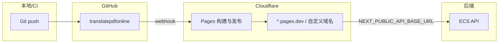

# 前端部署到 Cloudflare Pages（GitHub）详细方案

## 一、前提与架构

- **前端**：Next.js 16（App Router），位于 monorepo 的 [frontend](frontend/) 目录，构建命令 `npm run build`，API 请求通过 [frontend/lib/api.ts](frontend/lib/api.ts) 使用 `NEXT_PUBLIC_API_BASE_URL`。
- **后端**：已部署在 ECS（如 47.253.190.94），API 根地址例如 `https://translatepdfonline.com`；CORS 由 [backend/app/config.py](backend/app/config.py) 的 `FRONTEND_ORIGINS` 控制。
- **目标**：前端放在 Cloudflare Pages，用 GitHub 仓库触发自动构建与发布；环境变量与 CORS 配置清楚可落地。

---

## 二、从代码上传开始

### 2.1 仓库与分支

- **仓库**：确保前端代码在 GitHub 仓库中（如 `gladlyknow/translatepdfonline`）；前端代码在 `**frontend/`** 下，与 `backend/` 同仓（monorepo）。
- **分支**：选定用于生产部署的分支（如 `main` 或 `master`），后续 Push 到该分支会触发 Pages 生产构建。
- **推送前自检**（本地在项目根执行）：
  - `cd frontend && npm ci && npm run build` 能成功。
  - 若存在 [frontend/next.config.ts](frontend/next.config.ts) 或 `next.config.js`，确认无仅本地路径或本地环境依赖。

### 2.2 首次或重置时在 Cloudflare 连接 GitHub

1. 登录 [Cloudflare Dashboard](https://dash.cloudflare.com) → **Workers & Pages** → **Create application** → **Connect to Git**。
2. 选择 **GitHub**，授权 Cloudflare 访问目标组织/账号。
3. 选择仓库 **translatepdfonline**（或你的实际仓库名），点击 **Begin setup**。

---

## 三、Cloudflare Pages 构建配置

在 **Build configuration** 中设置（与 [DEPLOYMENT.md](DEPLOYMENT.md) 一致）：

| 配置项                        | 值               | 说明                    |
| -------------------------- | --------------- | --------------------- |
| **Production branch**      | `main`（或你的生产分支） | 该分支的 push 触发生产部署      |
| **Root directory**         | `frontend`      | 必填，monorepo 下前端目录     |
| **Framework preset**       | `Next.js`       | 若自动识别则保持，否则可选手动       |
| **Build command**          | `npm run build` | 即 `next build`        |
| **Build output directory** | 见下文             | 取决于是否静态导出或使用 OpenNext |

**Build output directory 说明**：

- **默认 Next.js（含 SSR）**：Cloudflare 若支持 Next.js 运行时，通常使用默认输出（如 `.next`），按 Cloudflare 当前文档为准；若文档要求指定，则填其要求的目录（例如 `.next` 或 OpenNext 的 `.vercel/output/static`）。
- **仅静态导出**：若改为静态站点以简化部署，需在 `frontend` 下增加或修改 `next.config.`*，设置 `output: 'export'`，然后构建输出目录填 `**out`**。
- 建议：先不改 `next.config`，用 **Root: frontend、Build: npm run build** 保存；若首次构建报错或部署后无法访问，再根据报错决定改为静态导出或接入 [OpenNext for Cloudflare](https://opennext.js.org/cloudflare)。

**Node 版本**：在 **Settings → Environment variables** 中可为 Build 设置 `NODE_VERSION`（如 `20`），避免版本过旧导致构建失败。

---

## 四、环境变量（重点）

### 4.1 前端（Cloudflare Pages）

在 **Pages 项目 → Settings → Environment variables** 中配置。变量在**构建时**注入，`NEXT_PUBLIC_`* 会被 Next.js 内联到客户端。

| 变量名                        | 必填  | 环境                   | 说明                  | 示例                               |
| -------------------------- | --- | -------------------- | ------------------- | -------------------------------- |
| `NEXT_PUBLIC_API_BASE_URL` | 是   | Production / Preview | 后端 API 公网根地址（无尾部斜杠） | `https://translatepdfonline.com` |

- **Production**：填生产 API 地址（如 `https://translatepdfonline.com`）。
- **Preview**（可选）：可为 PR/分支预览填测试 API 或同一生产 API。
- 修改环境变量后需 **重新部署**（Re-deploy 或再 push 一次）才会生效。

若未来前端使用 NextAuth 等且需在构建/运行时报出站点 URL，再增加例如：

- `NEXTAUTH_URL`：当前站点地址（如 `https://xxx.pages.dev` 或自定义域名）
- `NEXTAUTH_SECRET`：与后端约定一致的密钥（若需）

当前 [DEPLOYMENT.md](DEPLOYMENT.md) 与 [backend/app/config.py](backend/app/config.py) 仅要求前端提供 `NEXT_PUBLIC_API_BASE_URL`，后端负责 CORS 与 OAuth 回调。

### 4.2 后端（ECS）需配合的变量

前端部署到 Pages 后，后端必须允许该前端源站跨域，并保证 OAuth 回调指向后端：

| 变量名                   | 说明                      | 示例                                                        |
| --------------------- | ----------------------- | --------------------------------------------------------- |
| `FRONTEND_ORIGINS`    | CORS 允许的源，逗号分隔          | `https://your-project.pages.dev,https://yourdomain.com`   |
| `GOOGLE_REDIRECT_URI` | Google OAuth 回调（必须指向后端） | `https://translatepdfonline.com/api/auth/google/callback` |

- 将 **Cloudflare Pages 的访问域名**（如 `https://xxx.pages.dev` 或已绑定的自定义域名）加入 `FRONTEND_ORIGINS`。
- 修改后重启 ECS 上的 API 服务使配置生效。

---

## 五、部署流程与注意事项

### 5.1 一次完整流程（从代码到上线）

1. **本地**：在 `frontend/` 下确认 `npm run build` 通过，提交并 push 到生产分支。
2. **GitHub**：Push 触发 Cloudflare Pages 的 webhook，自动开始构建。
3. **Cloudflare**：在 **Deployments** 中查看构建日志；成功后可从 **View build** 或 **Visit site** 访问。
4. **后端**：若尚未配置，在 ECS 上设置 `FRONTEND_ORIGINS` 包含该 Pages 域名，并重启 API。
5. **验证**：在浏览器打开 Pages 地址，检查登录、上传、翻译是否正常（请求应发往 `NEXT_PUBLIC_API_BASE_URL` 且无 CORS 报错）。

### 5.2 注意事项

- **Root directory 必填**：不填则会在仓库根目录找 `package.json` 并可能用错依赖/脚本，必须设为 `frontend`。
- **环境变量生效时机**：仅构建时注入；改完变量后要 **Re-deploy** 或重新 push 才会在新构建中生效。
- **API 与 HTTPS**：`NEXT_PUBLIC_API_BASE_URL` 必须是前端可访问的后端公网地址（建议 HTTPS），且后端已放行 80/443 与 CORS。
- **OAuth 回调**：Google 登录回调必须在 Google Cloud Console 中配置为后端地址（与 `GOOGLE_REDIRECT_URI` 一致），不能指到 `*.pages.dev` 的前端地址。
- **Next.js 与 Cloudflare**：若 Cloudflare 对 Next.js 的默认支持与当前版本不兼容，可考虑：  
  - 使用 `output: 'export'` 做纯静态导出，或  
  - 按官方文档接入 OpenNext for Cloudflare，并相应调整 Build output directory。

### 5.3 可选：自定义域名

在 **Pages 项目 → Custom domains** 中添加域名并按提示在 DNS 添加 CNAME；然后将该自定义域名同样加入 ECS 的 `FRONTEND_ORIGINS`。

---

## 六、故障排查速查

| 现象          | 可能原因            | 处理                                                                  |
| ----------- | --------------- | ------------------------------------------------------------------- |
| 构建失败        | 依赖/Node 版本/路径错误 | 看 Pages 构建日志；本地 `frontend` 下 `npm run build` 复现；必要时设 `NODE_VERSION` |
| 页面白屏或接口 404 | API 地址错误        | 检查 `NEXT_PUBLIC_API_BASE_URL` 与后端实际地址一致，且已重新部署                      |
| CORS 报错     | 前端源未加入 CORS     | 确认 ECS `FRONTEND_ORIGINS` 包含 Pages 域名（含 `https://`），并重启 API         |
| Google 登录失败 | 回调 URI 不匹配      | 确认 `GOOGLE_REDIRECT_URI` 为后端 URL，且在 Google 控制台已配置该回调                |

---

## 七、与现有文档的关系

- 本方案与 [DEPLOYMENT.md](DEPLOYMENT.md) 第四节「前端部署（Cloudflare Pages）」一致，并补充了从**代码上传**开始的步骤、环境变量表、以及 Build output / Next.js 兼容性说明。
- 后端环境变量与 CORS 已在 [DEPLOYMENT.md](DEPLOYMENT.md) 第三节和 4.5 中说明，此处仅列出与前端部署直接相关的 `FRONTEND_ORIGINS`、`GOOGLE_REDIRECT_URI`，便于一次性配齐。

