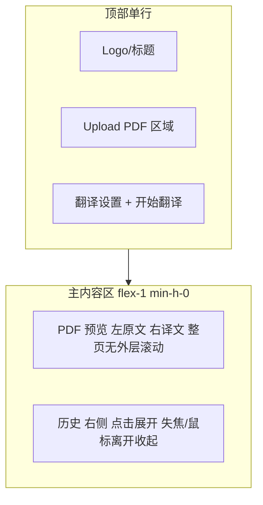

# 前端简约大气重设计

## 现状与参考

- **当前**：[frontend/app/[locale]/page.tsx](frontend/app/[locale]/page.tsx) 为上下分块：Upload 区 → 翻译表单区 → 任务状态区 → 双列 PDF 预览（`grid md:grid-cols-2`），整体 `max-w-6xl` 有纵向滚动。[Header](frontend/components/Header.tsx) 在同一行并排 Register / Sign in email / Sign in Google / 语言切换，显得拥挤；登录后仅 “Sign out” 无头像与用户信息。
- **参考**：[tmp/lumina-pdf-translator](tmp/lumina-pdf-translator)：顶部单行导航（品牌 + 语言胶囊 + 用户菜单）；Dashboard 顶行 “Upload 卡片 | 语言设置+Translate 按钮 | History 按钮”；下方主区域为预览 + 右侧可显隐的 History 侧栏；用户菜单带头像、邮箱、Sign Out；译文区有半透明下载按钮。本项目不照搬 Lumina，需保留双栏原文/译文对照、现有 NextAuth 与后端 API，仅借鉴布局思路与简约风格。

## 目标布局与数据流

- **顶部**：左侧为站点标题/Logo；中间为 “Upload PDF” 与 “翻译设置（语言、页码、翻译按钮）” 同一排，紧凑排列。
- **主内容**：占满剩余视口高度（`flex-1 min-h-0`），内层为双栏 PDF 预览（左原文、右译文），整页显示，**仅预览区域内部可滚动**，页面本身不出现整体滚动条。
- **历史**：在页面右侧，默认收起；用户点击 “历史” 按钮或图标时展开，展示任务列表（调用现有 `api.listTasks()`）；失去焦点或鼠标移出一定时间后收起。不照搬 Lumina 的 “History 开关常驻”，改为“展开/收起”以节省空间并保持简洁。

## 实现要点

### 1. 布局结构（[frontend/app/[locale]/page.tsx](frontend/app/[locale]/page.tsx)）

- 根容器：`min-h-screen flex flex-col bg-zinc-50 dark:bg-zinc-950`。
- **顶部条**（Header 下方或与 Header 合并，见下）：单行 flex，左侧标题，中间 Upload + 翻译设置同排。
  - Upload：保留 [UploadDropzone](frontend/components/UploadDropzone.tsx)，样式改为更紧凑的卡片（可参考 Lumina 的 `min-h-[100px] rounded-3xl border` 风格，但用本项目色系）。
  - 翻译设置：将 [TranslationForm](frontend/components/TranslationForm.tsx) 的核心（语言选择、页码、翻译按钮）提取为可内联的紧凑表单，与 Upload 同一行；或保持 TranslationForm 但用 flex 与 Upload 并排，去掉大标题与多余留白。
- **主内容区**：`flex-1 flex min-h-0 overflow-hidden`。
  - 左侧+中间：双栏 PDF 预览（左原文、右译文），使用 `grid grid-cols-2 gap-4` 或 flex，高度 100%，每栏内部 `overflow-auto`，[PdfViewerPane](frontend/components/PdfViewerPane.tsx) 填满格子，这样只有预览区内部滚动。
  - 右侧：历史侧栏，默认宽度 0 或收起状态；展开时约 280–320px，内显任务列表（来自 `api.listTasks()`），点击某条可设置 `taskId` 并更新 URL（`?task=xxx`），实现追溯。
- 任务状态（进度、错误、完成后的文件列表）可收缩为预览区上方的一小条或 Toast，不单独占一大块，保持“简约”。

### 2. 顶部导航简化（[frontend/components/Header.tsx](frontend/components/Header.tsx)）

- **未登录**：不并排四个按钮。改为“登录 / 注册”主次分明：例如一个次要 “Sign in” 文字链 + 一个主要 “Get started” 按钮（跳注册或登录）；或单一 “Sign in” 下拉/弹层，内为 “Email” / “Google” / “Register” 链接。语言切换与 Lumina 类似：胶囊式（EN | 中文）或小 select，与登录区隔开一定间距。
- **已登录**：显示用户信息：头像 + 名称/邮箱（可截断），点击展开下拉：账户信息、Sign out。不单独再显示 “Sign out” 大按钮。
- 与参考“简单实用”的常见做法：右侧为「语言 | 用户头像（含下拉）」，左侧为品牌；中间留给主页内容（Upload+设置）时，Header 仅保留左侧品牌 + 右侧语言+用户，Upload 与翻译设置放在 main 的第一行。

### 3. 用户头像与登录态展示

- **Google 登录**：使用 Google 返回的头像。NextAuth 的 Google provider 会返回 `user.image`；需在 [frontend/auth.ts](frontend/auth.ts) 的 `jwt` 与 `session` 回调中把 `image` 写入 token 并带到 session（例如 `session.user.image`），Header 中已登录时用 `` 显示。
- **Email 登录**：头像可“随机但可改”。方案 A：后端 User 表增加 `avatar_url`（可选），并增加 `GET /api/user/me`、`PATCH /api/user/avatar` 或 `POST /api/user/avatar`（上传图片，限制 500KB），前端 Email 用户显示 `avatar_url` 或默认随机头像（如 UI Avatars / DiceBear 基于 user.id）。方案 B：仅前端用随机头像（基于 user.id 的确定性 URL），可编辑时前端上传到后端，后端存 `avatar_url`。建议采用方案 B 并实现后端：User 增加 `avatar_url`，上传接口校验大小 ≤500KB，返回 URL。
- **匿名（临时）用户**：用确定性随机头像（如 `https://api.dicebear.com/7.x/identicon/svg?seed=${userId}` 或类似），不提供编辑。
- 头像尺寸：Header 小头像约 32px；下拉内可略大（如 48px）。限制仅针对上传文件（500KB）。

### 4. 历史侧栏（新组件）

- 新建组件，例如 `HistoryPanel.tsx`：右侧固定或绝对定位，宽度可动画（0 ↔ 320px）；内容为 `api.listTasks()` 的列表，每条显示任务摘要（文件名、状态、创建时间等，可从 TaskSummary + 可选 getTaskView 取 document_filename）；点击某项设置 `taskId` 并 `router.replace` 带 `?task=xxx`，主区展示该任务预览。
- 展开/收起：页面上有“历史”入口（图标或文字），点击展开；收起条件：点击外部（overlay）或鼠标移出面板区域后短延时（如 300ms）收起，避免误触即关。
- 历史仅对“当前用户”的任务列表有效（后端已按 user 过滤）；匿名用户可不显示历史或显示空状态提示登录。

### 5. 下载按钮（登录用户、译文就绪时）

- 当 `taskStatus === "completed"` 且 `taskView.can_download !== false` 且有译文 URL 时，在**译文预览区域**内显示一个简约下载按钮：半透明、小体积（如仅图标或图标+“Download”），靠近右下或右下角，样式参考 Lumina 的 `bg-white/10 backdrop-blur-md border border-white/20 rounded-2xl`，不喧宾夺主。
- 点击行为：使用现有 `taskView.outputs` 的主文件下载链接（`download_url?disposition=attachment`）或 `primary_file_url`（若后端支持 attachment）进行下载；若当前仅主文件用 `/api/tasks/:id/file?disposition=attachment`，则用该 URL。

### 6. 样式与品牌差异化

- 保持本项目色系（zinc 灰、适度蓝/绿强调），不照抄 Lumina 的 emerald；圆角、阴影、间距可适度参考 Lumina 的“简约卡片”风格（如 rounded-2xl/3xl、细边框）。
- 字体与间距统一：标题层级清晰，正文不拥挤；顶部一行控件间距合理，避免“四个按钮+语言挤在一起”。

## 文件与后端改动清单

| 项目                                                                                  | 说明                                                                                                                                  |
| ----------------------------------------------------------------------------------- | ----------------------------------------------------------------------------------------------------------------------------------- |
| [frontend/app/[locale]/page.tsx](frontend/app/[locale]/page.tsx)                    | 重构为：顶部单行 Upload+翻译设置；主区 flex-1 双栏预览（整页无外层滚动）；右侧历史面板状态与列表；任务状态收缩；下载按钮位置与条件渲染。                                                        |
| [frontend/components/Header.tsx](frontend/components/Header.tsx)                    | 未登录：Sign in / Get started 或下拉；已登录：头像+下拉（账户、Sign out）；语言胶囊或 select；布局不拥挤。                                                            |
| [frontend/auth.ts](frontend/auth.ts)                                                | JWT/session 中写入并保留 `user.image`（Google），供 Header 显示头像。                                                                              |
| 新 [frontend/components/HistoryPanel.tsx](frontend/components/HistoryPanel.tsx)      | 右侧可展开/收起，`api.listTasks()`，点击项设 taskId 并更新 URL；收起逻辑（点击外/鼠标离开）。                                                                      |
| 新 [frontend/components/UserMenu.tsx](frontend/components/UserMenu.tsx)（或合并进 Header） | 已登录时头像+下拉：邮箱、编辑头像（仅 email）、Sign out。                                                                                                |
| [frontend/components/TranslationForm.tsx](frontend/components/TranslationForm.tsx)  | 抽取“内联紧凑”版本或接受 props 控制紧凑布局，以便与 Upload 同一行。                                                                                          |
| [frontend/components/UploadDropzone.tsx](frontend/components/UploadDropzone.tsx)    | 样式微调：更紧凑、与翻译设置同排时宽度合理。                                                                                                              |
| 后端 User 表 + API                                                                     | 增加 `avatar_url` 字段；`GET /api/user/me`（返回当前用户含 avatar_url）；`POST /api/user/avatar`（multipart，校验 ≤500KB，写 User.avatar_url，可存 R2 或本地）。 |
| 后端迁移                                                                                | Alembic 迁移添加 `users.avatar_url`。                                                                                                    |

## 实施顺序建议

1. 后端：User.avatar_url + 迁移 + GET /api/user/me + POST /api/user/avatar（若不存在）。
2. NextAuth：session 中带 image（Google）与 avatar_url（从 /api/user/me 或 token 来）。
3. Header：重构为简约导航 + 用户头像/下拉（含 Sign out）；未登录时简化入口。
4. 首页布局：顶部单行 Upload + 翻译设置；主区双栏预览、flex-1、min-h-0、内部滚动。
5. HistoryPanel：新组件，右侧展开/收起，listTasks + 点击选任务。
6. 译文区下载按钮：条件渲染、简约样式、调用现有下载 URL。
7. 文案与 i18n：按需增删 key，保持中英等语言一致。

## 注意事项

- 整页无滚动：根 layout 或 page 根 div 为 `flex flex-col min-h-screen`，main 为 `flex-1 min-h-0 overflow-hidden`，预览网格/双栏内部分别 `overflow-auto`。
- 历史与 taskId 同步：选择历史任务时更新 URL (`?task=xxx`)，便于刷新/分享；现有 `searchParams.get("task")` 恢复逻辑可保留。
- 下载权限：仅当 `taskView.can_download !== false` 时显示下载按钮（后端已按登录/临时用户区分）。
- 头像 500KB：仅在后端上传接口校验；前端可选提示“图片需小于 500KB”。

