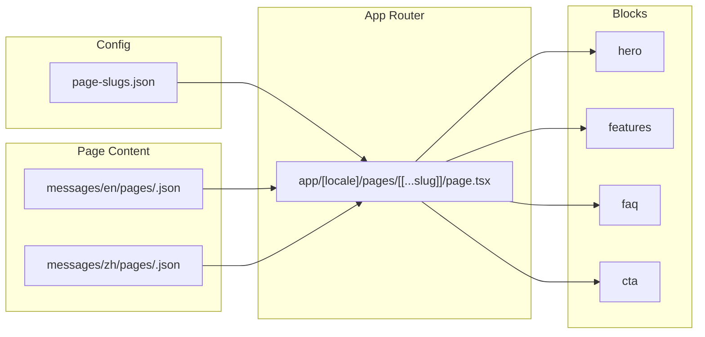

# 前端错误提示与 onlinepdftranslator 融合方案

## 1. 需求 1：前端对用户进行错误提示

**现状**：任务失败时已展示 `taskView.task.error_message` 或 `tErrors(taskView.task.error_code)`（[frontend/app/[locale]/page.tsx](frontend/app/[locale]/page.tsx) 约 607–612 行）；[frontend/messages/zh.json](frontend/messages/zh.json) / [frontend/messages/en.json](frontend/messages/en.json) 中已有 `errors.no_paragraphs` 等文案。

**待做**：

- 当 `taskStatus === 'failed'` 且 `error_code === 'no_paragraphs'` 时，**直接、友好地告知**：当前版本暂不支持此类 PDF 的翻译，并润色文案让用户感知「后续版本将提供 OCR 识别支持」。
- 修改 `errors.no_paragraphs`（及英文对应项）的文案，例如：
  - **中文**：当前版本暂不支持此类 PDF 的翻译（如扫描件、纯图片页）。我们正在规划 OCR 文字识别功能，后续版本将支持这类文档，敬请期待。
  - **英文**：This type of PDF is not supported in the current version (e.g. scanned or image-only pages). We are planning to add OCR support in a future release so these documents can be translated—stay tuned.
- 仅更新 [frontend/messages/zh.json](frontend/messages/zh.json) 与 [frontend/messages/en.json](frontend/messages/en.json) 中 `errors.no_paragraphs` 的文案即可，无需额外「勾选 OCR 重试」或滚动到表单等引导（当前版本不支持，不做操作引导）。

---

## 2. 需求 2：将 onlinepdftranslator 与 shipany-page-builder 融合到当前前端

**约束**：

- **最终前端项目位置不变**：所有改动落在 [frontend/](frontend/)（即 translatepdfonline 的前端），所有核心代码均在 **D:\imppro\translatepdfonline** 项目内实现。
- **代码参考与融合范围**：以 [tmp/onlinepdftranslator](tmp/onlinepdftranslator) 为参考，将其能力**移植并实现**到 translatepdfonline 中，包括：动态页与技能、以及该前端已有的**注册、登录、支付、订阅、订单**（融合后以前端为准，后端对应功能去除）。
- **D:\imppro\onlinepdftranslator 与本次融合无关**：不以其为移植源或依赖，计划中不引用该路径。

### 2.1 技能完整移植

- 将 [tmp/onlinepdftranslator/.claude/skills/shipany-page-builder/SKILL.md](tmp/onlinepdftranslator/.claude/skills/shipany-page-builder/SKILL.md) 移植到当前项目，例如：
  - 放入 `frontend/.cursor/skills/shipany-page-builder/SKILL.md`，或
  - 放入项目根目录的 `.cursor/skills/` 下（若希望全项目共用）。
- 在技能中**改写路径与约定**，使其指向当前前端的结构：
  - 将 `src/config/locale/messages/en|zh/pages/`** 改为当前项目实际采用的路径（见下节）；
  - 将 `src/config/locale/index.ts` 的 `localeMessagesPaths` 改为当前项目中的「页面 slug 注册方式」（例如 `frontend/config/page-slugs.json` 或合并进 i18n 的配置）；
  - 将 `scripts/create_dynamic_page.py` 改为当前项目中的脚本路径（如 `frontend/scripts/create_dynamic_page.js` 或保留 `.py` 并注明运行方式）。

### 2.2 动态页面构建能力（JSON 驱动页面）

当前前端使用 next-intl，消息通过 [frontend/i18n/request.ts](frontend/i18n/request.ts) 从 `messages/${locale}.json` 单文件加载，**没有**按页面 slug 的 JSON 与 `localeMessagesPaths` 机制。

**方案要点**：

1. **页面内容存储与路由**
  - 新增「页面内容」的存放位置，二选一或组合：
    - **A**：`frontend/messages/<locale>/pages/<slug>.json`，在 `getRequestConfig` 中按需合并进 `messages`（仅对动态页路由请求合并），并在某处维护「已注册 slug」列表；
    - **B**：`frontend/content/pages/<locale>/<slug>.json`（与 next-intl 解耦），仅在动态页路由内通过 `import()` 或 fs 按 slug 加载。
  - 新增动态页路由，例如：
    - `frontend/app/[locale]/pages/[[...slug]]/page.tsx`（或 `pages/[locale]/[...slug]/page.tsx` 视现有 app 结构而定），根据 `slug` 解析出页面 key，加载对应 JSON。
2. **区块组件**
  - 技能默认 sections：`hero`、`introduce`、`benefits`、`features`、`faq`、`cta`。
  - 所有区块在 **translatepdfonline 的 [frontend/](frontend/) 内实现**，例如 `frontend/components/blocks/`：hero、features、faq、cta 等；可参考 [tmp/onlinepdftranslator](tmp/onlinepdftranslator) 的结构与技能描述，但代码不依赖该目录，可先实现最小集合（hero、features、faq、cta），其余用占位或后续按需添加。
  - 在动态页的 `page.tsx` 中根据 `page.sections` 循环渲染：`getThemeBlock(section.type)` 渲染对应区块，传入 section 的 props。
3. **slug 注册与脚本**
  - 维护「已注册动态页」列表，例如：
    - `frontend/config/page-slugs.json`：`["features/ai-image-generator", ...]`，或
    - 在 next-intl 的配置/请求里维护 `localeMessagesPaths` 等价列表（若采用 A）。
  - 实现 **create_dynamic_page** 脚本（Node/TS 或保留 Python）：
    - 输入：route/slug、keywords、referenceCopy、sectionsWanted；
    - 输出：为每个 locale 生成 `messages/<locale>/pages/<slug>.json`（或 `content/pages/<locale>/<slug>.json`），并在 `page-slugs.json`（或等价）中追加 `pages/<slug>`；
    - 行为与技能一致：不覆盖已有文件（除非 `--force`），可带 `TODO:` 占位。
4. **与现有功能共存**
  - 首页保持现有翻译流程（上传、翻译设置、任务状态、预览等）；不修改 [frontend/app/[locale]/page.tsx](frontend/app/[locale]/page.tsx) 的主流程，仅做必要的布局/导航扩展（如顶部增加「产品/定价」等链接到动态页）。
  - 新营销/落地页仅通过 `/pages/...` 访问，与现有路由无冲突。

### 2.3 数据流示意（动态页）

---

## 3. 需求 2 延伸：前后端职责划分与后端瘦身

**前提**：前端项目 [tmp/onlinepdftranslator](tmp/onlinepdftranslator) **已有**注册、登录、支付、订阅、订单；融合后这些能力将移植到 translatepdfonline 的 [frontend/](frontend/)，**以前端为准**。

**原则**：与前端重合的功能一律**以前端为准**，后端**去除**重复实现。

### 3.1 后端需去除的功能

- **注册、登录、认证**：后端上的注册、登录、认证相关逻辑与接口**全部去除**，包括但不限于：
  - 路由：如 `backend/app/routes/auth.py` 中的发送验证码、验证注册、登录、Google 登录/回调、ensure-user 等；
  - 鉴权工具：如 `backend/app/auth_utils.py` 中与 JWT/NextAuth 会话校验相关的逻辑（若去除后翻译/上传等接口仍需识别用户，则改为接受前端下发的 token/session 或仅做透传/可选校验，具体以融合后前端的鉴权方式为准）；
  - 依赖：移除仅被上述功能使用的依赖与配置。
- **与前端重合的其它能力**：若后端存在与前端「注册、登录、支付、订阅、订单」重叠的接口或逻辑，一律**以前端为准并删除后端侧实现**；后端只保留**翻译、上传、任务、文档**等前端不实现的业务能力。

### 3.2 后端保留与适配

- **保留**：翻译（BabelDoc）、上传（presigned/multipart）、任务（创建/查询/取消/事件/文件下载）、文档列表/删除等与翻译流程强相关的 API。
- **适配**：若这些 API 当前依赖后端自行签发的 JWT 或 NextAuth 会话，需改为与融合后前端的鉴权方式对接（例如接受前端携带的 token/session，或在一段时间内允许未登录/匿名访问，由前端决定是否传鉴权信息）。

### 3.3 分阶段

- **Phase A**：完成需求 1（错误提示）+ 需求 2（技能 + 动态页 + 区块 + 脚本）移植；前端融合 tmp/onlinepdftranslator 的注册、登录、支付、订阅、订单到 [frontend/](frontend/)。
- **Phase B**：后端去除注册、登录、认证及与前端重合功能；保留并适配翻译/上传/任务/文档等 API，以与前端鉴权方式一致。

---

## 4. 实施顺序建议

| 步骤  | 内容                                                                                                                                                                                          |
| --- | ------------------------------------------------------------------------------------------------------------------------------------------------------------------------------------------- |
| 1   | 前端：将 `errors.no_paragraphs` 文案改为「当前版本暂不支持此类 PDF，后续将提供 OCR 支持」的友好提示（中英文）。                                                                                                                    |
| 2   | 移植 shipany-page-builder 技能到当前项目并改写路径/脚本引用。                                                                                                                                                  |
| 3   | 前端：新增动态页路由与页面 JSON 的加载方式（messages 或 content 目录）、slug 注册。                                                                                                                                    |
| 4   | 前端：在 [frontend/](frontend/) 内实现区块组件（hero、features、faq、cta 等）及 getThemeBlock + 动态页渲染（可参考 tmp/onlinepdftranslator 结构）。                                                                        |
| 5   | 实现 create_dynamic_page 脚本并写入技能说明。                                                                                                                                                           |
| 6   | 验证：保留首页翻译全流程；新动态页可访问；`pnpm build` 通过。                                                                                                                                                       |
| 7   | （Phase B）前端：将 tmp/onlinepdftranslator 的注册、登录、支付、订阅、订单融合到 [frontend/](frontend/)，以前端为准。                                                                                                      |
| 8   | （Phase B）后端：去除注册、登录、认证及相关路由与逻辑（如 [backend/app/routes/auth.py](backend/app/routes/auth.py)、[backend/app/auth_utils.py](backend/app/auth_utils.py)）；与前端重合功能一律删除；保留并适配翻译/上传/任务/文档 API 与前端鉴权方式。 |

---

## 5. 已确认事项

- **tmp/onlinepdftranslator**：仅作**代码参考**，所有核心代码均在 **D:\imppro\translatepdfonline** 项目中实现/移植；该前端已有注册、登录、支付、订阅、订单，融合后以前端为准。
- **D:\imppro\onlinepdftranslator**：与本次融合**完全无关**，计划中不以其为移植源或依赖。
- **后端与前端重合功能**：一律**以前端为准**，后端**去除**注册、登录、认证及与前端重叠的实现。

