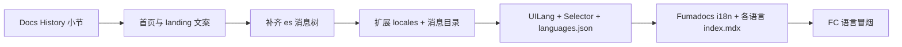

# 文档强调、首页改版、西语补齐与多语种扩展

## 1. `/docs`：强调 History（历史）栏

**内容位置：** 文档首页为 MDX，例如 [frontend/content/docs/index.mdx](frontend/content/docs/index.mdx)（另有 [index.zh.mdx](frontend/content/docs/index.zh.mdx)、[index.es.mdx](frontend/content/docs/index.es.mdx) 时需同步）。

**改法：** 在「Core features」或单独新增 **「Using the translate workspace」** 小节，用条目写清：

- **History 栏**列出当前浏览器会话/账号下的**上传与翻译任务**（状态、语言、打开任务等）。
- 用户可**从历史快速恢复**某次任务，避免重复上传；与右侧 PDF 预览、任务进度联动。

各语言版本用同一结构翻译即可。无需改计划文件；若希望出现在侧栏目录，可在 frontmatter 或 Fumadocs 侧栏配置里加锚点（视现有 docs 结构而定）。

---

## 2. 首页模版感强：改哪些文件、怎么改

首页区块由 `**pages/index.json` 的 `page.show_sections` + `page.sections.`*** 驱动，经主题渲染。

| 目标                                     | 文件                                                                                                                                                                                                                                                                                           |
| -------------------------------------- | -------------------------------------------------------------------------------------------------------------------------------------------------------------------------------------------------------------------------------------------------------------------------------------------- |
| 首页各区块文案（Hero、介绍、步骤、功能、数据、评价、FAQ、CTA 等） | [frontend/src/config/locale/messages/en/pages/index.json](frontend/src/config/locale/messages/en/pages/index.json)、[zh/pages/index.json](frontend/src/config/locale/messages/zh/pages/index.json)、[es/pages/index.json](frontend/src/config/locale/messages/es/pages/index.json)（及后续新语种同名路径） |
| 全站顶栏/页脚等若仍带 ShipAny 模版句                | [frontend/src/config/locale/messages/*/landing.json](frontend/src/config/locale/messages/en/landing.json) 等                                                                                                                                                                                  |
| 翻译落地页 Hero/SEO 段落（`/translate` 上方面板）   | [frontend/src/config/locale/messages/*/translate/home.json](frontend/src/config/locale/messages/en/translate/home.json)                                                                                                                                                                      |

**怎么改：**

1. 在 `pages/index.json` 里把仍像模版的句子（如 “Ready-to-use Templates”“Deploy to Production”）改成与 **PDF 翻译产品**一致的标题与描述；不需要的区块可从 `show_sections` 中**移除**对应 id，或把 `sections` 里该项改成你们真实卖点。
2. 替换 `hero.image` / `image_invert` 的 `src` 指向你们自己的配图（放到 `public/` 或 `public/imgs/`）。
3. `testimonials`、`stats` 等若为占位数据，改为真实文案或暂时从 `show_sections` 去掉。

---

## 3. 西班牙语「很多页面没适配」的根因与对策

**根因：** [frontend/src/core/i18n/request.ts](frontend/src/core/i18n/request.ts) 中 `loadMessages` 在缺少 `es/.../*.json` 时会 **import 失败并回退到 `defaultLocale`（多为 `en`）**，因此界面语言选 `es` 仍大量显示英文。

**对策（二选一或组合）：**

- **A（推荐）：** 以 `en` 为模板，为 [frontend/src/config/locale/messages/localeMessagesPaths](frontend/src/config/locale/index.ts) 中**每一个** path 在 `es/` 下建立对应 `.json`，再人工或机翻成西班牙语。
- **B：** 短期只保证高频路径（`common`、`landing`、`pages/index`、`pages/pricing`、`translate/`* 等）有 `es` 文件，其余仍回退英文（接受混合界面）。

---

## 4. 新增语种：法语、意大利语、希腊语、日语、韩语

需要同一套改动（与现有 `en`/`zh`/`es` 并行）：

1. **路由与显示名**
  - [frontend/src/config/locale/index.ts](frontend/src/config/locale/index.ts)：`locales` 数组、`localeNames`（如 `fr` → Français，`it` → Italiano，`el` → Ελληνικά，`ja` → 日本語，`ko` → 한국어）。
2. **消息文件**
  - 新建 `messages/fr/`、`it/`、`el/`、`ja/`、`ko/`，目录结构与 `en/` 一致（与 `localeMessagesPaths` 一一对应）。可脚本从 `en` 复制再翻译，避免漏文件。
3. **语言切换器**
  - 搜索引用 `locales` / `localeNames` 的 Header 或语言组件（如 [frontend/src/themes/default/blocks/header.tsx](frontend/src/themes/default/blocks/header.tsx) 一类），确保新代码出现在下拉列表中（通常只需改 `index.ts`）。
4. **Fumadocs 文档**
  - [frontend/src/core/docs/source.ts](frontend/src/core/docs/source.ts)：`i18n.languages` 增加 `fr`、`it`、`el`、`ja`、`ko`。  
  - 在 [frontend/content/docs/](frontend/content/docs/) 为每种语言提供 `index.<lang>.mdx`（或与现有命名约定一致），否则该语种文档会缺页或回退（视 Fumadocs 配置而定）。
5. **其它硬编码三语处**
  - 全文搜索 `en.*zh.*es` 或 `English.*Chinese.*Spanish`，更新产品描述、SEO、`translate/home.json` 的 `heroLanguagesHint` 等。

---

## 5. Translate 页 source / target 支持新语种

**前端：**

- 扩展 [frontend/src/shared/lib/translate-api.ts](frontend/src/shared/lib/translate-api.ts) 中的 `UILang` 类型（当前为 `'zh' | 'en' | 'es'`）。
- 更新 [frontend/src/shared/components/translate/LanguageSelector.tsx](frontend/src/shared/components/translate/LanguageSelector.tsx) 的 `LANGS` 列表。
- 为 **每种** UI 语言在 `translate/languages.json` 中增加展示名（`en/zh/es/fr/...` 的键与 label），路径：  
`frontend/src/config/locale/messages/*/translate/languages.json`（6 个语种目录都要有一份或依赖回退）。

**API：**  
[frontend/src/app/api/translate/route.ts](frontend/src/app/api/translate/route.ts) 目前对 `source_lang` / `target_lang` **无白名单校验**，会原样传给 FC；若需安全可后续加允许列表。

**FC / BabelDOC（必做验证）：**  
[babeldoc_fc/run_translate.py](babeldoc_fc/run_translate.py) 中 `_normalize_lang` 已处理 `ja`/`ko`/中文变体；`fr`、`it`、`el`、`es` 等会 **原样小写**传入 BabelDOC。上线前应用 **日、韩、法、意、希** 各跑一次短 PDF，确认不报错且译文语言正确；若 BabelDOC 要求内部码（如 `zh_cn`），再在 `_normalize_lang` 或 Next 层做映射表。

---

## 建议实施顺序

体量说明：第 4 步每个新语言约等于复制 **整棵** `en` 消息树（数十个 JSON），适合用脚本生成骨架再翻译；第 3 步西班牙语同理，工作量与「完整适配」成正比。