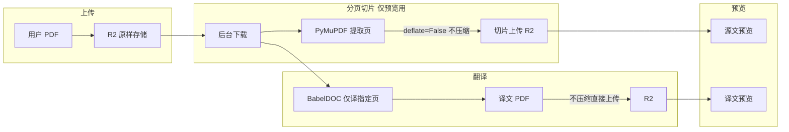

# 源文不压缩、分页不修改与预览重影修复

## 问题与诉求

- **源文预览重影严重**：与译文类似，画布 + 文本层叠显示导致重影。
- **译文重影/乱码**：仍存在。
- **用户质疑**：上传后的 PDF 是否被“特殊处理”？为何预览源文与原始上传不一致？
- **明确要求**：只做分页切片，不压缩、不修改原文内容与格式；上传到 R2 后，后台可下载源文做分页处理；用户输入翻译页时只将对应页传入后台；翻译完成后只对分页结果做预览。

## 当前实现要点

- **上传**：直传/预签名/分片上传后，R2 中存的是用户原文件（`doc.object_key`）；`preprocess_pdf` 仅从 R2 下载到本地并更新页数，**不修改内容**。
- **源文切片**：[backend/app/tasks_translate.py](backend/app/tasks_translate.py) 中 `_extract_source_pages_pdf` 用 PyMuPDF 的 `insert_pdf` + `save(out_path)`，**未传 `deflate=False`**，默认 save 会重新编码/压缩，导致切片与原文观感不一致。
- **译文上传**：同文件第 206 行对 BabelDOC 输出先执行 `_compress_pdf(primary)` 再上传 R2，**对译文做了强压缩**（deflate、garbage=4、clean），可能加剧乱码/重影观感。
- **预览**：[frontend/app/globals.css](frontend/app/globals.css) 仅对译文 Pane（`.pdf-viewer-target-pane` / `data-pdf-mode="target"`）隐藏画布；源文 Pane 仍画布+文本层同时显示，**源文也会重影**。

## 目标数据流（与“只分页、不压缩不修改”一致）

## 修改方案

### 1. 源文分页切片：不压缩、不修改内容

**文件**：[backend/app/tasks_translate.py](backend/app/tasks_translate.py)

- 在 `_extract_source_pages_pdf` 中，PyMuPDF 保存时**禁止重新压缩**，保持与原文一致的流编码：
  - 将 `out_doc.save(str(out_path))` 改为 `out_doc.save(str(out_path), deflate=False)`。
  - 不传 `garbage`、`clean` 等会重组文档的选项，仅做“按页提取”，避免格式与字体嵌入被改动。

这样“分页处理”仅做页面提取，不做压缩与内容修改，与“只做分页切片”一致。

### 2. 译文上传 R2：取消强压缩

**文件**：[backend/app/tasks_translate.py](backend/app/tasks_translate.py)

- 在 `run_translation_task` 中，上传译文到 R2 时**不再调用 `_compress_pdf`**：
  - 当前：`to_upload = _compress_pdf(primary)` 再 `r2_upload_file(to_upload, object_key)`。
  - 修改为：直接 `r2_upload_file(primary, object_key)`；若曾用 `_compress_pdf` 得到临时文件并 `unlink` 的逻辑一并删除或改为仅在未压缩时清理。

译文以 BabelDOC 输出原样上传，避免因压缩导致字体/流变化而加重乱码与重影。

### 3. 预览重影：源文与译文均“以文本层为主、隐藏画布”

**原因**：源文、译文在浏览器中均为“画布 + 文本层”双层渲染，叠在一起导致重影；译文还常因字体/编码与画布不一致而乱码。

**文件**：[frontend/app/globals.css](frontend/app/globals.css)、[frontend/components/PdfViewerPane.tsx](frontend/components/PdfViewerPane.tsx)

- **源文 Pane**：与译文一致，给源文容器加上可识别的 class 或 `data-pdf-mode="source"`，在 CSS 中对**源文 Pane** 的 `canvas` 与 `.react-pdf__Page__svg` 同样设置 `opacity: 0`，仅保留 `.textLayer` 可见。
- 这样源文、译文预览都只突出显示文本层，画布隐藏，从表现上消除重影与乱码。
- **注意**：纯图片/扫描版 PDF 无文本层时，会只看到空白。若后续要支持扫描版，可再考虑“仅对译文 Pane 隐藏画布”或按是否有文本层做切换；当前先统一为两栏都隐藏画布以解决重影与乱码。

### 4. 流程澄清（无需改代码，仅确认）

- **上传到 R2**：已是原样存储，未对用户文件做压缩或修改。
- **分页**：仅在“有 page_range”且翻译完成后，用 PyMuPDF 提取指定页并上传为 `source_slice_object_key`，供源文预览使用；按上述修改后，该切片为“仅提取、不压缩不修改”。
- **翻译**：BabelDOC 已使用 `pages=page_range` 与 `only_include_translated_page=True`，仅翻译指定页且输出仅为翻译页，无需改逻辑。
- **预览**：有 slice 时源文预览用切片（分片/Range 已支持）；译文预览用 R2 上的译文文件；两者都通过同源 API 代理，支持 Range。无需改 URL 或接口。

### 5. 可选：仅将“分页 PDF”传入 BabelDOC（减少大文件）

当前是“整份 PDF + page_range”交给 BabelDOC。若希望“只把对应页传入后台”：

- 在 `run_translation_task` 中，若存在 `task.page_range`，可先用 PyMuPDF（`deflate=False`）从本地源文件提取指定页得到临时 `source_pages.pdf`，再以该临时文件为 `local_pdf_path` 调用 BabelDOC，并传 `page_range=None`（整份即这几页）。
- 这样后台只处理分页后的小文件，大文件不必整份参与翻译；与“只做分页、不压缩”一致。本计划不强制实现，可作为后续优化。

## 涉及文件与修改摘要

| 位置                                                                             | 变更                                                                                                          |
| ------------------------------------------------------------------------------ | ----------------------------------------------------------------------------------------------------------- |
| [backend/app/tasks_translate.py](backend/app/tasks_translate.py)               | `_extract_source_pages_pdf`: `save(..., deflate=False)`；上传译文时去掉 `_compress_pdf`，直接上传 `primary`              |
| [frontend/app/globals.css](frontend/app/globals.css)                           | 为源文 Pane 增加与译文相同的画布隐藏规则（如 `.pdf-viewer-source-pane` 或 `[data-pdf-mode="source"]` 下 canvas/svg `opacity: 0`） |
| [frontend/components/PdfViewerPane.tsx](frontend/components/PdfViewerPane.tsx) | 源文容器增加 class 或 `data-pdf-mode="source"`，以便 CSS 统一隐藏画布                                                       |

## 验收

- 有 page_range 的任务：源文预览使用 R2 切片，且该切片为 PyMuPDF 仅提取、`deflate=False` 保存，与原文观感一致、无额外压缩。
- 译文预览：R2 上的译文为 BabelDOC 原样输出（未经过 `_compress_pdf`），预览无加重乱码。
- 源文、译文预览：两栏均以文本层为主、画布不可见，重影与乱码消失（纯图片 PDF 需后续单独考虑）。

