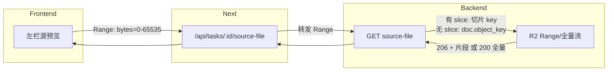

# 源文件预览分片传输

## 目标

- **有 page_range**：保持现状，`source-file` 只返回切片，支持 Range（已实现）。
- **无 page_range（整份翻译）**：源文件不再用 R2 公网 URL；改为始终走 `/api/tasks/:id/source-file`，由后端从 R2 按 **Range** 流式返回整份 `doc.object_key`，实现分片传输。

## 数据流（修改后）

## 1. 后端：view 中源 URL 始终同源

**文件**：[backend/app/routes/tasks.py](backend/app/routes/tasks.py)

- 在 `get_task_view` 里，不再在「无 slice」时赋 R2 公网 URL。
- **始终**设 `source_url = f"/api/tasks/{task_id}/source-file"`（有 slice 时已是该值，无 slice 时也改为该值；删除 `elif settings.r2_public_url and doc.object_key` 分支）。

## 2. 后端：source-file 无 slice 时回退整份 PDF 并支持 Range

**文件**：[backend/app/routes/tasks.py](backend/app/routes/tasks.py) 中 `get_task_source_file`

- **当前**：无 `source_slice_object_key` 时直接 404。
- **修改**：
  - 若存在 `source_slice_object_key`：逻辑不变，从 R2 拉取该 key，支持 Range，返回 206/200。
  - 若**不存在** slice 但能拿到 `doc` 且 `doc.object_key` 存在：用 **同一套** R2 流式接口（带 Range 时用 `r2_get_object_stream_range`，无 Range 时用 `r2_get_object_stream`）拉取 **整份源 PDF**（`doc.object_key`），返回 206 或 200，并设置 `Accept-Ranges: bytes`。
- 需要在该接口内根据 `task` 取 `document`（或已有 doc）：若已有 `get_task_view` 的上下文，`get_task_source_file` 内需 `db.query(Document).get(task.document_id)` 得到 `doc`，再取 `doc.object_key`。若当前 `get_task_source_file` 未查 Document，需增加一次查询。

## 3. 前端

- **无需改**：`sourcePdfUrl` 已用 `taskView.source_pdf_url`；[frontend/app/api/tasks/[taskId]/source-file/route.ts](frontend/app/api/tasks/[taskId]/source-file/route.ts) 已转发 Range 并透传 206/Content-Range。只要后端如上支持无 slice 时从 R2 按 Range 返回整份 PDF，前端即自动分片加载。

## 4. 涉及代码位置摘要

| 位置                                                                                | 变更                                                                                                                                                                 |
| --------------------------------------------------------------------------------- | ------------------------------------------------------------------------------------------------------------------------------------------------------------------ |
| [backend/app/routes/tasks.py](backend/app/routes/tasks.py) `get_task_view`        | `source_url` 始终为 `f"/api/tasks/{task_id}/source-file"`，删除无 slice 时赋 R2 公网 URL 的分支                                                                                  |
| [backend/app/routes/tasks.py](backend/app/routes/tasks.py) `get_task_source_file` | 无 `source_slice_object_key` 时：查 `doc = db.query(Document).get(task.document_id)`，若 `doc` 且 `doc.object_key` 存在则从 R2 流式返回该 key（带 Range 时 206，无 Range 时 200）；否则再 404 |

## 5. 验收

- 整份翻译任务：左侧源预览的请求应为 `/api/tasks/:id/source-file`，且网络里可见多次 `Range: bytes=...` 与 206 响应。
- 按页翻译任务：行为不变，仍为 source-file 返回切片并支持 Range。

