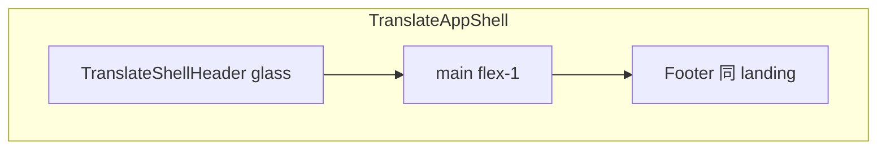

# 翻译页：Credits 位置、Hero 视觉升级与页脚复用

## 现状要点

- 漏斗与工作台均在 `[TranslatePageClient.tsx](frontend/src/app/[locale]/(translate)`/translate/TranslatePageClient.tsx)。积分与下载目前在侧栏 `**mt-auto` 底部**（约 739–768 行），在 `**max-h-[45vh]` 移动端侧栏** 中需滚动才易看到。
- `[TranslateAppShell.tsx](frontend/src/app/[locale]/(translate)`/TranslateAppShell.tsx) 仅有顶栏 + `main`，**无 Footer**；落地页的 Privacy / Terms / 社交 / 版权在 `[themes/default/blocks/footer.tsx](frontend/src/themes/default/blocks/footer.tsx)`，数据来自 `[landing.json](frontend/src/config/locale/messages/en/landing.json)` 的 `footer`。
- Hero 文案与结构目前依赖 `[translate/home.json](frontend/src/config/locale/messages/en/translate/home.json)` 与 `[UploadDropzone](frontend/src/shared/components/translate/UploadDropzone.tsx)` 的 `variant="hero"`。

## 1. Credits：固定可见，不沉底

- 在 **工作台侧栏**（`documentId` 存在分支）中：
  - 将 **Credits 卡片**（剩余积分 + 购买链接 / 未登录提示）移到 **侧栏前部**：建议顺序为 **Model 区块下方** 或 **「当前文档」卡片上方**，使用紧凑卡片样式（`rounded-xl border bg-zinc-50/…`），**不再使用 `mt-auto` 承载积分**。
  - **下载按钮**可保留在侧栏中下部（例如在 `TranslationForm` 与历史之间，或表单正下方），避免与积分一起挤在滚动区底部。
- 移动端仍保留侧栏 `max-h-[45vh]` 时，积分因在折叠区 **顶部**，首屏滚动侧栏即可先看到积分。

## 2. 漏斗首页：深色 Hero + 发光上传框 + 文案与格式标签

- 将 `!documentId` 分支拆成清晰区块（可新建 `[TranslateLandingSections.tsx](frontend/src/shared/components/translate/TranslateLandingSections.tsx)` 或同级多个小组件，避免 `TranslatePageClient` 过长）。
- **外层**：全宽 `section` 使用 **深蓝/深灰径向或线性渐变**（如 `from-slate-950 via-slate-900 to-slate-950` + 微弱高光），与下方浅色内容区（步骤、信任条、SEO）形成分段。
- **顶栏玻璃拟态**：在 `[TranslateShellHeader.tsx](frontend/src/shared/components/translate/TranslateShellHeader.tsx)` 增加 `backdrop-blur-md`、`bg-white/10`（暗色 Hero 上）或按滚动/路由切换类名；若 Hero 为深色而页脚为浅色，顶栏在整页可统一半透明 + blur，避免仅 Hero 内「断层」——实现时以 **整页深色 Hero 段 + 浅色下半页** 为准，顶栏文字改为浅色并在进入浅色区时切换（可用 `border-b border-white/10` + `text-zinc-100`）。
- **主标题**改为英文：**"Translate Academic PDFs without losing a single pixel."**（及 zh/es 对应翻译），写入 `translate/home.json`（或新建 `translate/landing.json` 并在 `[locale/index.ts](frontend/src/config/locale/index.ts)` 注册）。
- **上传框发光动画**：在 `UploadDropzone` 的 `hero` 变体外包一层 `relative`，用 **伪元素或额外 div** 做 `conic-gradient` / `linear-gradient` 旋转或 `animate-pulse` 的 **低强度边框光晕**（`pointer-events-none`，避免影响点击）；或 Tailwind `@keyframes` 放在 `[globals.css](frontend/src/app/globals.css)`（若项目集中放动画）。
- **格式标签**：上传框下方一行 **Pill**：`PDF`、`Academic Paper`、`Manual`、`Book`（纯展示，i18n 字符串）。

## 3. Before/After 对比滑块（「Magic Moment」）

- 新建客户端组件 `**BeforeAfterPdfCompare`**（例如 `[frontend/src/shared/components/translate/BeforeAfterPdfCompare.tsx](frontend/src/shared/components/translate/BeforeAfterPdfCompare.tsx)`）：
  - 左右两张 **静态图**（建议 `next/image`，路径如 `[public/translate-compare/before.png](frontend/public/translate-compare/before.png)`、`after.png`）；**若仓库暂无素材**，先用占位图 + README 说明需替换，保证交互与布局可验收。
  - 实现 **拖拽竖线** 或 **range input** 控制 `clip-path`/`width` 分割；`aria-`* 与键盘可操作（可选）。
- 放在 Hero 区块 **下方**（仍在深色段内或紧接的过渡段），与上传区形成「先看到效果再上传」的路径。

## 4. 三步流程与信任条

- **三步**：独立 `section`，三列（移动端纵向）：图标（Upload / Select / Download）+ 短标题 + 一句说明；文案 i18n。
- **Trust bar**：横向 `flex-wrap` 展示 **DeepSeek | zotero-pdf2zh | LaTeX Support | Multi-Language**（文字或 SVG/简单 logo 占位）；可用 `border-t border-white/10` 与 Hero 区分。

## 5. SEO 与介绍文案区（漏斗页底部、页脚之上）

- 在信任条下方增加 **浅色** `section`：`max-w-3xl` 居中，**可见** 的 `h2` + 多段 `p` + 关键词列表（来自 i18n，避免 `display:none`）；内容与 `[landing.json` footer.brand.description](frontend/src/config/locale/messages/en/landing.json) 可互补，突出学术 PDF、版式保留、多语言等（便于与你现有 SEO 策略一致）。

## 6. 页脚：翻译路由复用落地页 Footer

- 将 `[(translate)/layout.tsx](frontend/src/app/[locale]/(translate)`/layout.tsx) 改为 **async Server Component**：`getTranslations('landing')` → `t.raw('footer')`，`getThemeBlock('footer')` + `[FooterWithTranslateBehavior](frontend/src/themes/default/blocks/FooterWithTranslateBehavior.tsx)` 与落地页一致。
- 在 `[TranslateAppShell](frontend/src/app/[locale]/(translate)`/TranslateAppShell.tsx) 中增加 `**footer` 插槽**（`children` 末尾或 `footer?: ReactNode`），布局为 `flex min-h-screen flex-col`，`main` `flex-1`，**footer 在底部**，从而保留 **Privacy / Terms / 社交 / Theme / Locale / Copyright**（与截图一致）。若 `Copyright` 组件当前非 2026，可在对应 locale 的 footer 配置中增加 `copyright` HTML 字段覆盖。

## 7. 按钮与间距（工作台）

- `[TranslationForm](frontend/src/shared/components/translate/TranslationForm.tsx)` 的 `workbench` 提交按钮：按规范增加 **蓝渐变** + `box-shadow`（如 `shadow-[0_4px_14px_0_rgba(0,118,255,0.39)]`），并加大区块 `gap`/`py` 以改善拥挤感。

## 8. 响应式

- Hero 上传区在 `sm` 以下保持 **足够 min-height** 与 `px`/`py`；Before/After 滑块在小屏 **高度限制**（如 `max-h-[240px]`）避免占满屏。

## 验收清单

- 登录用户在工作台 **无需滚到侧栏最底部** 即可看到剩余 Credits。
- 未上传态：深色 Hero、发光框、新主标题、格式标签、滑块、三步、信任条、SEO 区齐全；**页脚** 与落地页一致且含 Privacy/Terms/©/联系方式。
- 提供或占位 **对比图** 资源路径说明；构建无 TS/Lint 报错。

