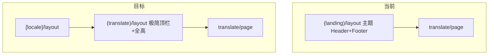

# 翻译页 SaaS 重设计

## 背景与约束

- 设计参考：`[frontend/tranlate_tmp/1.png](frontend/tranlate_tmp/1.png)`、`[2.png](frontend/tranlate_tmp/2.png)`。文案以你的说明为准：**主标题**「Keep the Layout, Change the Language.」；**语言默认空**（与现有 `[TranslationForm](frontend/src/shared/components/translate/TranslationForm.tsx)` 的 `useState<UILang | ''>('')` 一致）。设计图里的副文案（如 Drag & Drop、Powered by DeepSeek）可作为副标题/上传区内说明。
- **独立路由组布局**（不用 landing 的 Header/Footer）。
- **本版本不支持术语库**：侧栏与 API/DB/FC 均不做术语库上传与传递。后续版本若要支持，可参考 `tmp/BabelDOC` 中 `TranslationConfig.glossaries` + `Glossary.from_csv` 单独立项。

## 架构：路由与壳层

1. **新建** `frontend/src/app/[locale]/(translate)/layout.tsx`：仅包一层「SaaS 壳」——顶栏（Logo：T+PDF 图标组合、链接 Pricing / API / History、登录/用户区），**不加载** landing 的 `getThemeLayout('landing')`。底栏可选极简版权或省略（与设计「聚焦」一致）。
2. **迁移页面**：将 `(landing)/translate/page.tsx` 与 `TranslatePageClient.tsx` **移到** `(translate)/translate/`，并从 `(landing)` 下 **删除** 原路径，避免重复路由。
3. **侧向链接**：`API` 指向现有文档路由（若项目有 `(docs)` 或固定 `/docs`/`/api-docs`）或 `NEXT_PUBLIC_`* 外链；落地时以仓库内真实路径为准。

## UI：状态 A — 漏斗首页（无文档或明确「仅上传」态）

- 全屏纵向居中：**主标题** + 短副标题；**大号虚线拖拽区**（复用并改造 `[UploadDropzone](frontend/src/shared/components/translate/UploadDropzone.tsx)`：props 控制 `variant="hero"`，云+箭头图标、文案区）。
- **语言选择**紧贴上传区下方：两列 `LanguageSelector`，占位「请选择」，与表单校验一致。
- **不展示** 工作台侧栏、双栏预览、历史折叠条；登录前上传策略保持现有 `UploadDropzone` 行为（若需未登录也可点选并引导登录，不改动业务规则除非产品要求）。

## UI：状态 B — 工作台（`documentId` 已存在）

- **布局**：`h-screen` / `min-h-0` 网格 — **左侧固定宽侧栏** + **中间双栏 PDF**（原文 | 译文）+ **右侧或底栏动作区**（下载、Credits、可选历史入口）。
- **侧栏内容**（自上而下）：
  - **Model**：只读展示「DeepSeek V3」（或配置常量 `TRANSLATE_MODEL_DISPLAY_NAME`，便于日后改文案；**不可交互**）。
  - **页范围**（从现有 `TranslationForm` 抽出或 `workbench` 专用 props）：保留当前积分预检逻辑。
  - **Start 翻译**：主按钮蓝色，调用现有 `translateApi.translate`，禁用条件与现逻辑一致。
  - **任务进度/失败信息**：从顶栏大块迁至侧栏或双栏上方 **窄条**（避免抢预览焦点）。
- **中间双栏**：保留 `[PdfViewerPane](frontend/src/shared/components/translate/PdfViewerPane.tsx)` 双实例；标签可改为「Source / Translation」与设计一致。**分页**：保持同步页码（现有 `currentPage` / `targetPage` 逻辑）。**缩放**：在 `PdfViewerPane` 增加 `scale` 或 `widthMultiplier` + 工具条（− / + / 重置），避免仅依赖 `ResizeObserver` 宽度。
- **Credits**：侧栏底部或顶栏右侧固定展示 `user.credits.remainingCredits` + 链到 `/pricing`（与现 `TranslatePageClient` 一致）。
- **下载**：译文完成且 `downloadUrl` 存在时，侧栏主按钮或浮动按钮（从绝对定位改为设计一致的「动作区」）。
- **历史**：`HistoryPanel` 移入侧栏折叠区块或顶栏「History」下拉/抽屉，避免占用中间区域。

## 组件与文案拆分建议

- 新建（示例命名）：`TranslateShellHeader.tsx`、`TranslateHeroSection.tsx`、`TranslateWorkbench.tsx`；将超大 `TranslatePageClient` 拆为 2–3 个文件，状态仍可由父组件或轻量 context 持有。
- **i18n**：扩展 `[translate/home.json](frontend/src/config/locale/messages/en/translate/home.json)` / `zh`：导航、Hero、侧栏 Model、缩放按钮等。

## 风险与验收

- **暗色模式**：设计稿偏浅色 SaaS；侧栏与双栏需统一 token（slate/zinc + 品牌蓝），暗色可保留与全站一致。
- **验收**：未上传时只见漏斗首页；上传后进入工作台；Start 后双栏预览与下载与现网能力一致；**无术语库相关 UI 与接口**。

