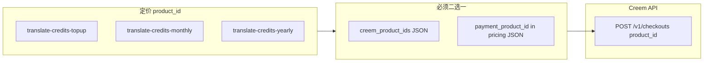

# 翻译页数提示与 Creem 配置说明 / 改进计划

## 问题 1：点击翻译出现整页英文提示

**文案来源**：[frontend/src/config/locale/messages/en/translate/translate.json](frontend/src/config/locale/messages/en/translate/translate.json) 的 `documentPagesUnknown`（客户端在 `TRANSLATE_CREDITS_ENABLED` 且未填页范围、且 `documentPageCount < 1` 时展示）。

**触发逻辑**（与后端一致）：

- [TranslationForm.tsx](frontend/src/shared/components/translate/TranslationForm.tsx) 用 `documentPageCount={sourceTotalPages}`（来自父组件）。
- [TranslatePageClient.tsx](frontend/src/app/[locale]/(landing)/translate/TranslatePageClient.tsx) 里 `sourceTotalPages` **仅**在 `getDocumentPreviewUrl` 成功时由 `res.total_pages` 赋值；失败或尚未完成请求时为 `0`（见约 274–305 行）。
- 后端 [translate/route.ts](frontend/src/app/api/translate/route.ts) 在积分开启、无 `page_range`、且 `documents.page_count` 未知时返回 `document_pages_required_for_billing`。

**缺口**：数据库里可能已有 `pageCount`（预览路由在解析成功时会写回，见 [preview-url/route.ts](frontend/src/app/api/documents/[documentId]/preview-url/route.ts)），但 [GET /api/documents/[documentId]](frontend/src/app/api/documents/[documentId]/route.ts) **未把 `page_count` 返回给前端**，因此客户端无法在等待预览或预览失败（如 413/网络错误）时使用库里的页数。

**建议实现（代码）**

1. 扩展 `GET /api/documents/[documentId]` 的 JSON，增加可选字段 `page_count`（来自 `doc.pageCount`，无则省略或 `null`）。
2. 在 [translate-api.ts](frontend/src/shared/lib/translate-api.ts) 的 `DocumentDetail` 类型中增加 `page_count?: number | null`。
3. 在 `TranslatePageClient` 中：在现有 `getDocument` 的 `useEffect` 里保存 `page_count` 到 state（如 `documentPageCountFromDb`），传给 `TranslationForm` 的 `documentPageCount` 使用 `**Math.max(sourceTotalPages, documentPageCountFromDb ?? 0)`**（或「任一大于 0 则采用」），使整本翻译在**仅 DB 有页数、预览未就绪**时也能通过客户端预检；后端仍以 DB `page_count` 为准。

**可选（文档）**：在 [environment-variables.md](frontend/docs/environment-variables.md) §5.1 或翻译页简短说明：开启积分后，不填页范围时需要已知总页数（预览或库字段）。

---

## 问题 2：`checkout failed: productId is required` — Creem 哪里没配好

**根因链**：

1. [checkout/route.ts](frontend/src/app/api/payment/checkout/route.ts) 解析 `paymentProductId` 的顺序为：多币种项上的 `payment_product_id` → 定价项默认 `payment_product_id` → 后台 `**creem_product_ids` JSON 映射**（[getPaymentProductId](frontend/src/app/api/payment/checkout/route.ts) 约 332–355 行）。
2. 若 `paymentProductId` 仍为空，仍会调用 Creem，但 [CreemProvider.createPayment](frontend/src/extensions/payment/creem.ts) 在 `!order.productId` 时直接 `throw new Error('productId is required')`（约 53–54 行）。

因此 **100% 表示：没有任何路径把「Creem 控制台里的 Product ID」写进结账订单**。

**定价侧 `product_id`（映射用的键）** 来自 next-intl 文案，例如 [en/pages/pricing.json](frontend/src/config/locale/messages/en/pages/pricing.json)：

- `translate-credits-topup`（一次性）
- `translate-credits-monthly`（月付）
- `translate-credits-yearly`（年付）

当前这些条目 **没有** `payment_product_id` 字段，因此必须依赖后台 `**creem_product_ids`**，否则 Creem 收不到 `product_id`。

**建议新增详细文档**（新文件更利于维护，例如 [frontend/docs/creem-checkout-setup.md](frontend/docs/creem-checkout-setup.md)，并在 [environment-variables.md](frontend/docs/environment-variables.md) §5.1 或 Payment 小节加链接）：

| 步骤                                    | 内容                                                                                                                                                                                                                                                 |
| ------------------------------------- | -------------------------------------------------------------------------------------------------------------------------------------------------------------------------------------------------------------------------------------------------- |
| Creem 控制台                             | 为每个套餐创建 **Product**（一次性 / 订阅周期与定价 JSON 中 `interval` 一致）；复制每个 Product 的 **ID**（以 Creem 界面为准，常见为 `prod_...` 类字符串）。                                                                                                                                   |
| 后台 Admin → Settings → Payment → Creem | `creem_enabled` = 开；`creem_environment` = sandbox/production 与密钥一致；填写 `creem_api_key`；`creem_signing_secret` 用于 Webhook 验签。                                                                                                                        |
| **Creem Product IDs Mapping**         | 合法 JSON，**键**必须与定价里的 `product_id` **完全一致**，**值**为 Creem Product ID。示例：`{"translate-credits-topup":"prod_xxx","translate-credits-monthly":"prod_yyy","translate-credits-yearly":"prod_zzz"}`。多币种时支持键 `productId_currency`（见 `getPaymentProductId`）。 |
| 常见错误                                  | JSON 语法错误（`getPaymentProductId` catch 后会返回空，导致同样报错）；键名写错（如 `translate-credits-month`）；未启用 Creem 却选 Creem 为渠道；Sandbox 用了 Production 的 Key。                                                                                                          |
| 替代做法                                  | 直接在 [en/pages/pricing.json](frontend/src/config/locale/messages/en/pages/pricing.json) 与 [zh/pages/pricing.json](frontend/src/config/locale/messages/zh/pages/pricing.json) 各 `item` 上增加 `payment_product_id`（与 checkout 中读取顺序一致），可不再依赖后台映射表。      |
| Webhook（订阅续费）                         | URL：`https://<你的域名>/api/payment/notify/creem`；Signing Secret 与后台一致。                                                                                                                                                                                |

**可选改进（代码，非必须）**：当 `paymentProvider === 'creem'` 且 `paymentProductId` 为空时，在调用 `createPayment` 前返回明确 `respErr`，文案提示「请配置 creem_product_ids 或定价 payment_product_id」，避免嵌套 `checkout failed: checkout failed:`（当前 [pricing.tsx](frontend/src/themes/default/blocks/pricing.tsx) toast 会拼接 API message）。

---

## 小结

- **问题 1**：以「文档 API 暴露 `page_count` + 客户端合并页数」为主修复；提示本身是预期行为，但应在 DB 已有页数时不再误拦。
- **问题 2**：以 **新建 Creem 配置文档 + 与定价键对齐的 JSON 示例** 为主；代码上可做更友好的校验错误信息。

