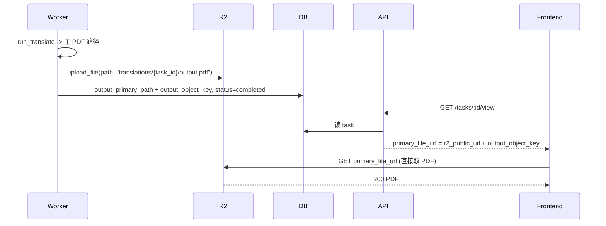

# 译文 PDF 走 R2 彻底消除 404

## 现状与根因

- Worker 已正确写入 `output_primary_path`（含中文路径），但 API 的 GET `/file` 仍 404。
- 根因：API 进程用 DB 中的路径做 `Path(...).exists()` 时，可能因**编码/路径格式/进程间路径解析差异**导致访问不到同一文件，本地路径方案在你这套环境下不可靠。
- 项目已接入 R2（原文 PDF 用 `source_pdf_url` 直接拼 R2 公网 URL），译文若也存 R2 并用 URL 访问，则**不再依赖 API 读本地文件**，404 从架构上消失。

## 目标

- 翻译完成后，**主 PDF 上传到 R2**，任务表存 **R2 object_key**。
- **预览/下载**：前端和 API 一律使用 **R2 公网 URL**（与原文 `source_pdf_url` 一致），不再请求 `/api/tasks/:id/file` 读盘。
- 未配置 R2 时保持现状：仅用 `output_primary_path` 与现有 fallback，不影响本地/无 R2 环境。

## 实现步骤

### 1. R2 上传本地文件

- 在 [backend/app/storage_r2.py](backend/app/storage_r2.py) 新增：
  - `upload_file(local_path: Path | str, object_key: str, content_type: str = "application/pdf") -> None`
  - 内部用现有 `get_r2_client()` 与 `settings.r2_bucket_name`，调用 `client.upload_file(str(local_path), Bucket=..., Key=object_key, ExtraArgs={"ContentType": content_type})`。
- 与现有 `download_to_path`、`create_presigned_put` 并列，不改变现有接口。

### 2. 任务表增加 R2 object_key

- 在 [backend/app/models.py](backend/app/models.py) 的 `TranslationTask` 上增加：
  - `output_object_key = Column(String(512), nullable=True)`  
  - 含义：译文主 PDF 在 R2 中的对象键，如 `translations/{task_id}/output.pdf`。
- 新增 Alembic 迁移（仅加该列），风格参考 [backend/alembic/versions/20260304_0004_add_task_output_primary_path.py](backend/alembic/versions/20260304_0004_add_task_output_primary_path.py)。

### 3. Worker：完成后上传 R2 并写 object_key

- 在 [backend/app/tasks_translate.py](backend/app/tasks_translate.py) 中，在**已设置 `task.output_primary_path` 且准备 `_update_task_status(..., "completed")` 之前**：
  - 若 R2 已配置（例如 `get_settings().r2_bucket_name` 且 `r2_endpoint_url` 等非空），则：
    - `object_key = f"translations/{task_id}/output.pdf"`（固定英文，避免 URL/编码问题）；
    - 调用 `storage_r2.upload_file(Path(task.output_primary_path), object_key)`；
    - 设置 `task.output_object_key = object_key`；
  - 若 R2 未配置，则保持仅写 `output_primary_path`，不写 `output_object_key`。
  - 然后执行现有 `_update_task_status(db, task, "completed")`（一次提交包含 `output_primary_path` 与可选的 `output_object_key`）。
- 上传异常时：记录日志，不阻断完成；仅不设置 `output_object_key`，前端仍可走本地 `/file` 或后续重试上传。

### 4. TaskView：优先返回 R2 公网 URL

- 在 [backend/app/routes/tasks.py](backend/app/routes/tasks.py) 的 **GET /tasks/{task_id}/view** 中，构造 `primary_file_url` 时：
  - 若 `task.output_object_key` 非空且 `settings.r2_public_url` 非空：  
  `primary_file_url = f"{settings.r2_public_url.rstrip('/')}/{task.output_object_key.lstrip('/')}"`  
  （与当前 `source_pdf_url` 拼法一致）；
  - 否则保持现有逻辑：有 `outputs` 时 `primary_file_url = f"/api/tasks/{task_id}/file"`，否则 `None`。
- 前端无需改：仍用 `taskView.primary_file_url` 作为译文 PDF 地址；当其为 R2 URL 时，直接加载，不再请求后端 `/file`。

### 5. GET /api/tasks/{task_id}/file：有 R2 则 302 重定向

- 在 [backend/app/routes/tasks.py](backend/app/routes/tasks.py) 的 **get_task_primary_file** 中，**最先**判断：
  - 若 `task.output_object_key` 非空且 `settings.r2_public_url` 非空：  
  构造 `redirect_url = f"{settings.r2_public_url.rstrip('/')}/{task.output_object_key.lstrip('/')}"`，  
  返回 `RedirectResponse(url=redirect_url, status_code=302)`。
  - 否则继续现有逻辑（用 `output_primary_path` 或 fallback 目录读本地文件）。
- 这样即使用户或旧前端仍请求 `/file`，也会被重定向到 R2，不再依赖本地路径，避免 404。

### 6. 可选：下载链接

- 当前下载若走 `outputs[].download_url`（`/api/tasks/:id/files/:filename`），可维持现状；若希望下载也走 R2，可在 TaskView 的 `outputs` 中为“主文件”增加一个基于 R2 URL 的项，或后续再统一为 R2。本方案先保证**预览** 100% 走 R2、不再 404。

## 数据流（概要）

## 预期效果

- **配置了 R2**：新完成任务的译文预览一律用 R2 URL，不再请求 API 读本地文件，**不再出现 404**；旧任务无 `output_object_key` 时仍走现有 `/file` 与 fallback。
- **未配置 R2**：行为与当前一致，仅本地路径 + fallback。
- 不改变前端路由或组件结构，仅后端与 Worker 增加 R2 上传与 URL 返回逻辑。

