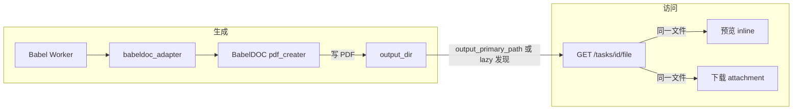

# 译文杂质、上下线丢失与下载 404 修复计划

## 问题根因简述

| 问题         | 根因                                                                                                                                                                                                                                                                         |
| ---------- | -------------------------------------------------------------------------------------------------------------------------------------------------------------------------------------------------------------------------------------------------------------------------- |
| 杂质 + 丢了上下线 | 适配器仍指向 `tmp/BabelDOC-main`，而新源码在 `tmp/BabelDOC`；且 **tmp/BabelDOC** 的 [pdf_creater.py](tmp/BabelDOC/babeldoc/format/pdf/document_il/backend/pdf_creater.py) 仅在 `curve.debug_info or translation_config.debug` 时渲染曲线（约 707–716 行），默认不渲染曲线，导致译文 PDF 本身就没有上下线；杂质则可能来自未过滤的边带图形。 |
| 预览丢上下线     | 预览展示的就是磁盘上的译文 PDF；若生成时曲线未渲染，预览自然缺上下线。修复生成逻辑即可。                                                                                                                                                                                                                             |
| 下载 404     | 后端 [get_task_primary_file_impl](backend/app/routes/tasks.py) 依赖 `output_primary_path` 或 `get_task_output_dir(task_id)` 等候选路径；若 API 与 Worker 的工程根或输出目录不一致、或 attachment 时用户校验（task.user_id != user.id）返回 404，或路径存在但 `allowed_base` 校验失败，都会导致“文件在却 404”。                      |

---

## 1. 使用新 BabelDOC 路径并统一输出目录

- **适配器路径**  
  - 当前 [babeldoc_adapter.py](backend/app/babeldoc_adapter.py) 写死 `BABELDOC_PATH = PROJECT_ROOT / "tmp" / "BabelDOC-main"`（第 22 行）。  
  - 改为支持用户的新路径：优先使用 `PROJECT_ROOT / "tmp" / "BabelDOC"`，若无该目录再回退到 `BabelDOC-main`；或通过环境变量 `BABELDOC_PATH`（或现有 config）配置，避免写死。
- **输出目录**  
  - [get_task_output_dir](backend/app/babeldoc_adapter.py) 使用 `CONFIG_PROJECT_ROOT` 与可选的 `babeldoc_output_dir`。  
  - 建议在 [config](backend/app/config.py) 中支持 `BABELDOC_OUTPUT_DIR`（绝对路径优先），并在文档中说明：**Worker 与 API 必须使用同一输出目录**，避免 API 找不到 Worker 写出的文件导致下载 404。

---

## 2. 译文 PDF：既有上下线又减杂质（BabelDOC 修改）

修改**实际被调用的** BabelDOC 源码中的 `pdf_creater`（若切到新路径则为 [tmp/BabelDOC/.../pdf_creater.py](tmp/BabelDOC/babeldoc/format/pdf/document_il/backend/pdf_creater.py)）：

- **默认渲染曲线**  
  - 与 BabelDOC-main 中现有逻辑一致：不要仅在 `curve.debug_info or translation_config.debug` 时渲染，改为**始终**将 `page.pdf_curve` 与 `formula_curves` 纳入候选，再按下面规则过滤。这样译文会保留标题上下线等装饰线。
- **边带杂质过滤**  
  - 只过滤**完全落在页面顶端/底端极窄带**内的曲线（例如高度 5%～6%），避免误伤标题区的上下线（它们通常在稍靠内位置）。  
  - 参考 BabelDOC-main 中的实现（cropbox、`margin_ratio`、按 bbox 判断完全在顶/底带内则 `continue`），在 **tmp/BabelDOC** 的 `pdf_creater` 中增加相同逻辑，但将 `margin_ratio` 设为约 **0.05～0.06**（不再用 0.12），这样只去掉最边缘的进度条/椭圆等，保留标题线。
- **不依赖 layout 的简化实现**  
  - 若当前 BabelDOC 的 curve 没有关联 layout 信息，可仅用“位置 + 窄带”过滤；若后续有 layout（如 title），再考虑“标题区曲线不过滤”的增强。

这样：生成的译文 PDF 既有上下线，又减少页边杂质；预览与下载都基于同一文件，预览会同步正常。

---

## 3. 下载 404 修复（后端）

在 [backend/app/routes/tasks.py](backend/app/routes/tasks.py) 的 `_get_task_primary_file_impl` 中：

- **放宽路径使用**  
  - 当 `stored_path` 存在且 `Path(stored_path).exists()` 且 `task.status == "completed"` 时，优先直接使用该路径返回文件；若 `allowed_base` 校验失败，仍可在 `completed` 时信任 `stored_path` 并返回，避免因路径风格（如大小写、符号链接）导致 404。
- **404 前再试 stored_path**  
  - 在最终 `raise HTTPException(404)` 前，若存在 `stored_path`，再试一次 `FileResponse(stored_path)`（存在则返回），避免“DB 里路径对但 resolve/allowed_base 导致未用上”的情况。
- **日志**  
  - 在返回 404 前打一条 warning，包含：`task_id`、`stored_path`、`get_task_output_dir(task_id)`、是否 attachment、`str(task.user_id)` vs `str(user.id)`，便于区分“文件未找到”与“无权限/用户不匹配”。

前端已用 `credentials: "include"` 且代理会转发 cookie；若仍 404，上述日志可快速判断是路径问题还是用户/权限问题。

---

## 4. 流程与文件关系（简要）

- 预览与下载都走同一接口、同一文件；只要生成时曲线渲染正确且输出目录一致，预览不会丢上下线，下载也不会错文件。  
- 若 404，需保证 API 与 Worker 使用同一 `PROJECT_ROOT` / `BABELDOC_OUTPUT_DIR`，并在 404 前用 `stored_path` 再试一次并打日志。

---

## 5. 实施顺序建议

1. **配置与路径**：适配器支持 `tmp/BabelDOC`（及可选 `BABELDOC_OUTPUT_DIR`），确保 Worker 与 API 使用同一输出目录。
2. **BabelDOC pdf_creater**：在**实际使用的** BabelDOC 中改为默认渲染曲线 + 顶/底约 5%～6% 窄带过滤。
3. **后端 file 接口**：放宽对 `stored_path` 的使用、404 前再试 `stored_path`、补充 404 日志。
4. **验证**：新跑一次翻译 → 看预览是否有上下线、是否还有明显杂质 → 再点下载，确认不再 404；若仍 404，根据新日志查路径或用户校验。

---

## 6. 涉及文件清单

- [backend/app/babeldoc_adapter.py](backend/app/babeldoc_adapter.py)：BabelDOC 路径逻辑（支持 `tmp/BabelDOC` 或配置）。  
- [backend/app/config.py](backend/app/config.py)：可选 `BABELDOC_OUTPUT_DIR`。  
- **tmp/BabelDOC/babeldoc/format/pdf/document_il/backend/pdf_creater.py**（若采用新路径）：默认渲染曲线 + 顶/底约 5% 带过滤。  
- [backend/app/routes/tasks.py](backend/app/routes/tasks.py)：`_get_task_primary_file_impl` 放宽路径、404 前再试、日志。

