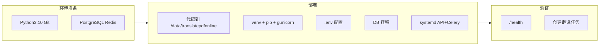

# 后端部署到 47.253.190.94 详细步骤

## 目标环境

- **服务器**：47.253.190.94（已与本地/CI 打通 root 免密登录）
- **部署路径**：/data/translatepdfonline（项目根目录）
- **用户**：root
- **进程**：API（gunicorn + uvicorn）、Celery Worker

后端配置从**项目根目录**的 `.env` 读取（[backend/app/config.py](backend/app/config.py) 中 `PROJECT_ROOT` 指向项目根），因此 `.env` 应放在 `/data/translatepdfonline/.env`。

**本计划包含**：① 本机配置 git remote 直推 ECS；② Nginx 反向代理与（可选）SSL；③ 后台进程（systemd 管理 API + Celery）；④ 每次 push 后自动重新部署（post-receive hook）。

---

## 一、本机 Git remote 配置（直推 ECS）

在**本机**项目根目录执行（已与 47.253.190.94 打通 root 免密）：

```bash
git remote add backend root@47.253.190.94:/data/translatepdfonline
```

若已存在 `backend` 远程，可改为：

```bash
git remote set-url backend root@47.253.190.94:/data/translatepdfonline
```

之后推送代码到 ECS 使用：

```bash
git push backend master
```

（分支名需与 ECS 上当前分支一致，如 ECS 为 `main` 则改为 `git push backend main`。）  
推送后 ECS 将自动执行部署（见第十节 post-receive hook）。

---

## 二、服务器环境准备

**目标系统**：47.253.190.94，Alibaba Cloud Linux 8（`al8`，x86_64）。使用 **dnf/yum** 安装包。

在 47.253.190.94 上安装基础依赖（若尚未安装）：

- **Git**：`dnf install -y git`
- **Python 3.10+**：AL8 默认可能为 3.9，需 3.10 时可：
  - 先查可用版本：`dnf module list python3` 或 `dnf list python3`*
  - 若仓库有 3.10：`dnf install -y python3.10 python3.10-pip`，再 `python3.10 -m venv backend/.venv`
  - 若无，可安装 Python 3.10 源码或使用阿里云/EPEL 提供的包
- **PostgreSQL 客户端**（可选）：`dnf install -y postgresql`
- 确保 **PostgreSQL**、**Redis** 已就绪且可从该机访问（在 `.env` 中通过 `DATABASE_URL`、`REDIS_URL` 配置）

---

## 三、代码放置到 /data/translatepdfonline（首次）且 Git 初始化

最终必须满足：`/data/translatepdfonline` 是**带 `.git` 的 Git 工作区**，否则本机无法直推、post-receive 也无法生效。

### 3.1 若服务器上相关目录**没有** git 初始化（当前常见情况）

**情况 A：目录已有代码（如 rsync 同步来的），但无 `.git`**

在 **47.253.190.94** 上执行（将 `<repo_url>` 换成 253 裸仓或 GitHub 地址，如 `root@10.254.128.253:/android/translate/repo.git`）：

```bash
cd /data/translatepdfonline
# 备份本地配置与虚拟环境（不被 git 跟踪，避免被覆盖）
cp -a .env .env.bak 2>/dev/null || true
cp -a backend/.venv /tmp/translatepdfonline_venv_bak 2>/dev/null || true
# 初始化并拉齐远程分支
git init
git remote add origin <repo_url>
git fetch origin
git checkout -b master origin/master
# 若远程主分支为 main：git checkout -b main origin/main
# 恢复备份
mv .env.bak .env 2>/dev/null || true
rm -rf backend/.venv; mv /tmp/translatepdfonline_venv_bak backend/.venv 2>/dev/null || true
```

若之前没有 `.env` 或 `backend/.venv`，忽略对应报错即可；`.env` 需在第四节单独创建。

**情况 B：目录为空或可整体替换**

在 47 上直接 clone，再在项目根创建 `.env`（见第五节）：

```bash
mkdir -p /data
git clone <repo_url> /data/translatepdfonline
cd /data/translatepdfonline && git checkout master
# 若远程主分支为 main：git checkout main
```

**情况 C：从 253 rsync 时已带 `.git`**

若 rsync 时已同步 `.git`，在 47 上执行 `cd /data/translatepdfonline && git status` 确认无报错即可，无需再 init。

### 3.2 校验

在 47 上执行：

```bash
cd /data/translatepdfonline && git status
```

应能看到当前分支及文件状态，且存在 `.git` 目录。

---

## 四、Python 虚拟环境与依赖

```bash
cd /data/translatepdfonline
python3.10 -m venv backend/.venv
# 若系统只有 python3.9，可先 dnf install python3.10 或使用 python3 -m venv（需 ≥3.10）
source backend/.venv/bin/activate
pip install -U pip
pip install -r backend/requirements.txt
pip install gunicorn
```

说明：生产 API 使用 gunicorn + uvicorn（[DEPLOYMENT.md](DEPLOYMENT.md) 5.4），`requirements.txt` 中未包含 gunicorn，需单独安装。**不要**在服务器上执行 `pip install -e tmp/BabelDOC`（BabelDOC 在 FC 运行）。

---

## 五、环境变量 .env

在项目根创建 `/data/translatepdfonline/.env`，内容参考 [DEPLOYMENT.md](DEPLOYMENT.md) 第 3.2 节，至少包含：


| 变量                                                                                           | 说明                       |
| -------------------------------------------------------------------------------------------- | ------------------------ |
| `DATABASE_URL`                                                                               | PostgreSQL 连接串           |
| `REDIS_URL`                                                                                  | Redis 连接串（Celery broker） |
| `JWT_SECRET`                                                                                 | 生产用随机长字符串                |
| `FRONTEND_ORIGINS`                                                                           | 前端域名，逗号分隔（CORS）          |
| `R2_ACCOUNT_ID`、`R2_BUCKET_NAME`、`R2_ACCESS_KEY_ID`、`R2_SECRET_ACCESS_KEY`、`R2_ENDPOINT_URL` | R2 存储                    |
| `BABELDOC_USE_FC`                                                                            | `true`                   |
| `BABELDOC_FC_URL`                                                                            | FC 的 /translate 完整 URL   |
| `BABELDOC_FC_SECRET`                                                                         | 与 FC 一致                  |
| `ENVIRONMENT`                                                                                | 如 `production`           |


可选：Google OAuth、Resend、`R2_PUBLIC_URL` 等。设置权限：`chmod 600 /data/translatepdfonline/.env`。

---

## 六、数据库

- 若使用 **Alembic**：在 backend 目录执行迁移  
`cd /data/translatepdfonline/backend && .venv/bin/alembic upgrade head`
- 若仅需建表（无迁移历史）：  
`cd /data/translatepdfonline/backend && .venv/bin/python scripts/create_tables.py`  
（依赖 `DATABASE_URL` 已在 `.env` 中配置）

---

## 七、后台进程（systemd 管理 API + Celery）

以下路径与工作目录均以 `/data/translatepdfonline` 为项目根。API 与 Celery 由 systemd 托管，开机自启、异常重启。

**7.1 API 服务**

创建 `/etc/systemd/system/translatepdfonline-api.service`：

```ini
[Unit]
Description=translatepdfonline API (gunicorn+uvicorn)
After=network.target

[Service]
Type=notify
User=root
WorkingDirectory=/data/translatepdfonline/backend
Environment="PATH=/data/translatepdfonline/backend/.venv/bin"
ExecStart=/data/translatepdfonline/backend/.venv/bin/gunicorn -k uvicorn.workers.UvicornWorker app.main:app -b 0.0.0.0:8000
Restart=always
RestartSec=5

[Install]
WantedBy=multi-user.target
```

**7.2 Celery Worker**

创建 `/etc/systemd/system/translatepdfonline-celery.service`：

```ini
[Unit]
Description=translatepdfonline Celery Worker
After=network.target

[Service]
Type=simple
User=root
WorkingDirectory=/data/translatepdfonline/backend
Environment="PATH=/data/translatepdfonline/backend/.venv/bin"
Environment="PROJECT_ROOT=/data/translatepdfonline"
ExecStart=/data/translatepdfonline/backend/.venv/bin/celery -A app.celery_app worker -l info
Restart=always
RestartSec=10

[Install]
WantedBy=multi-user.target
```

说明：`PROJECT_ROOT` 保证 Celery 与 API 使用同一 `.env` 路径（[config.py](backend/app/config.py) 通过 `PROJECT_ROOT` 加载根目录 `.env`）。

**7.3 启用并启动**

```bash
systemctl daemon-reload
systemctl enable translatepdfonline-api translatepdfonline-celery
systemctl start translatepdfonline-api translatepdfonline-celery
systemctl status translatepdfonline-api translatepdfonline-celery
```

---

## 八、Nginx 配置（反向代理 + 可选 SSL）

API 监听 `0.0.0.0:8000`，对外通过 Nginx 提供 80/443，并做反向代理。

**8.1 安装 Nginx**

在 47 上（Alibaba Cloud Linux 8，使用 dnf）：

```bash
dnf install -y nginx
systemctl enable nginx
systemctl start nginx
```

**8.2 站点配置**

AL8 上 Nginx 通常通过 `/etc/nginx/conf.d/` 加载站点，主配置已 `include conf.d/*.conf`。创建：

`/etc/nginx/conf.d/translatepdfonline.conf`：

```nginx
server {
    listen 80;
    server_name _;   # 改为你的域名，如 api.example.com
    client_max_body_size 100M;

    location / {
        proxy_pass http://127.0.0.1:8000;
        proxy_http_version 1.1;
        proxy_set_header Host $host;
        proxy_set_header X-Real-IP $remote_addr;
        proxy_set_header X-Forwarded-For $proxy_add_x_forwarded_for;
        proxy_set_header X-Forwarded-Proto $scheme;
        proxy_read_timeout 600s;
        proxy_connect_timeout 75s;
    }
}
```

检查并重载 Nginx：

```bash
nginx -t && systemctl reload nginx
```

**8.3 可选：HTTPS（Let’s Encrypt）**

```bash
dnf install -y certbot python3-certbot-nginx
certbot --nginx -d api.yourdomain.com
```

按提示完成后，Nginx 会自动增加 `listen 443 ssl` 与证书路径。防火墙/安全组放行 22、80、443。

---

## 九、验证

1. **健康检查**：`curl -s http://47.253.190.94/health`（经 Nginx）或 `http://47.253.190.94:8000/health`（直连）返回 `{"status":"ok", "env":"production"}`。
2. **API 文档**：浏览器访问 `http://47.253.190.94/api/docs`（若 `api_base_prefix` 为 `/api`）。
3. **Celery**：创建一条翻译任务，在 Worker 日志中确认任务被消费：`journalctl -u translatepdfonline-celery -f`。

---

## 十、本机直推与推送后自动部署

目标：本机执行 `git push backend master` 即推送到 47.253.190.94，并在 47 上自动更新代码、安装依赖、重启 API 与 Celery。

### 10.1 在 ECS 上允许接收 push 并安装 hook（一次性）

**10.1.1 允许向当前分支 push（非裸仓）**

在 47 上执行：

```bash
cd /data/translatepdfonline
git config receive.denyCurrentBranch updateInstead
```

这样本机 push 到该仓库时，会更新 47 上当前分支及工作区，而不会拒绝。

**10.1.2 安装 post-receive 钩子（推送后自动部署）**

在 47 上创建 `/data/translatepdfonline/.git/hooks/post-receive`，内容如下（注意路径与 systemd 服务名需与上文一致）：

```bash
#!/bin/bash
# 每次本机 push 后自动：更新工作区已在 push 时由 updateInstead 完成，此处仅做依赖安装与重启
set -e
WORKTREE=/data/translatepdfonline
cd "$WORKTREE"
export PATH="$WORKTREE/backend/.venv/bin:$PATH"
pip install -U -q pip
pip install -q -r backend/requirements.txt
pip install -q gunicorn
cd backend && alembic upgrade head 2>/dev/null || true
systemctl restart translatepdfonline-api translatepdfonline-celery
echo "Deploy done."
```

然后：

```bash
chmod +x /data/translatepdfonline/.git/hooks/post-receive
```

说明：`.env` 已存在于工作区，不会被 push 覆盖；`backend/.venv` 在首次部署时已创建，hook 中只做 `pip install` 与重启。

### 10.2 在本机添加远程并推送

在本机项目根目录（已与 47 打通 root 免密）执行：

```bash
git remote add backend root@47.253.190.94:/data/translatepdfonline
# 若已有 backend 远程，可：git remote set-url backend root@47.253.190.94:/data/translatepdfonline
git push backend master
```

之后每次更新代码，在本机执行：

```bash
git push backend master
```

即可触发 ECS 上自动部署（post-receive 执行 pip install、alembic、重启 API 与 Celery）。

### 10.3 注意事项

- 本机 push 的**分支**需与 ECS 上当前分支一致（如均为 `master`）；若 ECS 上为 `main`，则本机应 `git push backend main`，或在 ECS 上 `git checkout main` 并拉齐。
- 若服务器上相关目录**没有 git 初始化**，必须先按 **第三节 3.1** 在 ECS 上完成 `git init` + `remote add origin` + `fetch` + `checkout`（或直接 clone），再执行 10.1。

---

## 十一、后续手动更新（可选）

若不通过 push 部署，可在 47 上手动执行：

```bash
cd /data/translatepdfonline
git pull   # 需已配置 remote
export PATH=/data/translatepdfonline/backend/.venv/bin:$PATH
pip install -r backend/requirements.txt
pip install gunicorn
cd backend && alembic upgrade head
systemctl restart translatepdfonline-api translatepdfonline-celery
```

---

## 流程概览




