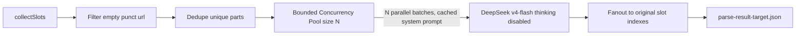

# DeepSeek `translate_parse_result` 阶段加速方案

## 1. 现状与瓶颈

OCR 流水线 stage `translate_parse_result` 调用链：

`runOneStage(translate_parse_result)` → [`translateAndPersistParseResultTarget`](frontend/src/shared/lib/ocr-parse-result-target-translate.ts) → [`translateStringListWithDeepSeek`](frontend/src/shared/lib/ocr-translate.ts)

定位到 4 个瓶颈（按影响排序）：

- **DeepSeek V4 默认开启 Thinking**。当前请求体未传 `extra_body.thinking.type = "disabled"`，每批都跑思考链。官方 *DeepSeek V4 Production Playbook*：*"V4 enables thinking by default; pass extra_body={"thinking": {"type": "disabled"}} for non-thinking. Fastest and cheapest."*
- **批次完全串行**：`while (start < parts.length) await fetch(...)`，并发 = 1。
- **Prompt 不利于 Context Cache**：指令与 batch 数据拼在同一 user message，前缀每批都不同，无法命中 ≈ 5% 价格的 cache-hit。
- **slot 没有去重 / 短路**：`span_boxes[*].text[]` 常按字/词切分，含大量重复及纯数字 / 标点 / URL，全部送 DeepSeek 浪费 token 与批次。

## 2. 优化后数据流

## 3. 修改清单

### 3.1 [`frontend/src/shared/lib/ocr-translate.ts`](frontend/src/shared/lib/ocr-translate.ts) — `translateStringListWithDeepSeek`

- **关闭 Thinking**：请求 body 增加
  - `extra_body: { thinking: { type: 'disabled' } }`
  - 同步删去本函数里的 `reasoning_effort`（thinking disabled 时被忽略，留着误导）
- **缓存友好 messages**：拆成两条
  - `system`：固定指令（含 `Translate each string from {sourceLang} to {targetLang}` 与「Return ONLY a JSON array of N strings, same order」）
  - `user`：仅 `JSON.stringify(slice)`
  - 注：`sourceLang` / `targetLang` / `N` 是变量，但放在 system 顶部，仅当语言对/批大小变化时才 miss；同一任务内大多数批共享前缀
- **temperature** 默认 `1.3`（DeepSeek 官方对 translation 的推荐），新增 `OCR_PARSE_TRANSLATE_TEMPERATURE` 可覆盖
- **并发池**：
  - 新增 `OCR_PARSE_TRANSLATE_CONCURRENCY`，默认 `6`，clamp `[1, 16]`
  - 先把整段 `parts` 拆成所有 batch（保留 start/end 索引），再用简单 Promise 池并行执行；批内仍单线程 retry
- **批大小调小**：
  - `OCR_PARSE_TRANSLATE_CHUNK_ITEMS` 默认 64 → **24**
  - `OCR_PARSE_TRANSLATE_CHUNK_CHARS` 默认 16000 → **6000**
  - 理由：批越小，单批生成 token 越少 → 单批 latency 更低、并行度更高；失败重试代价更小
- **退避**：429 / 5xx / timeout / abort 才退避，公式 `min(8000, base * 2^(attempt-1)) + random(0, base)`，`base = 600ms`
- **日志**保留 `[ocr/deepseek_parse_batch] start/done`，新增字段 `concurrency`, `thinking_disabled: true`, `chunk_items_max`, `chunk_chars_max`

### 3.2 [`frontend/src/shared/lib/ocr-parse-result-target-translate.ts`](frontend/src/shared/lib/ocr-parse-result-target-translate.ts) — `translateAndPersistParseResultTarget`

在收集 `parts` 之后、调用 DeepSeek 之前加一层「预处理」：

- **本地短路**（identity 写回，不走 DeepSeek）：
  - 空 / 纯空白
  - `/^[\s\d\p{P}\p{S}]+$/u` 且长度 ≤ 16
  - `/^https?:\/\//`
- **去重**：按字符串值归并到 unique 列表，仅这一份送 DeepSeek，再按 hashmap 扇出回所有原始槽位
- 维持「`translated.length === slots.length`」契约不变（在本层维护映射，下层不感知）
- 日志补：`parts_total`, `parts_passthrough`, `parts_to_translate_unique`, `dedupe_ratio`

### 3.3 [`.cursor/plans/translatepdfonline_cloudflare_双项目部署手册.md`](.cursor/plans/translatepdfonline_cloudflare_双项目部署手册.md)

在 Consumer 环境变量章节追加：

- `OCR_PARSE_TRANSLATE_CONCURRENCY`（默认 6，clamp 1–16）
- `OCR_PARSE_TRANSLATE_CHUNK_ITEMS`（默认 24）
- `OCR_PARSE_TRANSLATE_CHUNK_CHARS`（默认 6000）
- `OCR_PARSE_TRANSLATE_TEMPERATURE`（默认 1.3）
- 一句注记：*V4 默认开启 Thinking，本流水线已显式 disabled；不要在 env 里设置 `OCR_DEEPSEEK_REASONING_EFFORT` / `DEEPSEEK_REASONING_EFFORT`，否则只会被忽略并造成困惑。*

## 4. 不动的部分

- 阶段切分（`runOneStage` / `OcrStage` 列表）
- 计费、queue 路由、R2 keys、`parse-result-target.json` schema
- `translateMarkdownWithDeepSeek`（整段 markdown 翻译路径，独立 PR 再优化）
- `OcrTranslatePageClient.tsx` 等前端代码

## 5. 验收

- 1 页样本 `translate_parse_result` 阶段 wall-clock 由原来分钟级降至秒级
- consumer 日志在该 stage 内可看到多条 `[ocr/deepseek_parse_batch] start` 几乎同时打印（并发证据）
- 同一任务多次 batch 的 DeepSeek 响应中 `usage.prompt_cache_hit_tokens > 0`（cache 命中证据，可加日志打印 `usage` 验证）
- 多页 PDF 总耗时随页数近似线性 + 并发因子下降，且无 429 风暴
