# translate_parse_result 阶段：方案 A（参数调优 + cache 修复）

## 1. 日志诊断（154 parts，5min8s）

```mermaid
gantt
    title translate_parse_result wall clock 11:04:15 to 11:09:24
    dateFormat ss
    axisFormat %M:%S
    section Wave1
    Batch1 35s :a1, 00, 35s
    Batch2 75s :a2, 00, 75s
    Batch3 121s :a3, 00, 121s
    Batch4 59s :a4, 00, 59s
    Batch5 308s outlier :crit, a5, 00, 308s
    Batch6 170s :a6, 00, 170s
    section Wave2
    Batch7 53s :a7, after a1, 53s
    Batch8 87s :a8, after a4, 87s
    Batch9 97s :a9, after a2, 97s
    Batch10 10s :a10, after a7, 10s
```

- 9/10 批 `prompt_cache_hit_tokens=0` → 跨批 cache 没命中，原因在 system prompt 里嵌了 `slice.length`（每批 N 不同，前缀就不同）。
- batch 5 命中 1792/1876 是「自匹配」：第一次到 180s 被 abort、第二次发出与第一次同样的 body 才命中。
- 没有 `max_tokens` 上界，输出最大 12530 tokens（batch 6）→ 单批延迟弹性大。

## 2. 修改清单

### 2.1 [`frontend/src/shared/lib/ocr-translate.ts`](frontend/src/shared/lib/ocr-translate.ts) → `translateStringListWithDeepSeek` / `runOneBatch`

- **`system` prompt 去掉变量 N**（核心收益）。新内容固定为：
  - `Translate each string in the JSON array sent by the user from {sourceLang} to {targetLang}.`
  - `Preserve markdown/HTML/LaTeX tags, numbers, URLs, and code. Do not add explanations.`
  - `Return ONLY a JSON array of strings whose length equals the input array's length, in the same order.`
  - 只保留 `sourceLang`/`targetLang` 两个变量；同一任务内 system 完全一致 → 第 2+ 批立即命中 prompt cache。
- **批大小调小**：
  - `OCR_PARSE_TRANSLATE_CHUNK_CHARS` 默认 6000 → **3000**
  - `OCR_PARSE_TRANSLATE_CHUNK_ITEMS` 默认 24 → **12**
- **并发拉到 10**：`OCR_PARSE_TRANSLATE_CONCURRENCY` 默认 6 → **10**（仍 clamp [1,16]，符合 DeepSeek 官方建议「8–16 in-flight」）。
- **fetch 超时收紧**：`OCR_PARSE_TRANSLATE_FETCH_TIMEOUT_MS` 默认 180000 → **90000**。
  - 配合 `OCR_PARSE_TRANSLATE_RETRY_MAX=3`，最坏单批 ≈ 90+90+90 + jitter ≈ 280s，但首/二次重试已能享受 cache，多数情况下 1 次就过。
- **新增 `max_tokens` 上界**：在请求体里加 `max_tokens: Math.min(8000, Math.max(1024, Math.round(plan.chars * 4)) + 256)`。
  - 目的：避免「跑飞」吃掉 384K 的全部预算；中文输出比英文 chars 略多 token，4× chars 已宽裕。
  - 同步打到 `[ocr/deepseek_parse_batch] start` 日志的 `max_tokens` 字段。
- **日志补充**：`start`/`done` 日志加 `cache_stable_system: true`、`fetch_timeout_ms`、`max_tokens`。

### 2.2 [`.cursor/plans/translatepdfonline_cloudflare_双项目部署手册.md`](.cursor/plans/translatepdfonline_cloudflare_双项目部署手册.md) §5.3

- 同步默认值：
  - `OCR_PARSE_TRANSLATE_CONCURRENCY` 默认 **10**
  - `OCR_PARSE_TRANSLATE_CHUNK_ITEMS` 默认 **12**
  - `OCR_PARSE_TRANSLATE_CHUNK_CHARS` 默认 **3000**
  - `OCR_PARSE_TRANSLATE_FETCH_TIMEOUT_MS` 默认 **90000**
  - 新增 `OCR_PARSE_TRANSLATE_MAX_TOKENS_BUDGET`（可选，覆盖动态计算的封顶；默认按 `slice_chars * 4 + 256` 自适应，硬上限 8000）
- 注记：同一任务内 system prompt 已固定，跨 batch 应该看到 `prompt_cache_hit_tokens > 0`（首批仍 miss，从第 2 批起命中）。

## 3. 不动的部分

- 阶段切分、queue 路由、计费、R2 keys、`parse-result-target.json` schema
- 去重 / 本地短路逻辑（已经在跑）
- `translateMarkdownWithDeepSeek`（独立路径，本次不改）
- 不引入 SSE 流式（留给后续方案 B，如果 A 仍不达标再上）

## 4. 验收

- 重跑同样 154 parts 任务，consumer 日志中：
  - 第 1 批 `prompt_cache_hit_tokens=0`，第 2+ 批 `prompt_cache_hit_tokens > 0`（system 命中）
  - `[ocr/deepseek_parse_batches] plan` 中看到 `concurrency=10`、`chunk_items_max=12`、`chunk_chars_max=3000`
  - `[ocr/deepseek_parse_batch] start` 中带 `max_tokens` 与 `fetch_timeout_ms=90000`
- stage 总耗时（同样 154 parts）目标从 308s 降至 ≤ 120s（无 outlier 时 ≤ 90s）
- 不应出现 stage 内任意批耗时 > 270s（90s × 3 重试上限）；如出现，说明触发了 DeepSeek 长时间排队，需要走方案 B 的流式
