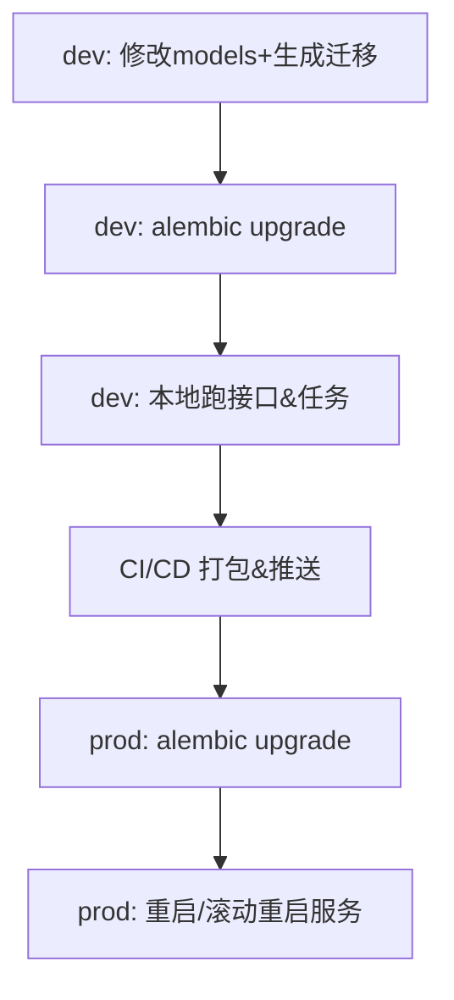

### 变更目标概览

- **数据库层面**：引入结构化迁移机制（而不是直接改 ORM 模型就上线），确保在改代码前就完成表结构/索引/默认值等变更。
- **Redis 层面**：统一通过配置与健康检查管理 Redis 连接、密码和可用性，在改动 Celery/缓存逻辑前先验证连接与权限。
- **开发流程**：形成一套“改代码前 checklist”，包括：写迁移脚本、在本地/测试环境执行验证、再启用依赖新结构的新代码。

---

### 一、数据库变更策略（PostgreSQL + SQLAlchemy）

- **引入迁移工具**
  - **选择 Alembic**：与 SQLAlchemy 深度集成，适合现有 FastAPI 项目。
  - 在 `backend/` 下新增 `alembic/` 目录与配置文件（`alembic.ini`），配置 `sqlalchemy.url` 指向 `DATABASE_URL`。
- **迁移文件组织**
  - 将目前已手工执行的变更（如 `users.is_temporary`、`translation_tasks.error_code` 等）补充成 **显式迁移脚本**，例如：
    - `versions/20260304_add_users_quota_fields.py`
    - `versions/20260304_add_translation_tasks_error_fields.py`
  - 每个迁移脚本包含：
    - `upgrade()`：`ALTER TABLE ... ADD COLUMN ...` 逻辑。
    - `downgrade()`：若可行，则实现删除列或回滚逻辑（生产环境慎用）。
- **迁移与模型同步策略**
  - 开发新字段/新表时流程改为：
    1. **先改 models**（`backend/app/models.py`），但不要立刻依赖新字段做强校验逻辑。
    2. 生成 Alembic 迁移（`alembic revision --autogenerate -m "..."`），检查 SQL 是否正确；必要时手工编辑。
    3. 在本地执行 `alembic upgrade head`，确认无报错、新字段存在，并用 `psql \d` 验证。
    4. 只有在迁移成功后，才在业务代码里**真正依赖**这些字段（例如写入/查询新列）。
- **生产变更流程示意**

- **现有问题的修复纳入迁移**
  - 为当前已经手工执行的 `ALTER TABLE users ...` 与 `ALTER TABLE translation_tasks ...` 写补录迁移脚本，并在注释中标明：
    - “此迁移在某些环境中已手工执行过，如再次执行需使用 `IF NOT EXISTS` 或提前检查”。

---

### 二、Redis 与 Celery 变更策略

- **配置集中化**
  - 在 `backend/app/config.py` 中：
    - 确保 `redis_url` 统一从 `.env / .env.local` 读取，包含密码、数据库索引等。
    - 为 Redis 引入单独的 **健康检查开关** 与超时设置（例如 `redis_enabled`, `redis_timeout_seconds`）。
- **健康检查与启动前验证**
  - 新建一个小脚本 `backend/scripts/check_redis.py`：
    - 尝试 `ping` 当前 `redis_url`，校验密码与可连通性。
    - 对失败时给出**明确错误信息**（密码错误、host 不通、端口不通）。
  - 在开发启动脚本中（`scripts/run-worker.js` 或 `start-dev.ps1`）：
    - 可选：在启动 Celery 之前调用一次 `python -m backend.scripts.check_redis`，失败则直接退出并打印原因。
- **Celery 配置防踩坑**
  - 保持当前 `backend/app/celery_app.py` 的设计：
    - 本地开发默认 `backend=None`，仅用 Redis 做 broker，避免 result backend 因密码问题导致 worker 启动失败。
    - 如需在生产启用 result backend，单独通过 `CELERY_RESULT_BACKEND_URL` 控制，并在文档中说明需要与 Redis 密码同步配置。
- **变更前 checklist（Redis 相关）**
  - 修改 Redis 地址/密码前：
    - 更新 `.env` / `.env.local` 中的 `REDIS_URL`。
    - 本地执行 `check_redis.py`，确认能 `PING` 成功。
    - 再重启 worker 与 backend 服务。

---

### 三、代码改动前的标准检查流程

- **数据库相关变更前**：
  - 是否新增/修改了 `models.py` 中的字段或表？
  - 是否创建/更新了 Alembic 迁移脚本，并在本地成功执行？
  - 是否在本地通过接口或脚本验证：插入/更新/查询新字段都正常？
- **Redis/Celery 相关变更前**：
  - `.env` 中的 Redis URL 是否更新到位？
  - 是否在当前环境运行过 Redis 健康检查脚本并确认成功？
  - 对 Celery 配置的修改（如是否启用 result backend）是否在文档中记录？
- **提交代码前**：
  - `backend/scripts/create_tables.py` 与 Alembic 配置不冲突（明确其只用于本地开发初始化，而正式环境使用 Alembic）。
  - 在 `doc/` 中同步更新“数据库变更记录”和“Redis 配置说明”，方便后续排查。

---

### 四、在当前项目中的落地位置

- **新增/更新的关键文件（计划阶段，不立即修改）**：
  - Alembic：
    - `[backend/alembic.ini](backend/alembic.ini)`
    - `[backend/alembic/env.py](backend/alembic/env.py)`
    - `[backend/alembic/versions/*.py](backend/alembic/versions/)`
  - 检查脚本：
    - `[backend/scripts/check_redis.py](backend/scripts/check_redis.py)`
  - 文档：
    - `[doc/数据库与迁移规范.md](doc/数据库与迁移规范.md)`（新建，系统性描述迁移流程）
    - 在已有的 `[doc/在线翻译网站-技术需求细化-中英西.md](doc/在线翻译网站-技术需求细化-中英西.md)` 的 Changelog 中补一版 “v0.x – 数据库迁移与 Redis 变更流程规范”。

---

### 五、后续实施顺序建议

1. 在 `backend/` 中初始化 Alembic，并生成与现有 schema 对齐的首个基线迁移。
2. 为当前已经手动执行的列新增写补录迁移脚本（`users` 与 `translation_tasks`），确保新环境一键可用。
3. 新建 Redis 健康检查脚本，并在文档中写明使用方式；可选地集成进 `start-dev.ps1` 或 `npm run dev:all` 的前置步骤。
4. 更新技术文档，写清楚“改模型前先写迁移、跑迁移，再启用新代码”的约束。
5. 之后每次改动数据库/Redis 时，严格按这套流程执行，避免再靠运行时报错来发现问题。

