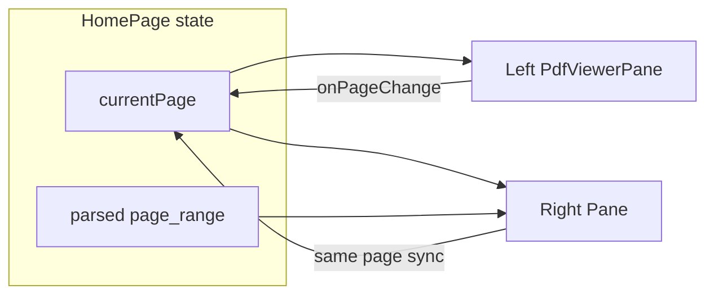

# 前端多语言、DeepSeek 配置、预览文案与原文/译文同步

## 1. 语言选项控制前端页面（多语言适配）

**问题**：切换为 en 后，首页仍显示中文（如「1. 上传 PDF」「2. 翻译设置」等），因这些文案在 [frontend/app/[locale]/page.tsx](frontend/app/[locale]/page.tsx) 中硬编码。

**做法**：

- 在 [frontend/messages/zh.json](frontend/messages/zh.json)、[frontend/messages/en.json](frontend/messages/en.json)、[frontend/messages/es.json](frontend/messages/es.json) 中新增 **home** 命名空间，例如：
  - `uploadSection`: "1. 上传 PDF" / "1. Upload PDF" / "1. Subir PDF"
  - `translateSection`: "2. 翻译设置" / "2. Translation settings" / "2. Configuración de traducción"
  - `taskStatusSection`: "3. 任务状态" / "3. Task status" / "3. Estado de la tarea"
  - `taskId`: "任务 ID" / "Task ID" / "ID de tarea"
  - `currentStatus`: "当前状态" / "Current status" / "Estado actual"
  - `translationFailed`: "翻译失败" / "Translation failed" / "Traducción fallida"
  - `sourceFile`: "源文件" / "Source file" / "Archivo fuente"
  - `translationResult`: "翻译结果" / "Translation result" / "Resultado"
  - `pdfPreview`: "PDF 预览" / "PDF Preview" / "Vista previa PDF"
  - `sourceLabel`: "原文" / "Source" / "Original"
  - `targetLabel`: "译文" / "Translation" / "Traducción"
- 在 **task** 中新增：
  - `viewAfterComplete`: "翻译完成后可在此查看原文与译文对比"（去掉「当前为占位预览」）
- 在 page.tsx 中：使用 `useTranslations("home")`（或与 task 混用），将所有上述硬编码字符串改为 `t("key")`；标题中的 filename 保持动态拼接即可。
- 为 **PdfViewerPane** 的「上一页」「下一页」「加载中」「加载失败」「暂无 PDF」做 i18n：在 messages 中增加 **pdfViewer** 命名空间（prevPage, nextPage, loading, loadFailed, noPdf），在 [frontend/components/PdfViewerPane.tsx](frontend/components/PdfViewerPane.tsx) 内使用 `useTranslations("pdfViewer")` 替换硬编码。

---

## 2. 翻译报错 401（DeepSeek API Key）

**现象**：Worker 调用 `https://api.deepseek.com/chat/completions` 返回 401，提示 `Your api key: ... is invalid`。

**原因**：后端通过 [backend/app/config.py](backend/app/config.py) 的 `get_settings()` 读取 `DEEPSEEK_API_KEY`；config 在加载时已从**项目根目录** `.env` 加载（`PROJECT_ROOT = Path(__file__).resolve().parents[2]`），Worker 进程在 import 时会执行该逻辑，因此若根目录 `.env` 中未设置或填错 key，会出现 401。

**建议（文档与可选校验）**：

- 在 [doc/](doc/) 或 README 中明确说明：**在项目根目录的 `.env` 中配置有效的 `DEEPSEEK_API_KEY`**；Worker 与 Backend 共用该配置。
- 可选：在 [backend/app/tasks_translate.py](backend/app/tasks_translate.py) 或 babeldoc_adapter 调用前增加一次校验——若 `not settings.deepseek_api_key`，在任务开始时即抛出明确错误（如 "DEEPSEEK_API_KEY not set in .env"），避免大量 401 后再发现；401 时可在现有错误处理中把 message 转为用户可读的“API Key 无效或已过期，请检查根目录 .env 中的 DEEPSEEK_API_KEY”。

不修改代码也可：仅在文档中说明 401 时检查根目录 `.env` 中的 `DEEPSEEK_API_KEY` 是否有效。

---

## 3. 去掉「当前为占位预览」文案

**位置**：[frontend/app/[locale]/page.tsx](frontend/app/[locale]/page.tsx) 第 243 行附近，`taskStatus === "completed"` 为假时的 else 分支。

**做法**：将该句改为使用翻译 key，且文案仅保留「翻译完成后可在此查看原文与译文对比」：

- 在 zh/en/es 的 **task** 下增加 `viewAfterComplete`（如 1 中所述）。
- 将当前硬编码的「翻译完成后可在此查看原文与译文对比（当前为占位预览）」改为 `t("viewAfterComplete")`。

---

## 4. 译文只展示翻译完成的页 + 原文/译文同步 + 未翻译占位 + 多语言

**需求归纳**：

- 用户选择第 7 页翻译时：只展示原文第 7 页与译文对应页；左右翻页同步。
- 未在本次任务中翻译的页：右侧显示「未翻译」类提示。
- 所有新增文案需多语言（zh/en/es）。

**数据**：`taskView.task.page_range` 已存在（如 `"7"` 或 `"1-5"`），前端 [frontend/lib/api.ts](frontend/lib/api.ts) 的 `TaskDetail` 已含 `page_range: string | null`。

**实现要点**：

- **解析 page_range**：在前端写一个解析函数，将 `"7"` 转为 `[7,7]`，`"1-5"` 转为 `[1,5]`（仅支持单页或连续区间即可）。
- **提升“当前页”状态**：在 [frontend/app/[locale]/page.tsx](frontend/app/[locale]/page.tsx) 中维护 `currentPage`（如 useState），作为左右两个预览的“当前页码”唯一来源；左、右 Pane 均受控于此（左：源 PDF 显示第 currentPage 页；右：根据 currentPage 与 page_range 决定显示译文第几页或占位）。
- **左侧 Pane**：仍用现有 `PdfViewerPane`，传入 `fileUrl={sourcePdfUrl}`；增加 props：`page`（当前页）、`onPageChange`，使翻页时更新 HomePage 的 `currentPage`。若 PdfViewerPane 当前为内部 state 控制页，需改为受控模式（或接收 initialPage + 在 onPageChange 时由父组件更新 currentPage 再回传 page）。
- **右侧 Pane**：
  - 若 `currentPage` 在解析出的 [start, end] 内：显示译文 PDF，且显示第 `currentPage - start + 1` 页（译文 PDF 可能只有 (end - start + 1) 页）。
  - 否则：不渲染译文 PDF 内容，改为占位文案「此页未翻译」/ "This page is not translated" / "Esta página no está traducida"（新 key，如 `pdfViewer.pageNotTranslated`）。
- **PdfViewerPane 改造**：支持受控页码（`page` + `onPageChange`），以及可选的 `initialPage`；当 `numPages` 已知时，翻页按钮用 `onPageChange` 通知父组件，父组件更新 `currentPage` 后，左侧和右侧都用同一个 `currentPage` 渲染（左侧永远用 currentPage；右侧用映射后的页码或占位）。这样“用户选择”的翻页会自然同步左右。
- **多语言**：在 messages 的 **pdfViewer** 中增加 `pageNotTranslated`（中/英/西），右侧占位时使用该 key。

**流程简述**：

- 右侧逻辑：若 `currentPage in [start,end]`，显示译文 PDF 第 `(currentPage - start + 1)` 页；否则显示 `t("pdfViewer.pageNotTranslated")`。

---

## 实施顺序建议

1. 在 messages 中新增 **home**、**pdfViewer** 及 **task.viewAfterComplete** 等 key（zh/en/es）。
2. 修改 page.tsx：全部改用 `t()`，去掉「当前为占位预览」。
3. 修改 PdfViewerPane：支持受控 `page`/`onPageChange`，内部文案改用 `useTranslations("pdfViewer")`。
4. 在 HomePage 中：解析 `taskView?.task.page_range`，提升 `currentPage` 状态，左右 Pane 受控并同步；右侧按页范围显示译文或「此页未翻译」。
5. 文档：补充 DEEPSEEK_API_KEY 与 401 的说明（及可选的启动/任务内校验）。
