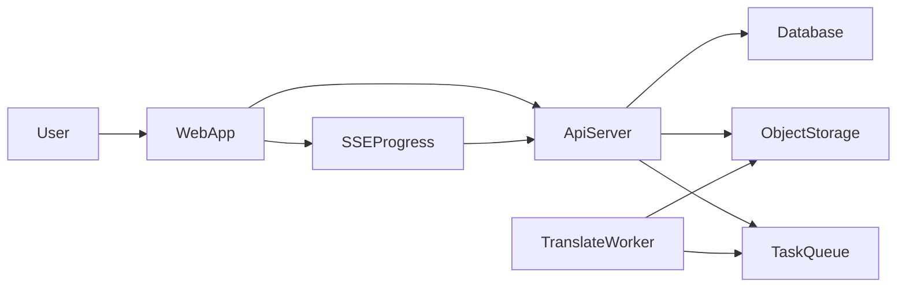

## 在线 PDF 翻译网站总体目标

为 `translatepdfonline.com` 搭建一个面向全球用户的**多语言在线 PDF 翻译平台**，支持 Google / GitHub / 手机号注册登录，用户可上传 PDF、按页数预览与选择翻译范围，获得高质量、多语种译文，并在浏览器内实现原文-译文双侧对比阅读。同时提供「免费额度 + 超额度付费」的 Token 计费模式，并满足 AGPL-3.0 与隐私安全要求。

---

## 一、用户角色与使用场景

- **未登录访客**
  - **访问范围**: 官网首页、功能介绍、价格说明、FAQ、开源说明、隐私条款
  - **试用限制**: 可体验 Demo（系统内置示例 PDF 的部分页面翻译预览），但不能上传自己文件
- **注册用户（Free）**
  - **能力**:
    - 绑定登录方式（Google / GitHub / 手机号）
    - 上传 PDF 文件（限制文件大小与页数，例如 ≤ 50MB，≤ 200 页）
    - 每个账户拥有初始 Token 配额（如 1,000 Tokens），用于实际翻译
    - 在网页中查看原文 / 译文、使用双栏对比
    - 浏览最近 N 个翻译任务记录
  - **限制**:
    - 每日/每月 Token 使用上限
    - 同时运行的翻译任务数限制（例如 1 个）
- **付费订阅用户（Pro 及以上）**
  - **额外能力**:
    - 更高 Token 月配额（例如 500,000 Tokens/月）
    - 更大单文件限制（如 100MB, 1,000 页）
    - 更高并发翻译任务数（例如 3 个并行）
    - 优先队列（缩短排队时间）
    - 更长的翻译历史保留时间（例如 30 天）

---

## 二、功能需求

### 2.1 账号与认证模块

参考文件: `[在线翻译网站.md](d:/imppro/translatepdfonline/在线翻译网站.md)` 中关于 Better Auth / JWT / Aliyun SMS 的设想。

- **登录方式**
  - **Google OAuth2 登录**
  - **GitHub OAuth 登录**
  - **手机号登录（短信验证码）**
    - 使用阿里云香港区域的 SMS 服务
    - 支持国际区号，至少覆盖中国、欧美、西语国家
- **账号模型**
  - 一个 `user` 可以绑定多个登录方式（email OAuth、手机号）
  - 统一的用户 ID，用于关联钱包、任务、日志等
- **会话与鉴权**
  - 使用 JWT（短期 Access Token + 长期 Refresh Token）
  - JWT 中包含 `user_id`、`subscription_tier`、`token_balance` 等核心字段
  - 前后端都通过中间件校验 JWT，有效期与刷新逻辑按文档既有设想执行

### 2.2 用户中心与个人资料

- **基础信息**
  - 显示用户名、邮箱/手机号、注册时间、登录方式
  - 支持设置主显示语言（UI 语言）：中文 / 英文 / 西班牙语（可扩展）
- **安全设置**
  - 查看已绑定登录方式，并可解绑（在安全前提下）
  - 设置 / 重置密码（仅适用于邮箱注册场景，如未来扩展）
- **订阅信息**
  - 当前套餐（Free / Pro / Enterprise）
  - 当前 Token 余额、已消耗 Token、本周期重置时间
  - 升级 / 续费入口（指向支付页面）

### 2.3 PDF 上传与管理

- **上传方式**
  - 登录后，在「仪表盘」或「新建翻译」页面，用户可通过拖拽或点选上传 PDF
  - 使用「直传到对象存储（如 Cloudflare R2）」的模式：前端从后端获取预签名 URL，然后直接 PUT 上传
- **文件限制与校验**
  - 前端和后端都要校验：
    - 文件类型为 `application/pdf`
    - 文件大小在限制范围内（按用户等级不同）
  - 上传过程中展示进度条与状态（上传中 / 成功 / 失败）
- **文件管理**
  - 每个用户有一个「文档列表」：
    - 列表字段：文档名、上传时间、页数、最近翻译时间、状态（未翻译 / 部分翻译 / 已翻译）
    - 支持搜索（按文件名）、分页展示

### 2.4 PDF 在线预览（原文端）

- **预览技术来源**
  - 参考 `@letter-ai/lector`、`react-pdf-viewer` 或原生 `PDF.js` 实现在线预览
- **基本能力**
  - 支持按页预览、缩略图导航、跳转指定页
  - 支持放大/缩小、全屏
  - 可显示总页数、当前页码
- **访问权限**
  - 仅文档所有者可预览；后续如设计共享链接，则遵守签名链接 + 有效期机制

### 2.5 翻译任务创建与页数选择

- **翻译设定表单**
  - 选择待翻译的 PDF 文件
  - 选择源语言与目标语言（多语言互译，如中-英、英-西等）
  - 选择翻译范围：
    - 全文（所有页）
    - 指定页范围（如 1-10 页，多段区间可作为进阶需求）
  - 选项：
    - 是否保持版式（适用于学术 PDF）
    - 是否忽略参考文献 / 附录（进阶）
- **Token 预估与校验**
  - 后端根据页数、预估文本量估算 Token 消耗
  - 检查用户钱包余额：
    - 若余额不足：提示用户充值或升级套餐
    - 若足够：冻结相应 Token，创建翻译任务

### 2.6 翻译任务处理流程

- **任务状态生命周期**
  - `Pending` → `Queued` → `Processing` → `Completed` / `Failed`
- **异步处理**
  - 上传完成后的 PDF 由 Worker 异步处理：
    - 版式分析、文本提取
    - 调用 LLM（如 DeepSeek-V3）进行翻译
    - 生成译文结构（段落、坐标、data-index）
  - 后端通过消息队列（如 Redis + Celery）协调任务
- **进度通知**
  - 前端在翻译详情页订阅任务进度（建议使用 SSE）：
    - 显示整体进度百分比
    - 显示当前阶段（解析、翻译、生成对照版）
  - 出错时展示可读错误信息，并提供「重新尝试」或「联系客服」入口

### 2.7 翻译结果展示与对比预览

- **单端查看**
  - 用户可切换「只看原文」/「只看译文」
- **双栏对比模式**
  - 左侧：原文 PDF
  - 右侧：译文 PDF 或「重排后的译文视图」
  - 强调以下交互：
    - 同步滚动：左右视图依据 `data-index` 进行段落同步
    - 鼠标悬停高亮对应段落
- **页码与段落跳转**
  - 用户在一侧选择某一段落或页码，另一侧自动跳到对应位置
- **下载与导出**（可作为二期）
  - 导出译文为：
    - 双语对照 PDF
    - 纯译文 PDF
    - Word / Markdown（进阶）
  - 导出操作也需校验 Token 或订阅等级（例如仅 Pro 可下载）

### 2.8 任务历史与记录

- **翻译任务列表**
  - 字段：任务名（自动生成，支持用户自命名）、文档名、创建时间、状态、源/目标语言、消耗 Token
- **任务详情**
  - 可从历史记录进入翻译对比页面
  - 显示：错误日志（如有）、进度、文件清理倒计时（离自动删除还有多久）

### 2.9 计费与 Token 体系

- **钱包与 Token 逻辑**
  - 每个用户拥有一个 `wallet`：
    - `balance`：当前可用 Token
    - `frozen_balance`：正在执行任务冻结的 Token
  - 操作必须具备原子性，避免并发下余额错误
- **免费与订阅层级**
  - Free：注册即获得固定 Token（如 1,000），有月度上限
  - Pro：按月订阅（如 $9.99/月），每月重置 Token 到高配额（如 500,000）
- **增益机制（可分阶段上线）**
  - 每日签到送少量 Token
  - 邀请注册奖励 Token
  - 错误反馈经审核后返还相应 Token

### 2.10 支付与订单

- **全球支付渠道**
  - 面向国际用户可优先集成 Stripe
  - 未来可视需要接入支付宝/微信支付等
- **订单模型**
  - 订阅订单：记录用户、套餐、金额、支付状态、有效期
  - 一次性充值（如购买额外 Token 包，可作为后续扩展）
- **支付回调与状态同步**
  - 支持支付成功/失败回调
  - 成功后更新 `subscription_tier` 与 `wallet` Token

### 2.11 网站展示层与营销页面

- **首页**
  - 核心卖点：多语种学术 PDF 高质量翻译、双栏对照阅读、隐私保护
  - 展示 Demo 动画或截图
  - 行动按钮：立即试用 / 登录
- **功能页**
  - 详细介绍功能：上传、预览、翻译、对照、下载
- **价格页**
  - 展示 Free / Pro 套餐对比
- **开源与合规页**
  - 链接到 BabelDOC 等使用的开源项目
  - 展示 AGPL-3.0 合规说明与源码仓库链接
- **帮助与 FAQ**
  - 常见问题：支持语言、隐私策略、文件保留时间、计费，等

---

## 三、非功能性需求

### 3.1 性能

- 单页 PDF 解析耗时 **≤ 2 秒**（在常见学术 PDF 场景下）
- 常规用户任务排队时间可接受（如 ≤ 30 秒），Pro 用户优先
- 前端首次进入仪表盘的加载时间 ≤ 3 秒（在良好网络环境下）

### 3.2 可用性与体验

- 界面需支持响应式设计，桌面端优先优化，移动端支持基本操作
- 重要操作（删除文档、取消任务）需二次确认
- 翻译任务进度可视化清晰，避免“黑盒等待”

### 3.3 安全与隐私

- 全站强制 HTTPS / TLS 1.3
- 翻译文件在对象存储中的保留时间有限（例如默认 48 小时自动删除，付费用户可自定义略长）
- 所有用户数据遵守所在地区法律法规（如 GDPR 基本要求）
- 预签名 URL 过期时间短、可配置，并限制访问来源

### 3.4 法律与开源合规

- 使用 BabelDOC / MinerU 等 AGPL-3.0 组件时：
  - 网站 Footer 明确提供源码链接
  - 公布适当免责声明
  - 对核心修改部分按要求公开

---

## 四、系统模块与架构概览

> 本节偏向高层架构，不绑定具体技术栈（Next.js、Python Worker 等细节可按 `在线翻译网站.md` 现有构想执行）。

- **前端 Web 应用**
  - 页面：登录注册、仪表盘、上传与翻译向导、对比查看器、价格页、帮助页等
  - 与后端交互：REST / GraphQL API + SSE 订阅翻译进度
- **API 网关与业务后端**
  - 负责用户与钱包管理、翻译任务创建、权限校验、支付回调处理等
- **异步翻译 Worker 集群**
  - 负责 PDF 解析、版式分析、调用 LLM、生成和存储翻译结果
- **存储层**
  - 对象存储（原始 PDF 与译文文件）
  - 关系型数据库（用户、钱包、任务、订单等）
  - 缓存 / 队列（Redis 等）

可用简单的架构图示意（逻辑关系）：

---

## 五、里程碑与迭代建议

- **MVP 版本（第 1 阶段）**
  - 支持登录（Google / GitHub 至少一种 + 手机号）、PDF 上传、基础在线预览
  - 支持选择页数范围的 PDF 翻译
  - 支持单侧译文查看，简单双栏对比（无需复杂同步算法）
  - 实现 Token 钱包的最小闭环（免费额度即可）
- **增强版本（第 2 阶段）**
  - 实现高质量双栏同步滚动、data-index 段落对齐
  - 支持多语种配置、更多 UI 语言
  - 上线订阅付费与 Pro 套餐
- **专业版本（第 3 阶段）**
  - 圈选翻译、公式保护等高级学术功能
  - 完善的增益机制（签到、邀请、反馈返利）
  - 更多导出格式、团队版支持

以上规划文档可以作为产品需求说明书（PRD）的基础，如果你需要，我可以在下一步把其中某一块（例如「双栏对比查看器」或「Token 计费模型」）细化成更接近技术实现的设计文档。