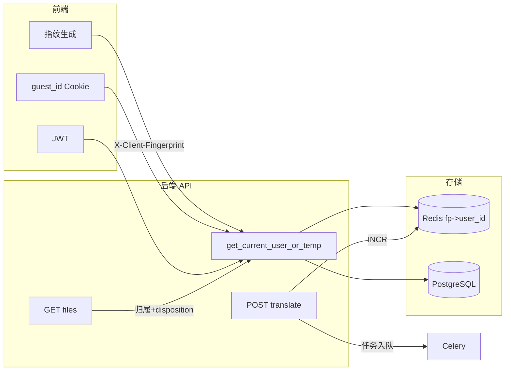

# 指纹、下载限制、限流与技术文档

## 现状摘要

- **临时用户**：[auth_utils.py](backend/app/auth_utils.py) 通过 `guest_id` Cookie 识别；无 Cookie 则创建新临时用户并写 Cookie。清空 Cookie 即可获得新配额（白嫖）。
- **下载**：[tasks.py](backend/app/routes/tasks.py) 中 `GET /api/tasks/{task_id}/files/{filename}` 无鉴权、无任务归属校验，任何人持 URL 即可下载。
- **预览**：前端用同一 `download_url` 在页面内展示译文 PDF，与下载共用同一接口。
- **限流**：后端无 API 限流；Celery 任务 [tasks_translate.py](backend/app/tasks_translate.py) 无并发/速率限制，高并发时 ECS 易被打满。
- **Google 登录**：[auth.py](backend/app/routes/auth.py) 回调仅按 email 查/建 User，未与临时用户或指纹关联。

---

## 1. 浏览器指纹 + Redis 绑定临时账号（防恶意上传与白嫖）

**目标**：同一浏览器指纹在 Redis 中固定对应一个临时账号；清 Cookie 无法获得新账号，从而限制 R2 占用与翻译页数白嫖。

**实现要点**：

- **前端**
  - 引入浏览器指纹库（如 [FingerprintJS open-source](https://github.com/fingerprintjs/fingerprintjs)），在应用初始化时生成指纹哈希（不依赖 Cookie）。
  - 所有调用后端 API 的请求（如 axios/fetch 拦截器）统一附加 Header：`X-Client-Fingerprint: <hash>`；或使用 Cookie（如 `fp`）由后端读取。
- **后端**
  - Redis 结构：`fp:{fingerprint_hash}` -> `user_id`（UUID），TTL 建议 90 天。
  - 修改 [get_current_user_or_temp](backend/app/auth_utils.py) 逻辑顺序：
    1. 优先 JWT -> 已登录用户。
    2. 若有 `guest_id` Cookie 且 DB 中存在且为临时用户 -> 该用户。
    3. 若有指纹 Header/Cookie，查 Redis `fp:{hash}`；若存在则用对应 `user_id` 加载用户（可选：回写 `guest_id` Cookie 以兼容旧端）。
    4. 否则创建新临时用户，写 DB、写 Cookie，并写 Redis `fp:{hash}` -> `user_id`，TTL 90 天。
  - 指纹哈希需做长度/字符白名单校验，避免注入；仅作“同一设备绑定”用，不存储原始指纹。

**效果**：同设备同指纹始终对应同一临时用户；恶意上传与翻译额度绑定到该指纹，清 Cookie 无法重置。

---

## 2. Google 登录后“入库”与数据迁移

**目标**：指纹/临时账号仅作访客凭证；Google 注册后以“正式用户”入库，并可选将临时用户下的文档与任务迁移到该正式用户。

**实现要点**：

- **回调扩展**（[auth.py](backend/app/routes/auth.py) Google callback）：
  - 从 state 或 Cookie 中读取当前 `guest_id`（若存在）。
  - 若存在且 DB 中该用户为 `is_temporary`，则：
    - 将该用户下的 `Document`、`TranslationTask` 的 `user_id` 更新为本次 Google 登录得到的正式用户 ID（或新建的 User）。
    - 可选：删除或标记临时用户，避免重复使用。
  - 若不存在 guest_id，则保持当前“按 email 查/建 User”行为。
- **Redis 指纹**：登录成功后可选清除或更新 `fp:{hash}` 指向正式用户 ID（若希望同一设备登录后不再用临时身份）；或仅依赖 JWT，不再用指纹解析该请求。

**文档**：在技术文档中说明“临时用户 + 指纹”与“Google 登录后入库、数据迁移”的流程与边界。

---

## 3. 未登录不允许下载；可翻译、可预览

**目标**：未进行真正登录（即临时用户 `is_temporary=True`）时，允许翻译与在线预览，**不允许**下载 PDF；正式登录用户可下载。

**实现要点**：

- **后端**（[tasks.py](backend/app/routes/tasks.py)）：
  - `GET /api/tasks/{task_id}/files/{filename}` 增加：
    - 依赖 `get_current_user_or_temp`，得到当前用户。
    - 查询 `TranslationTask`，校验 `task.user_id == current_user.id`（任务归属）。
    - 增加查询参数 `disposition`：`inline`（预览）或 `attachment`（下载）。
    - 当 `disposition=attachment`（或默认按“下载”语义）时：若 `user.is_temporary` 则返回 `403`，提示需登录后下载；否则返回文件并设置 `Content-Disposition: attachment`。
    - 当 `disposition=inline` 时：仅校验任务归属，通过则返回文件并 `Content-Disposition: inline`（或省略，浏览器默认可预览）。
- **前端**：
  - 预览：译文/原文 PDF 的 iframe 或 object 的 URL 使用 `?disposition=inline`（或后端约定默认即 inline）。
  - 下载链接：仅当已登录（有 JWT、非临时用户）时展示“下载”按钮，链接为 `?disposition=attachment`；未登录时隐藏下载按钮或置灰并提示“登录后下载”。

**注意**：当前前端 [page.tsx](frontend/app/[locale]/page.tsx) 中列表里直接使用 `f.download_url` 作为链接；需改为带 `disposition` 的 URL，并根据登录态决定是否展示下载入口。

---

## 4. 翻译并发与限流（阿里云 ECS 生产）

**目标**：前端用户并发发起翻译时，后端与 Celery 不被打满；需考虑限流与排队策略。

**实现要点**：

- **API 层限流**（建议）：
  - 对 `POST /api/translate` 做 per-user 或 per-IP 限流（例如 [slowapi](https://github.com/laurentS/slowapi)）：如每用户/每 IP 每分钟最多 N 次创建任务，超出返回 429。
  - 配置项可放在 [config.py](backend/app/config.py)（如 `RATE_LIMIT_TRANSLATE_PER_MINUTE`），便于生产调参。
- **全局/每用户并发控制**（建议）：
  - Redis 计数：键如 `translation:running_count`（全局）或 `translation:running:{user_id}`（每用户）。
  - 在 `POST /api/translate` 中，在入队 Celery 前：`INCR` 计数；在 Celery 任务结束时（无论成功/失败）在 finally 中 `DECR`。
  - 若全局计数超过阈值（如 2 * worker 数）则返回 503，提示“翻译任务繁忙，请稍后再试”；可选每用户上限（如每用户最多 2 个进行中）。
- **Celery 层**（可选）：
  - 对 [run_translation_task](backend/app/tasks_translate.py) 设置 `rate_limit`（如 `"2/m"`）或通过 Celery 配置限制并发，避免单机同时跑过多重型任务。
- **技术文档**：记录限流策略（API 频率、并发上限）、返回码（429/503）及建议的 ECS worker 数量与配置。

---

## 5. 技术文档（所有要求与细节）

**要求**：将上述所有技术要求与实现细节写入项目技术文档，便于后续维护与部署。

**建议**：

- 在 [doc/](doc/) 下新增 `**doc/guest-fingerprint-download-ratelimit.md`**（或等价名称），包含：
  - **1. 防 R2 滥用与白嫖**
    - 问题：恶意上传导致 R2 暴增、清 Cookie 白嫖翻译。
    - 方案：浏览器指纹 + Redis 绑定临时账号；同一指纹固定对应同一临时用户；可选单文件大小、单 IP 上传频率（若已实现可写清）。
  - **2. 浏览器指纹与账号绑定**
    - 前端如何生成指纹、如何携带（Header/Cookie）。
    - 后端 Redis 键设计、TTL、解析顺序（JWT -> guest_id -> 指纹 -> 新建）。
    - 隐私与合规说明：指纹仅用于防滥用、不用于跨站追踪。
  - **3. Google 登录后入库**
    - 临时用户与正式用户的边界；回调中如何读取 guest_id、如何迁移 Document/TranslationTask；Redis 指纹的后续处理。
  - **4. 下载策略**
    - 未登录：可翻译、可预览，不可下载。
    - 接口行为：`disposition=inline` 与 `attachment` 的语义；任务归属校验；403 场景。
    - 前端：预览 URL 与下载 URL 的区分、下载按钮的显示条件。
  - **5. 限流与生产部署**
    - API 限流：POST /translate 的频率限制（per-user/per-IP）、429。
    - 并发控制：Redis 计数、503、建议的全局/每用户并发上限。
    - Celery：rate_limit 或并发建议、ECS 上 worker 数量与资源建议。
  - **6. 配置项**
    - 新增环境变量或配置：如指纹 Redis 前缀与 TTL、限流阈值、并发上限等（若已落在 [config.py](backend/app/config.py) 或 .env 示例中，在此列出）。
- 在 [README.md](README.md) 或 [在线翻译网站-技术需求细化-中英西.md](在线翻译网站-技术需求细化-中英西.md) 中增加指向该文档的链接，便于检索。

---

## 实现顺序建议

1. **下载限制**：后端 `files/{filename}` 鉴权 + disposition；前端按登录态展示下载入口。
2. **限流**：Redis 并发计数 + 可选 slowapi 对 POST /translate 限流；文档中写明配置与 429/503。
3. **指纹 + 临时账号**：前端集成指纹并带 Header/Cookie；后端 Redis 绑定与 get_current_user_or_temp 改造。
4. **Google 回调数据迁移**：state/guest_id 读取与 Document/TranslationTask 迁移。
5. **技术文档**：新建 `doc/guest-fingerprint-download-ratelimit.md`，按上述章节写完并链入 README/需求文档。

---

## 架构关系简图

