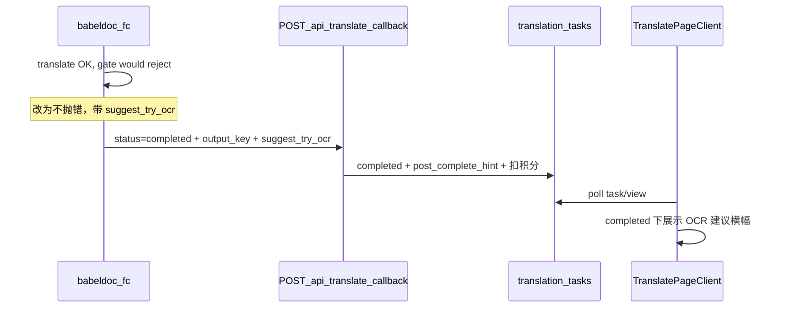

# FC 成功提示 + OCR 页范围切片

## 背景与数据流

当前门闸在 [`babeldoc_fc/run_translate.py`](d:/imppro/translatepdfonline/babeldoc_fc/run_translate.py) 第 238–239 行 `enforce_text_layer_after_translate(...)` 抛 `InsufficientTextLayerForTranslationError`，[`babeldoc_fc/main.py`](d:/imppro/translatepdfonline/babeldoc_fc/main.py) 捕获后 `status=failed` 回调并 HTTP 500。成功路径回调见 `_notify_completed_callback_with_retry`，仅传 `translated_page_count`（约 250–298 行）。

OCR 管线已支持切片：[`frontend/src/shared/lib/ocr-queue.ts`](d:/imppro/translatepdfonline/frontend/src/shared/lib/ocr-queue.ts) 使用 `row.sourceSliceObjectKey || doc.objectKey`（约 711 行）。[`POST /api/ocr/tasks`](d:/imppro/translatepdfonline/frontend/src/app/api/ocr/tasks/route.ts) 目前未接收 `page_range` / `source_slice_object_key`，计费用整文档 `pageCount`（约 98–100 行），需与翻译 API 对齐。

---

## 1. 数据库与回调契约

- 在 `translation_tasks` 增加可空列，例如 **`post_complete_hint`**（`text`，取值如 `suggest_try_ocr`），便于扩展其它「成功但建议后续操作」类提示。
- 新增迁移 SQL 到 [`frontend/docs/migrations/`](d:/imppro/translatepdfonline/frontend/docs/migrations/)（与现有 `translation_tasks_*.sql` 风格一致），并更新 Drizzle：[`frontend/src/config/db/schema.postgres.ts`](d:/imppro/translatepdfonline/frontend/src/config/db/schema.postgres.ts)。

**FC**

- 调整 [`run_translate_local`](d:/imppro/translatepdfonline/babeldoc_fc/run_translate.py)：`enforce_text_layer_after_translate` 仅对 **`InsufficientTextLayerForTranslationError`** 捕获并返回第三元组/结构字段 **`suggest_try_ocr=True`**（仍返回已生成的 PDF 路径列表与 `page_hint`）；其它异常照旧抛出。注意 `run_translate_local_with_retries` 今日对 `InsufficientTextLayerForTranslationError` 直接 `raise`（约 351–352 行），需改为：**不重试、不当作 last_exc 失败**，而是携带标志成功返回。
- [`main.py`](d:/imppro/translatepdfonline/babeldoc_fc/main.py)：上传 R2 成功后，调用扩展后的 `_notify_completed_callback_with_retry(..., suggest_try_ocr=bool)`；[`_notify_callback`](d:/imppro/translatepdfonline/babeldoc_fc/main.py) 在 `status==="completed"` 时 JSON 增加可选字段（建议命名 **`suggest_try_ocr`**，布尔），与现有 `translated_page_count` 并列。
- 更新 [`babeldoc_fc/README.md`](d:/imppro/translatepdfonline/babeldoc_fc/README.md)：说明「门闸命中仍返回 200 + completed，并可能带 `suggest_try_ocr`」。

**Next 回调**

- [`frontend/src/app/api/translate/callback/route.ts`](d:/imppro/translatepdfonline/frontend/src/app/api/translate/callback/route.ts)：在 `status === 'completed'` 分支解析 `body.suggest_try_ocr === true`（或同名 snake_case），将 **`post_complete_hint`** 设为 `'suggest_try_ocr'`；否则可清空该字段（避免旧值残留）。**不改变**现有「仅 completed 时 `consumeCredits`」逻辑，满足「积分扣除流程正常」。
- `deriveErrorCodeFromCallbackBody` 中对 `babeldoc_insufficient_text_layer` 的映射仅应在 **`failed`** 时生效；completed 路径不再依赖 error_message 推断。

**任务 API**

- [`frontend/src/app/api/tasks/[taskId]/route.ts`](d:/imppro/translatepdfonline/frontend/src/app/api/tasks/[taskId]/route.ts)、[`view/route.ts`](d:/imppro/translatepdfonline/frontend/src/app/api/tasks/[taskId]/view/route.ts)、[`tasks/route.ts`](d:/imppro/translatepdfonline/frontend/src/app/api/tasks/route.ts) 在 JSON 中暴露 **`post_complete_hint`**（或 camelCase `postCompleteHint`，与项目现有字段风格一致）。
- [`frontend/src/shared/lib/translate-api.ts`](d:/imppro/translatepdfonline/frontend/src/shared/lib/translate-api.ts) `TaskDetail` / `TaskSummary` 类型补字段。

---

## 2. 翻译页 UI：completed 下方柔和提示

- 在 [`TranslatePageClient.tsx`](d:/imppro/translatepdfonline/frontend/src/app/[locale]/(translate)/translate/TranslatePageClient.tsx) 中，在「任务状态卡片」内 **`statusLabel(completed)` 与进度条之后**（约 1217–1255 行区域下方），当 `taskStatus === 'completed'` 且 `taskDetail`/`taskView.task` 上 **`post_complete_hint === 'suggest_try_ocr'`** 时渲染一块 **独立视觉层级**的提示区：
  - 样式：浅 sky/blue 或 slate 底、圆角、`border` 细线，**非错误红**；可带 `Sparkles`/`Scan` 类图标；文案 + 「前往 OCR 翻译」**`Link`** 到 `/ocrtranslator`。
  - **Query 参数**（在现有失败态 `document`、`source_lang`、`target_lang` 基础上 **增加页信息**，供 OCR 页预填/校验）：
    - **`page_range`**（可选）：当前翻译任务的 **有效** `page_range`（与 `taskView.task.page_range` 一致；整书翻译则省略或传空由 OCR 侧忽略）。
    - **`doc_pages`**（可选）：`document_page_count`，便于 OCR 页展示总页数或与用户输入取交集（与翻译 API 行为对齐时可复用 `intersectPageRangeWithDocument`）。
  - 失败态里已有 `router.push(/ocrtranslator?...)` 的按钮（约 1279–1283 行）若仍引导 OCR，应 **同步带上** 上述 query，避免「成功提示跳转」与「失败跳转」参数不一致。
- 文案走 **next-intl**：在现有 10 个语言的 [`frontend/src/config/locale/messages/*/translate/task.json`](d:/imppro/translatepdfonline/frontend/src/config/locale/messages)（或 `home.json`，与 `useTranslations` 命名空间一致）各增 **title + body + cta** 键；**十种语言全部补齐**（en/zh/ja/ko/de/fr/es/it/ru/el）。
- 成功后 **`failed` 分支里针对纯门闸的 OCR 引导可弱化**：若该场景已只走 `post_complete_hint`，可减少重复；**保留**真实失败（无输出、下载失败、BabelDOC 硬错误）的 failed UI。

---

## 3. OCR 页：页范围 + 切片 PDF

**目标行为**：与 [`TranslationForm`](d:/imppro/translatepdfonline/frontend/src/shared/components/translate/TranslationForm.tsx) 一致——可选页范围；空则整份文档；填写则生成 **仅含该范围的 PDF** 上传到 R2，并把 **`source_slice_object_key`** 写入任务，供千帆 OCR 下载。

### 3.1 OCR 顶栏布局（产品规格）

- **位置**：在当前 **Source language / Target language** 文案与控件所在区域 **正下方** 新增 **一行**，不要压到下方主 CTA 区域之外再单独占大块纵向空间。（**实现落点**：该行放在 **OCR 页左侧侧栏**上传卡内，与主 CTA 同卡；非主区双栏上方全宽条。）
- **高度**：该行总高度控制在 **约等于当前主按钮（如「开始 OCR」）一行的高度**（紧凑单行：`items-center`、适当 `py`/`min-h`，与现有按钮视觉对齐）。
- **结构：S | T | P 三列**（同一行栅格）：
  - **S**：Source 语言（与现有一致，可缩写标签 **「S」** + `LanguageSelector`，或保留完整「Source」若空间允许；**实现时优先短标签 S 以控宽**）。
  - **T**：Target 语言（**「T」** + `LanguageSelector`）。
  - **P**：**Page range** 文本输入框（**「P」** + `input`）；占位符英文为 **`Page range (optional, e.g. 1-10)`**，其它语言在文案文件中提供对应 `placeholder`；使用原生 **`placeholder`**，用户一旦输入内容占位符自动消失（无需自定义浮动 label）。
- **URL 预填**：读取 query **`page_range`**（及可选 **`doc_pages`**），在客户端 state 初始化时写入 P 输入框（若用户未改过可显示为空或预填值；预填时仍可用 placeholder 规则：有值则浏览器不显示 placeholder，符合预期）。
- **i18n**：S/T/P 列标题若展示字母缩写，可增加键如 `ocrWorkbench.sourceShort` / `targetShort` / `pageRangeShort`（或复用已有短标签）；占位符键可与翻译页 `pageRangeExample` 对齐或单独 `ocrPageRangePlaceholder`。

**实现要点**

- **复用翻译 API 的页范围语义**：从 [`translate/route.ts`](d:/imppro/translatepdfonline/frontend/src/app/api/translate/route.ts) 抽出或复用 `normalizePageRangeInput`、`parseTranslatePageRange`、`intersectPageRangeWithDocument`（或从已有 [`translate-billing-estimate`](d:/imppro/translatepdfonline/frontend/src/shared/lib/translate-billing-estimate.ts) / 共享 util 调用），在 **`POST /api/ocr/tasks`** 校验 `page_range` 与 `document.pageCount`，计算 `pageRange` / `pageRangeUserInput` 写入 `translation_tasks`，与翻译任务行结构一致。
- **请求体扩展**：`page_range?: string | null`，`source_slice_object_key?: string | null`。当提供 `source_slice_object_key` 时，服务端校验 key 形如 `slices/{documentId}/...` 且归属当前用户文档（与翻译路由对 slice 的校验方式对齐，若翻译路由尚无校验则补最小前缀校验防越权）。
- **`creditsEstimated`**：有 `page_range` 时用 `estimateTranslatedPages(page_range, doc.pageCount)` × `creditsPerPage`；有 slice 无 range 时可按 slice 对应页数（若仅传 slice 则要求同时传 effective `page_range` 或由服务端只信 range——**推荐**：客户端在切片成功后始终传 **effective `page_range`**，与翻译一致）。
- **客户端切片**（[`OcrTranslatePageClient.tsx`](d:/imppro/translatepdfonline/frontend/src/app/[locale]/(translate)/ocrtranslator/OcrTranslatePageClient.tsx) 的 `startOcrTask`）：
  - 若 `page_range` 非空：调用已有 [`translateApi.getPresignedSlice`](d:/imppro/translatepdfonline/frontend/src/shared/lib/translate-api.ts) → 用 **`pdf-lib`**（项目已依赖）从用户本地/已上传文档拉取源 PDF（与翻译页同源：通过 `getDocument` + presigned GET 或已有 document 下载 URL）生成子集 bytes → `PUT` 到 `upload_url` → `createOcrTask` 带 `source_slice_object_key` 与 `page_range`。
  - 若为空：不调 slice，行为与现网一致。
- **抽取共享函数**：新建小模块（如 `shared/lib/pdf-page-slice.ts`）封装「range 字符串 → 复制页到 `PDFDocument` → `save()`」，供 OCR（及将来翻译若启用 slice）复用，避免在页面组件内堆逻辑。
- **`translateApi.createOcrTask`**：扩展 body；[`ocr/tasks/route.ts`](d:/imppro/translatepdfonline/frontend/src/app/api/ocr/tasks/route.ts) `insert` 增加 `pageRange`、`pageRangeUserInput`、`sourceSliceObjectKey`。
- 可选 toast：页范围被裁剪时复用 `pageRangeAdjustedNotice`（若 API 返回 adjusted meta，可像 `TranslationForm` 一样扩展 `createOcrTask` 响应）。

**若有 OCR retry**：检查 [`ocr/tasks/[taskId]/retry/route.ts`](d:/imppro/translatepdfonline/frontend/src/app/api/ocr/tasks/[taskId]/retry/route.ts) 是否重置 `sourceSliceObjectKey`；应保留原任务上的 slice/range，避免重试误用全文。

---

## 4. 测试与验收

- **FC**：为「门闸触发仍返回 200 + completed + `suggest_try_ocr`」增加单元测试或最小集成断言（mock `run_translate_local` 返回值）。
- **回调**：对 `completed + suggest_try_ocr` 写库与扣费分支做轻量测试（若项目无现成框架，可文档化手工验收步骤）。
- **前端**：OCR 页在填 `1-1` 时网络请求含 `source_slice_object_key`；`ocr-queue` 日志中 `sourcePdfObjectKey` 为 slice key。

---

## 范围说明（与用户「尽量不报错的」对齐）

- **本次核心**：原 **`InsufficientTextLayerForTranslationError` / text_layer_gate** 路径改为成功完成 + `suggest_try_ocr`，避免 FC 500 与任务 `failed`。
- **不自动合并**：上传失败、BabelDOC 无输出、R2 上传失败等仍应为 **failed**（否则无文件可下载且误扣费风险大）。若后续希望「扫描检测在译前即失败」也改为成功提示，需单独产品决策（与 BabelDOC 是否产出 PDF 强相关）。
