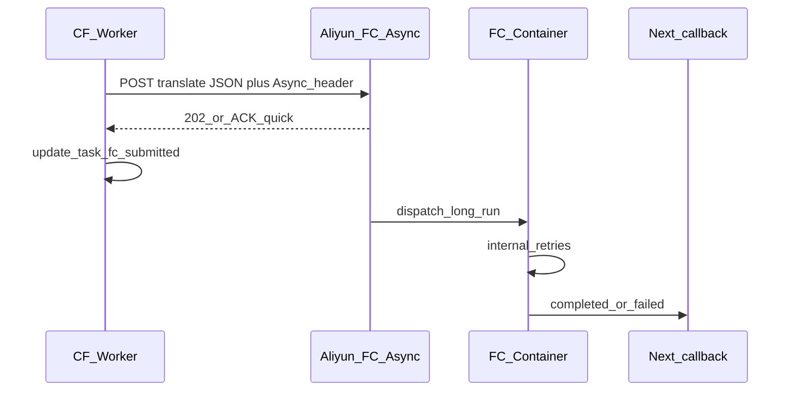

# FC 异步触发 + 内部重试 + 语言对齐

## 背景与根因

1. **`Invocation canceled by client`（约 27–31s）**  
   Cloudflare Worker 对 FC 的 **`fetch` 长连接**在子请求/调度策略下会被中止；FC 日志「Invoke End canceled」后仍可能出现 **延迟的 BabelDOC 日志**，多为 **断连后进程仍短暂继续**，容易造成「任务表象中断、日志不完整」的错觉。

2. **异步调用能力（阿里云）**  
   HTTP 触发 FC（含自定义容器/Web 模式）时可加请求头 **`X-Fc-Invocation-Type: Async`**：网关 **快速返回**，实例在平台侧 **排队执行**，无需调用方长时间占用连接（参见阿里云 FC Web 函数 / 异步调用文档）。注意：**异步请求体上限约 128KB**，当前 JSON（预签名 URL + 元数据）通常在范围内，需在实现里校验体量并在文档中写明。

3. **与你先前诉求的对齐**  
   - 「不在外面重试」→ 去掉/弱化 Next 侧 **`fetch` 挂起重试**（[`fcFetchHangRetryUsed`](d:\imppro\translatepdfonline\frontend\src\app\api\translate\invoke-fc.ts)、超时后再派发等）；429/503 等是否仍由 Cron 派发可作为可选收口（建议：**仅 FC 内重试**，Cron 只做「从未派发成功」的兜底一次派发，需单独定义）。  
   - 「问题及时返回调用方」→ **同步路径**仅承载：**校验失败 / Async 请求被拒 / 立即错误**；**翻译结果**一律 **`callback_url`**（已是主线）；异步 ACK 成功后 Next 写 **`fc_async_accepted`** 或沿用 **`fc_accepted`** 并明确语义为「已提交 FC，不等 HTTP 完成」。  
   - **Automatic term extractor JSON 报错**（`Expecting value line 1 column 1`）→ 属 LLM 返回非 JSON：应在 **FC 内**对「需 JSON 的步骤」做 **有限次重试 + 明确异常**，并最终 **`failed` 回调**。

---

## 架构调整（推荐）

---

## 实现任务

### 1. Next：异步触发 FC（[`invoke-fc.ts`](d:\imppro\translatepdfonline\frontend\src\app\api\translate\invoke-fc.ts)）

- 对 FC 的 `fetch` 增加请求头 **`X-Fc-Invocation-Type: Async`**（建议 **`TRANSLATE_FC_INVOCATION_TYPE=sync|async`** 环境变量，默认 **`async`** 生产，`sync` 便于本地调试）。
- **超时**：异步模式下 **`AbortSignal.timeout` 改为较短**（例如 **15–30s**），只等待 **网关 ACK**，避免误用 600s 长超时。
- **响应解析**：异步成功时 HTTP 体通常 **不含** `output_object_key`；**勿**按同步契约解析 JSON；在 **`res.ok`（或文档约定的 202）** 时更新 DB：`progress_stage`（如 `fc_async_submitted` 或与现有 `fc_accepted` 合并并在 [`translate-fc-contract.md`](d:\imppro\translatepdfonline\frontend\docs\translate-fc-contract.md) 写明语义）、清空 lease、`fc_next_attempt_at` 等。
- **移除/废弃**：基于 **`fetch` `catch` 的挂起重试**（[`fcFetchHangRetryUsed`](d:\imppro\translatepdfonline\frontend\docs\migrations\translation_tasks_fc_fetch_hang_retry.sql) 相关分支）；迁移文件可保留列但逻辑不再依赖，或后续单独 migration 删除（可选）。

### 2. Next：Cron [`dispatch-pending`](d:\imppro\translatepdfonline\frontend\src\app\api\translate\dispatch-pending\route.ts)

- 保留 **从未成功提交到 FC** 的任务（无 ACK / 网络错误）的 **有限次派发**或 **单次派发**（与产品确认）；**不再**承担「长时间等 FC 算完」的职责。
- [`reapStaleFcAcceptedTasks`](d:\imppro\translatepdfonline\frontend\src\app\api\translate\invoke-fc.ts) 仍适用于 **callback 未落地**；若 `fc_accepted` 语义改为「仅异步 ACK」，需在注释与文档中写清。

### 3. FC：内部重试与错误上报（[`babeldoc_fc/main.py`](d:\imppro\translatepdfonline\babeldoc_fc\main.py)）

- **下载 PDF / 上传 R2**：对瞬时网络错误 **有限次重试**（退避）。
- **`run_translate_local`**：对 **可判定为瞬时**的 LLM/API 错误 **包装重试**（可在 `run_translate.py` 外层 try/loop，避免大改 BabelDOC 内核）；对 **JSON 解析失败**（term extractor 等）同样 **重试或降级**（重试次数 env 可配置）。
- **回调**：延续 **`_notify_completed_callback_with_retry`**；失败则 **422** 或异步模式下平台是否会再投递——需查异步调用失败策略；至少保证 **`failed` 回调**尽力送达。
- **同步模式保留**：本地或调试仍可走同步完整响应（可选）。

### 4. 契约文档（[`translate-fc-contract.md`](d:\imppro\translatepdfonline\frontend\docs\translate-fc-contract.md)）

- 说明 **`X-Fc-Invocation-Type: Async`**、**128KB 限制**、**成功以 callback 为准**、Worker 端 **短超时**。
- 更新「Invocation canceled by client」：**首选 Async + 短 ACK 超时** 作为 CF 部署推荐配置。

### 5. 语言对齐（[`translate-langs.ts`](d:\imppro\translatepdfonline\frontend\src\shared\lib\translate-langs.ts) vs [`run_translate.py`](d:\imppro\translatepdfonline\babeldoc_fc\run_translate.py) `_normalize_lang` / `_target_lang_only_instruction`）

- UI 支持：**en, zh, es, fr, it, el, ja, ko, de, ru**。  
- FC 已将 **`zh` → `zh_cn`** 等归一化；**建议在 FC 入口增加显式 allowlist**（归一化后与 BabelDOC 一致），非法组合 **400 + 明确 detail**，避免静默走错模型配置。  
- 核对 **`el`（希腊语）** 等在 `_target_lang_only_instruction` 是否已有专门提示（已有 Greek 分支）；缺省 fallback 已有通用句。

### 6. 可选：阿里云侧配置

- 异步调用默认 **平台重试次数**（如 3 次）与 **死信**；按需在控制台调优，避免与 FC 内重试 **重复过多**。

---

## 风险与验证

- **幂等**：同一 `task_id` 异步被触发两次时，FC 应 **覆盖同一 `output_object_key`**；callback **扣费**仍依赖 [`callback/route.ts`](d:\imppro\translatepdfonline\frontend\src\app\api\translate\callback\route.ts) 幂等字段。  
- **验证**：Staging 对 FC 开 Async，Worker 日志应在 **秒级** 内收到 ACK；FC 完整跑完后 **仅有 callback** 置 `completed`；故意断开 Worker 不应再出现长时间 **`fetch` 挂起后 cancel**（若仅用 Async）。
