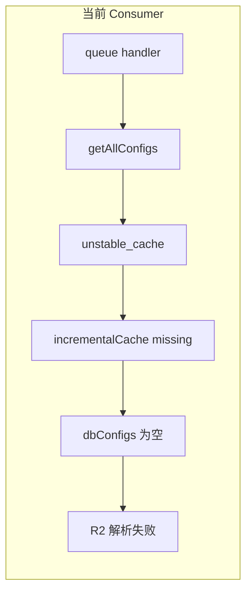

# Logo、History、OCR 工作台与 R2 报错修复计划

## 根因说明（问题 4）

- 日志 `Invariant: incrementalCache missing in unstable_cache` 来自 [`frontend/src/shared/models/config.ts`](frontend/src/shared/models/config.ts) 中的 `getConfigs`（`unstable_cache` 包装）。
- 独立队列 Worker（[`frontend/workers/ocr-pipeline-consumer/src/index.ts`](frontend/workers/ocr-pipeline-consumer/src/index.ts) + `runWithCloudflareEnv`）**不是** Next 请求生命周期，没有 incremental cache；`getAllConfigs()` 内调用 `getConfigs()` 抛错后被 catch，DB 配置为空。
- [`frontend/src/shared/lib/translate-r2.ts`](frontend/src/shared/lib/translate-r2.ts) 在 Worker 上会从配置解析 R2；**队列 Consumer** 与主 Worker 一致：**R2 仅以数据库 `r2_*` 字段为准**，不依赖、也不为 Consumer 单独配置 Worker 环境变量 `R2_*` 作为兜底。DB 读失败（如 `unstable_cache` 抛错）时配置为空，才会出现 **`R2 not configured`**（与主应用「能连库」不矛盾：主应用走 OpenNext fetch 路径，incremental cache 可用）。

**修复策略（代码）**

1. 在 [`config.ts`](frontend/src/shared/models/config.ts) 抽出与 `unstable_cache` 回调**相同**的纯函数，例如 `loadConfigsFromDatabase(): Promise<Configs>`（无 `unstable_cache`）。
2. `getConfigs` 仍用 `unstable_cache(loadConfigsFromDatabase, …)`，供常规 Next / OpenNext `fetch` 使用。
3. 在 `getAllConfigs` 中：若检测到「非 Next 缓存环境」（推荐 **`tryGetAlsCfEnv()` 来自 [`worker-runtime-env.ts`](frontend/src/shared/lib/worker-runtime-env.ts)**，与队列 Consumer 一致；可选再加 `catch` 到 `incrementalCache` 错误时 fallback），则 **直接** `await loadConfigsFromDatabase()`，不走 `unstable_cache`。
4. **R2 策略（Consumer）**：Consumer 与产品线约定一致，**全部依赖 DB 中的 `r2_*` 字段**；计划与部署手册中**不包含**「在 Consumer Worker 上另配 `R2_*` 环境变量」的兜底说明。若 DB 未写入完整 `r2_*`，应修后台/数据而非绕开。实现时若 `translate-r2` 在 Worker 上仍会合并 `process.env` 的 R2，可对 **`tryGetAlsCfEnv()` 有值**（队列 Consumer）的分支**仅**使用 DB 解析结果，避免 env 掩盖 DB 缺失。

---

## 问题 1：顶栏 Logo 未换

当前 [`TranslateShellHeader.tsx`](frontend/src/shared/components/translate/TranslateShellHeader.tsx) 使用「T」字 + `FileText` 图标，与已落地的 [`/brand/logo-t-pdf.jpeg`](frontend/public/brand/logo-t-pdf.jpeg) 不一致。

**改动**：品牌链 `Link` 内改为 `next/image`（或 `img`）引用与 [`frontend/src/config/index.ts`](frontend/src/config/index.ts) 中 `app_logo` 一致的公开路径（默认 `/brand/logo-t-pdf.jpeg`），保留可访问的 `alt`/`title`，移动端可隐藏右侧副标题以控高。

---

## 问题 2：upload 页 History 重复 + 顶栏 History 增强 + 弹窗重做

**现状**

- 顶栏 [`TranslateShellHeader`](frontend/src/shared/components/translate/TranslateShellHeader.tsx) 已有「History」链到 `/upload#translate-history`。
- [`UploadPageClient.tsx`](frontend/src/app/[locale]/(translate)/upload/UploadPageClient.tsx) 另有 sticky「History」按钮 + `Sheet`，与顶栏语义重复；Sheet 内还有硬编码中英文混排（「上传后请选择处理模式」/「History」/「已上传文档」）与样式不统一的按钮。

**目标**

- **去掉** upload 页内的 sticky History 与整段 Sheet（避免与顶栏重复）。
- 顶栏 **History**：改为打开**全局**历史抽屉（非 hash 跳转）；在文案旁增加小图标（使用已有资源：例如将 [`tmp/images/history.png`](tmp/images/history.png) 拷入 `frontend/public/brand/history-nav.png` 并用 `Image` 固定小尺寸，避免依赖外链）。
- **抽屉内容重做**（新组件，例如 `TranslateHistoryDrawer.tsx`，由 [`TranslateAppShell.tsx`](frontend/src/app/[locale]/(translate)/TranslateAppShell.tsx) 挂载）：
  - 全部文案走 `next-intl`（[`frontend/src/config/locale/messages/*/translate.*.json`](frontend/src/config/locale/messages) 新增 `translate.historyDrawer` 或扩展现有 `translate.shell`），消除语言混乱。
  - 分区清晰：**当前选中文档**（名称、大小、选中态）、**进行中的任务** / **最近任务**（按 OCR / Translate 分组或 Badge）、**已上传文档列表**；空状态单独文案。
  - 列表项：统一卡片样式（选中边框、次要信息 muted、时间/状态一行）；选中文档后在底部或固定区展示 **Translate** / **OCR** 两个主操作，样式对齐 [`translate-ui.ts`](frontend/src/config/translate-ui.ts) 主按钮与 outline 次按钮。
- **状态**：用轻量 React Context（如 `TranslateHistoryDrawerProvider`）提供 `openHistory()` / `closeHistory()`，`TranslateShellHeader` 与（可选）`useEffect` 监听 `location.hash === '#translate-history'` 时打开，以兼容旧链。

---

## 问题 3：ocrtranslator 页面信息架构与布局

**现状**（[`OcrTranslatePageClient.tsx`](frontend/src/app/[locale]/(translate)/ocrtranslator/OcrTranslatePageClient.tsx)）：左侧宽 `aside`（上传、说明、语言、开始、下载、History、进度）；右侧在 `preview` 与 `workbench` 间切换——`preview` 为双 PDF，`workbench` 为 [`OcrParseWorkbench`](frontend/src/shared/ocr-workbench/OcrParseWorkbench.tsx)（内部已是 PDF 条带 + Canvas + 底部工具栏）。

**目标（与用户描述对齐）**

- **主内容区**：以 translate 双栏为参考，**左栏固定为源 PDF**（沿用 `PdfViewerPane` + 现有分页/zoom）；**右栏为「可视化 JSON」**：对应当前页/当前解析结果展示 **格式化、可折叠的 JSON**（只读或可编辑视需求；首版只读 + 与页码联动即可），满足「源文件 + JSON 左右均分」。
- **工作台编辑**：将 [`OcrParseWorkbench`](frontend/src/shared/ocr-workbench/OcrParseWorkbench.tsx) 中的 **Canvas + `ParseResultEditorToolbar`（字体/对齐/列表等，已覆盖部分「格式样式」）** 放到主区**下方全宽**（或右栏下半与 JSON 上下分栏），避免与「左 PDF 右 JSON」抢同一高度；复杂块类型（表格/图片/公式）在现有 toolbar/inspector 基础上按 [`onlinepdftranslator` 的 `parse-result-workbench`/toolbar](file:///D:/imppro/onlinepdftranslator/src/shared/blocks/translator/parse-result-workbench.tsx) 的交互密度做**增量**补齐（优先复用本仓库 [`parse-result-editor-toolbar.tsx`](frontend/src/shared/ocr-workbench/parse-result-editor-toolbar.tsx) 的扩展点 `inspectorControls` / `extraFontControls`），避免整文件搬运。
- **左侧边栏**：保留必要控制（换文件、语言、开始任务、进度、下载、删除），**去掉**侧栏内 [`HistoryPanel`](frontend/src/shared/components/translate/HistoryPanel)（与全局 History 抽屉合并，避免再次重复）；压缩说明文案区块，按钮组用栅格/分组标题重新排版。
- **去掉**顶栏 `preview | workbench` 二选一切换（若主区已同时包含 PDF + JSON + 下方编辑区）；无解析结果前右栏显示占位说明。

实现时可能需将「JSON 字符串状态」从 `OcrParseWorkbench` 提升到 `OcrTranslatePageClient` 或通过 **callback/ref** 暴露当前页 `doc` 的序列化视图，以便右栏独立渲染（减少重复 fetch）。

---

## 问题 4：实施顺序建议

1. **先修 `config.ts` 缓存分支**（解除 Consumer 读库与 R2 配置）— 可单独验证队列任务不再报 `R2 not configured`（在 DB 已配 `r2_*` 的前提下）。
2. **顶栏 Logo + History 全局抽屉 + 清理 upload 页**。
3. **ocrtranslator 布局重构**（改动面大，依赖前两步稳定导航与历史入口）。

---

## 测试建议

- 本地：`pnpm run dev`，验证顶栏 History 抽屉在 `/upload`、`/translate`、`/ocrtranslator` 均可打开且文案随语言切换。
- 部署 develop 后：对 OCR 任务触发队列 Consumer，确认日志无 `incrementalCache missing`，且 OCR 流水线可读到 DB 中 R2 配置并完成 presign。
