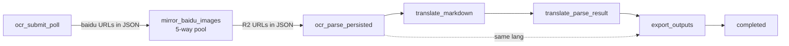

# OCR ParseResult 图片镜像到 R2

## 1. 现状

- [`runOcrAndPersistParse`](frontend/src/shared/lib/ocr-translate.ts) 把百度返回的 ParseResult JSON **原样** `putObject` 到 `translations/{taskId}/ocr-parse-result.json`，里面 `pages[].images[].data_url` 等字段保留了 `xmind-parser.bj.bcebos.com` 的 30 天签名地址。
- 镜像辅助函数 [`rewriteExternalImagesToR2`](frontend/src/shared/lib/ocr-parse-result-image-proxy.ts) **只在** Workbench PATCH 保存路径里被调用（[`api/tasks/[taskId]/parse-result/route.ts`](frontend/src/app/api/tasks/[taskId]/parse-result/route.ts) 第 108–113 行），不在 OCR 流水线写入路径上。
- 因此 Workbench 的导出 / 快照（[`parse-result-image-data.ts`](frontend/src/shared/ocr-workbench/parse-result-image-data.ts) 的 `shouldUseProxyFirst` 跨域判断）落到 [`api/proxy/file`](frontend/src/app/api/proxy/file/route.ts) 走同源代理；签名过期后整体失败。

## 2. 期望流向（修复后，新增独立队列阶段）

`mirror_baidu_images` 是新加的 OCR pipeline 阶段：

- 由 queue 单独投递与重试（沿用 `enqueueNextStage` 与现有阶段的失败/重入语义）
- 阶段内 `runPool` 控制下载并发（默认 5，`OCR_IMAGE_MIRROR_CONCURRENCY` 可调，clamp [1,16]）
- 单阶段 wall-clock 走自身预算 `OCR_IMAGE_MIRROR_STAGE_TIMEOUT_MS`（默认 8 分钟，单图 fetch 内部已有 90s 超时）
- 失败容忍：单批中 >50% 图片下载失败抛错触发 retry；否则记录 `failed` 计数继续，把已镜像部分的 URL 改写后写回 R2
- 进度百分比插入：`ocr_submit_poll=20 → mirror_baidu_images=35 → ocr_parse_persisted=45`

## 3. 修改清单

### 3.1 扩展 rewriter 支持内联 URL & 重试 & 并发参数化

[`frontend/src/shared/lib/ocr-parse-result-image-proxy.ts`](frontend/src/shared/lib/ocr-parse-result-image-proxy.ts)：

- 现有 `replaceStringsInPlace` 仅做整字段精确替换；需要新增对**字符串内嵌 URL** 的处理，覆盖百度可能塞进 `tables[].markdown` / `layouts[].text` 的 `` / ``：
  - 新增 `INLINE_BAIDU_URL_RE = /https?:\/\/[^\s)\]"'<>]+(?:baidubce\.com|bcebos\.com|bdstatic\.com)[^\s)\]"'<>]*/gi`
  - 新增 `collectInlineUrls(obj, out)`（递归 + 正则 `match`），加到现有 `collectUrls`/`collectDataUrls` 旁
  - 新增 `replaceInlineUrlsInPlace(obj, map)`：对每个 string 字段做 `value.replace(INLINE_BAIDU_URL_RE, m => map.get(m) ?? m)`
  - 调用顺序：`collectUrls` + `collectInlineUrls` + `collectDataUrls` → 上传 → `replaceStringsInPlace`（精确字段）+ `replaceInlineUrlsInPlace`（内联）
- **单图下载重试（最多 3 次）**：
  - 在 fetch 闭包外抽出 `fetchImageWithRetry(url, { maxRetries=3, perAttemptTimeoutMs=90_000 })`，**逐次** `fetch(url, { signal: AbortSignal.timeout(perAttemptTimeoutMs) })`，仅对以下情形重试（attempt < maxRetries）：
    - 抛错（网络 / DNS / `AbortError` 超时 / TLS 等）
    - HTTP 状态 ∈ `[408, 425, 429, 500, 502, 503, 504]`
  - **不重试（fast-fail，计入 failed）**：状态 401 / 403 / 404 / 410（百度签名过期 / 对象删除，重试无意义；浪费阶段预算）
  - 退避：`backoffMs(attempt) = min(4000, 300 * 2^attempt) + Math.random() * 200`（attempt 从 1 起），respect 上层 `AbortSignal`
  - 日志：每次失败 `console.warn('[ocr/parse_image_mirror] retry', { url_host, attempt, max_retries, status, error_name, backoff_ms })`，最终失败 `console.warn('[ocr/parse_image_mirror] give_up', { url_host, attempts, last_status })`
  - URL 在日志里**只打 host**，避免泄漏百度签名 querystring
  - env：`OCR_IMAGE_MIRROR_MAX_RETRIES`（默认 3，clamp [0,5]）、`OCR_IMAGE_MIRROR_FETCH_TIMEOUT_MS`（默认 90_000）
- `maxConcurrent` 默认值：保持调用方传入；`runOcrAndPersistParse` 调用方默认 5，调用方/脚本可覆盖。
- `r2ObjectExists` 已存在，相同哈希不会重复上传；data URL 路径只做 base64 解码，不参与重试逻辑。
- 返回结构扩展为 `{ replaced: number; failed: number; total: number }`（其中 `failed` 仅记录"重试 3 次仍失败"或被 fast-fail 的 URL），便于阶段做「失败比例」判断。

### 3.2 OCR pipeline 新增独立阶段 `mirror_baidu_images`（队列处理）

[`frontend/src/shared/lib/ocr-queue.ts`](frontend/src/shared/lib/ocr-queue.ts)：

- 类型扩展 `OcrStage`：在 `'ocr_submit_poll'` 与 `'ocr_parse_persisted'` 之间插入 `'mirror_baidu_images'`。
- `normalizeStage` / `stagePercent` 同步：`ocr_submit_poll=20`、`mirror_baidu_images=35`、`ocr_parse_persisted=45`、其余不变。
- `runOneStage` 改造：
  - `ocr_submit_poll` 完成后返回 `'mirror_baidu_images'`（不再返回 `'ocr_parse_persisted'`）。
  - 新增 case `mirror_baidu_images`：从 R2 读 `keys.outputParseResultObjectKey` → `JSON.parse` → 调 `rewriteExternalImagesToR2({ json, taskId, maxConcurrent: OCR_IMAGE_MIRROR_CONCURRENCY })` → `putObject` 写回；返回 `'ocr_parse_persisted'`。
  - 用 `withStageTimeout('mirror_baidu_images', fn, OCR_IMAGE_MIRROR_STAGE_TIMEOUT_MS)` 包裹（默认 480_000ms = 8min；阶段内单图 fetch 已有 `AbortSignal.timeout(90s)`）。
  - 日志：`console.log('[ocr/stage] start', { stage:'mirror_baidu_images', concurrency, timeout_ms })`、`console.log('[ocr/parse_image_mirror] done', { task_id, replaced, failed, total, elapsed_ms })`。
- 失败策略：
  - `rewriteExternalImagesToR2` 整体抛错 → 阶段失败、走现有 retry / `enqueueNextStage` 重投。
  - 其内 `failed > 0` 但 `failed / total <= 0.5` → 视为成功（部分图片可能已过期签名），写回部分改写后的 JSON、日志 `mirror_partial=true`。
  - `failed / total > 0.5` → 抛错重试整阶段。
- env：
  - `OCR_IMAGE_MIRROR_CONCURRENCY`（默认 5，clamp [1,16]）
  - `OCR_IMAGE_MIRROR_STAGE_TIMEOUT_MS`（默认 480_000）
  - `OCR_IMAGE_MIRROR_FAIL_RATIO_MAX`（默认 0.5）

[`frontend/src/shared/lib/ocr-translate.ts`](frontend/src/shared/lib/ocr-translate.ts)：

- `runOcrAndPersistParse` **不再做镜像**，保持当前职责：写原始 source JSON + markdown。无需改入参。
- 新增导出 `mirrorBaiduImagesIntoParseResult(taskId, parseResultKey, opts)`（如果偏好把 R2 读写细节封装在 ocr-translate.ts 而非 ocr-queue.ts，可放这里；ocr-queue.ts 仅调用）。
- `runOcrTranslatePipeline` 不变（这条单进程路径不归 queue，改造后该函数若仍想保留「全流程」语义，可在 OCR 写完后直接调用 `mirrorBaiduImagesIntoParseResult`，与 queue 阶段共享实现）。

### 3.3 GET 路径不动

[`api/tasks/[taskId]/parse-result/route.ts`](frontend/src/app/api/tasks/[taskId]/parse-result/route.ts) 维持不变 —— 新任务在 R2 里就是干净的 R2 URL，老任务由 §3.4 的脚本一次性处理后亦如此，无需读时副作用。

### 3.4 一次性管理脚本（旧任务批量修复）

新建 [`frontend/scripts/ocr-mirror-baidu-images.ts`](frontend/scripts/ocr-mirror-baidu-images.ts)：

- 入口 `npx tsx scripts/with-env.ts npx tsx scripts/ocr-mirror-baidu-images.ts`，参数：
  - `--task=<id>`（单任务）
  - `--task-file=<path>`（一行一个 taskId）
  - `--all-recent=<N>`（默认 200，按 `created_at desc` 拉 OCR 任务）
  - `--concurrency=<N>`（每个 task 内部下载并发，默认 5；脚本同时只处理 1 个 task，避免与 consumer 抢配额）
  - `--dry-run`（只扫描不写）
- 行为：
  1. 选定 task 列表（DB 查 `translationTasks` 过滤 `preprocess_with_ocr=true`）
  2. 对每个 task：尝试读 `ocrParseResultSourceKey(taskId)` 与 `ocrParseResultTargetKey(taskId)`
  3. 解析 JSON → `rewriteExternalImagesToR2({ json, taskId, maxConcurrent })` → `putObject` 写回（dry-run 跳过写）
  4. 日志 `[ocr/mirror-script] task=... replaced=... failed=... total=... elapsed_ms=...`
  5. 一个 task 失败不影响其它，最后输出 summary
- 失败容忍：百度签名已经过期的图片下载会 4xx/5xx；脚本只把这些计入 `failed`，不抛错；该 task 的图片仍指向旧外链（无法挽救），但 R2 里至少其它仍有效图片已迁移。
- 文档头注明：脚本依赖 `R2_*` 与 `DATABASE_URL` 等 env，与 `with-env.ts` 配合使用，参考 `init-rbac.ts` 模式。

### 3.5 部署手册补充

[`.cursor/plans/translatepdfonline_cloudflare_双项目部署手册.md`](.cursor/plans/translatepdfonline_cloudflare_双项目部署手册.md) §5.3 / §5.x：

- 一段说明：OCR pipeline 新增独立阶段 `mirror_baidu_images`，在 `ocr_submit_poll` 之后异步并发（默认 5）下载百度图片到 `translations/{taskId}/assets/`，并改写 source JSON 为 R2 URL；该阶段失败可独立重试，不会污染已落库的 source JSON。
- env：`OCR_IMAGE_MIRROR_CONCURRENCY` / `OCR_IMAGE_MIRROR_STAGE_TIMEOUT_MS` / `OCR_IMAGE_MIRROR_FAIL_RATIO_MAX`。
- 旧任务一次性脚本用法示例。

## 4. 不动的部分

- `/api/proxy/file` 路由本身（仍是无鉴权开放代理，建议另起 PR 加白名单 + auth；本次专注 JSON 改写）。
- 计费、queue 路由、阶段切分、`parse-result-target.json` 写出逻辑（target 在 source 已改写后做 `structuredClone`，会自动继承 R2 URL）。
- Workbench `` 与 `parse-result-image-data.ts` 的 `shouldUseProxyFirst` 兜底逻辑（修复后命中不到 baidu URL，自然不会触发）。

## 5. 验收

- 新跑一份多页 PDF 的 OCR 任务：
  - consumer 日志按顺序看到 `[ocr/stage] start stage=ocr_submit_poll` → `done` → `start stage=mirror_baidu_images concurrency=5 max_retries=3` → `[ocr/parse_image_mirror] done { replaced, failed, total, elapsed_ms }` → `start stage=ocr_parse_persisted`
  - R2 下 `translations/{taskId}/assets/` 有 N 个图片对象
  - `translations/{taskId}/ocr-parse-result.json` 中所有 `data_url` 与 markdown 内嵌 URL 均为 `${NEXT_PUBLIC_R2_PUBLIC_URL}/translations/...`
  - DB 任务进度按 20 → 35 → 45 推进
- 重试验证（开发环境 mock）：
  - 在拦截层让某 URL 第一次返回 503，第二次 200 → 日志看到一条 `retry attempt=1 status=503` + 最终 `replaced` 计入；不计入 `failed`
  - 让某 URL 永远返回 503 → 日志 `retry attempt=1..2`、最终 `give_up attempts=3`，计入 `failed`
  - 让某 URL 返回 403 → 不重试，直接计入 `failed`
- 故障注入：把 mirror 阶段（rewriter 抛错）mock 一次 → consumer 自动重试该阶段、`ocr_submit_poll` 不重跑、source JSON 不会被部分覆盖
- Workbench 打开同任务：DevTools Network 中无 `/api/proxy/file?url=...bcebos...` 请求，导出 HTML / 快照功能正常
- 跑 `scripts/ocr-mirror-baidu-images.ts --task=<旧 taskId> --concurrency=5`：日志 OK，再打开旧任务也走 R2
