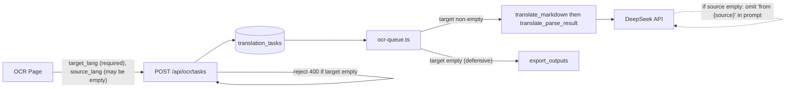

## 背景与症结

当前任务 `task=9uVc8JKu0KuKuqdnlKHXX`（中文 PDF, target=en）跳过翻译，根因有两处：

1. [frontend/src/shared/lib/ocr-lang.ts](frontend/src/shared/lib/ocr-lang.ts) `languagesNeedTranslation(src, tgt)` 在 canonical(src)===canonical(tgt) 时返回 `false`，被 `ocr-queue.ts`、`ocr-export-queue.ts`、`ocr-parse-result-r2-keys.ts` 三处共用，直接让 `translate_markdown` / `translate_parse_result` 阶段被跳过。
2. 前端 [OcrTranslatePageClient.tsx:815](frontend/src/app/[locale]/(translate)/ocrtranslator/OcrTranslatePageClient.tsx) 在用户没主动选 source 时把 source 默认成 `'en'`；后端 [api/ocr/tasks/route.ts:36](frontend/src/app/api/ocr/tasks/route.ts) 还有 `targetLang = rawTargetLang || sourceLang` 兜底把语义彻底磨平。

按你的决策（`gate_and_source_default` + `remove_fallback`）：闸口改成"target_lang 非空就翻译"；前端 source 默认改空；API 严格化；DeepSeek prompt 在 source 为空时省略 source 描述。

## 数据流变更



## 文件改动

### 1. 闸口改成 target-only —— [frontend/src/shared/lib/ocr-lang.ts](frontend/src/shared/lib/ocr-lang.ts)

把 `languagesNeedTranslation` 的判定从"两端 canonical 不等"改为"target 非空"。三个 OCR 调用点（`ocr-queue.ts` 第 252 行、`ocr-parse-result-r2-keys.ts` 第 19/35 行、`ocr-export-queue.ts` 第 447/673 行）无需改名，行为自动随之更新。

```ts
export function languagesNeedTranslation(_sourceLang: string, targetLang: string): boolean {
  return Boolean(canonicalLangCode(targetLang));
}
```

`canonicalLangCode` 已经在 source 为 `''` 时返回 `''`，所以"未选 source"不会触发空串误判；规则变成：**只要用户选了 target 就走翻译**。

### 2. API 严格化 —— [frontend/src/app/api/ocr/tasks/route.ts](frontend/src/app/api/ocr/tasks/route.ts) 第 30–50 行

- 去掉第 36 行的 `targetLang = rawTargetLang || sourceLang` 兜底。
- target 缺失/不支持 → 返回 400 `target_lang required` / `Unsupported target_lang`，与前端按钮 `disabled` 行为一致，让"未选 target"在后端可识别。
- 允许 source 为空：第 30 行从 `String(body.source_lang || 'en')` 改成 `String(body.source_lang || '').trim().toLowerCase()`；第 40 行的 `isSupportedUiLang(sourceLang)` 校验改成"source 非空时才校验"。
- 第 235 行 `sourceLang` 写库时按空串落库（`source_lang text NOT NULL`，空串合法）。

### 3. 前端 source 默认改空 —— [OcrTranslatePageClient.tsx](frontend/src/app/[locale]/(translate)/ocrtranslator/OcrTranslatePageClient.tsx)

第 815 行 `const effectiveSource = sourceLang || 'en';` 改成 `const effectiveSource = sourceLang || '';`，并允许空 source 通过 `translateApi.createOcrTask`。开始按钮的 `!targetLang` 守卫保留（target 仍是必选）。

第 816 行的 `effectiveTarget = targetLang || 'zh'` 兜底是死代码（按钮已 disable），顺便去掉，跟 API 严格化一致。

### 4. DeepSeek prompt 在 source 为空时省略 source —— [frontend/src/shared/lib/ocr-translate.ts](frontend/src/shared/lib/ocr-translate.ts)

两处 prompt 都需要在 `sourceLang` 为空时切换到"无 source"分支；同一任务内 source 是固定的（要么有要么没有），prompt 仍是 batch 间稳定的，DeepSeek prompt cache 不破坏。

- `translateMarkdownWithDeepSeek` 第 377–383 行：

```ts
const fromClause = params.sourceLang ? `from ${params.sourceLang} ` : '';
const prompt = [
  `Translate the following markdown ${fromClause}to ${params.targetLang}.`,
  'Keep markdown structure, formulas, URLs, and code blocks unchanged.',
  'Return translated markdown only.',
  '',
  params.markdown,
].join('\n');
```

- `translateStringListWithDeepSeek` 第 543–547 行：

```ts
const fromClause = sourceLang ? `from ${sourceLang} ` : '';
const systemPrompt = [
  `Translate each string in the JSON array sent by the user ${fromClause}to ${targetLang}.`,
  'Preserve markdown/HTML/LaTeX tags, numbers, URLs, and code. Do not add explanations.',
  "Return ONLY a JSON array of strings whose length equals the input array's length, in the same order.",
].join('\n');
```

### 5. translate → OCR 跳转保留 target_lang

页内的 in-page CTA（`TranslatePageClient.tsx` 第 1294 / 1433 / 1496 行）和 `TranslationForm.handleGoOcr`（[TranslationForm.tsx:233-244](frontend/src/shared/components/translate/TranslationForm.tsx)）已经通过 `buildOcrWorkbenchSearch` / 局部 `URLSearchParams` 把 target_lang 带过去。剩两个入口没带：

#### 5.1 顶栏 OCR 链接 —— [TranslateShellHeader.tsx:99-109](frontend/src/shared/components/translate/TranslateShellHeader.tsx)

把写死的 `href="/ocrtranslator"` 改为读当前 URL 的 `target_lang`（在 /translate 上由 [TranslatePageClient.tsx:324](frontend/src/app/[locale]/(translate)/translate/TranslatePageClient.tsx) 写入）：

```tsx
import { useSearchParams } from 'next/navigation';
// ...
const searchParams = useSearchParams();
const ocrHref = useMemo(() => {
  const t = searchParams?.get('target_lang')?.trim();
  return t ? `/ocrtranslator?target_lang=${encodeURIComponent(t)}` : '/ocrtranslator';
}, [searchParams]);
// <Link href={ocrHref} ...>
```

行为：
- 在 /translate 上选了 target → 跳 /ocrtranslator 时带 target_lang。
- 在其它页面（/upload、/pricing 等）URL 上无 target_lang → 跳转保持原样无参数（与现状一致）。
- 在 /ocrtranslator 上点击 → 同样自带，等价于无操作。

#### 5.2 历史抽屉的"用 OCR 翻译"按钮 —— [TranslateHistoryDrawerPanel.tsx:141-145](frontend/src/shared/components/translate/TranslateHistoryDrawerPanel.tsx)

```tsx
const searchParams = useSearchParams();
const goOcr = useCallback(() => {
  if (!selectedDocumentId) return;
  const qs = new URLSearchParams({ document: selectedDocumentId });
  const t = searchParams?.get('target_lang')?.trim();
  if (t) qs.set('target_lang', t);
  router.push(`/ocrtranslator?${qs.toString()}`);
  onOpenChange(false);
}, [router, selectedDocumentId, searchParams, onOpenChange]);
```

注：
- `handleSelectTask`（点选历史任务）push 的是 `?task=...`，OCR 页加载该 task 后会从 DB 读回 `target_lang`（[OcrTranslatePageClient.tsx:417-418](frontend/src/app/[locale]/(translate)/ocrtranslator/OcrTranslatePageClient.tsx)），无需在 URL 中再带 target_lang。
- 只改 OCR 方向（`goOcr`），`goTranslate` 不在本次范围。

### 6. 兼容老任务

- 现有任务若 `source_lang === target_lang` 之前是被跳过的：retry 时按新规则会进入翻译；正常重跑即可。
- `getOcrParseResultBodyForRead` 在 `target_lang` 非空但 `*-target.json` 还未生成时已有 fallback 到 source key 的逻辑，行为继续成立。

## 不在本次范围

- `babeldoc_fc` 路径（PDF 翻译）：`languagesNeedTranslation` 的当前调用全部在 OCR 路径，PDF 路径不消费这个函数，无影响。
- DB schema 不动；老任务无需迁移。
- source 自动检测（如读取 OCR 结果首页文本判断中/英）属于体验增强，本次仅让 source 缺失时仍能正常翻译。