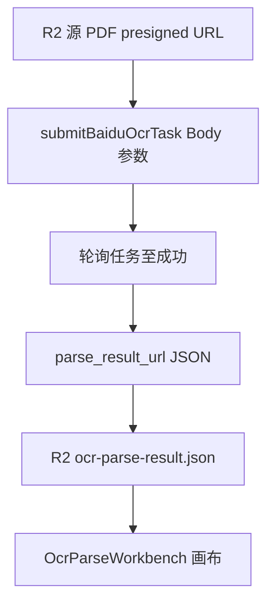
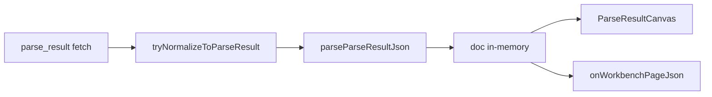

# OCR Workbench：请求参数、parse_result 契约与展示梳理

## 0. 端到端链路（总览）

| 阶段 | 代码入口 | 说明 |
|------|-----------|------|
| 提交 OCR | [`ocr-translate.ts`](d:/imppro/translatepdfonline/frontend/src/shared/lib/ocr-translate.ts) `submitBaiduOcrTask` | `application/x-www-form-urlencoded` Body |
| 落库 / 队列 | [`ocr-queue.ts`](d:/imppro/translatepdfonline/frontend/src/shared/lib/ocr-queue.ts) `ocr_submit_poll` | 轮询后写入 R2 |
| Workbench 拉取 | [`OcrParseWorkbench.tsx`](d:/imppro/translatepdfonline/frontend/src/shared/ocr-workbench/OcrParseWorkbench.tsx) | `fetch(/api/tasks/:id/parse-result)` → 归一化 → 画布 |
| 翻译写回 | [`ocr-parse-result-target-translate.ts`](d:/imppro/translatepdfonline/frontend/src/shared/lib/ocr-parse-result-target-translate.ts) | 改文本槽位，不改几何 |

---

## 1. 百度 OCR 提交：Body 请求参数

> 说明：参数放在 **HTTP Body**（表单），非 Query。`file_data` 与 `file_url` 二选一，`file_data` 优先。

### 1.1 参数表（接口说明）

| 参数 | 必选 | 类型 | 说明 |
|------|------|------|------|
| `file_data` | 与 `file_url` 二选一 | string | 文件 base64。版式：pdf/jpg/jpeg/png/bmp/tif/tiff/ofd（图最长边 ≤4096px）；流式：doc/docx/txt/wps/ppt/pptx。图 ≤10M，版式 ≤100M，流式 ≤50M；PDF ≤500 页。>50M 须用 `file_url` |
| `file_url` | 与 `file_data` 二选一 | string | 文件 URL，≤1024 字节；PDF ≤100M、≤500 页。须关闭防盗链 |
| `file_name` | **是** | string | 文件名（后缀须正确，如 `1.pdf`） |
| `recognize_formula` | 否 | bool | 无需开启，大模型默认识别版式文档公式 |
| `analysis_chart` | 否 | bool | 是否解析统计图表 |
| `parse_image_layout` | 否 | bool | 无需开启，大模型默认解析文档内图片 |
| `language_type` | 否 | string | 无需开启，大模型默认识别语种 |
| `merge_tables` | 否 | bool | 跨页表格合并；`tables[].merge_table` 为 begin/end；合并内容在 table_html / markdown |
| `relevel_titles` | 否 | bool | **段落标题分级**：对 `paragraph_title` 在 `layouts[].sub_type` 输出标题级别 |
| `recognize_seal` | 否 | bool | 是否识别印章 |
| `return_span_boxes` | 否 | bool | **返回行坐标**：`layouts[].span_boxes[]` 含 `text`、`location` |

### 1.2 当前实现（[`submitBaiduOcrTask`](d:/imppro/translatepdfonline/frontend/src/shared/lib/ocr-translate.ts)）

| 参数 | 当前值 | 备注 |
|------|--------|------|
| `file_url` | R2 presigned URL | 与产品上传路径一致 |
| `file_name` | 文档名或 `document.pdf` | 已传 |
| `parse_image_layout` | `'true'` | 显式开启（接口称默认可不开） |
| `merge_tables` | `'true'` | 已开，Workbench 读 `tables[].merge_table` |
| **`relevel_titles`** | **未传** | **导致 `sub_type` 常为空，标题层级无法在 UI 体现** |
| **`return_span_boxes`** | **未传** | **导致无 `span_boxes` 或为空，行级 `location` 无法用于排版/调试** |
| `analysis_chart` | 未传 | 图表类 `image_description` 可能偏弱 |
| `recognize_seal` | 未传 | `type: seal` 块依赖上游是否仍返回 |

### 1.3 产品要求与实现缺口（必须补齐）

| 需求 | 提交侧 | 响应侧 | Workbench 侧 |
|------|--------|--------|----------------|
| 段落标题分级 | `relevel_titles=true` | `layouts[].type=paragraph_title` 且 **`sub_type` 有级别** | 画布/属性面板展示 `sub_type`；导出 HTML 可选标题标签语义 |
| 行坐标 | `return_span_boxes=true` | `layouts[].span_boxes[].text` + **`location`** | 当前仅 Zod 保留、翻译遍历 `text[]`；**画布不用 `location` 排版** → 细粒度行距/竖线仍可能“丢” |

**建议（实现阶段）**：在 `submitBaiduOcrTask` 的 `URLSearchParams` 中增加 `relevel_titles: 'true'`、`return_span_boxes: 'true'`；大文件继续仅用 `file_url`（已满足）。

---

## 2. parse_result_url：响应 JSON 契约

> Workbench 通过同源 API 读取与 `parse_result_url` 同结构的 JSON（落 R2 后由 [`/api/tasks/:taskId/parse-result`](d:/imppro/translatepdfonline/frontend/src/app/api/tasks) 提供）。下列为**上游契约**；内存中经 [`parseParseResultJson`](d:/imppro/translatepdfonline/frontend/src/shared/ocr-workbench/translator-parse-result.ts) 归一化。

### 2.1 文档根

| 字段 | 类型 | 说明 |
|------|------|------|
| `file_name` | string | 文档名称 |
| `file_id` | string | 文档 ID |
| `pages` | list | 单页解析列表（非空） |

### 2.2 `pages[]` 单页

| 字段 | 类型 | 说明 | Workbench 消费 |
|------|------|------|----------------|
| `page_id` | string | 页码 ID | 保留，画布未单独展示 |
| `page_num` | int | 页码 | 翻页、导出 |
| `text` | string | **整页纯文本** | 翻译写回；**画布不渲染** |
| `layouts` | list | 版式块列表 | **画布主数据源**（见下） |
| `tables` | list | 表格 | `type=table` 时读 `markdown` |
| `images` | list | 图片 | `type=image` / chart 等对齐 `layout_id` + `data_url` |
| `meta` | dict | 页元信息 | `page_width` / `page_height` 定画布比例 |

### 2.3 `pages[].layouts[]`

| 字段 | 类型 | 说明 | Workbench 消费 |
|------|------|------|----------------|
| `layout_id` | string | 全局唯一，形如 `xxxxx-layout-{global_layout_index}` | 排序、选中、关联 tables/images |
| `text` | string | 块文本；**table/image 类型常为空**，内容在 tables/images | 文本槽 Markdown/HTML 渲染 |
| `position` | list | `[x, y, w, h]` 轴对齐框 | **唯一用于绝对定位** |
| `polygon` | list | 顶点围合多边形 | Schema 保留；**画布未绘制** |
| `span_boxes` | list | **需 `return_span_boxes=true`** | 见下表；翻译改 `text[]`；**画布未用 `location`** |
| `type` | string | 版式类型（见 2.5） | 分支：table / image / 文本 |
| `sub_type` | string | **需 `relevel_titles=true`**，标题级别 | Schema 保留；**UI 未展示** |

#### `span_boxes[]` 子项（`return_span_boxes` 开启后）

| 字段 | 类型 | 说明 |
|------|------|------|
| `text` | list | 行内文本片段 |
| `location` | list | **行坐标** |

### 2.4 `pages[].tables[]`

| 字段 | 类型 | 说明 | Workbench 消费 |
|------|------|------|----------------|
| `layout_id` | string | 对应 `layouts` 中 `type=table` | `findTableForLayout` |
| `markdown` | string | 表格 Markdown | 表格块渲染 |
| `position` | list | `[x, y, w, h]` | 可与 layout 同步更新 |
| `cells` | list | 单元格嵌套版面 | 翻译遍历 cell `text` |
| `matrix` | list | 二维索引 → cells | 未在画布单独可视化 |
| `merge_table` | string | **需 `merge_tables=true`**：跨页 `begin` / `end` | 数据保留，UI 无专门标识 |

### 2.5 `pages[].images[]`

| 字段 | 类型 | 说明 | Workbench 消费 |
|------|------|------|----------------|
| `layout_id` | string | 对应 `layouts` 中 image/chart 等 | `findImageForLayout` |
| `position` | list | `[x, y, w, h]` | 与 layout 联动 |
| `data_url` | string | 图片链接 | ``；镜像阶段可改写到 R2 |
| `image_description` | string | 图表描述 JSON 字符串 | **未在画布展示**（可 `analysis_chart` 增强） |

### 2.6 `pages[].meta`

| 字段 | 类型 | 说明 |
|------|------|------|
| `page_width` | int | 页宽（坐标系） |
| `page_height` | int | 页高 |

### 2.7 `layouts[].type` 枚举（接口取值）

`abstract` · `algorithm` · `aside_text` · `chart` · `content` · `display_formula` · `doc_title` · `figure_title` · `footer` · `footer_image` · `footnote` · `formula_number` · `header` · `header_image` · `image` · `inline_formula` · `number` · **`paragraph_title`** · `reference` · `reference_content` · `seal` · `table` · `text` · **`vertical_text`**

| 类型族 | 画布行为摘要 |
|--------|----------------|
| `table` | 读 `tables[].markdown` |
| `image` / `header_image` / `footer_image` / `chart`（有 `data_url`） | 图片槽 |
| `paragraph_title` | 文本槽；**应配合 `sub_type` 显示级别（待 UI）** |
| `vertical_text` | 文本槽但 **无竖排 CSS** |
| `footer` / `header` / `text` | 文本槽；装饰线若仅 `polygon` 则不可见 |

---

## 3. Workbench 内部数据流（展示层）

| 环节 | 文件 | 说明 |
|------|------|------|
| 拉取 | [`OcrParseWorkbench.tsx`](d:/imppro/translatepdfonline/frontend/src/shared/ocr-workbench/OcrParseWorkbench.tsx) | `fetch(parseResultUrl)` |
| 归一化 | [`normalize-ocr-parse-json.ts`](d:/imppro/translatepdfonline/frontend/src/shared/ocr-workbench/normalize-ocr-parse-json.ts) | 兼容包装字段 |
| 校验 | [`translator-parse-result.ts`](d:/imppro/translatepdfonline/frontend/src/shared/ocr-workbench/translator-parse-result.ts) | Zod；见第 4 节形变 |
| 画布 | [`parse-result-canvas.tsx`](d:/imppro/translatepdfonline/frontend/src/shared/ocr-workbench/parse-result-canvas.tsx) | 仅 `position` 矩形 + `text`/表/图 |
| 外传 JSON | `JSON.stringify(doc.pages[i])` | **归一化后的页对象**，非原始 HTTP 体 |

---

## 4. “细节丢失”根因（请求 + 响应 + 展示）

### 4.1 上游未请求 → 响应本无字段

| 现象 | 根因 |
|------|------|
| 无标题级别 | 未传 **`relevel_titles`** → `sub_type` 空 |
| 无行级坐标 | 未传 **`return_span_boxes`** → `span_boxes` 缺失或空 |

### 4.2 有字段但画布未消费

| 字段 | 根因 |
|------|------|
| `polygon` | 无 SVG/路径层 |
| `span_boxes[].location` | 未参与排版（仅 `layout.text`） |
| `page.text` | 不渲染 |
| `sub_type` | 未展示（即使开启 relevel_titles） |
| 空 `text` + 薄 `position` / 仅 `polygon` | 页眉页脚横线等装饰不可见 |
| `vertical_text` | 无 `writing-mode` |
| `image_description` | 未展示 |

### 4.3 Zod 归一化形变

- 无效 **`position`** → 默认 `[0, 0, 100, 24]`，块堆在左上角。
- 非数组 **`polygon`** → `[]`。
- 非数组 **`span_boxes`** → `[]`。

### 4.4 JSON 预览“少字段”

侧栏/调试 JSON 来自 **内存 `doc.pages[i]`**，含上述 preprocess 结果，不等于百度原始 `parse_result_url` 下载体。

---

## 5. 改进方向（按依赖顺序）

### Phase A — 提交参数（阻塞 relevel / span）

1. [`ocr-translate.ts`](d:/imppro/translatepdfonline/frontend/src/shared/lib/ocr-translate.ts)：`relevel_titles=true`、`return_span_boxes=true`。
2. 可选：`analysis_chart`、`recognize_seal` 按产品开关配置化（env）。
3. **仅对新提交任务生效**；历史 R2 JSON 需重跑 OCR 才有新字段。

### Phase B — 契约文档与观测

4. `doc/technical`：本计划第 1–2 节表格入库，维护「参数 → 响应 → UI」矩阵。
5. Workbench：原始 JSON 下载 vs normalized 单页对比。

### Phase C — 展示消费新字段

6. **`sub_type`**：`paragraph_title` 显示级别徽章 / 导出标题层级。
7. **`span_boxes`**：调试 overlay 或辅助排版（`location` + `text[]`）。
8. **`polygon`** / 极细 box：SVG 叠加、线段渲染。
9. **`vertical_text`**：竖排 CSS。
10. **`page.text`**：侧栏只读或缺失提示。

### Phase D — Zod

11. 无效 `position` 不静默默认框；跳过绘制 + warn。

---

## 6. 验收场景

| 场景 | 预期 |
|------|------|
| 新任务提交 | Body 含 `relevel_titles`、`return_span_boxes` |
| 下载 parse_result | `paragraph_title` 带 `sub_type`；layout 含非空 `span_boxes` 与 `location` |
| Workbench | 标题见级别；可选行框 overlay；页眉线/竖排/polygon 按 Phase C 逐步可见 |
| 重跑前旧任务 | 仍无 span/sub_type（符合“仅新任务”） |
