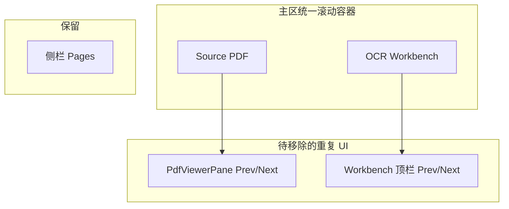

# OCR：去重翻页 + 统一滚动下画布铺满

## 约束（本次不改）

- **JSON focus / Source focus**：保持现有 `activeFocusPanel`、`onClick` 设焦点、侧栏 Pages 对 `currentPage` / `jsonPage` 的分支逻辑；**不**为删 UI 而合并或改写焦点状态机。
- **点击文件后翻页**：用户先点击 Source 或 Workbench 区域获得对应焦点后，仍用侧栏 Pages（及既有 handler）对**当前焦点**下的 PDF/解析页翻页；无需新增「必须点文件才能翻」的门槛，仅保证删主区内重复控件后该链路不被破坏。

## 背景与根因

- **重复翻页**：侧栏 Pages 已负责翻页与缩放；主区内仍有两处：
  - Source：[OcrTranslatePageClient.tsx](d:/imppro/translatepdfonline/frontend/src/app/[locale]/(translate)/ocrtranslator/OcrTranslatePageClient.tsx) 内 `OcrSourcePdfPanel` 对 [PdfViewerPane](d:/imppro/translatepdfonline/frontend/src/shared/components/translate/PdfViewerPane.tsx) 传了 `showPageControls`（约第 170 行附近）。
  - Workbench：[OcrParseWorkbench.tsx](d:/imppro/translatepdfonline/frontend/src/shared/ocr-workbench/OcrParseWorkbench.tsx) 中 **`showTopPageControls` 恒为 `true`**（约 1036–1040 行），在 `hideSourcePanel` + 左侧 portal 工具栏场景下仍会渲染顶栏「Prev / Next / Page」块（与注释「否则只能在侧栏找」的历史假设冲突；你已明确要删）。
- **画布偏小**：[parse-result-canvas.tsx](d:/imppro/translatepdfonline/frontend/src/shared/ocr-workbench/parse-result-canvas.tsx) 在 `scrollContainerMode === 'parent'` 时，根节点使用固定 **`min-h-[min(60dvh,420px)]`**（约 755–757 行）。`fitScale` 用 `clientWidth`/`clientHeight` 做 cover（约 683–727 行）；**高度被人工压扁**时，cover 会按较小维度缩放，导致「纸面」在列宽方向**铺不满**可视化区。
- **画布上方提示**：[`OcrParseWorkbench.tsx`](d:/imppro/translatepdfonline/frontend/src/shared/ocr-workbench/OcrParseWorkbench.tsx) 在 `!selectedLayoutId` 时渲染 `t('selectBlockHint')`（约 1265–1268 行），英文见 [`ocrWorkbench.json`](d:/imppro/translatepdfonline/frontend/src/config/locale/messages/en/translate/ocrWorkbench.json) 的 `selectBlockHint`。与侧栏精简目标一致，在 **OCR 并排 + portal** 场景下不再展示该段（实现可与「隐藏顶栏翻页」同一条件：`hideSourcePanel && externalToolbarContainerId`）；若产品希望其它入口仍保留提示，可仅在该条件隐藏。

## 实现方案

### 1. 去掉 Source 内翻页控件

- 在 [OcrTranslatePageClient.tsx](d:/imppro/translatepdfonline/frontend/src/app/[locale]/(translate)/ocrtranslator/OcrTranslatePageClient.tsx) 的 `OcrSourcePdfPanel` 中，对 `PdfViewerPane` 将 **`showPageControls` 改为 `false`**（或仅在 `unifiedMainScroll` 为 true 时关闭，与当前 OCR 双栏行为一致）。
- 可选：若希望「非 unified 布局」仍保留（当前仅 OCR 使用该 panel），保留 prop 分支即可。

### 2. 去掉 Workbench 顶栏翻页（保留其它顶栏逻辑若仍需要）

- 在 [OcrParseWorkbench.tsx](d:/imppro/translatepdfonline/frontend/src/shared/ocr-workbench/OcrParseWorkbench.tsx) 将 `showTopPageControls` 从常量 `true` 改为条件，例如：
  - **`false`** 当 `hideSourcePanel && externalToolbarContainerId`（与当前 OCR 页：侧栏 Pages + portal 工具栏一致）；**否则**保持 `true`，避免其它入口（无侧栏翻页、无 portal）失去顶栏翻页。
- `showWorkbenchTopBar` 仍为 `showTopPageControls || showTopFileActions`：OCR portal 场景下 `showTopFileActions` 已为 `false`，顶栏整块可隐藏；若加载/错误态仍依赖 `showWorkbenchTopBar` 包一层布局，需确认 `renderStatusWithToolbar` 在顶栏隐藏时是否仍美观（必要时仅对 **success 主内容** 隐藏顶栏，loading/error 保留极简条或保持现状）。

### 3. 去掉「选中文本块…」提示（与第 2 点同一 OCR 场景）

- 在 [OcrParseWorkbench.tsx](d:/imppro/translatepdfonline/frontend/src/shared/ocr-workbench/OcrParseWorkbench.tsx) 中，对 `{!selectedLayoutId ? ( 
…selectBlockHint…
 ) : null}`：**当 `hideSourcePanel && externalToolbarContainerId` 时不渲染**（整块不显示）；其它用法可保留原提示以免无侧栏时失引导。
- 无需删各 locale JSON 中的 `selectBlockHint` 键（避免未引用键的清理范围扩大）；若整站都不再使用该文案可后续单独删键。

### 4. 修复 `parent` 滚动模式下画布「占满列宽」

- 在 [parse-result-canvas.tsx](d:/imppro/translatepdfonline/frontend/src/shared/ocr-workbench/parse-result-canvas.tsx) 的 `scrollContainerMode === 'parent'` 分支：
  - **去掉** `min-h-[min(60dvh,420px)]` 这类与列宽脱钩的固定最小高。
  - 改为 **`w-full`** + 用 **`aspect-ratio: renderBox.w / renderBox.h`**（与 `renderBox` 同步）让容器在列宽确定后**自动得到与纸张一致的高度**，使 `ResizeObserver` / `clientHeight` 与列宽一致，`fitScale` 的 cover 行为以**列宽为主**铺满可视列。
  - 保留 `overflow-visible`，避免嵌套滚动条。
- 复核 `useLayoutEffect` 中 `sync` 与 `scrollContainerMode` 依赖（已有 `scrollContainerMode` 在依赖数组中则无需改）。
- 在浏览器中验证：`canvasScalePercent` 滑块仍改变缩放；导出/Moveable 不受影响。

### 5. 验证清单

- OCR 页：主区仅**一条**纵向滚动条；Source / Workbench 内**无** Prev/Next/Page 1/1；**无**「Select a text block…」/ `selectBlockHint` 提示条；侧栏 Pages 仍可用。
- 点击 Source / Workbench 切换焦点后，侧栏翻页与缩放仍作用于**对应** PDF 与 JSON 页（与现网一致）。
- 画布：在典型视口下**横向铺满** workbench 列（允许纵向略超出由外层滚动承接）。
- 非 OCR 或 `hideSourcePanel=false` 的 `OcrParseWorkbench` 用法：顶栏翻页与画布 `panel` 模式行为**不变**（回归）。
