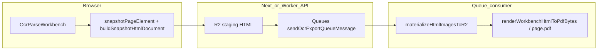

# OCR 导出 PDF 与队列加固

## 现状（代码已确认）

- **Workbench → 导出**：[`OcrParseWorkbench.tsx`](frontend/src/shared/ocr-workbench/OcrParseWorkbench.tsx) 在 `pdf`/`html` 时调用 `collectWorkbenchSnapshotHtml()`（逐页 `flushSync` 换页 → `snapshotPageElement` → [`buildSnapshotHtmlDocument`](frontend/src/shared/ocr-workbench/parse-result-export-snapshot.ts)），经 API 把 **整份 HTML** 写入 R2 staging（[`exports/route.ts`](frontend/src/app/api/ocr/tasks/[taskId]/exports/route.ts) `exportStagingHtmlKey`）。
- **队列 → PDF**：[`processOcrTaskExport`](frontend/src/shared/lib/ocr-export-queue.ts) 对 `pdf` 分支：`getObjectBody(staging)` → `materializeHtmlImagesToR2` → [`renderWorkbenchHtmlToPdfBytes`](frontend/src/shared/lib/ocr-export-html-to-pdf-worker.ts)（Browser Rendering + [`htmlToPdfBytesCloudflareWithDiagnostics`](frontend/src/shared/lib/ocr-export-pdf-cloudflare.ts)）。
- **与「快照 HTML」强相关、但不在快照文件内的差异点**：[`ocr-export-pdf-cloudflare.ts`](frontend/src/shared/lib/ocr-export-pdf-cloudflare.ts) 中 `page.pdf({ printBackground: true, preferCSSPageSize: true, margin: { top/bottom/left/right: '8mm' } })`。快照文档 [`buildSnapshotHtmlDocument`](frontend/src/shared/ocr-workbench/parse-result-export-snapshot.ts) 使用 `@page { margin: 0; size: A4 ... }` 与 `@media print` 下的 `--print-scale`。**额外 8mm 页边距**会改变可排版区域与缩放感知，是最符合「HTML 没问题、PDF 与可视化不一致」且**不动 `parse-result-export-snapshot.ts` 核心快照逻辑**的修复入口。
- **队列**：导出已通过 [`sendOcrExportQueueMessage`](frontend/src/shared/lib/ocr-queue.ts) 投递；消费者 [`handleOcrPipelineQueueBatch`](frontend/src/shared/lib/ocr-queue.ts) 对 `ocr_export_generate` 调用 `processOcrTaskExport`。当前 [`wrangler.consumer.jsonc`](frontend/wrangler.consumer.jsonc) / [`wrangler.consumer.develop.jsonc`](frontend/wrangler.consumer.develop.jsonc) 为 **同一队列** `translatepdfonline`，且 **`max_batch_size: 5`**：一批里可能叠多条消息，**串行**执行时总耗时可叠加，易触发 Worker/队列可见性/超时类问题（大文件 + 多导出叠加时更明显）。

## 建议实现（分两部分）

### A. PDF 与「当前 JSON 可视化 / 已下载 HTML」对齐（优先改 PDF 渲染层）

1. **对齐 `page.pdf()` 与快照 `@page`**（主改动在 [`ocr-export-pdf-cloudflare.ts`](frontend/src/shared/lib/ocr-export-pdf-cloudflare.ts)，不碰 `snapshotPageElement` / 采集循环）  
   - 将 `margin` 改为与快照 CSS 一致（通常为 **全 0**），避免在 `preferCSSPageSize: true` 下与 `@page{margin:0}` 双重约束冲突。  
   - 可选：`page.emulateMediaType('print')` 再 `pdf()`（若实测默认已等价可省略）。  
   - 保持 `printBackground: true`；`waitUntil` 可评估从 `domcontentloaded` 升到 `networkidle0` 或保留现状 + 已有 `images complete` / `fonts.ready`（避免无意义拉长小任务）。

2. **验收方式**（避免盲改）  
   - 同一任务：下载 **staging 归一化后的 HTML**（或与线上 `ocr-output.html` 同源流程）与 **PDF** 对比；确认差异是否随 margin 消除而消失。  
   - 若仍有差异，再记录：是否仅字体子集/CJK（与快照内联样式有关，仍可不先动快照采集）。

### B. 大文件导出与队列稳定性

1. **消费者批处理**  
   - 将 OCR 队列 consumer 的 **`max_batch_size` 从 5 改为 1**（`wrangler.consumer.jsonc` 与 develop 变体同步），与代码注释「长任务建议 batch=1」一致，避免多条 `ocr_export_generate` 在同一次 invocation 里排队拉长总时间。  
   - `max_batch_timeout` 可保留或略调；若 Cloudflare 支持为 consumer 配置 **visibility / acknowledgment** 相关参数，对照官方文档与当前 `processOcrTaskExport` 最坏耗时（Browser + 大图 materialize）核对是否需显式加大。

2. **超时与可观测性（按需）**  
   - [`OCR_EXPORT_STAGE_TIMEOUT_MS`](frontend/src/shared/lib/ocr-export-queue.ts) 已通过环境变量可调：大文件可在部署层提高；代码侧可对 **staging 字节数 / 图片数量** 打日志（已有部分 `console.log`），便于区分「队列重投」与「单阶段超时」。  
   - 若仍出现队列重试导致重复处理：检查 `claimExportForProcessing` 幂等与失败行状态，必要时在 consumer 入口对 **processing 超时** 做与 [`OCR_EXPORT_STALE_PROCESSING_MS`](frontend/src/app/api/ocr/tasks/[taskId]/exports/route.ts) 一致的重拾策略（仅当诊断确认需要时再改）。

3. **「导出必须走队列」**  
   - 当前 POST 已在 staging 上传后 `sendOcrExportQueueMessage`；若某些环境 `binding_unavailable` 会 503（[`exports/route.ts`](frontend/src/app/api/ocr/tasks/[taskId]/exports/route.ts)）。计划里可补充：**生产强制绑定队列**；本地无绑定时是否允许同步 `processOcrTaskExport` 为可选（仅 dev，需你方产品决策，默认不建议分叉逻辑）。

## 明确不优先做的（除非你后续要求）

- 重写 [`parse-result-export-snapshot.ts`](frontend/src/shared/ocr-workbench/parse-result-export-snapshot.ts) 的克隆/样式内联算法（你要求不轻易动快照逻辑）。  
- 将单任务 PDF 拆成「每页一条队列再合并」：工程量大，仅在 A +B 仍不足时作为阶段二。
