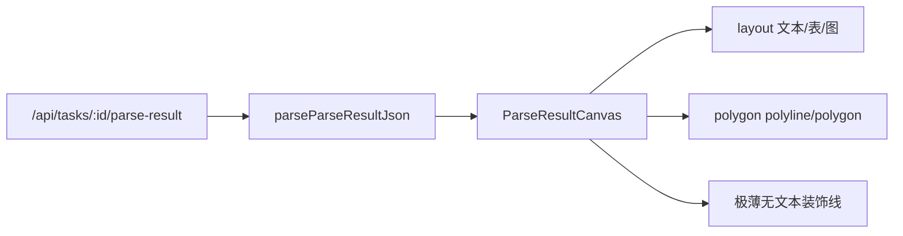

# OCR Workbench Phase B–D 展示收敛

## 目标（与当前实现的差异）

| 能力 | 当前 | 调整后 |
|------|------|--------|
| `polygon` 横/竖线 | File 区「Polygon overlay」开关 + 蓝色 SVG | **始终**按 `layouts[].polygon` 绘制，无开关 |
| `span_boxes` | File 区「Line boxes」+ 绿色虚线 | **不绘制**（你已选：仅版面还原，不做行级调试框） |
| 极薄无文本 layout | `LayoutDecorativeStroke` 灰色细线 | **保留** |
| `pages[].text` | 画布上方展开/收起 | **整块删除** |
| 原始 JSON 下载 | File 区按钮 + `rawParseJsonRef` | **删除**（侧栏仍展示当前页归一化 JSON，不变） |

保留不动：`sub_type` 角标、`vertical_text`、`无效 position` 跳过、百度 `relevel_titles` / `return_span_boxes` 提交参数（后端仍可带 `span_boxes` 供翻译遍历，只是画布不用）。

---

## 数据流（收敛后）

---

## 1. 删除 Workbench UI 与状态

文件：[`frontend/src/shared/ocr-workbench/OcrParseWorkbench.tsx`](d:/imppro/translatepdfonline/frontend/src/shared/ocr-workbench/OcrParseWorkbench.tsx)

**移除 state / ref / callback：**

- `showPolygonOverlay`、`showSpanBoxesOverlay`、`pageTextExpanded`
- `rawParseJsonRef`、`hasRawParseJson`、`downloadRawParseJson`
- 拉取 parse-result 时对 `raw` 的 `JSON.stringify` 仅存 ref 的逻辑（约 L247–253）

**`fileControls` 精简：**

- 删除两个 checkbox（`overlayPolygon` / `overlaySpanBoxes`）和「Download raw parse JSON」按钮
- 保留 Undo / Redo / Save 及原有导出相关按钮

**画布区域：**

- 删除 L1556–1571 整块 `page?.text` 展开/收起 UI
- `ParseResultCanvas` 调用处去掉 `showPolygonOverlay` / `showSpanBoxesOverlay` props

**`useMemo` 依赖数组：** 同步去掉已删 state/callback 的引用（约 L1241–1252）。

---

## 2. 画布：polygon 常开 + 去掉 span 叠加

### [`parse-result-canvas.tsx`](d:/imppro/translatepdfonline/frontend/src/shared/ocr-workbench/parse-result-canvas.tsx)

- 从 `Props` 删除 `showPolygonOverlay?`、`showSpanBoxesOverlay?` 及默认值
- 始终渲染 `<ParseResultCanvasOverlays page={...} />`（无开关 props）

### [`parse-result-canvas-overlays.tsx`](d:/imppro/translatepdfonline/frontend/src/shared/ocr-workbench/parse-result-canvas-overlays.tsx)

- 删除 `showPolygonOverlay` / `showSpanBoxesOverlay` props 及早期 `return null` 守卫
- **删除** 全部 `span_boxes` → `<rect>` 绿色虚线逻辑（可一并移除 `parseSpanBoxLocationRect` 的 import，若文件内无其它引用）
- **polygon 样式**：由调试蓝 `rgba(59,130,246,...)` 改为与装饰线一致的中性色，例如与 [`LayoutDecorativeStroke`](d:/imppro/translatepdfonline/frontend/src/shared/ocr-workbench/parse-result-canvas-overlays.tsx) 对齐的 `stroke: rgba(113,113,122,0.75)`（或 `currentColor` + `text-zinc-500`），`fill: none`，`strokeWidth: 1`
- 行为不变：`parsePolygonPoints` → 3+ 点 `<polygon>`，2 点 `<polyline>`，坐标经 `toRenderRect` 映射

`parse-result-geometry.ts` 中的 `parseSpanBoxLocationRect` **可保留**（翻译/后续排版可能仍用），仅 overlays 不再引用。

---

## 3. 文档与 i18n（小改）

### [`doc/technical/ocr-workbench-parse-result.md`](d:/imppro/translatepdfonline/doc/technical/ocr-workbench-parse-result.md)

更新「响应字段与 Workbench 消费」表：

- `polygon` → 画布默认绘制几何线/框（非工具栏开关）
- `span_boxes` → 数据保留，**画布不绘制**
- 删除 `pages[].text` 行与「下载原始 JSON」描述
- 侧栏仅说明「当前页归一化 JSON」

### i18n（可选但建议）

从 10 个 [`ocrWorkbench.json`](d:/imppro/translatepdfonline/frontend/src/config/locale/messages) 删除未使用键：

`overlayPolygon`、`overlaySpanBoxes`、`downloadRawParseJson`、`parseJsonRawUnavailable`、`pageTextExpand`、`pageTextCollapse`

---

## 4. 验证

- `cd frontend && pnpm exec tsc --noEmit`
- 手动：打开含 `polygon` 与极薄 header/footer layout 的 OCR 任务 → 画布应直接见灰线/多边形，File 区无 overlay/checkbox/raw 下载、无 page text 条
- 侧栏 JSON 与编辑/保存流程不受影响

---

## 不在本次范围

- 用 `span_boxes.location` 做行内文字排版（你明确不画框；排版属后续大改）
- 修改侧栏归一化 JSON 展示逻辑
- 回滚百度提交参数或 Zod/`sub_type`/`vertical_text` 等已落地项
