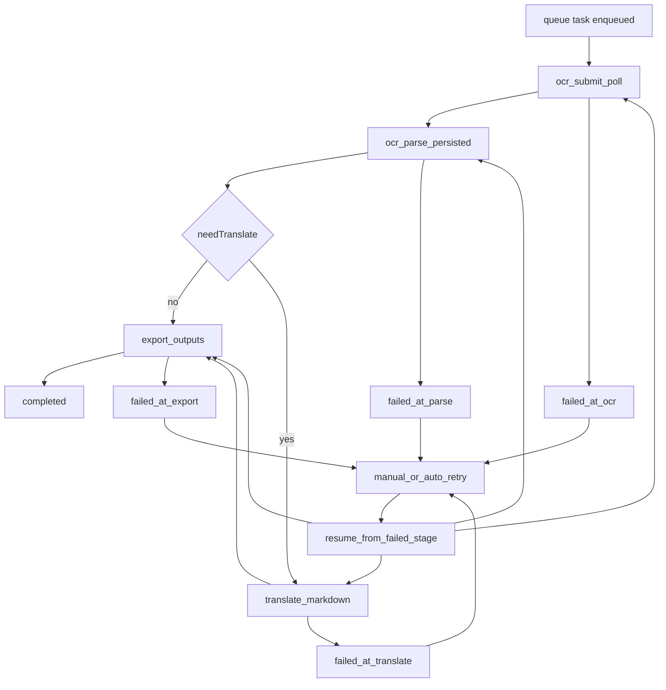

# OCR 任务拆分生产化计划

## 目标与约束

- 按 `onlinepdftranslator` 思路拆分流程，避免单次 queue 任务执行过长导致 `exceededCpu`。
- 分支规则：
  - `targetLang` 为空，或 `sourceLang === targetLang`：走 **OCR落盘 + 导出**（不翻译）。
  - `sourceLang !== targetLang`：走 **OCR落盘 + 翻译 + 导出**。
- 保持现有 API 对前端契约稳定（任务状态、下载链接字段不破坏）。
- 失败后必须支持**断点重试**：不回到起点，按失败阶段继续执行。

## 设计方案（状态机 + 阶段队列）

- 在任务表中沿用/扩展 `progressStage`、`status`、`fcDispatchAttemptCount`、`fcNextAttemptAt`，把当前 `runOcrTranslatePipeline()` 的串行步骤改为“单阶段执行后再入队下一阶段”。
- 增加阶段运行记录字段（可在 `translation_tasks` 扩展，或新增阶段日志表）用于前端重试按钮判断：\n  - `currentStage` / `lastFailedStage`\n  - `stageAttemptCount`（按阶段）\n  - `stageErrorCode` / `stageErrorMessage`\n  - `retryable`（是否允许人工重试）
- 推荐阶段：
  - `ocr_submit_poll`
  - `ocr_parse_persisted`
  - `translate_markdown`（可跳过）
  - `export_outputs`
  - `completed`

## 代码改造点

- 重构 [`frontend/src/shared/lib/ocr-queue.ts`](D:/imppro/translatepdfonline/frontend/src/shared/lib/ocr-queue.ts)
  - 将 `invokeOcrPipelineForTask()` 改为“读取当前阶段 -> 只执行一步 -> 更新阶段 -> 重新入队”。
  - 保留 lease/退避重试逻辑，但重试粒度从“整条流水线”改为“单阶段”。
  - 增加阶段级错误日志（含 `task_id`、`stage`、`attempt`、`elapsed_ms`）。
  - 失败时写入 `lastFailedStage` 与 `retryable=true`，并保持已完成阶段结果可复用（不回滚）。

- 拆分 [`frontend/src/shared/lib/ocr-translate.ts`](D:/imppro/translatepdfonline/frontend/src/shared/lib/ocr-translate.ts)
  - 从 `runOcrTranslatePipeline()` 拆出可独立调用的函数：
    - `runOcrAndPersistParse()`：完成 Baidu 轮询并将 parse_result 落 R2。
    - `translateMarkdownWithDeepSeek()`：保留现有实现，单独阶段调用。
    - `exportMarkdownToPdfAndMd()`：将 Markdown 导出 PDF/MD（含现有 render 限流）。
  - 保留兼容包装函数（供旧调用点），内部转调新分段函数。

- 更新任务阶段判断（同文件或队列层）
  - `needTranslate = targetLang && sourceLang !== targetLang`。
  - `!needTranslate` 时，`translatedMarkdown = markdown`，直接进入导出阶段。

- 新增重试 API（建议） [`frontend/src/app/api/ocr/tasks/[taskId]/retry/route.ts`](D:/imppro/translatepdfonline/frontend/src/app/api/ocr/tasks/[taskId]/retry/route.ts)
  - 仅允许 `status=failed` 且 `retryable=true` 的任务调用。
  - 行为：把任务状态改为 `queued`，`progressStage` 设为 `lastFailedStage`，清理本阶段错误并重新入队。
  - 保证“从失败点继续”，禁止重置为 `ocr_submit_created`（除非显式 `force_restart`）。

- 前端重试入口（建议） [`frontend/src/app/[locale]/(translate)/ocrtranslator/OcrTranslatePageClient.tsx`](D:/imppro/translatepdfonline/frontend/src/app/[locale]/(translate)/ocrtranslator/OcrTranslatePageClient.tsx)
  - 当任务 `failed` 且 `retryable=true` 时展示“继续重试”按钮。
  - 按钮文案附带失败阶段（如 `Retry from translate_markdown` / `从翻译阶段继续`）。
  - 点击调用 retry API，前端状态切回排队/处理中，继续轮询。

- 队列配置与运行时（保持稳态）
  - 继续使用 [`frontend/wrangler.consumer.develop.jsonc`](D:/imppro/translatepdfonline/frontend/wrangler.consumer.develop.jsonc) / [`frontend/wrangler.consumer.jsonc`](D:/imppro/translatepdfonline/frontend/wrangler.consumer.jsonc) 的 `max_batch_size=1` 与较高 `cpu_ms`；新架构下单阶段执行更短，进一步降低超时概率。

## 可观测性与恢复

- 阶段日志规范化：`[ocr/stage] start|done|retry|failed`，统一 JSON 字段。
- 对“已完成阶段”的幂等处理：若重复消费，检测已有产物（R2 key/DB 字段）后直接推进下一阶段，避免重复调用外部 API。
- 对外部失败（Baidu/DeepSeek/R2）保留指数退避，并记录阶段级 `errorCode`。
- 自动重试耗尽后，任务停在具体失败阶段（`lastFailedStage`），等待人工触发“继续重试”。
- 人工重试只重跑当前失败阶段及其后续阶段，前置成功阶段不重复执行。

## 验证计划

- 用例 A：`source!=target`，验证阶段依次走到翻译与导出，最终 `completed` 且 PDF/MD 可下载。
- 用例 B：`source==target`，验证跳过翻译阶段，直接导出。
- 用例 C：`target` 为空，验证允许创建任务并走“仅 OCR + 导出”。
- 用例 D：人为注入失败（例如临时无 DeepSeek key），验证重试只发生在对应阶段且任务可恢复。
- 用例 E：任务失败后通过前端“继续重试”按钮恢复，确认从 `lastFailedStage` 继续而不是从头开始。
- 回归：前端历史列表、任务详情与下载接口保持可用。