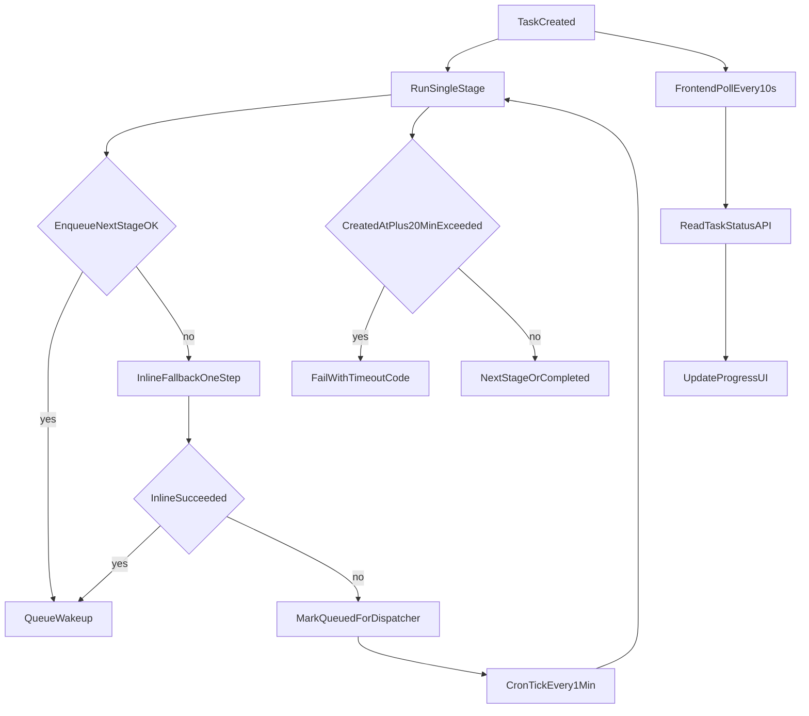

# OCR修复补充执行计划

## 目标与约束

- 修正 `ocrtranslator` 的交互偏差：`Hist & Log` 改为左侧抽屉，不再跳转页面；`File` 按你的要求删除。
- 对齐 `onlinepdftranslator` 的工作台操作语义：左侧操作分组 + 工作台工具栏可操作入口清晰。
- 修复 `upload` 的入口与布局重复问题：去掉重复 `Pricing`、按钮与语言选择收敛到上传区域。
- 修复首页 Hero 与 CTA 的信息层级：将关键按钮并排到同一行，减少冗余文案与重复区块。
- 队列按生产标准重设：降低 cron 等待感知，补齐 20 分钟总任务超时失败策略，解决内存/CPU 超限风险。

## 一、OCR Translator 交互修正（先做）

- 在 [D:/imppro/translatepdfonline/frontend/src/app/[locale]/(translate)/ocrtranslator/OcrTranslatePageClient.tsx](D:/imppro/translatepdfonline/frontend/src/app/[locale]/(translate)/ocrtranslator/OcrTranslatePageClient.tsx)：
  - 删除 `File` 按钮与对应入口文案。
  - 将 `Hist & Log` 从 `router.push('/upload#translate-history')` 改为本页 `Sheet`（左侧抽屉）打开。
  - `Home` 按钮改为跳转 `/`；`Upload` 保持跳转 `/upload`。
  - 将当前硬编码中英混杂文案（如 `Text edit`/中文说明）替换为统一 i18n key。
- 参考在线项目抽屉结构，将 `Hist & Log` 拆成两个区块：
  - 任务历史列表（状态、时间、可选重开/重试）。
  - 脱敏运行日志（只显示阶段、耗时、错误摘要，不显示后端路径/内部对象键）。
- 复用 `Sheet` 组件模式（与 [D:/imppro/onlinepdftranslator/src/shared/blocks/translator/translator-upload-page.tsx](D:/imppro/onlinepdftranslator/src/shared/blocks/translator/translator-upload-page.tsx) 一致）。

## 二、Text edit / Font settings 可操作入口修复

- 在 [D:/imppro/translatepdfonline/frontend/src/shared/ocr-workbench/OcrParseWorkbench.tsx](D:/imppro/translatepdfonline/frontend/src/shared/ocr-workbench/OcrParseWorkbench.tsx)：
  - 保留 `ParseResultEditorToolbar` 作为真实操作入口。
  - 增加可见锚点与“定位到工具栏”触发能力（避免仅文字说明）。
- 在 [D:/imppro/translatepdfonline/frontend/src/app/[locale]/(translate)/ocrtranslator/OcrTranslatePageClient.tsx](D:/imppro/translatepdfonline/frontend/src/app/[locale]/(translate)/ocrtranslator/OcrTranslatePageClient.tsx)：
  - 将纯说明块改为按钮化入口（`Text edit`、`Font settings`）并绑定到工作台工具栏区域。
  - 保证按钮、提示、错误动作全部走 i18n。
- 文案落地到：
  - [D:/imppro/translatepdfonline/frontend/src/config/locale/messages/zh/translate/ocrWorkbench.json](D:/imppro/translatepdfonline/frontend/src/config/locale/messages/zh/translate/ocrWorkbench.json)
  - [D:/imppro/translatepdfonline/frontend/src/config/locale/messages/en/translate/ocrWorkbench.json](D:/imppro/translatepdfonline/frontend/src/config/locale/messages/en/translate/ocrWorkbench.json)

## 三、Upload 页面结构重排

- 在 [D:/imppro/translatepdfonline/frontend/src/app/[locale]/(translate)/upload/UploadPageClient.tsx](D:/imppro/translatepdfonline/frontend/src/app/[locale]/(translate)/upload/UploadPageClient.tsx)：
  - 去掉页首下方重复的一行 `PDF Translate / PDF OCR / Pricing`（保留页首并排入口）。
  - 去掉页面内重复 `Pricing` 入口。
  - 删除重复文件名展示（保留上传框中的文件信息卡即可）。
  - 删除并替换上传后冗余区块文案（如“上传完成后，选择下一步 / 请先上传文档…”等重复提示），统一为简洁且单语种的一组 CTA 提示。
  - 上传后 CTA 改为与页面主语种一致，不混用中英。
- 在 [D:/imppro/translatepdfonline/frontend/src/shared/components/translate/TranslateLandingSections.tsx](D:/imppro/translatepdfonline/frontend/src/shared/components/translate/TranslateLandingSections.tsx)：
  - 把路径按钮区（`PDF Translate`/`PDF OCR`）与 `Source Language`/`Target Language` 下沉到上传区域同一组布局。
  - 采用与 online 参考一致的“上传+设置同区域”结构，减少跳读。

## 三点五、首页 Hero 与 CTA 重设计

- 在 [D:/imppro/translatepdfonline/frontend/src/shared/components/translate/TranslateLandingSections.tsx](D:/imppro/translatepdfonline/frontend/src/shared/components/translate/TranslateLandingSections.tsx)：
  - 重排首页顶部内容层级：`Get Started`、`Read Documentation`、`Open OCR Translator`、`Special launch pricing for early users` 放在同一行（响应式下允许换行但同组展示）。
  - 将 “Scanned or image-heavy PDF?” 提示与说明文案与 CTA 同一视觉组，避免分散到多段重复区域。
  - 保留核心说明（BabelDOC + OCR Translator 差异），但压缩为一段，去掉重复解释。
- 在 [D:/imppro/translatepdfonline/frontend/src/config/locale/messages/zh/translate/home.json](D:/imppro/translatepdfonline/frontend/src/config/locale/messages/zh/translate/home.json) 与 [D:/imppro/translatepdfonline/frontend/src/config/locale/messages/en/translate/home.json](D:/imppro/translatepdfonline/frontend/src/config/locale/messages/en/translate/home.json)：
  - 新增/替换对应首页 CTA 文案 key，确保不出现中英混杂与重复语义。

## 四、队列生产化重构（内存/超时/等待体验）

- 在 [D:/imppro/translatepdfonline/frontend/src/shared/lib/ocr-queue.ts](D:/imppro/translatepdfonline/frontend/src/shared/lib/ocr-queue.ts)：
  - 增加总任务超时判定：`now - task.createdAt > 20min` 即标记 `failed`（`error_code=ocr_task_timeout_20m`），并返回可重试。
  - `dispatchPendingOcrJobs` 增加硬上限与入口统一（避免单次 cron 扫太多任务）。
  - 保留 `enqueue_failed -> fallback_dispatcher`，并补 `fallback_inline`（仅 1 步、受 guard 控制）以减少 cron 依赖等待。
- 在 [D:/imppro/translatepdfonline/frontend/src/app/[locale]/(translate)/ocrtranslator/OcrTranslatePageClient.tsx](D:/imppro/translatepdfonline/frontend/src/app/[locale]/(translate)/ocrtranslator/OcrTranslatePageClient.tsx)：
  - 将任务状态轮询改为**前端每 10 秒请求一次**（`10s poll`）验证结果。
  - 前端轮询作为主链路实时反馈，cron 仅作为兜底补偿，不承担“每步推进可见性”职责。
- 在 [D:/imppro/translatepdfonline/frontend/workers/ocr-pipeline-consumer/src/index.ts](D:/imppro/translatepdfonline/frontend/workers/ocr-pipeline-consumer/src/index.ts)：
  - 将 `scheduled` 调度从当前批处理改为轻量 tick（小批次，仅补拉）。
  - 打印结构化调度日志（processed、elapsed、timeout-hit 数）。
- 在配置文件：
  - [D:/imppro/translatepdfonline/frontend/wrangler.consumer.develop.jsonc](D:/imppro/translatepdfonline/frontend/wrangler.consumer.develop.jsonc)
  - [D:/imppro/translatepdfonline/frontend/wrangler.consumer.jsonc](D:/imppro/translatepdfonline/frontend/wrangler.consumer.jsonc)
  - 将 cron 从 `*/3` 调整为 `* * * * *`（Cloudflare cron 最小粒度 1 分钟）。
  - 保持 `max_batch_size=1`，并显式限制 `OCR_DISPATCH_BATCH_SIZE` 默认值更小（建议 1~2）。
- 在 [D:/imppro/translatepdfonline/frontend/src/shared/lib/ocr-translate.ts](D:/imppro/translatepdfonline/frontend/src/shared/lib/ocr-translate.ts)：
  - 减少高峰内存分配：parse JSON 持久化去掉 pretty-print（避免 `JSON.stringify(..., null, 2)` 额外内存膨胀）。
  - 保持日志只输出脱敏元数据（字符数、阶段、耗时），禁止原文/路径泄露。

## 五、日志脱敏策略（前端可展示）

- 新增前端展示日志的映射层（建议放在 [D:/imppro/translatepdfonline/frontend/src/shared/lib/translate-api.ts](D:/imppro/translatepdfonline/frontend/src/shared/lib/translate-api.ts) 对应模型与 UI 映射处）：
  - 仅暴露：`stage`、`attempt`、`elapsed_ms`、`status`、`safe_message`。
  - 屏蔽：对象存储 key、服务器路径、内部 URL、堆栈。
- `ocrtranslator` 抽屉中统一显示脱敏日志，不直接透传后端原始错误串。

## 验收清单

- `Hist & Log` 点击后左侧抽屉打开，无页面跳转；`File` 按钮已删除。
- `Home` 正确跳转 `/`，`Upload` 正确跳转 `/upload`。
- `Text edit`/`Font settings` 为可点击入口，并能定位到可编辑工具栏。
- `upload` 页面无重复 `Pricing`、无重复文件名展示；按钮与语言选择都在上传区域。
- 首页 Hero 的四个核心 CTA 在同一行同组展示，文案层次清晰，无重复解释块。
- upload 页面移除“上传完成后，选择下一步”等重复提示，语言统一且与当前 locale 一致。
- 前端以 10 秒轮询主导状态可见性；队列 cron 仅兜底补偿，等待感明显降低。
- 队列调度等待显著下降（cron 1 分钟 + 失败即时补偿）；20 分钟超时可稳定失败并支持重试。
- 前端日志仅显示脱敏信息，不出现后端路径或对象键。

## 调度与超时流程

