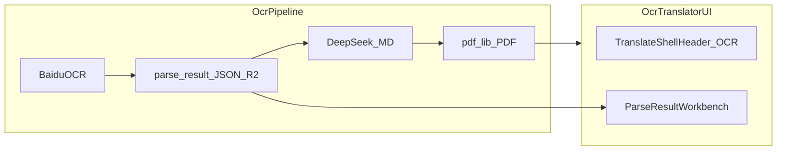

# OCR 品牌化、PDF 乱码修复与 Workbench 对齐

## 背景与根因

1. **标题混淆**：[`TranslateShellHeader.tsx`](D:/imppro/translatepdfonline/frontend/src/shared/components/translate/TranslateShellHeader.tsx) 使用 `translate.shell.brandShort`（与 translate 一致）；[`OcrTranslatePageClient.tsx`](D:/imppro/translatepdfonline/frontend/src/app/[locale]/(translate)/ocrtranslator/OcrTranslatePageClient.tsx) 侧栏仍用 `tHome('workbenchModel')` + `TRANSLATE_MODEL_DISPLAY_NAME`，与 translate 工作台视觉一致。
2. **PDF 乱码 / 日志 `cjk_font_embed_failed_fallback_helvetica`**：[`markdownToSimplePdfBytes`](D:/imppro/translatepdfonline/frontend/src/shared/lib/ocr-translate.ts) 对自定义字节调用 `embedFont` 时 **未注册 fontkit**（pdf-lib 要求）；且 [`tryLoadOcrPdfCjkFontBytes`](D:/imppro/translatepdfonline/frontend/src/shared/lib/ocr-export-pdf-font-bytes.ts) 依赖 Node `fs` + 本机路径，在 **Cloudflare Workers** 等环境常读不到字体，导致回退 Helvetica 与 `toSafeFontText` 的 `?` 占位。
3. **Workbench**：旧站核心在 [`parse-result-workbench.tsx`](D:/imppro/onlinepdftranslator/src/shared/blocks/translator/parse-result-workbench.tsx)（约 3k+ 行）及依赖的 [`translator-parse-result`](D:/imppro/onlinepdftranslator/src/shared/types/translator-parse-result.ts)、[`parse-result-document`](D:/imppro/onlinepdftranslator/src/shared/lib/translator/parse-result-document.ts)、画布/工具栏/导出等。当前 OCR 管线以 **Markdown + DeepSeek** 为主路径，与旧站「以 ParseResult 为真源编辑」不完全相同，需增加 **持久化 ParseResult 级 JSON** 与 **编辑后再导出** 的闭环。

## 里程碑 M1：OCR 品牌化（小改动）

- 扩展 [`TranslateAppShell`](D:/imppro/translatepdfonline/frontend/src/app/[locale]/(translate)/TranslateAppShell.tsx) / `TranslateShellHeader`：增加 `variant?: 'translate' | 'ocr'`（或由 `usePathname()` 检测 `/ocrtranslator`），文案走新键（如 `translate.shell.brandShortOcr`、`brandSubtitleOcr`），避免与 translate 共用同一 `brandShort`。
- 在 [`OcrTranslatePageClient.tsx`](D:/imppro/translatepdfonline/frontend/src/app/[locale]/(translate)/ocrtranslator/OcrTranslatePageClient.tsx) 侧栏顶部：专用 `workbenchModelOcr` / `workbenchPipelineHint` 等 i18n（10 locale），替换硬编码英文「OCR Translator / Baidu…」块；与 translate 页模型标题区明显区分（配色/标签可沿用现有 sky/zinc 体系）。

## 里程碑 M2：修复 OCR 导出 PDF 中文（高优先级）

- **依赖**：在 [`frontend/package.json`](D:/imppro/translatepdfonline/frontend/package.json) 增加 `@pdf-lib/fontkit`（与 `pdf-lib@^1.17.1` 配套）。
- **代码**：在 `markdownToSimplePdfBytes` 内 `PDFDocument.create()` 之后、`embedFont(cjkBytes)` 之前调用 `pdfDoc.registerFontkit(fontkit)`（按 pdf-lib 官方用法）。
- **字体字节来源（兼容 Node + Workers）**：
  - 将 **SIL OFL** 的 Noto Sans SC（或 Noto Sans CJK 子集）放入 [`frontend/public/fonts/`](D:/imppro/translatepdfonline/frontend/public/fonts/)（当前仓库无 `public/fonts`，需新增）。
  - 扩展加载逻辑：除保留现有 `PDF_CJK_FONT_PATH` / 本机路径外，增加 **`fetch` 绝对 URL** 路径（例如 `process.env.APP_URL` / `NEXT_PUBLIC_APP_URL` + `/fonts/NotoSansSC-Regular.otf`），在 Workers 无 `fs` 时使用；`tryLoadOcrPdfCjkFontBytes` 可拆为 **同步（Node）** + **异步（通用）** 两条入口，`runOcrTranslatePipeline` 使用异步版本。
- **验证**：本地与 Cloudflare 构建各跑一次 OCR 完成流，确认日志不再出现 `fontkit` 相关报错，导出 PDF 中文正常。

## 里程碑 M3：持久化「可编辑」JSON 与 API

- 在 [`runOcrTranslatePipeline`](D:/imppro/translatepdfonline/frontend/src/shared/lib/ocr-translate.ts) 中，在拿到 `latestResult` 且 `resolveOcrMarkdown` 成功解析后，将 **用于生成 markdown 的最终 JSON**（若来自 `parse_result_url` 则写入 fetch 后的对象；否则写 Baidu 原始 payload）上传到 R2，固定键名例如 `translations/{taskId}/ocr-parse-result.json`（与现有 [`ocr-queue.ts`](D:/imppro/translatepdfonline/frontend/src/shared/lib/ocr-queue.ts) 的 `translations/${taskId}/ocr-output.*` 并列）。
- 扩展 [`/api/tasks/[taskId]/view`](D:/imppro/translatepdfonline/frontend/src/app/api/tasks/[taskId]/view/route.ts)：当 `task.preprocessWithOcr === true` 且任务完成时，增加 `ocr_parse_result_url`（presigned GET）或并入 `outputs` 数组，供前端 workbench 拉取。
- （可选）新增 `PATCH /api/tasks/[taskId]/ocr-parse-result`：接收用户保存的 JSON，写回 R2 并更新 `updatedAt`；为 workbench「保存」按钮预留。

## 里程碑 M4：迁入 onlinepdftranslator 级 Workbench（你选择的完整对齐）

**4.1 依赖与代码迁移**

- 从 [`onlinepdftranslator`](D:/imppro/onlinepdftranslator) 按依赖顺序复制/改写模块到 `translatepdfonline/frontend/src/shared/ocr-workbench/`（或 `shared/blocks/ocr-workbench/`），包括但不限于：`parse-result-workbench.tsx` 引用的 `parse-result-canvas`、`parse-result-editor-toolbar`、`parse-result-document`、`parse-result-export-*`、`use-parse-result-history` 等；**统一替换** `@/core/i18n`、`toast`、`ui` 路径，使在 translatepdfonline 内可编译。
- 核对 **npm 依赖**（如 `markdown-it`、`github-markdown-css`、若旧站用 Vditor 则评估是否必须引入或先用轻量 Markdown 预览替代）。

**4.2 数据模型适配（关键风险点）**

- 使用旧站 [`parseParseResultJson`](D:/imppro/onlinepdftranslator/src/shared/types/translator-parse-result.ts) 对 `ocr-parse-result.json` 做校验：
  - **若可直接 `ok: true`**：workbench 全功能可直接挂载。
  - **若失败**：实现一层 `normalizeBaiduParseResultToParseResult(raw): ParseResult`（按 Baidu `pages` / `layouts` 等字段映射到 `parsePageSchema`），或 fork 一份放宽的 Zod schema；此步骤需用真实 Baidu 返回样例做 fixture 测试。
- 明确 **翻译结果** 在 UI 中的位置：当前管线产出为 **translated Markdown**；workbench 若展示「译后」需二选一或组合：
  - **A**：仍以 ParseResult 为编辑主对象，译后文本存在 layout 的 `text` 字段（需 DeepSeek 后写回 layout，工作量大）；或
  - **B**：workbench 右侧保留 **Markdown 预览**（来自 `ocr-output.md`），左侧/中间为 JSON/画布编辑源文档结构（与旧站「左原右译」略有差异，但可渐进）。

**4.3 挂载到 ocrtranslator 页**

- 在 [`OcrTranslatePageClient.tsx`](D:/imppro/translatepdfonline/frontend/src/app/[locale]/(translate)/ocrtranslator/OcrTranslatePageClient.tsx) 中，任务 `completed` 且拿到 `ocr_parse_result_url` 后，以 **Tab / 折叠** 方式切换：
  - 现有 Source PDF + 输出预览（PDF 修复后）；
  - 新 **OCR Workbench**（挂载迁移后的 `ParseResultWorkbench` 容器组件）。
- 导出：复用 workbench 内已有导出能力，并接到 **R2 更新**（`putObject` 覆盖 `ocr-output.pdf` / `ocr-output.md`）或新增「下载临时文件」API，避免与 babeldoc 普通任务混淆（仅 `preprocessWithOcr` 任务）。

## 里程碑 M5：回归

- OCR：上传 → 完成 → 下载 PDF/MD 中文无乱码；Workbench 打开 JSON、编辑、保存、再导出。
- Translate：不受影响（`preprocessWithOcr === false` 路径不变）。
- i18n：新 shell / OCR 侧栏键覆盖 10 locale。

## 里程碑 M6：新建 Cloudflare Queue（必选）+ Workers 部署 + 文档 / 测试 / DB + DeepSeek 对齐

### 6.1 目标架构（必须新建独立 Queue）

- **Postgres 仍为任务真源与状态机**（`translation_tasks`、`preprocess_with_ocr`、租约字段），用于幂等、前端轮询、与 BabelDOC 任务区分。
- **Cloudflare Queues 为 OCR 管线派发主通道**：提交成功后向 **专用队列** 发送消息（建议 body：`{ "taskId": "<id>" }`），由 Worker **`queue` consumer** 调用 [`invokeOcrPipelineForTask`](D:/imppro/translatepdfonline/frontend/src/shared/lib/ocr-queue.ts)。
- **禁止**与 BabelDOC / `translate` FC 派发共用同一 Queue。
- **现状**（实施前）：[`POST /api/ocr/tasks`](D:/imppro/translatepdfonline/frontend/src/app/api/ocr/tasks/route.ts) 使用 `waitUntil(dispatchPendingOcrJobs)` + 可选 Cron [`/api/ocr/dispatch-pending`](D:/imppro/translatepdfonline/frontend/src/app/api/ocr/dispatch-pending/route.ts)；[`wrangler.toml`](D:/imppro/translatepdfonline/frontend/wrangler.toml) 尚无 Queues 绑定。实施后文档需写明 **主路径 = Queue**，Cron/`dispatch-pending` 是否保留为 **兜底 drain**（若保留，须依赖行级租约避免双消费）。

### 6.2 资源命名（建议）

| 资源 | 建议名称 |
|------|-----------|
| 主队列 | `ocr-pipeline-queue` |
| 死信队列（可选） | `ocr-pipeline-dlq` |
| Producer binding | `OCR_PIPELINE_QUEUE` |

### 6.3 Cloudflare Workers 详细部署方案（OpenNext + Queues）

**前提**：`main = ".open-next/worker.js"` 由 [`scripts/generate-wrangler.js`](D:/imppro/translatepdfonline/frontend/scripts/generate-wrangler.js) 生成；Queues 配置应进入 **生成模板/白名单**，避免手改 `wrangler.toml` 被覆盖。

**A. 创建队列**：Dashboard **Queues** → Create `ocr-pipeline-queue`；可选创建 DLQ 并绑定 dead-letter。

**B. Wrangler 片段（实施时写入生成结果）**：

- `[[queues.producers]]`：`binding = "OCR_PIPELINE_QUEUE"`，`queue = "ocr-pipeline-queue"`。
- `[[queues.consumers]]`：`queue = "ocr-pipeline-queue"`，按管线耗时设置 `max_batch_size`（长任务可设为 `1`）、`max_batch_timeout`、`max_retries`；可选 `dead_letter_queue`。

**C. Worker 导出 `queue` handler**：在可部署入口提供与 OpenNext 兼容的 **`export default { fetch, queue }`**；若框架仅导出 `fetch`，采用 **`_worker.js` 包装层**：`fetch` 委托 OpenNext，`queue` 委托共享模块（例如 `runOcrQueueBatch(env, batch)` 内循环调用 `invokeOcrPipelineForTask`）。处理失败时按 Cloudflare 语义 **抛错** 以触发重试；业务不可恢复错误则写 DB `failed` 并不再抛错（避免无限重试）。

**D. Producer**：在 `POST /api/ocr/tasks` 于 `enqueueOcrTask(taskId)` 成功后执行 `env.OCR_PIPELINE_QUEUE.send(...)`。兼容期可双写 `waitUntil(dispatchPendingOcrJobs)`，验证后关闭其一并在文档标明。

**E. 生产部署顺序**：Dashboard 建队 → 更新 wrangler 生成逻辑 → build → `wrangler deploy` → 配置 Secrets/Vars（Hyperdrive、R2、Baidu、DeepSeek 等，与 [`frontend/docs/environment-variables.md`](D:/imppro/translatepdfonline/frontend/docs/environment-variables.md) 交叉引用）→ Dashboard 观察队列深度与消费者错误率 → 端到端 OCR 一单。

**F. 本地 / 预览**：`wrangler dev` 与本地队列开发流程（以当前 Wrangler 版本文档为准）；无 binding 时的行为（报错或降级）须在文档写清。

### 6.4 参考 onlinepdftranslator 的 DeepSeek 翻译（对齐要求）

旧站核心：[`deepseek-translate.ts`](D:/imppro/onlinepdftranslator/src/shared/lib/translator/deepseek-translate.ts)（`translateOcrDocument`、layout/table **分段**、跳过公式/图类型、批大小/并发/超时环境变量、覆盖率与 batch 重试）及 [`pipeline.ts`](D:/imppro/onlinepdftranslator/src/shared/lib/translator/pipeline.ts) / [`poll-cycle.ts`](D:/imppro/onlinepdftranslator/src/shared/lib/translator/poll-cycle.ts) 与 **`deepseek-chat` / `deepseek-reasoner`** 模型选择。

当前站：[`ocr-translate.ts`](D:/imppro/translatepdfonline/frontend/src/shared/lib/ocr-translate.ts) 中 `translateMarkdownWithDeepSeek` 为 **整篇 Markdown 单次** 调用。

**计划要求**：在 OCR 管线中规划 **向旧站能力收敛**——优先在具备 ParseResult / 结构化 JSON（M3/M4）后，评估 **移植或封装调用** `translateOcrDocument` 一类逻辑；短期无法全量移植时，至少在文档与配置层对齐 **模型可选、批参数、重试语义**，并列出与旧站 env 的映射表（建议新前缀 `OCR_DEEPSEEK_*` 以免与全站键混淆）。

### 6.5 交付文档 [`frontend/docs/ocr-queue-and-pipeline.md`](D:/imppro/translatepdfonline/frontend/docs/ocr-queue-and-pipeline.md)

在 **translatepdfonline** 新增该文档，并在 [`doc/ARCHIVE_INDEX.md`](D:/imppro/translatepdfonline/doc/ARCHIVE_INDEX.md) 登记。

正文须含：

1. **架构**：Submit → DB → **Queue send** → **queue consumer** → `invokeOcrPipelineForTask` → R2；与 BabelDOC `invoke-fc` 对照；至少一次投递与租约去重。
2. **Cloudflare 部署**：建队、wrangler、`queue` 出口与 OpenNext 组合方式、deploy 顺序、监控与排障。
3. **测试**：单任务、多消息积压、consumer 重试、租约防双跑、非 OCR 任务不被本 consumer 处理。
4. **数据库**：无新列则写明 **无迁移**；有列则写迁移路径、上线顺序、回滚。

## 风险与范围说明

- **完整迁移 parse-result-workbench** 体量大，且 Baidu JSON 与 `ParseResult` 可能不完全一致；M4 中 **normalize 层** 与 **译后数据绑定策略（A/B）** 需在实现首周用真实任务 JSON 定型，否则易返工。
- 字体文件会增加仓库体积；若需控制大小，可改用子集化 OTF 并文档说明许可证。
- **OpenNext Worker 与 Queues consumer 同栈**：若 `@opennextjs/cloudflare` 默认入口不支持导出 `queue`，需包装层或官方推荐模式；属 M6 实施首周技术验证项。
