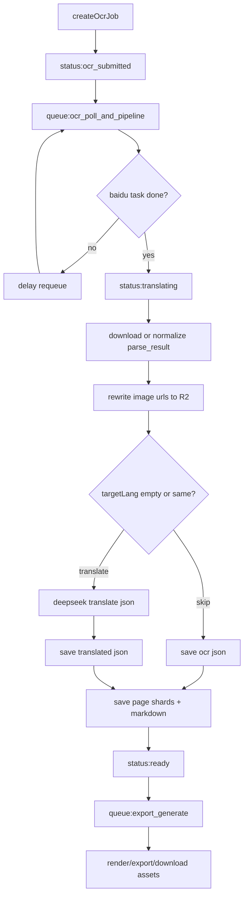

# OCR控件与队列稳态整改计划

## 目标与已确认问题
- `ocrtranslator` 的 `Editing and font controls / Open Text edit / Open Font settings` 需要按参考图重做（当前两个按钮都只滚动到同一锚点，不区分子面板）。
- `upload` 页面与首页入口需要重新对齐：
  - 首页 `Upload` 入口必须放在页首导航同一排，和 `Translate PDF Online / PDF Translate / PDF OCR / Pricing` 同级展示。
  - `upload` 页的 `PDF Translate / PDF OCR / Source Language / Target Language` 必须同排，并放进文件上传大框内部（同一个容器）。
  - `PDF OCR` 必须带简明说明：与 Translate 的区别、何时使用（扫描件/图片型 PDF 优先 OCR）。
- OCR 流程定义与 `onlinepdftranslator` 不一致：当前把 `export` 混入 OCR 主链，导致阶段边界不清晰、内存峰值集中、卡住时难恢复。
- 线上出现 `Worker exceeded memory limit`，并伴随 `enqueue_failed -> cron_dispatch processed=0` 的“看起来卡住”现象，需要按参考项目拆成“OCR/翻译主链 + 导出异步链”。
- `Hist & Log` 与相关页面存在语言混乱（中英混用、硬编码文案、状态/阶段直出英文）。

## 关键现状（只读排查结论）
- 阶段编排主入口在 [`D:/imppro/translatepdfonline/frontend/src/shared/lib/ocr-queue.ts`](D:/imppro/translatepdfonline/frontend/src/shared/lib/ocr-queue.ts)，阶段执行在 [`D:/imppro/translatepdfonline/frontend/src/shared/lib/ocr-translate.ts`](D:/imppro/translatepdfonline/frontend/src/shared/lib/ocr-translate.ts)。
- `onlinepdftranslator` 的参考实现是：
  - 队列任务 `ocr_poll_and_pipeline` 只负责 OCR 查询与后处理主链（[`D:/imppro/onlinepdftranslator/src/shared/lib/translator/poll-cycle.ts`](D:/imppro/onlinepdftranslator/src/shared/lib/translator/poll-cycle.ts)）。
  - 导出走独立队列任务 `export_generate`（[`D:/imppro/onlinepdftranslator/src/shared/lib/translator/process-job-export.ts`](D:/imppro/onlinepdftranslator/src/shared/lib/translator/process-job-export.ts)），不与 OCR 主链同阶段执行。
  - OCR 后处理顺序是：下载/规范化 parse_result -> 图片重写到 R2 -> DeepSeek 翻译 JSON（可跳过）-> 保存 translated JSON -> 切页分片 -> 生成 markdown。
- `enqueue_failed` 后会回退 dispatcher，并在 `inlineDepth < 1` 时尝试内联继续执行下一阶段，因此 `cron_dispatch {processed:0}` 可能是任务已进入 `processing/completed`，不一定是 Cron 失效。
- `export_outputs` 的内存峰值主要在“整段加载 + 整段渲染”链路：`getObjectBody` 全量读 R2 -> `markdown` 整串驻留 -> `markdownToSimplePdfBytes`（`split`、字体嵌入、`doc.save()`）。
- `ocrtranslator` 语言混乱主要来自：`zh` 仍含 `Home/Upload/Hist & Log`、`Open Text edit` 等混合文案，以及页面内硬编码中文/英文状态文本。

## 流程梳理（改为对齐 onlinepdftranslator）

## 实施计划

### 1) 重做 ocrtranslator 的 Editing/Font controls（对齐参考图）
- 重构 [`D:/imppro/translatepdfonline/frontend/src/shared/ocr-workbench/parse-result-editor-toolbar.tsx`](D:/imppro/translatepdfonline/frontend/src/shared/ocr-workbench/parse-result-editor-toolbar.tsx)：
  - 按参考图分成稳定分区：`Text edit`、`Font settings`、`Block props`、`File`（保留你之前要求的左侧导航不含 File；File 区仅在工具面板内）。
  - 把按钮组样式统一为“卡片化+同尺寸控件+明确选中态”，并将 `Open Text edit` / `Open Font settings` 改为真正定位到子分区锚点。
- 调整 [`D:/imppro/translatepdfonline/frontend/src/app/[locale]/(translate)/ocrtranslator/OcrTranslatePageClient.tsx`](D:/imppro/translatepdfonline/frontend/src/app/[locale]/(translate)/ocrtranslator/OcrTranslatePageClient.tsx)：
  - `openToolbarPanel` 拆成 `openTextEditPanel` 与 `openFontSettingsPanel`，分别滚动/聚焦对应 section。
  - `Hist & Log` 保留左侧抽屉结构，避免打断当前 workbench 编辑。

### 2) upload 与首页入口布局重构（新增）
- 首页页首入口统一：
  - 调整 [`D:/imppro/translatepdfonline/frontend/src/themes/default/blocks/hero.tsx`](D:/imppro/translatepdfonline/frontend/src/themes/default/blocks/hero.tsx)，确保 `Upload` 在页首入口同排，与 `PDF Translate / PDF OCR / Pricing` 同级。
  - 对应 i18n 文案在 [`D:/imppro/translatepdfonline/frontend/src/config/locale/messages/zh/translate/home.json`](D:/imppro/translatepdfonline/frontend/src/config/locale/messages/zh/translate/home.json) 与 [`D:/imppro/translatepdfonline/frontend/src/config/locale/messages/en/translate/home.json`](D:/imppro/translatepdfonline/frontend/src/config/locale/messages/en/translate/home.json) 统一维护。
- upload 大框内同排布局：
  - 重构 [`D:/imppro/translatepdfonline/frontend/src/shared/components/translate/TranslateLandingSections.tsx`](D:/imppro/translatepdfonline/frontend/src/shared/components/translate/TranslateLandingSections.tsx) 与 [`D:/imppro/translatepdfonline/frontend/src/app/[locale]/(translate)/upload/UploadPageClient.tsx`](D:/imppro/translatepdfonline/frontend/src/app/[locale]/(translate)/upload/UploadPageClient.tsx)，将 `PDF Translate / PDF OCR / Source Language / Target Language` 放入上传大框内部并同排呈现（窄屏可换行）。
  - 新增 `PDF OCR` 说明文案（区别与使用场景）：扫描件、图片型、不可复制文本的 PDF 优先 OCR；普通可选中文字 PDF 优先 Translate。
  - 说明文案全部走 i18n，不允许页面硬编码中英混合。

### 3) OCR 全流程“卡住点”与内存峰值治理（生产化，按参考项目分流）
- 先对齐流程边界：OCR 主链只负责 `OCR + JSON重写/翻译 + markdown`，`export/download` 改为独立异步任务，避免在 OCR 链路做重渲染。
- 在 [`D:/imppro/translatepdfonline/frontend/src/shared/lib/ocr-queue.ts`](D:/imppro/translatepdfonline/frontend/src/shared/lib/ocr-queue.ts) 增强可观测性：
  - 补齐结构化日志：`task_id`、`status`、`phase`、`attempt`、`inline_depth`、`lease_until`、`queued_to_processing_latency_ms`、`enqueue_result`。
  - 明确输出 `enqueue_failed` 原因类型（binding 缺失/queue.send 抛错）。
  - 对“queued 但 lease 未过期”的情况加专用诊断日志，定位 `processed=0` 真因。
- 在 [`D:/imppro/translatepdfonline/frontend/src/shared/lib/ocr-translate.ts`](D:/imppro/translatepdfonline/frontend/src/shared/lib/ocr-translate.ts) 做内存削峰：
  - 优先治理 OCR 主链大对象（parse_result/translated JSON）读写策略，减少整包驻留时间。
  - 对齐参考项目做法：先持久化 `ocr.json` / `translated.json` / `page shards`，导出环节仅消费已落盘结果。
  - 增加关键指标日志：`json_bytes`、`page_count`、`translated_segments`、`elapsed_ms`、`memory_snapshot`。
- 导出链路单独治理（参考 [`D:/imppro/onlinepdftranslator/src/shared/lib/translator/process-job-export.ts`](D:/imppro/onlinepdftranslator/src/shared/lib/translator/process-job-export.ts)）：
  - 独立超时、重试、heartbeat 与错误码归一，不再让导出失败拖住 OCR 主任务状态。
  - 保障“OCR ready 后可重复触发 export/download”，而不是卡在 OCR 阶段。
- 核对 consumer 运行配置（只改必要项）：
  - 继续保持 `max_batch_size=1`、Cron 1 分钟兜底、前端 10s 轮询主驱动。
  - 基于 Cloudflare 官方限制（内存 128MB/isolates）评估 `limits.cpu_ms` 与分段执行边界，防止“单页仍 OOM”。

### 4) 语言混乱一次性清理（ocrtranslator + upload/translate/home）
- 统一文案来源到 i18n，移除硬编码：
  - [`D:/imppro/translatepdfonline/frontend/src/config/locale/messages/zh/translate/ocrWorkbench.json`](D:/imppro/translatepdfonline/frontend/src/config/locale/messages/zh/translate/ocrWorkbench.json)
  - [`D:/imppro/translatepdfonline/frontend/src/config/locale/messages/en/translate/ocrWorkbench.json`](D:/imppro/translatepdfonline/frontend/src/config/locale/messages/en/translate/ocrWorkbench.json)
  - [`D:/imppro/translatepdfonline/frontend/src/config/locale/messages/zh/translate/home.json`](D:/imppro/translatepdfonline/frontend/src/config/locale/messages/zh/translate/home.json)
  - [`D:/imppro/translatepdfonline/frontend/src/config/locale/messages/en/translate/home.json`](D:/imppro/translatepdfonline/frontend/src/config/locale/messages/en/translate/home.json)
  - [`D:/imppro/translatepdfonline/frontend/src/app/[locale]/(translate)/upload/UploadPageClient.tsx`](D:/imppro/translatepdfonline/frontend/src/app/[locale]/(translate)/upload/UploadPageClient.tsx)
  - [`D:/imppro/translatepdfonline/frontend/src/app/[locale]/(translate)/translate/TranslatePageClient.tsx`](D:/imppro/translatepdfonline/frontend/src/app/[locale]/(translate)/translate/TranslatePageClient.tsx)
- 规范化 `Hist & Log` 展示：
  - `status`、`progress_stage` 映射为本地化标签（不再直出英文枚举）。
  - 保留脱敏原则，不泄露路径/object key/internal URL。

### 5) 验证与回归
- 类型检查与 lint：`pnpm tsc --noEmit` + `ReadLints`。
- 场景回归：
  - 首页页首入口同排验证：`Upload / PDF Translate / PDF OCR / Pricing` 视觉同级、交互可达。
  - upload 大框内同排验证：`PDF Translate / PDF OCR / Source / Target` 在同一容器内；响应式断点仅换行不拆容器。
  - `PDF OCR` 说明文案可见且多语言一致，能明确“与 Translate 的区别及适用场景”。
  - OCR+翻译到 `ready`（不触发导出）稳定完成。
  - OCR+翻译+导出+下载（导出为独立链路）。
  - OCR+导出+下载（source=target/target 为空，跳过翻译）。
  - 大文档/图片密集文档压测（重点看 OCR 主链与导出链各自 OOM/超时）。
  - `Hist & Log` 的 Uploaded files / Recent tasks / 运行日志多语言一致性。
- 观察指标：确保不再出现“任务停在 OCR 阶段却实际是导出失败”的状态，并可从日志区分 OCR 卡点与导出卡点。