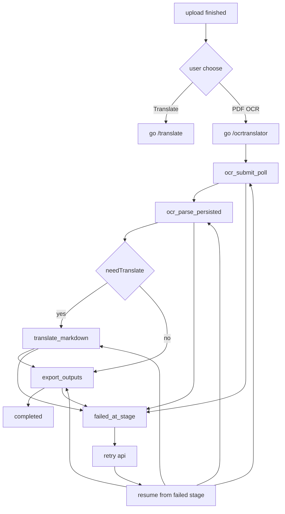

# OCR生产整改与页面重构计划

## 现状与根因

- `upload` 页目前仅保留上传落地块，无“上传后直达 Translate/OCR”的操作区（见 [`UploadPageClient.tsx`](D:/imppro/translatepdfonline/frontend/src/app/[locale]/(translate)/upload/UploadPageClient.tsx)）。
- OCR 任务卡在 `Queued · ocr_parse_persisted` 的直接原因是阶段推进使用“再入队下一阶段”，但 consumer 里 `enqueueNextStage` 失败后仅记日志，不做兜底推进（`[ocr/stage] enqueue_failed`），导致任务停滞。
- 当前 consumer 配置仅有 `queues.consumers`，无 producer 绑定；若消费 Worker 里无可用 `OCR_PIPELINE_QUEUE` 发送能力，阶段拆分会断在第一次“下一阶段投递”。
- `ocrtranslator` 当前工作区与 `onlinepdftranslator` 的 `Text edit / Font settings / Home / Upload / Hist & Log / File` 信息架构未对齐。

## 实施顺序（生产优先）

1. **先修运行链路防卡死**（必须先做）
2. **再做 upload 跳转与文案重构**
3. **最后做 ocrtranslator workbench 结构对齐与头尾折叠**

---

## 一、OCR 阶段推进与断点续跑（止血）

### 1) 阶段推进兜底（避免 `enqueue_failed` 卡死）

- 文件：[`ocr-queue.ts`](D:/imppro/translatepdfonline/frontend/src/shared/lib/ocr-queue.ts)
- 改造：
  - `enqueueNextStage()` 失败时，不仅记录 warn，还要执行兜底：
    - 优先：尝试同一 consumer 内直接继续执行下一阶段（受 CPU guard 限制，最多再推进 1 步）；
    - 次级：标记任务可被 dispatcher 拉起（`status=queued + nextAttemptAt=now + progressStage=nextStage`）。
  - 增加“阶段推进结果”日志字段：`enqueue_ok`, `fallback_inline`, `fallback_dispatcher`。

### 2) Consumer 具备生产级再投递能力

- 文件：[`wrangler.consumer.develop.jsonc`](D:/imppro/translatepdfonline/frontend/wrangler.consumer.develop.jsonc)、[`wrangler.consumer.jsonc`](D:/imppro/translatepdfonline/frontend/wrangler.consumer.jsonc)
- 改造：
  - 为 consumer 增加 producer 绑定 `OCR_PIPELINE_QUEUE` 指向同队列（dev/prod 各自队列），保证“阶段间再投递”在 consumer 内可用。
  - 维持 `max_batch_size=1`、`cpu_ms` 高配，避免多任务争抢 CPU。

### 3) 断点续跑语义对齐

- 文件：[`/api/ocr/tasks/[taskId]/retry/route.ts`](D:/imppro/translatepdfonline/frontend/src/app/api/ocr/tasks/[taskId]/retry/route.ts)、[`ocr-queue.ts`](D:/imppro/translatepdfonline/frontend/src/shared/lib/ocr-queue.ts)
- 改造：
  - retry 必须以 `progressStage`（失败阶段）为恢复点，不重置到 `ocr_submit_poll`。
  - 返回体增加 `resume_stage`，前端可展示“从哪一步继续”。

### 4) 运营兜底通路（防止队列瞬时故障）

- 文件：[`/api/ocr/dispatch-pending/route.ts`](D:/imppro/translatepdfonline/frontend/src/app/api/ocr/dispatch-pending/route.ts)
- 改造：
  - 建议加 Cloudflare Cron 定时触发该接口，补拉 `queued` 任务，避免单点 enqueue 失败造成长时间停留。

---

## 二、Upload 页面重构（上传后可直达）

### 目标

- 顶部入口并排显式：`PDF Translate` / `PDF OCR` / `Pricing`。
- 上传完成后在页面内给出两个 CTA：
  - **主按钮（强调）**：`Go to Translate`
  - 次按钮：`Go to PDF OCR`
- OCR 旁补充说明：“扫描件/图片型 PDF 用 OCR；可复制文本优先 Translate”。
- 上传成功后保留“当前文件信息卡 + 两个跳转按钮”，避免用户找不到下一步。

### 改造文件

- [`UploadPageClient.tsx`](D:/imppro/translatepdfonline/frontend/src/app/[locale]/(translate)/upload/UploadPageClient.tsx)
- [`TranslateShellHeader.tsx`](D:/imppro/translatepdfonline/frontend/src/shared/components/translate/TranslateShellHeader.tsx)
- i18n 文案：`translate/home.json`、`translate/upload.json`（至少 `en/zh`）。

---

## 三、三页面按钮与可视化重设计（用户视角）

### 范围

- `upload`、`translate`、`ocrtranslator` 三个页面的按钮层级、状态提示、可视化区块一致性。
- 目标：减少学习成本，上传后用户一眼知道“下一步去哪、当前卡在哪、怎么恢复”。

### 统一设计原则

- 主路径按钮（Translate）始终主强调；次路径按钮（PDF OCR）次强调。
- 可视化区优先展示“当前进度/阶段/可操作按钮”，避免纯文本堆叠。
- 错误态必须给出动作：`继续重试`、`刷新状态`、`查看日志摘要`。

### 改造文件

- [`UploadPageClient.tsx`](D:/imppro/translatepdfonline/frontend/src/app/[locale]/(translate)/upload/UploadPageClient.tsx)
- [`TranslatePageClient.tsx`](D:/imppro/translatepdfonline/frontend/src/app/[locale]/(translate)/translate/TranslatePageClient.tsx)
- [`OcrTranslatePageClient.tsx`](D:/imppro/translatepdfonline/frontend/src/app/[locale]/(translate)/ocrtranslator/OcrTranslatePageClient.tsx)
- 共享样式与组件：`translate-ui.ts`、工作台侧栏/状态卡组件。

---

## 四、OCR Translator 工作台对齐（参照 onlinepdftranslator）

### 目标结构

- 左侧（沿 `onlinepdftranslator`）：**所有操作区/编辑区**都在左侧，包含 `Home / Upload / Hist & Log / File`、`Text edit / Font settings`、`Export / Download`、错误态与`继续重试`按钮。
- 中央：源文件预览（PDF）。
- 右侧：可视化 JSON。
- 三栏比例要求：**沿用当前 ocrtranslator 页面比例**（不改主框架宽度占比，只替换内容组织）。
- 错误态必须显示失败阶段与可重试动作（调用 retry API）。

### 改造文件

- [`OcrTranslatePageClient.tsx`](D:/imppro/translatepdfonline/frontend/src/app/[locale]/(translate)/ocrtranslator/OcrTranslatePageClient.tsx)
- [`OcrParseWorkbench.tsx`](D:/imppro/translatepdfonline/frontend/src/shared/ocr-workbench/OcrParseWorkbench.tsx)
- 工具条/面板组件（`parse-result-editor-toolbar` 等）按 onlinepdftranslator 结构对齐。

---

## 五、页首/页尾折叠（仅 ocrtranslator）

- 范围按你确认：**仅 `ocrtranslator` 页面**。
- 做法：
  - 在 `ocrtranslator` 页引入“header/footer 折叠状态”；
  - 默认折叠，用户可展开；状态写入 localStorage（可选）。

---

## 六、图标与静态资源迁移（tmp -> 正式目录）

- 所有设计图标参考源：`D:/imppro/translatepdfonline/tmp/images`。
- 上线要求：图标统一迁移到项目正式路径（如 `frontend/public/brand/local/` 或 `frontend/public/icons/ocr/`），并更新代码引用。
- 禁止在页面中直接引用 `tmp/` 路径。
- 对 `upload/translate/ocrtranslator` 三页按钮与可视化图标统一替换为该目录资源。

---

## 七、验证与上线门槛

- 阶段推进：`ocr_submit_poll -> ... -> completed` 连续可达；出现 `enqueue_failed` 时不再卡死。
- 重试：失败后前端按钮可用，且从失败阶段继续。
- Upload：上传后两个跳转按钮稳定出现，Translate 按钮视觉主强调，OCR 使用说明明确。
- OCR 工作台：左操作区/中源文件/右JSON 三栏布局稳定，比例与当前页面一致。
- 三页面统一：`upload/translate/ocrtranslator` 按钮层级与可视化状态反馈一致。
- 图标路径：全部来自正式静态目录，无 `tmp/` 直接引用。
- 生产队列：consumer 具备 producer + cron fallback，日志可追踪阶段耗时与失败原因。

