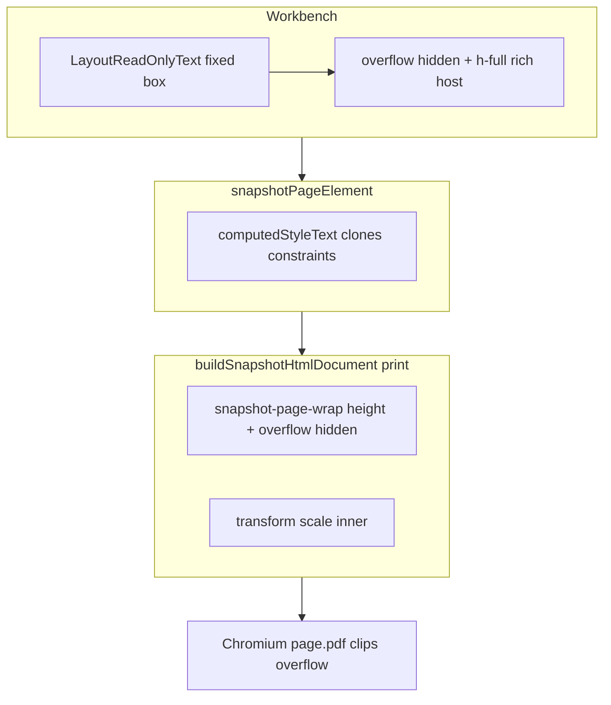

# PDF 导出文字框底部截断：原因与修复方案

## 对比图与现象归纳

- 坏图：正文末行、代码块附近出现**水平方向只剩半行字**、**同一命令被拆成多行叠字**、段落**最后一行被「切掉」**。
- 好图：同一页在 Workbench 中排版正常（或另一导出）无裁切。

这与「整页栅格」无关，属于**矢量快照 + Chromium `page.pdf`** 路径下的**盒内裁切**问题。

## 根因（代码级）

1. **文字块结构**（[`parse-result-canvas.tsx`](D:/imppro/translatepdfonline/frontend/src/shared/ocr-workbench/parse-result-canvas.tsx) `LayoutReadOnlyText` / `LayoutTable`）  
   - 外层 `[data-layout-id]`：`overflow: 'hidden'` 与画布给出的**固定宽高**（`boxFrame`）。  
   - 内层 `.parse-result-rich-host`：`overflow-hidden` + `h-full`（见约 437、552 行）。  
   - 快照通过 [`snapshotPageElement`](D:/imppro/translatepdfonline/frontend/src/shared/ocr-workbench/parse-result-export-snapshot.ts) 的 `computedStyleText` **原样固化**上述约束。

2. **`normalizeSnapshotOverflowForPrint`**（同文件约 35–51 行）  
   将 `overflow: auto/scroll` 改为 `hidden`，进一步**强化裁切**；与「避免 scrollport」目标一致时，若内容在 PDF 引擎里仍略超盒高，会表现为**底行被切**。

3. **打印页容器**（[`buildSnapshotHtmlDocument`](D:/imppro/translatepdfonline/frontend/src/shared/ocr-workbench/parse-result-export-snapshot.ts) 内 `@media print`）  
   - `.snapshot-page-wrap`：`height: calc(var(--page-h) * var(--print-scale))` + **`overflow: hidden`**（约 210–218 行）。  
   - 内层 `.snapshot-page-scale`：`transform: scale(...)`。  
   亚像素舍入 + 与屏幕度量不一致时，会在**页缘或缩放容器**上再叠一层裁切。

4. **字号适配容差偏小**（[`parse-result-export-layout-fit-script.ts`](D:/imppro/translatepdfonline/frontend/src/shared/ocr-workbench/parse-result-export-layout-fit-script.ts)）  
   `isOverflow` 使用 `scrollHeight > clientHeight + 1`（约 16–17 行）。Chromium PDF 常用字体/行高与 Workbench 有 1–3px 级差异时，**屏上已通过、PDF 仍略溢出**，仍被 `hidden` 裁掉。

5. **与日志 `strict_parse_json_*` 无关**  
   当前 Consumer 已走 staging 快照；截断来自**快照 HTML + 打印样式**，不是 JSON 自拼分支。

## 修复策略（按优先级实施）

### A. 快照阶段：按「源 DOM」给每个块增加安全高度（主修）

在 [`parse-result-export-snapshot.ts`](D:/imppro/translatepdfonline/frontend/src/shared/ocr-workbench/parse-result-export-snapshot.ts) 的 `snapshotPageElement` 末尾（在拼 `sectionHtml` 之前），对 `pageEl` 与 `clone` 中**同一 `data-layout-id`** 配对（用 `CSS.escape(layoutId)` 查询，避免 id 特殊字符）：

- 跳过 `data-layout-type="image"`（避免撑破插图框）。  
- 对文本/表格：读取源元素 `outer`（`[data-layout-id]`）或内层 `.parse-result-rich-host` 的 `scrollHeight` / `getBoundingClientRect().height`，取 **`ceil(max(...)) + slack`**（建议 **4–8px**），在克隆根上**追加** `min-height: …px`（或 `height: auto` + `min-height`，在不改 `position:absolute` 的前提下优先只加 `min-height`，避免破坏坐标）。  
- 若内层 `scrollHeight` 明显大于外层 `clientHeight`，优先按**内层滚动高度**扩容外层 `min-height`，保证 PDF 中整块可读。

这样不依赖「猜测」Chromium 差多少像素，而是**以当前浏览器真实排版为准**预留 PDF 余量。

### B. 打印 CSS：减弱整页裁切 + 富文本底部留白

仍在 [`buildSnapshotHtmlDocument`](D:/imppro/translatepdfonline/frontend/src/shared/ocr-workbench/parse-result-export-snapshot.ts) 的 `<style>` 中调整 `@media print`：

- `.snapshot-page-wrap`：将 **`height` + `overflow:hidden`** 改为 **`min-height: calc(...)`** + **`overflow: visible`**（或至少 `overflow: clip` 仅防横向溢出需实测；若出现跨页 bleed 再收紧）。  
- 为 `.parse-result-rich-host`（或 `[data-layout-id] .parse-result-rich-host`）增加 **`padding-bottom: 0.15em ~ 0.25em`**，缓冲降部与最后一行行高。

### C. layout-fit 脚本：容差与二次 pass

在 [`parse-result-export-layout-fit-script.ts`](D:/imppro/translatepdfonline/frontend/src/shared/ocr-workbench/parse-result-export-layout-fit-script.ts)：

- 将 `isOverflow` 阈值从 `+1` 提高到 **`+4` ~ `+6`**（与 A 的 slack 一致即可）。  
- `runFit` 内在 `DOMContentLoaded` 后增加 **`requestAnimationFrame` 再跑一轮** `fitTextLayout`（或 `setTimeout(0)` 双次），应对字体子像素在 print media 下晚 settle 的情况。

可选：在 [`ocr-export-pdf-cloudflare.ts`](D:/imppro/translatepdfonline/frontend/src/shared/lib/ocr-export-pdf-cloudflare.ts) 在 `waitForFunction(__prLayoutFitDone)` 之后 **`page.evaluate` 再调用一次与脚本同源的 shrink 逻辑**（避免重复维护则仅依赖 C 的脚本内双 pass）。

### D. 代码块叠字（横向）

若 A–C 后仍有个别 `psql` 行在窄盒内「拆行叠字」：

- 在快照文档的 print CSS 中为 `pre, code` 增加 **`white-space: pre-wrap`**、**`word-break: break-all`** 或 **`overflow-wrap: anywhere`**（择一对 monospace 破坏最小者），与 Workbench 中「可读优先」一致即可。

## 验收建议

- 同一 OCR 页：Workbench 与导出 PDF 对照，重点看**段落末行、代码块、表格单元格底边**。  
- 故意缩小文字框高度触发 `fitReadOnlyText` 后再导出，确认 PDF **无半截字**（允许字号略小于屏上极端情况）。  
- 打开同一份 staging HTML 的浏览器打印预览，应与 PDF 一致。

## 不在本轮

- 水印斜纹：与裁切无关，单独需求处理。  
- 回到整页栅格 PDF：与产品「矢量快照」方向冲突，不作为默认方案。
