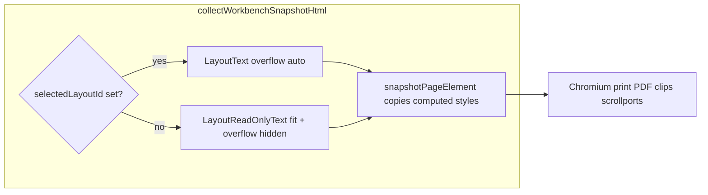

# PDF 部分文字框展示不全 / 与 Workbench 不一致

## 根因（代码级）

- [`OcrParseWorkbench.tsx`](frontend/src/shared/ocr-workbench/OcrParseWorkbench.tsx) 的 `collectWorkbenchSnapshotHtml` **未**在逐页快照前清除选中态。
- 选中时 [`parse-result-canvas.tsx`](frontend/src/shared/ocr-workbench/parse-result-canvas.tsx) 使用 **`LayoutText`**：内层 `contentEditable` 容器样式含 **`overflowY: 'auto'`**（约 169–177、263–265 行），外层 `overflow: hidden`（选中时 frame，约 916–920 行）。
- **未选中**时使用 **`LayoutReadOnlyText`**：`useEffect` 里 **`fitReadOnlyText`** 按盒高缩小字号，且内外 **`overflow: hidden`**（约 504–558 行），静态排版更适合打印。
- [`snapshotPageElement`](frontend/src/shared/ocr-workbench/parse-result-export-snapshot.ts) 用 `computedStyleText` 把上述样式**原样**写入克隆；[`buildSnapshotHtmlDocument`](frontend/src/shared/ocr-workbench/parse-result-export-snapshot.ts) 再走 `@media print` + `transform: scale`。**Chromium 对 `overflow: auto` 区域在 PDF 中常按可视窗口裁切**，易出现截图中「标题压正文」「命令行断行叠字」「后续段落字号异常」等与右侧 Workbench（只读已适配）不一致的现象。
- [`parse-result-export-html.ts`](frontend/src/shared/ocr-workbench/parse-result-export-html.ts) 中的 **`workbenchLayoutFitScript`** 只对 **`.pr-layout`** 生效；DOM 快照里没有该类名，**PDF 路径从未跑**与自建 HTML 相同的溢出收缩逻辑（计划里「第二轮」项）。

## 实施方案

### 1. 导出快照前强制取消选中（主修，低成本）

在 [`OcrParseWorkbench.tsx`](frontend/src/shared/ocr-workbench/OcrParseWorkbench.tsx) 的 **`collectWorkbenchSnapshotHtml`** 开头（在 `for` 循环前）使用 **`flushSync(() => setSelectedLayoutId(null))`**，确保每一页快照时块均为 **LayoutReadOnlyText** 路径；在恢复 `activePageIndex` 的 `finally` 里**不必**恢复旧选中（避免误恢复跨页无效 id；若需保留 UX，可在快照前 `const prev = selectedLayoutId`，结束后 `flushSync(() => setSelectedLayoutId(prev))` 且仅在 `prev` 仍存在于当前页时恢复）。

在 `setActivePageIndex(i)` 与 `requestAnimationFrame` 之间已有一次双 rAF；可在 **`flushSync` 清选中后再多等 1 帧**（或 `requestAnimationFrame` 一次），给 `LayoutReadOnlyText` 的 `fitReadOnlyText` 留出应用时间。

### 2. 快照克隆防御性归一化 overflow（可选加固）

在 [`parse-result-export-snapshot.ts`](frontend/src/shared/ocr-workbench/parse-result-export-snapshot.ts) 的 **`snapshotPageElement`** 中，克隆并写完 `computedStyleText` 后，对 **`[data-layout-id]`** 及其内部常见富文本容器（如 **`.parse-result-rich-host`**）扫描 `style`，将 **`overflow-y: auto`**、**`overflow: auto`** 在用于打印的克隆上改为 **`hidden`** 或 **`visible`**（优先与只读块一致用 `hidden`，避免 PDF 出现滚动条裁切）。注意勿破坏表格/图片块已有逻辑（[`parse-result-canvas.tsx`](frontend/src/shared/ocr-workbench/parse-result-canvas.tsx) 中 `showRasterSlot` 等分支）。

### 3. 与 `buildSelfContainedHtml` 对齐的 layout-fit 脚本（若 1+2 仍有个别块溢出）

在 [`parse-result-export-snapshot.ts`](frontend/src/shared/ocr-workbench/parse-result-export-snapshot.ts) 的 **`buildSnapshotHtmlDocument`** 末尾 `</body>` 前注入脚本（从 [`parse-result-export-html.ts`](frontend/src/shared/ocr-workbench/parse-result-export-html.ts) 的 `workbenchLayoutFitScript` 复制逻辑）：将 **`querySelectorAll('.pr-layout')`** 改为 **`querySelectorAll('[data-layout-id]')`**，**`fitTextLayout`** 的目标为「带 `data-layout-type` 且非 image/table」的块；仍设置 **`window.__prLayoutFitDone`**，与 [`ocr-export-pdf-cloudflare.ts`](frontend/src/shared/lib/ocr-export-pdf-cloudflare.ts) 已有 `waitForFunction` 兼容。避免与参考项目「双轨」：可把脚本抽成 **`parse-result-export-layout-fit-script.ts`** 一处导出，供 `export-html` 与 `buildSnapshotHtmlDocument` 共用（可选，若希望单源）。

## 验收

- 导出前故意选中一段含长文/代码的块，再导出 PDF：应与取消选中后 Workbench 只读视图一致，无叠字、无半截标题压正文。
- 与参考行为对齐：浏览器打开同一 staging HTML 的「打印预览」与 PDF 一致。

## 不在此轮处理

- 水印 `2026-05-09 ...`：若来自业务层叠水印组件，与快照 CSS 无关，单独需求再关。
