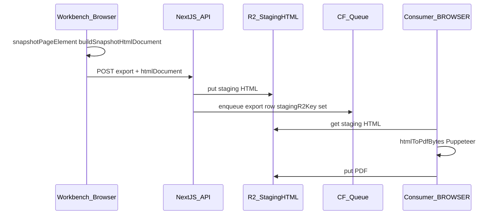

# PDF 与 Workbench 一致：快照 + staging + BROWSER（修订版）

## 0. 结论：为何放弃「仅 strict」

**strict** 指 Consumer 仅读 R2 上 **`ocr.json` / `translated.json`**，用 `buildSelfContainedHtml(..., workbench_like)` **在服务端重建** HTML 再打 PDF（见 [process-job-export.ts](D:/imppro/onlinepdftranslator/src/shared/lib/translator/process-job-export.ts) 中 **`stagingR2Key` 为空** 时的 `else` 分支）。该路径 **不反映** 用户浏览器里 Workbench 的 **实时 computed 样式、选中态、画布缩放后的实际盒模型** 等，易出现 **与 Workbench 完全不一致** 的导出效果。

**目标**：PDF（及需版式一致的 HTML 导出）**必须与 Workbench 中展示一致** → 采用 **快照方案**：在浏览器内对导出页 DOM **`snapshotPageElement` + `buildSnapshotHtmlDocument`**（矢量自包含 HTML），将 **`htmlDocument` 写入 R2 staging**，Consumer 再 **`setContent` + `page.pdf`**。这与 onlinepdftranslator **Parse Result Workbench** 路径一致，**不是** Translator 列表里「只 POST format、无快照」那条。

## 1. `BROWSER` 与前端分工（不变）

- **配置**：[wrangler.consumer.develop.jsonc](D:/imppro/translatepdfonline/frontend/wrangler.consumer.develop.jsonc) 的 `browser.binding` → Consumer Worker，**不是** Next 用户站点。
- **运行时**：[`ocr-export-html-to-pdf-worker.ts`](D:/imppro/translatepdfonline/frontend/src/shared/lib/ocr-export-html-to-pdf-worker.ts) 使用 `env.BROWSER` + [`ocr-export-pdf-cloudflare.ts`](D:/imppro/translatepdfonline/frontend/src/shared/lib/ocr-export-pdf-cloudflare.ts)。
- **前端**：负责 **生成快照 HTML** 并随导出请求提交（或由 API 写入 staging）；**不**在浏览器内打最终 PDF。  
- **Consumer**：从 R2 **读 staging HTML** → Chromium 打 PDF（与参考 `pdf source mode: staging_html` 一致）。

## 2. onlinepdftranslator 参考（满足「快照 → PDF」的部分）

| 层次 | 路径 | 作用 |
|------|------|------|
| 模型 | [translator_job_export.ts](D:/imppro/onlinepdftranslator/src/shared/models/translator_job_export.ts) | `stagingR2Key`、`replaceWithPendingExport`、状态、日志 |
| API | [exports/route.ts](D:/imppro/onlinepdftranslator/src/app/api/translator/jobs/[id]/exports/route.ts) | `pdf`/`html` 且存在 `htmlDocument` 时上传 `stg-{exportId}.html` 再入队 |
| Workbench 前端 | [parse-result-workbench.tsx](D:/imppro/onlinepdftranslator/src/shared/blocks/translator/parse-result-workbench.tsx) | `getDomSnapshotHtml` → `startAsyncExportJob(..., { htmlDocument, orientation })` |
| 队列消费 | [process-job-export.ts](D:/imppro/onlinepdftranslator/src/shared/lib/translator/process-job-export.ts) | `row.stagingR2Key` 为真时：`load staging` → `htmlStringToPdfBytes` |
| HTML→PDF | [export-document.ts](D:/imppro/onlinepdftranslator/src/shared/lib/translator/export-document.ts) + [export-pdf-cloudflare.ts](D:/imppro/onlinepdftranslator/src/shared/lib/translator/export-pdf-cloudflare.ts) | Cloudflare / Playwright 统一入口 |

translatepdfonline 应对齐：**同一数据契约**（staging 键、导出行、队列消息）+ **同一消费分支**（有 staging 则只信 staging 打 PDF）。

## 3. translatepdfonline 实现要点（与当前代码对齐时自查）

1. **前端** [`OcrParseWorkbench.tsx`](D:/imppro/translatepdfonline/frontend/src/shared/ocr-workbench/OcrParseWorkbench.tsx)：导出 pdf/html 前 `flush` + `patchOcrParseResult`；再 **`collectWorkbenchSnapshotHtml`**（仅矢量 `buildSnapshotHtmlDocument`，**不要**整页栅格作为主路径）；`retryOcrTaskExport` 传入 `htmlDocument` + `orientation`。
2. **API** [`exports/route.ts`](D:/imppro/translatepdfonline/frontend/src/app/api/ocr/tasks/[taskId]/exports/route.ts)：对 pdf/html **保留** `htmlDocument` 校验与 staging 写入（与参考 POST 行为一致）。
3. **Consumer** [`ocr-export-queue.ts`](D:/imppro/translatepdfonline/frontend/src/shared/lib/ocr-export-queue.ts)：`pdf` 分支 **优先** `load_staging_html` → `renderWorkbenchHtmlToPdfBytes`；`materializeHtmlImagesToR2` 等与现有一致即可。
4. **版式辅助**：[`parse-result-export-layout-fit-script.ts`](D:/imppro/translatepdfonline/frontend/src/shared/ocr-workbench/parse-result-export-layout-fit-script.ts) 注入快照文档等，仅作为 **Chromium 打印** 与画布一致的补充，不改变「快照源来自浏览器」的原则。

## 4. 与 strict 路径的关系

- **strict** 仍可作为参考项目里 **无 Workbench、无快照** 场景（如仅 JSON 列表导出）的 **降级/旁路**；**translatepdfonline OCR Workbench 主产品路径不得依赖 strict 保证版式**。
- 若需「未打开 Workbench 也能出 PDF」，可另设产品需求，与「与当前画布一致」拆开。

## 5. 文档范围

- 本文件为修订后的 **架构与实现约束**；与已回滚的「仅 strict」表述 **冲突时以本文件为准**。落地实现与部署说明同步到 [translatepdfonline_cloudflare_双项目部署手册](D:/imppro/translatepdfonline/.cursor/plans/translatepdfonline_cloudflare_双项目部署手册.md) 相关章节。
