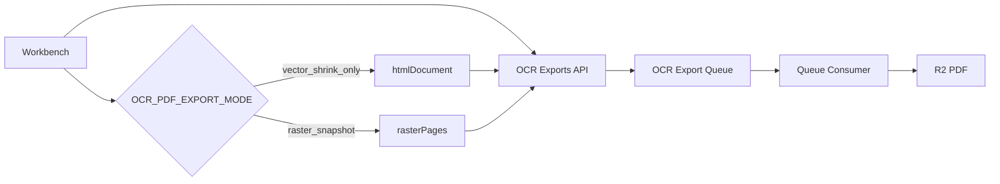

# OCR PDF 导出方案重设（环境变量驱动）

## 先回答你的关键问题

可以“按当前 HTML 导出文件直接做 PDF”，但它**不是像素快照**，而是 HTML 在 Chromium 里再次排版。导致你看到“换行后截断”的主要原因是：
- 字体命中/回退、字距、行高在 Workbench 浏览器与 Consumer Chromium 之间可能不同；
- print 媒体规则与容器尺寸触发二次重排；
- 只要重排后多出一行，就会在固定框 `overflow:hidden` 下被裁切。

所以：
- 若目标是“可搜索文本 + 尽量一致”，走 `vector_shrink_only`；
- 若目标是“100% 视觉一致（零换行漂移）”，走 `raster_snapshot`。

## 目标与边界

- 仅改 `pdf` 导出流程。
- `html` / `md` 维持当前行为与契约（不改 API 返回格式、不改现有下载链路）。
- 用环境变量可一键切换 PDF 模式，便于灰度和回滚。

## 设计总览

## 环境变量设计

- `OCR_PDF_EXPORT_MODE`：`vector_shrink_only`（默认）| `raster_snapshot`
- `NEXT_PUBLIC_OCR_PDF_EXPORT_MODE`：前端与 API 模式对齐（部署时与上项保持一致）
- `OCR_PDF_VECTOR_OVERFLOW_SLACK_PX`：默认 `1` 或 `2`（收紧容差）
- `OCR_PDF_RASTER_SCALE`：默认 `2`（像素快照倍率）
- `OCR_PDF_RASTER_IMAGE_TYPE`：`png`（默认）| `jpeg`

## 实施步骤

1. PDF 模式分流（前端 + API + 队列消息）
- 文件：[`frontend/src/shared/ocr-workbench/OcrParseWorkbench.tsx`](D:/imppro/translatepdfonline/frontend/src/shared/ocr-workbench/OcrParseWorkbench.tsx)
  - `startExport('pdf')` 根据 `NEXT_PUBLIC_OCR_PDF_EXPORT_MODE` 选择构建 payload：
    - `vector_shrink_only`：仅发 `htmlDocument`
    - `raster_snapshot`：发 `rasterPages`（每页 data url + 宽高）
- 文件：[`frontend/src/app/api/ocr/tasks/[taskId]/exports/route.ts`](D:/imppro/translatepdfonline/frontend/src/app/api/ocr/tasks/[taskId]/exports/route.ts)
  - `pdf` 请求按 `OCR_PDF_EXPORT_MODE` 校验对应 payload，写入 staging（HTML 或 raster JSON）
  - 入队消息增加 `pdfMode` 字段，避免 Consumer 与 API 读到不同环境值。

2. `vector_shrink_only`：去回放大，单向 shrink
- 文件：[`frontend/src/shared/ocr-workbench/parse-result-export-layout-fit-script.ts`](D:/imppro/translatepdfonline/frontend/src/shared/ocr-workbench/parse-result-export-layout-fit-script.ts)
  - 删除“缩小后回放大到临界”的 Phase 2。
  - 保留单向 shrink 到不溢出（文本/公式/表格统一逻辑，表格可用更小步长）。
  - 容差改为 `OCR_PDF_VECTOR_OVERFLOW_SLACK_PX`（默认 1~2）。

3. `raster_snapshot`：像素级快照
- 文件：[`frontend/src/shared/ocr-workbench/parse-result-export-snapshot.ts`](D:/imppro/translatepdfonline/frontend/src/shared/ocr-workbench/parse-result-export-snapshot.ts)
  - 增加/恢复每页 raster 生成函数（按 `OCR_PDF_RASTER_SCALE` 生成）。
  - 输出 `rasterPages`（不要再依赖 PDF 端文字重排）。
- 文件：[`frontend/src/shared/lib/ocr-export-queue.ts`](D:/imppro/translatepdfonline/frontend/src/shared/lib/ocr-export-queue.ts)
  - `pdf` 分支按 `pdfMode`：
    - `vector_shrink_only`：现有 `renderWorkbenchHtmlToPdfBytes`
    - `raster_snapshot`：读 staging raster，组装“一页一图”HTML 后再 `page.pdf`（或后续再切纯 PDF 拼页）。

4. 保持 `html`/`md` 不变
- 文件：[`frontend/src/shared/lib/ocr-export-queue.ts`](D:/imppro/translatepdfonline/frontend/src/shared/lib/ocr-export-queue.ts)
  - `html`、`md` 分支代码不动；仅 `pdf` 分支扩展模式判断。
- 文件：[`frontend/src/app/api/ocr/tasks/[taskId]/exports/route.ts`](D:/imppro/translatepdfonline/frontend/src/app/api/ocr/tasks/[taskId]/exports/route.ts)
  - `format==='html'` 仍沿用 `htmlDocument` staging 链路。

5. 验收与回归
- `vector_shrink_only`：
  - 页数与 Workbench 一致；无文本/表格/公式截断；可搜索文本保留。
- `raster_snapshot`：
  - 与 Workbench 视觉像素一致；页数一致；不再出现换行漂移。
- 代码检查：`pnpm exec tsc --noEmit`。

## 风险与回滚

- `raster_snapshot` 风险：PDF 体积增大、文本不可选中。
- 回滚方式：仅切回 `OCR_PDF_EXPORT_MODE=vector_shrink_only`，无需回滚代码。