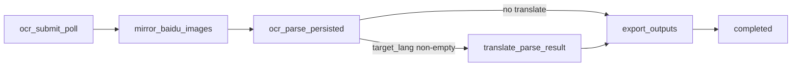

## 现状梳理

`translate_markdown` 阶段在 [frontend/src/shared/lib/ocr-queue.ts:345-358](frontend/src/shared/lib/ocr-queue.ts) 里：读 `ocr-source.md`，整本送 DeepSeek 翻译，写 `ocr-translated.md`。这条路上大概 85s（4 页中文 → en，单请求生成 ~8000 tokens）。

但下游消费者实际并不需要这个文件：

- **导出 PDF/MD**：[ocr-export-queue.ts:621-630](frontend/src/shared/lib/ocr-export-queue.ts) 的 `buildMarkdownWithR2ImageUrls` 调 `buildMarkdownExportWithAssets(parsed.data, ...)` —— **从 parse JSON 直接重建 markdown**，加载的 `ocr-translated.md` 只在 parse JSON 解析失败时作为 fallback。
- **`/api/tasks/[taskId]/markdown` GET**：`translateApi.getTaskMarkdown` / `patchTaskMarkdown` 在前端**没有任何调用方**（grep 0 命中），属于历史 dead code。

也就是说，`translate_markdown` 写入的 `ocr-translated.md` 是**几乎不会被读取**的产物。

## 数据流变化



注意：之前 `ocr_parse_persisted → translate_markdown → translate_parse_result`，现在变成 `ocr_parse_persisted → translate_parse_result`。

## 文件改动

### 1. 跳过 translate_markdown 阶段 —— [frontend/src/shared/lib/ocr-queue.ts](frontend/src/shared/lib/ocr-queue.ts)

- 第 339–343 行 `case ocr_parse_persisted` 改为：

```ts
if (params.stage === 'ocr_parse_persisted') {
  return needTranslateForTask(params.sourceLang, params.targetLang)
    ? 'translate_parse_result'
    : 'export_outputs';
}
```

- 第 345–358 行的 `case translate_markdown` 整段删除；改为「兼容旧消息」：如果某条历史队列消息仍写着 `translate_markdown`，归并到 `translate_parse_result` 跑（而不是 throw）。在 `normalizeStage` 里加一行：`if (s === 'translate_markdown') return 'translate_parse_result';`，并在 `runOneStage` 入口判断 `params.stage === 'translate_markdown'` 时直接当作 `translate_parse_result` 处理或转换 stage 名（推荐前者：在 normalize 入口归并）。
- `OcrStage` union 移除 `'translate_markdown'` 字面量，但因为 DB 里可能存在历史值，保留 `normalizeStage` 的归并行为。
- `stagePercent` 表里删除 `translate_markdown: 65`；`translate_parse_result` 改成 65（取代之前 80），让进度条平滑。

### 2. /api/tasks/[taskId]/markdown GET 改成按需构建 —— [frontend/src/app/api/tasks/[taskId]/markdown/route.ts](frontend/src/app/api/tasks/[taskId]/markdown/route.ts)

去掉读 `ocr-translated.md` / `ocr-source.md` 的逻辑，直接用 parse JSON 重建：

```ts
import { getOcrParseResultBodyForRead } from '@/shared/lib/ocr-parse-result-r2-keys';
import { parseParseResultJson } from '@/shared/ocr-workbench/translator-parse-result';
import { buildMarkdownExportWithAssets } from '@/shared/lib/ocr-export-markdown'; // 现有

// ...
const bytes = await getOcrParseResultBodyForRead(taskId, task.sourceLang, task.targetLang);
const parsed = parseParseResultJson(JSON.parse(new TextDecoder('utf-8').decode(bytes)));
if (!parsed.ok) return Response.json({ detail: 'invalid parse result' }, { status: 500 });
const { markdown } = await buildMarkdownExportWithAssets(parsed.data, `ocr-${taskId}`);
return Response.json({ markdown, source: 'parse_result_rebuild', updated_at: ... });
```

PATCH 已经写到 `ocr-translated.md`/`ocr-source.md`，没人调用，**可以保留现状不动**（避免无谓改动），也可后续再清理。

### 3. 导出路径对 ocr-translated.md 缺失更宽容 —— [frontend/src/shared/lib/ocr-export-queue.ts](frontend/src/shared/lib/ocr-export-queue.ts)

第 621–625 行的 `loadMarkdownFromR2(row.sourceMarkdownObjectKey)` 改为「失败时返回空串作 fallback」，让真正的 markdown 在 `buildMarkdownWithR2ImageUrls` 里由 parse JSON 重建：

```ts
const markdown = await withStageTimeout(
  'load_markdown',
  async () => {
    try {
      return await loadMarkdownFromR2(row.sourceMarkdownObjectKey);
    } catch {
      return '';
    }
  },
  OCR_EXPORT_STAGE_TIMEOUT_MS
);
```

`ensureOcrPendingExportsForTask` / `enqueueExportForFormat` 里的 `finalMarkdownKey` 仍然按 `languagesNeedTranslation` 选 `ocr-translated.md` / `ocr-source.md`（key 名只是个 hint，实际不再被读到）—— **保留不动，避免大改 schema**。

### 4. 进度条 / i18n 标签清理 —— [frontend/src/config/locale/messages/{zh,en}/translate/ocrWorkbench.json](frontend/src/config/locale/messages/zh/translate/ocrWorkbench.json)

`stageTranslateMarkdown` 这个 key 不再被使用，先**保留**（兼容历史 DB 中可能仍存的 `progress_stage='translate_markdown'`，前端读到时仍可显示中文标签）。

### 5. 部署手册补一段 —— [.cursor/plans/translatepdfonline_cloudflare_双项目部署手册.md](.cursor/plans/translatepdfonline_cloudflare_双项目部署手册.md)

新增一节说明：
- 阶段表去掉 `translate_markdown`，进度从 `ocr_parse_persisted (45%) → translate_parse_result (65%) → export_outputs (90%)`。
- 旧任务 retry：DB 里 `progress_stage='translate_markdown'` 的会被 `normalizeStage` 归并到 `translate_parse_result`，无需手工迁移。

## 不在本次范围

- 不动 `R2_PUBLIC_URL` 配置（你说自己处理）。当前 mirror_baidu_images 写回的图片 URL 仍是 7 天 presigned，过期前请你在 Worker Dashboard 加上 `R2_PUBLIC_URL=https://storage.translatepdfonline.com` 然后重跑 `pnpm ocr:mirror-images --all-recent`。
- 不动 workbench 「target 未生成时 fallback 到 source」的行为：这是**预期回退**，不是 BUG。取消 translate_markdown 之后，从 `ocr_parse_persisted` 完成到 `translate_parse_result` 完成的时间窗只剩并行批次时长（4 页 × 16 并发，估计 5–15s），fallback 现象会大大减少。
- 不删 `/api/tasks/[taskId]/markdown` PATCH 与 `ocr-translated.md` 写入路径上残留 dead code（保留以减少 diff，后续清理）。

## 验证

- `pnpm exec tsc --noEmit` 通过。
- 起一个新中文任务 target=en，日志按顺序应出现：`ocr_submit_poll → mirror_baidu_images → ocr_parse_persisted → translate_parse_result → export_outputs → completed`，**不再有 `translate_markdown`**。
- workbench 在 `translate_parse_result` 完成后刷新，应直接读到 `ocr-parse-result-target.json`（英文版面）。
- 旧 task retry 一次，应不报错（`translate_markdown` 被归并到 `translate_parse_result`）。