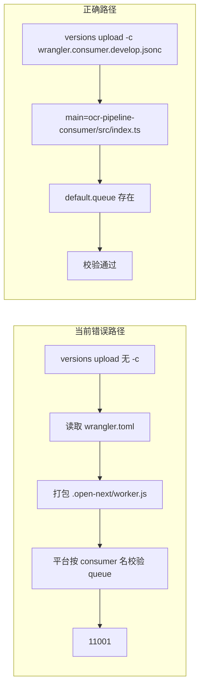

# 彻底消除 11001：Queue consumer 与 OpenNext 上传错位

## 根因（与日志逐条对齐）

1. **Deploy 命令**为 `npx wrangler versions upload`（无 `-c`），Wrangler 默认读取 [frontend/wrangler.toml](d:/imppro/translatepdfonline/frontend/wrangler.toml)：`main = ".open-next/worker.js"`，即 **OpenNext 站点 Worker**，其导出为 **`fetch` + 资源绑定**，**不包含** Queues 文档要求的 **`export default { async queue(...) { ... } }`**。

2. **Cloudflare Workers Builds** 将本次上传绑定到脚本名 **`translatepdfonline-quenues-dev`**（与 [frontend/wrangler.consumer.develop.jsonc](d:/imppro/translatepdfonline/frontend/wrangler.consumer.develop.jsonc) 中 consumer Worker 名一致），平台因此按 **Queue consumer** 校验脚本，发现 **无 `queue` 处理器** → **`workers.api.error.queue_handler_missing` [11001]**。

3. 日志中的 **`Failed to match Worker name... expected "translatepdfonline-quenues-dev"`** 证实：CI 期望的是 **consumer 脚本名**，实际上传的却是 **主站 OpenNext 配置**。

4. 日志里 **`OCR_PIPELINE_QUEUE (translatepdfonline)`** 来自主 `wrangler.toml` 顶层 `[[queues.producers]]`，进一步说明本次上传走的是 **主站配置**，不是 `wrangler.consumer.develop.jsonc`（其中队列名为 `translatepdfonline-dev`）。

5. **`duplicate-case` / `equals-negative-zero`** 来自 OpenNext 打出来的 `handler.mjs`，仅为 esbuild 警告，**与 11001 无关**；可忽略或后续再压警告。



---

## 必须做的修正（Cloudflare 控制台 / Workers Builds）

在 **绑定到脚本 `translatepdfonline-quenues-dev`** 的那条构建流水线里，把 **User deploy command**（或等价「部署命令」）从裸的：

`npx wrangler versions upload`

改为在 **`frontend` 目录** 下执行（与日志中 assets 路径 `/opt/buildhome/repo/frontend/.open-next` 一致）：

```bash
npx wrangler versions upload -c wrangler.consumer.develop.jsonc
```

说明：

- **必须带 `-c wrangler.consumer.develop.jsonc`**，才会使用 [workers/ocr-pipeline-consumer/src/index.ts](d:/imppro/translatepdfonline/frontend/workers/ocr-pipeline-consumer/src/index.ts) 里已存在的 **`export default { queue, fetch }`**（当前实现正确，无需为 11001 再改业务逻辑）。
- 若该流水线的工作目录不是 `frontend`，则改为：  
  `cd frontend && npx wrangler versions upload -c wrangler.consumer.develop.jsonc`  
  或使用 Wrangler 的 **`--cwd frontend`**（以你面板支持的写法为准）。

**生产 consumer** 同理：使用 [frontend/wrangler.consumer.jsonc](d:/imppro/translatepdfonline/frontend/wrangler.consumer.jsonc)：

```bash
npx wrangler versions upload -c wrangler.consumer.jsonc
```

---

## 与「主站 OpenNext」上传的关系（两条线）

- **主站**（`translatepdfonline` / `translatepdfonline-dev`）：继续用 OpenNext 生成物 + 现有 `wrangler.toml` / `wrangler versions upload -e develop`（或你们现有命令），**不要**把这条线绑到脚本名 `translatepdfonline-quenues-dev`。
- **Queue consumer**（`translatepdfonline-quenues` / `translatepdfonline-quenues-dev`）：**单独**一条构建/部署，**仅**使用 `wrangler.consumer*.jsonc`。

若 Cloudflare **只允许一个 deploy command**：应拆成 **两个 Workers Builds 项目**（或一个 Pages + 一个 Worker），分别配置上述两条命令；**不能**用同一条命令既上传 OpenNext 又满足 consumer 名。

---

## 可选：消除 `Multiple environments` 警告（主站 upload）

若主站仍用根目录 `wrangler versions upload` 且存在 `[env.develop]`，按日志建议显式指定环境，例如：

`npx wrangler versions upload -e develop`（或 `--env=""` 指向顶层，视你们要上传的环境而定）。

这与 consumer 的 `-c` 文件无关，但可减少误上传到错误环境的风险。

---

## 可选：仓库内防回归（实施时二选一或都做）

1. **文档**：在 [frontend/docs/environment-variables.md](d:/imppro/translatepdfonline/frontend/docs/environment-variables.md) 或 [README.md](d:/imppro/translatepdfonline/README.md) 增加一小节「Workers Builds：consumer 必须用 `-c wrangler.consumer*.jsonc`」，把本文根因与命令写死，避免以后再改回裸 `versions upload`。

2. **脚本**：在 [frontend/package.json](d:/imppro/translatepdfonline/frontend/package.json) 增加显式脚本，例如 `cf:versions:consumer:dev`，内容为上面的 `wrangler versions upload -c wrangler.consumer.develop.jsonc`，供 CI 复制粘贴，减少配置漂移。

---

## 验收

- 对 **consumer** 流水线：部署日志中 **Bindings** 应出现 consumer 配置中的项（如 `OCR_PIPELINE_QUEUE (translatepdfonline-dev)`、`BROWSER`、`HYPERDRIVE`），且 **不再出现** 11001。
- 对 **主站** 流水线：仍上传 OpenNext `worker.js`，脚本名应为 `translatepdfonline-dev`（或你们主站名），**不应**再被强制成 `translatepdfonline-quenues-dev`。
