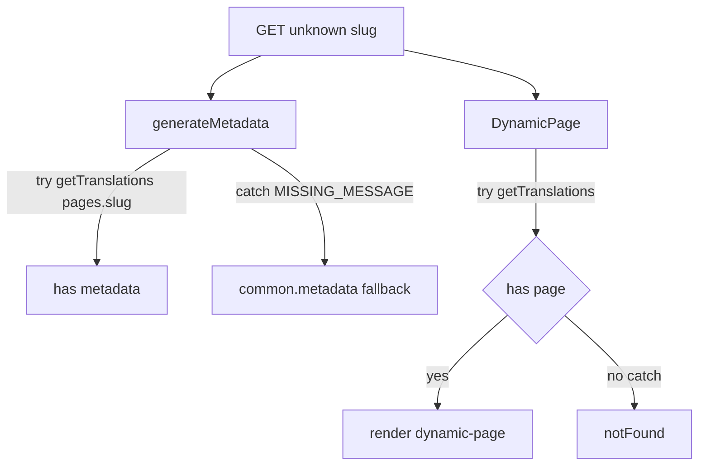

# 修复生产 MISSING_MESSAGE 与 OCR DeepSeek 非数组解析

## 问题 1：`MISSING_MESSAGE: pages.phpinfo_* (en)`

**根因**（非缺失文案）：站点使用 catch-all 落地页 [`frontend/src/app/[locale]/(landing)/[...slug]/page.tsx`](d:/imppro/translatepdfonline/frontend/src/app/[locale]/(landing)/[...slug]/page.tsx)。扫描器访问 `/phpinfo_details`、`/phpinfoapi`、`/phpinfo-api` 等路径时，`slug` 经 `slugArr.join('.')` 变成 `phpinfo_details` 等，进而使用 namespace `pages.${dynamicPageSlug}` 调用 `getTranslations`。

- **页面组件**（约 155–166 行）已对 `getTranslations` 包在 `try/catch` 中，缺失 namespace 时走 `notFound()`，不抛错。
- **`generateMetadata` 动态分支**（约 74–88 行）在同样场景下 **未** 包裹 `try/catch`，`getTranslations({ locale, namespace: messageKey })` 会直接抛出 `MISSING_MESSAGE`，与日志一致。

**建议修改**（最小改动）：

- 在 `generateMetadata` 中，对「静态 MDX 未命中 → 尝试动态 messages 页」这一段（当前 74–88 行附近），用与 `default` 导出相同的模式包裹：在 `try` 内调用 `getTranslations` 并 `t.has('metadata')` 填 title/description；`catch` 时 **不记录为 error**，直接落到下方已有逻辑（约 91–103 行）用 `common.metadata` 作为兜底标题/描述。
- 这样非法/探测路径与真实不存在的动态页行为一致：元数据退化为通用站级 SEO，页面体仍为 `notFound()`（若也无 `page` 键）。

**非目标**：不必为每个探测路径新增 `messages/en/pages/*.json`；也不必在中间件硬编码封禁列表（除非后续希望减少无意义请求）。

---

## 问题 2：`DeepSeek batch translate: expected 8 strings, got non-array`

**根因**：[`frontend/src/shared/lib/ocr-translate.ts`](d:/imppro/translatepdfonline/frontend/src/shared/lib/ocr-translate.ts) 中 `translateStringListWithDeepSeek` → `runOneBatch` 在 `JSON.parse(rawContent)` 成功后，仅当结果为 **数组** 时才进入 `normalizeDeepSeekBatchArrayOutput`；若模型遵守「数组语义」但包在对象里（例如 `{"translations":[...]}`、`{"items":[...]}`），`parsedArr` 为非数组，最终报错 `got non-array`（日志中 batch 为 8 条，与默认 `OCR_PARSE_TRANSLATE_CHUNK_ITEMS` 默认 8 一致）。

**建议修改**（与既有「空 content 降级」计划兼容，不改变「真·无效 JSON / 条数不对仍失败」的约定）：

1. 在 `runOneBatch` 内、`JSON.parse`（及现有 fence 提取）成功之后，增加小函数 **`coerceDeepSeekBatchJsonToArray(parsed: unknown): unknown[] | null`**，按顺序尝试：
   - 已是数组 → 原样返回；
   - 为 `object` 且非 null → 依次检查常见字段名是否为数组：`translations`、`items`、`result`、`data`、`strings`（可按需增减）；
   - 若对象键均为纯数字字符串且覆盖 `0..n-1`，可按序拼成数组（兼容少数模型输出）；
   - 若为 **字符串** 且看起来像二次 JSON，可 **单次** `JSON.parse` 再递归 coerce（防止无限递归，设深度上限 1–2）。
2. `coerce` 得到数组后，再走现有 `normalizeDeepSeekBatchArrayOutput` 与长度判断；若 `coerce` 返回 `null`，保持现有 `invalid JSON array` / `expected N strings, got ...` 行为。
3. **可观测性**：当发生了「对象 → 数组」的 coerce 时，打一条 **`console.warn`**（含 `task_id`、`batch`、`batches_total`、`coerce: true`），便于与 DeepSeek 控制台对照；正常路径无额外日志。

**验收要点**：

- 构造助手返回 `{"translations":[8 strings]}` 的 mock 或集成测，确认 `translate_parse_result` 完成且顺序与条数正确。
- 仍确认：`[]` 错长度、纯文本非 JSON、数组长度不对时阶段仍失败（与 [`.cursor/plans/ocr-deepseek-parse-degrade.plan.md`](d:/imppro/translatepdfonline/.cursor/plans/ocr-deepseek-parse-degrade.plan.md) 中「非空但非法 / 条数不匹配不降级」一致）。

---

## 涉及文件

| 文件 | 变更 |
|------|------|
| [`frontend/src/app/[locale]/(landing)/[...slug]/page.tsx`](d:/imppro/translatepdfonline/frontend/src/app/[locale]/(landing)/[...slug]/page.tsx) | `generateMetadata` 动态分支 `try/catch` + 兜底 `common.metadata` |
| [`frontend/src/shared/lib/ocr-translate.ts`](d:/imppro/translatepdfonline/frontend/src/shared/lib/ocr-translate.ts) | 新增 `coerceDeepSeekBatchJsonToArray`，在 `runOneBatch` 解析路径中接入 |

实施后在 `frontend` 下执行 `pnpm exec tsc --noEmit` 做类型冒烟即可。
