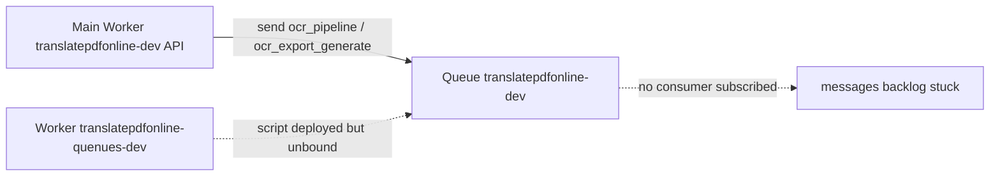
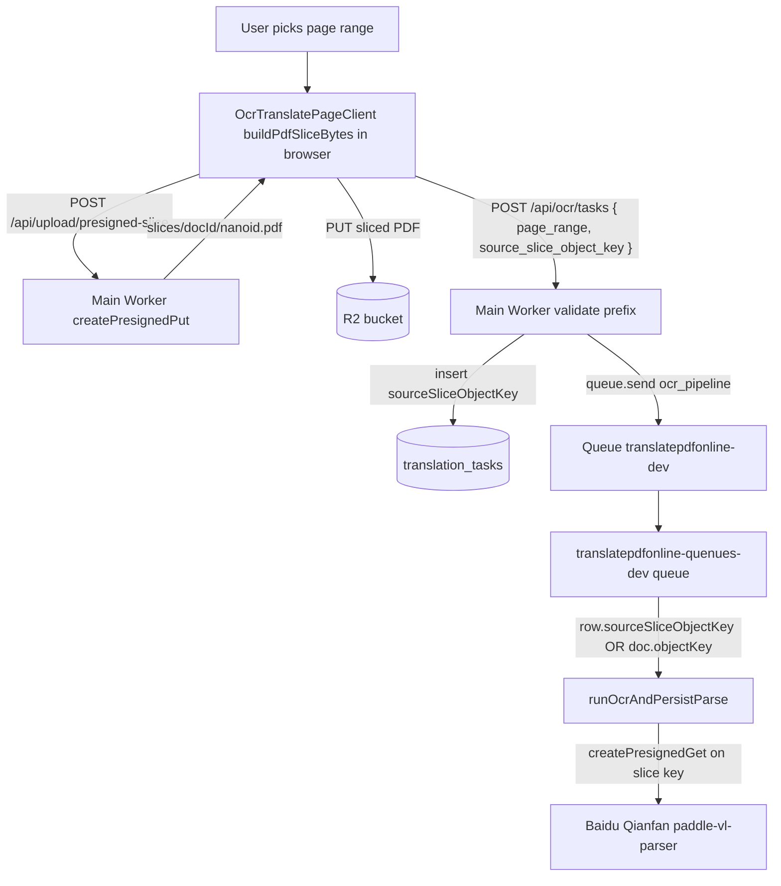

## 现状回顾

- 主 Worker `translatepdfonline-dev`（producer）：[wrangler.toml](frontend/wrangler.toml) `[env.develop]` 把 `OCR_PIPELINE_QUEUE` 指向队列 `translatepdfonline-dev`。`POST /api/ocr/tasks` 和 `POST /api/ocr/tasks/:id/exports` 只往队列发消息，本就该跑在主 Worker。
- 消费 Worker `translatepdfonline-quenues-dev`：[wrangler.consumer.develop.jsonc](frontend/wrangler.consumer.develop.jsonc) 已声明 `queues.consumers: translatepdfonline-dev`，入口 [workers/ocr-pipeline-consumer/src/index.ts](frontend/workers/ocr-pipeline-consumer/src/index.ts) 实现 `queue()`，调 [src/shared/lib/ocr-queue.ts](frontend/src/shared/lib/ocr-queue.ts) 的 `handleOcrPipelineQueueBatch` 同时处理 `ocr_pipeline` + `ocr_export_generate` 两类消息（导出 PDF/HTML/MD 在 [src/shared/lib/ocr-export-queue.ts](frontend/src/shared/lib/ocr-export-queue.ts) `processOcrTaskExport` 内落地到 R2）。
- 您选了「Worker 部署过，但 Dashboard Queues → translatepdfonline-dev → Consumers 里看不到它」。这意味着：消息发出来了，但队列没人消费。导出永远不会从 pending 变 ready；新建 OCR 任务也不会被推进。

## 问题与根因对照



- **#1 导出卡 processing**：消费者未订阅队列。
- **#2 日志没有页数**：`[ocr] submit_and_enqueue_ok` 在 [src/app/api/ocr/tasks/route.ts](frontend/src/app/api/ocr/tasks/route.ts) 第 249–252 行只打了 `task_id/document_id/source_lang/target_lang`，没把 `page_range/page_range_user_input/page_range_adjusted/document_page_count/has_slice` 带上。`[ocr/precheck] page_count` 早一步打过页数，但分散在两条日志，您过滤 fingerprint 时只看到提交那条。
- **#3 为啥没看到 quenues-dev**：您看的三条日志都是 `scriptName: translatepdfonline-dev`，是主 Worker 的请求型日志。消费者的日志在另一个 Worker 流里（`scriptName: translatepdfonline-quenues-dev`，`eventType: queue` 而非 `fetch`），需要在 Workers Logs / Logpush / `wrangler tail translatepdfonline-quenues-dev` 单独看。

## 改动一：让消费者真正订阅 develop 队列（不改代码，跑命令）

> 顺序：先确认队列存在 → 重新部署消费者 → 必要时手工绑定 → tail 验证。

1. 确认队列 `translatepdfonline-dev` 在 Dashboard 已创建（您之前提到过）。若不在：

   ```bash
   cd frontend
   npx wrangler queues create translatepdfonline-dev
   ```

2. 重新部署消费者并强制 wrangler 绑定 consumer：

   ```bash
   cd frontend
   npx wrangler deploy -c wrangler.consumer.develop.jsonc --keep-vars
   ```

   这会把 `wrangler.consumer.develop.jsonc` 里的 `[[queues.consumers]] queue = "translatepdfonline-dev"` 同步成 Cloudflare 上的 consumer 绑定。

3. 部署后 30 秒 在 Dashboard → Queues → `translatepdfonline-dev` → Consumers 应能看到 `translatepdfonline-quenues-dev`。看不到再走兜底：

   ```bash
   # 清掉旧的悬挂 consumer（若 11001 / 旧名残留）
   pnpm run cf:queues:consumer:remove:dev
   # 显式绑定
   npx wrangler queues consumer add translatepdfonline-dev translatepdfonline-quenues-dev
   ```

4. 实时验证：

   ```bash
   npx wrangler tail translatepdfonline-quenues-dev --format=pretty
   ```

   然后在网页发起一次 OCR 导出，应在 tail 中看到：

   - `[ocr/queue] enqueued`（这条是主 Worker 的，但 tail 不会出现，可忽略）
   - `[ocr-pipeline-consumer]` / `[ocr/export]` 的相关日志（`processOcrTaskExport` 内置）
   - 不再看到，说明绑定还没生效；继续看 Dashboard。

5. 检查消费者必要的运行时变量（`--keep-vars` 不会跨 Worker 拷贝）：

   - `BAIDU_AUTHORIZATION` 或 `BAIDU_OCR_API_KEY` + `BAIDU_OCR_SECRET_KEY`
   - `DEEPSEEK_API_KEY`、可选 `OCR_DEEPSEEK_MODEL`
   - R2 直连：`R2_ACCESS_KEY_ID/R2_SECRET_ACCESS_KEY/R2_ENDPOINT/R2_BUCKET`（或走 DB `config` 表的 `r2_*`，参见 [translatepdfonline_cloudflare_双项目部署手册.md](.cursor/plans/translatepdfonline_cloudflare_双项目部署手册.md) 第 5 章）
   - `NEXT_PUBLIC_APP_URL`（PDF 导出回填图片需要）
   - HYPERDRIVE 绑定已在配置里（id `1f0a3251f43343c3872e5f882ff3d879`），同主 Worker
   - `BROWSER` 绑定已在配置里（PDF 导出依赖 Browser Rendering，需在账号上启用 Workers Browser Rendering）

6. 把过去卡 processing 的导出行重置为 pending 重新触发（不强制；新任务自然会 ready）：
   - 进 OCR workbench → 点 PDF/HTML/MD 旁的 重试，前端会调 `POST /api/ocr/tasks/:id/exports`，重新入队由新 consumer 消费。

## 改动二：`[ocr] submit_and_enqueue_ok` 日志补全页数与分页字段

文件：[frontend/src/app/api/ocr/tasks/route.ts](frontend/src/app/api/ocr/tasks/route.ts) 第 249–252 行。

把：

```ts
console.log(
  '[ocr] submit_and_enqueue_ok',
  JSON.stringify({ task_id: taskId, document_id: doc.id, source_lang: sourceLang, target_lang: targetLang })
);
```

改为：

```ts
console.log(
  '[ocr] submit_and_enqueue_ok',
  JSON.stringify({
    task_id: taskId,
    document_id: doc.id,
    source_lang: sourceLang,
    target_lang: targetLang,
    document_page_count: resolvedPageCount,
    page_range: pageRange,
    page_range_user_input: pageRangeUserInputDb,
    page_range_adjusted: pageRangeAdjusted,
    has_slice: Boolean(sourceSliceObjectKey),
    source_slice_object_key: sourceSliceObjectKey ?? null,
    credits_estimated: creditsEstimated,
  })
);
```

读取的字段全部已经在该函数作用域内（见 137–246 行），不引入新逻辑，仅在日志里把分页信息一次性带上，避免再去翻 `[ocr/precheck] page_count`。`source_slice_object_key` 是为了一眼看出消费者将向百度提交哪份 PDF（带 `page_range` 时应是 `slices/<documentId>/<nanoid>.pdf`，不带时为 `null`，回退到 `documents.objectKey`）。

## 现有「带 page_range → 切片 PDF → 用切片调百度」链路（不改，仅核对）

仓库里这条链路已经在跑，本次修复仅新增可观测性，不改逻辑：



关键引用：

- 前端切片：[`OcrTranslatePageClient.tsx`](frontend/src/app/[locale]/(translate)/ocrtranslator/OcrTranslatePageClient.tsx) 第 898–921 行（`buildPdfSliceBytes` + `getPresignedSlice` + `PUT`）。
- 预签名：[`/api/upload/presigned-slice/route.ts`](frontend/src/app/api/upload/presigned-slice/route.ts) 第 36–47 行，键为 `slices/{documentId}/{nanoid}.pdf`。
- 落库：[`/api/ocr/tasks/route.ts`](frontend/src/app/api/ocr/tasks/route.ts) 第 99–107 行校验前缀、第 239 行写入 `sourceSliceObjectKey`。
- 消费者使用：[`ocr-queue.ts`](frontend/src/shared/lib/ocr-queue.ts) 第 711 行 `row.sourceSliceObjectKey || doc.objectKey` → [`ocr-translate.ts`](frontend/src/shared/lib/ocr-translate.ts) 第 640–648 行 `createPresignedGet(params.sourcePdfObjectKey, 3600)` 后传给百度 `submitBaiduOcrTask`。

## 改动三：手册补一条「develop 消费者必须二次确认 consumer 已绑定」

在 [.cursor/plans/translatepdfonline_cloudflare_双项目部署手册.md](.cursor/plans/translatepdfonline_cloudflare_双项目部署手册.md) 第 7 章「验证清单」之上加一节，专门写 develop 双项目的兜底：

- 部署后 1–2 分钟若 Dashboard → Queues → `translatepdfonline-dev` → Consumers 仍为空：
  - `pnpm run cf:queues:consumer:remove:dev`（清干净）
  - `npx wrangler queues consumer add translatepdfonline-dev translatepdfonline-quenues-dev`
  - 再部署一次 `npx wrangler deploy -c wrangler.consumer.develop.jsonc --keep-vars`
- 出现 `Queue handler is missing [11001]`：通常是把 consumer 绑到了主 Worker。先 `npx wrangler queues consumer remove translatepdfonline-dev translatepdfonline-dev`，再做上一步。

## 不做（避免范围漂移）

- 不动 `wrangler.toml` 与 `wrangler.consumer.develop.jsonc` 的现有 binding/queue 名（已正确）。
- 不重写 `processOcrTaskExport` / `runOcrAndPersistParse`；它们的逻辑没问题，问题在没人触发它们。
- 不动前端导出按钮 / 轮询逻辑；消费者恢复后会自然走通。
- 不动「OCR 去重翻页与画布铺满」最近的改动（与本次问题无关）。

## 验证

1. dev 站发一次 OCR 任务（带 `page_range` 例如 `1-3`）：
   - 主 Worker 日志应看到 `[ocr] submit_and_enqueue_ok` 含 `document_page_count / page_range / has_slice=true / source_slice_object_key=slices/<docId>/<nanoid>.pdf / credits_estimated`。
   - `[ocr/precheck] page_count` 不变。
   - **R2 控制台** 应看到 `slices/<documentId>/<nanoid>.pdf` 这份切片 PDF（前端浏览器内切片后 PUT 上传的产物），大小明显小于原 PDF。
   - DB 中 `translation_tasks.source_slice_object_key` 字段应等于上面这个键。
2. 几秒内 `wrangler tail translatepdfonline-quenues-dev` 看到 `processOcrTaskExport` / `runOcrAndPersistParse` 日志推进；DB 中任务从 `queued` → `processing` → `completed`。
   - 由于 `runOcrAndPersistParse` 用的就是 `row.sourceSliceObjectKey || doc.objectKey`，带 `page_range` 时百度收到的是切片 PDF 的预签名 URL；OCR 输出页数应等于 `page_range` 内页数（例如 `1-3` → 3 页），可在 R2 `translations/<taskId>/ocr-parse-result.json` 的 `pages.length` 中核对。
3. 同样的任务再点一次「不带 page_range」（清空输入框），重复以上：`has_slice=false / source_slice_object_key=null`，OCR 应处理整本文档。
4. 在 OCR workbench 点 PDF / HTML / MD 导出：状态从 processing → ready，下载链接 200。
5. Dashboard → Queues → `translatepdfonline-dev` → Metrics：`Messages backlog` 回到 0。